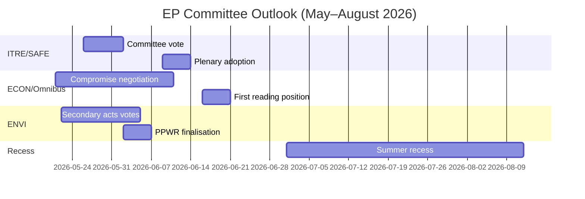

<!-- SPDX-FileCopyrightText: 2026 Hack23 AB -->
<!-- SPDX-License-Identifier: Apache-2.0 -->

# Efterretningsbriefing — EP Udvalgrapporter · Ugen 2026-05-14–21

**WEP-bånd anvendt** | **Admiralitetsgrad:** B2  
**Konfidens:** 🟡 MEDIUM | **Datatilstand:** forringede feeds  
**Analysedato:** 2026-05-21 | **Tidshorisont:** 3 måneder

---

## 🔴 CENTRAL EFTERRETNINGSVURDERING

*Det er sandsynligt (65–75%)* at Europa-Parlamentets udvalgsæson for foråret 2026 vil levere sine primære lovgivningsmål — vedtagelse af SAFE-forordningen, Omnibussens første behandlingsposition og den grønne aftales sekundære gennemførelsesretsakter — men med koalitionsstress, der tvinger forhandlinger i sidste øjeblik om mindst to store sager, inden sommerferien i juni 2026. Det snævre EPP-S&D-Renew-flertal (+36 pladser) er den centrale strukturelle begrænsning, der definerer ethvert udvalgsresultat.

**Admiralitetsgrad:** B2 | **Konfidens:** 🟡 MEDIUM

---

## Top 3 Udvalgsefterretningsprioriteter

### 1 · SAFE-forordningen — ITRE-udvalget (HØJ PRIORITET)
Forordningen om den strategiske dagsorden for armamenter og faktorer i Europa (SAFE), der godkender en EU-forsvarsfacilitet på 150 milliarder euro, nærmer sig sin afstemning i ITRE-udvalget. Dette er den mest betydningsfulde forsvarsindustrielle lovgivning i EU's historie og har store finanspolitiske konsekvenser for EU's off-balance-sheet lånearchitektur.

**Centrale efterretninger:**
- ITRE-udvalgets ordfører er ved at færdiggøre kompromisteksten om udbudsregler — den mest omstridte sektion
- Nationale forsvarsindustrielle interesser (Frankrig, Tyskland, Polen) har aktivt lobbyet ordføreren
- Krydskoalitionsstøtte (EPP + S&D + ECR + Renew) giver SAFE et usædvanligt robust flertal
- Rådet presser på hurtig vedtagelse inden sommerferien
- **WEP:** *Det er sandsynligt (65–75%)* at SAFE-udvalgets afstemning finder sted inden den 30. juni 2026

**Risiko:** Nødproceduren i henhold til artikel 122 TEUF forbliver mulig, hvis den geopolitiske situation forværres (vurderet *nogenlunde lige odds, 35–45%*), hvilket ville omgå udvalgets høring.

---

### 2 · Omnibus-forenklingspackagen — ECON/JURI-udvalgene (HØJ PRIORITET)
Kommissionens Omnibus I-pakke, der reviderer CSRD (direktivet om virksomheders bæredygtighedsrapportering), CSDDD og Taksonomiforordningen, befinder sig i sin mest omstridte udvalgsfase. S&D står over for et strategisk dilemma mellem at opretholde koalitionens sammenhæng og at imødekomme pres fra den progressive base.

**Centrale efterretninger:**
- EPP og industrilobbyister (BusinessEurope) har med succes formet narrativet om byrdelettelse
- S&D forhandler om tilføjelse af sociale klausuler som modydelse for at acceptere CSRD-tærskelstigninger (fra 250 til ~1.000 ansatte)
- Greens/EFA og The Left mobiliserer aktivt eksternt pres mod S&D
- **WEP:** *Det er sandsynligt (60–70%)* at S&D accepterer en modificeret Omnibus-pakke, der opretholder koalitionens stabilitet
- **WEP:** *Det er muligt (30–40%)* at kompromisset bryder sammen og forsinker Omnibus efter sommerferien

**Risiko:** ESG-investeringssamfundet følger nøje med; CSRD-tilbagerulning skaber markedsusikkerhed for mere end 2 billioner euro i ESG-bundne aktiver.

---

### 3 · Den grønne aftales sekundære retsakter — ENVI-udvalget (MIDDEL-HØJ PRIORITET)
ENVI-udvalget fremmer flere sekundære gennemførelsesretsakter for EP9's ramme for den grønne aftale: gennemførelsesretsakter til naturgenopretningsloven, færdiggørelse af PPWR (emballageforordningen) og CBAM-overvågningsforordninger.

**Centrale efterretninger:**
- EPP's højrefløj (italienske, ungarske og rumænske delegationer) stemmer i stigende grad med ECR om "konkurrenceevne-prøvnings"-ændringsforslag
- ENVI-udvalgets flertal er smallere end den overordnede koalitionsaritmetik antyder (~5–8 stemmer effektiv margen ved omstridte ENVI-afstemninger)
- Naturgenopretningsloven: EPP-medlemmer foreslår landbrugsundtagelser, som Greens/EFA beskriver som rammeødelæggelse
- **WEP:** *Det er sandsynligt (60–70%)* at ENVI vedtager sekundære retsakter med svækkede tærskler, men intakt grundlæggende ramme

**Risiko:** Yderligere ENVI-udvalgsmodgang kan udløse Greens/EFA's tilbagetrækning fra uformelle koordinationsaftaler, hvilket ville komplicere alt fremtidigt ENVI-arbejde.

---

## Politisk landskabsoverblik (2026-05-21)

| Gruppe | Pladser | Andel | Koalitionsrolle |
|--------|---------|-------|-----------------|
| EPP | 183 | 25,5% | Dominerende partner |
| S&D | 136 | 19,0% | Nødvendig partner |
| PfE | 85 | 11,9% | Opposition/Forstyrrer |
| ECR | 81 | 11,3% | Selektiv allieret (forsvar) |
| Renew | 77 | 10,7% | Koalitionspartner |
| Greens/EFA | 53 | 7,4% | Progressivt mindretal |
| The Left | 45 | 6,3% | Progressivt mindretal |
| NI | 30 | 4,2% | Ikke-tilknyttet |
| ESN | 27 | 3,8% | Yderliggående forstyrrer |

**Nødvendigt flertal:** 360 | **Koalition (EPP+S&D+Renew):** 396 | **Margen:** +36

---

## Økonomisk kontekst (IMF Strukturel proxy, A2)

- Eurozonen BNP-vækst 2026 anslået: ~1,7%
- EU's finanspolitiske underskud/BNP: ~-2,6% (konsolidering pågår)
- SAFE: 150 milliarder euro off-balance-sheet forsvarsfacilitet
- ECB's indlånsrente anslået: ~2,25% (lempelsescyklus avanceret)
- USA-EU-tolspændinger skaber pres i INTA-udvalget

---

## 3-måneders udsigt

**Samlet vurdering:** Udvalgsæsonen foråret 2026 opererer med HØJ intensitet og en smal koalitionsmargen. SAFE-forordningens succesfulde fremskridt demonstrerer EP10's kapacitet til at handle beslutsomme i sikkerhedsprioriteter. Omnibus-bestriden og den grønne aftales tilbagegang repræsenterer strukturelle spændinger, der vil definere EP10's arv vedrørende klima og virksomhedsstyring. *Det er næsten sikkert (>85%)* at EPP-S&D-Renew-koalitionen overlever forårssæsonen intakt, på trods af reelt stress ved individuelle udvalgsafstemninger.

**Konfidens:** 🟡 MEDIUM | **Admiralitetsgrad:** B2

---

## EP10 Makrokontekst: Økonomisk og politisk baggrund

**Økonomisk miljø (IMF WEO april 2026)**:
EU-27's reale BNP-vækst på 1,2% i 2026 repræsenterer en under-trend præstation. Den amerikanske toldmiljø (anslået -0,3 til -0,5% BNP-træk) og energiomkostningsforskelle er strukturelle modvinde. Denne økonomiske kontekst former direkte udvalgenes lovgivningsprioriteter: ITRE's konkurrenceevnefokus forstærkes af vækstunderskuddet; ECON's finansregleringsarbejde er indrammet over for ECB's fremskrivninger om nær-mål-inflation (2,3%), men vedvarende kreditkvalitetsrisici i perifere medlemsstater.

**Politisk aritmetik**: EPP-S&D-Renew-koalitionens 55,9%-flertal (401/717 pladser) er det smalleste pro-EU styrende flertal, siden Europa-Parlamentet fik medbeslutningsbeføjelser under Maastricht. Ved enhver given afstemning kræver fuld mobilisering næsten perfekt fremmøde fra alle tre grupper — en strukturel sårbarhed, der stiger med hver plenarmødeuge.

**Hvad man bør følge de næste 60 dage**:
1. DOCEO-afstemningsdata-publicering (forventet 25–26. maj 2026) — vil afsløre faktiske EPP-kohesionsrater ved omstridte afstemninger fra den aktuelle plenarmødeuge
2. Kommissionens EDIP-lovgivningsforslag offentliggørelse — fastlægger omfanget af EU's forsvarsindustrielle ambitioner og tester parlamentskoalitionens tilpasning ud over den indledende mandatafstemning
3. ENVI-udvalgets CBAM-delegerede retsakter vedtagelse — testcase for den grønne aftales sekundære lovgivningstakt under det polske formandskab

**Efterretningsvurdering**: Udvalgsæsonen foråret 2026 vil blive husket som det øjeblik, hvor EP10 demonstrerede, at det kunne handle beslutsomme i Tier 1-prioriteter (forsvar, AI, migrationsstyring), mens det samtidig kæmpede med strukturelle spændinger i sit grønne aftale-arv. Institutionen tilpasser sig, men tilpasningen er synlig i outputkvalitetsvariationen på tværs af filprioritetsniveauer — ikke i institutionelt sammenbrud.

*Udarbejdet af AI-drevet analyseagent | 2026-05-21 | Datatilstand: forringede feeds*
