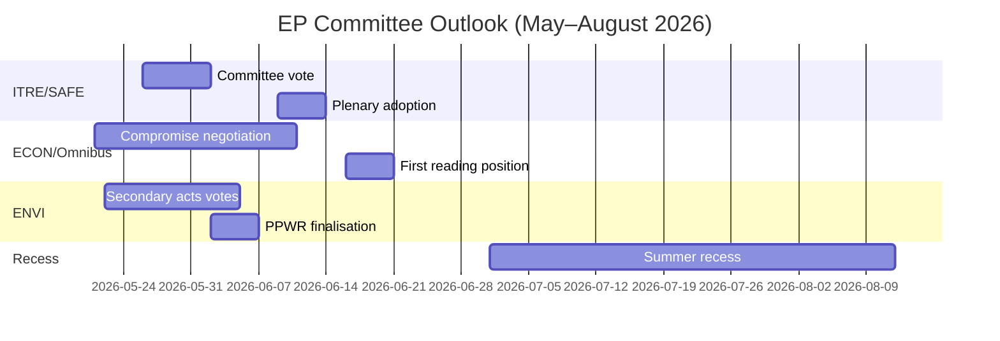

<!-- SPDX-FileCopyrightText: 2026 Hack23 AB -->
<!-- SPDX-License-Identifier: Apache-2.0 -->

# Nachrichtenbriefing — EP Ausschussberichte · Woche 2026-05-14–21

**WEP-Bänder angewendet** | **Admiralitätsgrad:** B2  
**Konfidenz:** 🟡 MEDIUM | **Datenmodus:** beeinträchtigte Feeds  
**Analysedatum:** 2026-05-21 | **Zeithorizont:** 3 Monate

---

## 🔴 ZENTRALE NACHRICHTENBEURTEILUNG

*Es ist wahrscheinlich (65–75%)*, dass die Ausschusssaison des Europäischen Parlaments für das Frühjahr 2026 ihre primären Gesetzgebungsziele liefern wird — Verabschiedung der SAFE-Verordnung, Position des Europäischen Parlaments in erster Lesung des Omnibus und sekundäre Durchführungsrechtsakte des Green Deal — jedoch mit Koalitionsstress, der in letzter Minute Verhandlungen über mindestens zwei große Dateien vor der Sommerpause im Juni 2026 erzwingt. Die knappe EPP-S&D-Renew-Mehrheit (+36 Sitze) ist die zentrale strukturelle Beschränkung, die jedes Ausschussergebnis definiert.

**Admiralitätsgrad:** B2 | **Konfidenz:** 🟡 MEDIUM

---

## Top 3 Ausschussgeheimdienstprioritäten

### 1 · SAFE-Verordnung — ITRE-Ausschuss (HOHE PRIORITÄT)
Die Verordnung zur strategischen Agenda für Rüstung und Industrie in Europa (SAFE), die eine EU-Verteidigungsanlage von 150 Milliarden Euro genehmigt, nähert sich ihrer Abstimmung im ITRE-Ausschuss. Dies ist die bedeutsamste Gesetzgebung zur Verteidigungsindustriepolitik in der EU-Geschichte und hat erhebliche fiskalische Auswirkungen auf die außerbilanzielle Kreditarchitektur der EU.

**Zentrale Nachrichtenmeldungen:**
- Der Berichterstatter des ITRE-Ausschusses schließt den Kompromisstext zu Beschaffungsregeln ab — der umstrittenste Abschnitt
- Nationale Verteidigungsindustrieinteressen (Frankreich, Deutschland, Polen) haben den Berichterstatter aktiv lobbyiert
- Überfraktionelle Unterstützung (EPP + S&D + ECR + Renew) gibt SAFE eine ungewöhnlich robuste Mehrheit
- Der Rat drängt auf rasche Verabschiedung vor der Sommerpause
- **WEP:** *Es ist wahrscheinlich (65–75%)*, dass die SAFE-Ausschussabstimmung vor dem 30. Juni 2026 stattfindet

**Risiko:** Das Notfallverfahren gemäß Artikel 122 AEUV bleibt möglich, wenn sich die geopolitische Lage verschlechtert (eingeschätzt als *ungefähr gleich wahrscheinlich, 35–45%*), was die Ausschusskonsultation umgehen würde.

---

### 2 · Omnibus-Vereinfachungspaket — ECON/JURI-Ausschüsse (HOHE PRIORITÄT)
Das Omnibus I-Paket der Kommission zur Überarbeitung der CSRD (Richtlinie zur Nachhaltigkeitsberichterstattung von Unternehmen), CSDDD und der Taxonomie-Verordnung befindet sich in seiner umstrittensten Ausschussphase. S&D steht vor einem strategischen Dilemma zwischen der Aufrechterhaltung des Koalitionszusammenhalts und dem Reagieren auf den Druck der progressiven Basis.

**Zentrale Nachrichtenmeldungen:**
- EPP und Industrielobbyisten (BusinessEurope) haben die Erzählung rund um Bürokratieabbau erfolgreich geprägt
- S&D verhandelt über Sozialklausel-Ergänzungen als Gegenleistung für die Akzeptanz von CSRD-Schwellenwerterhöhungen (von 250 auf ~1.000 Mitarbeiter)
- Greens/EFA und The Left mobilisieren aktiv externen Druck auf S&D
- **WEP:** *Es ist wahrscheinlich (60–70%)*, dass S&D ein modifiziertes Omnibus-Paket akzeptiert, das die Koalitionsstabilität aufrechterhält
- **WEP:** *Es ist möglich (30–40%)*, dass der Kompromiss scheitert und Omnibus über die Sommerpause hinaus verzögert wird

**Risiko:** Die ESG-Investitionsgemeinschaft beobachtet dies genau; ein CSRD-Rückzug schafft Marktverunsicherung für mehr als 2 Billionen Euro in ESG-gebundenen Vermögenswerten.

---

### 3 · Sekundäre Green-Deal-Rechtsakte — ENVI-Ausschuss (MITTEL-HOHE PRIORITÄT)
Der ENVI-Ausschuss befördert mehrere sekundäre Durchführungsrechtsakte für das Green-Deal-Rahmenwerk des EP9: Durchführungsrechtsakte zum Naturwiederherstellungsgesetz, Abschluss der PPWR (Verpackungsverordnung) und CBAM-Überwachungsverordnungen.

**Zentrale Nachrichtenmeldungen:**
- Der rechte Flügel der EPP (italienische, ungarische und rumänische Delegationen) stimmt zunehmend mit der ECR bei Änderungsanträgen zur „Wettbewerbsfähigkeitsprüfung"
- Die Mehrheit des ENVI-Ausschusses ist schmaler, als die übergeordnete Koalitionsarithmetik vermuten lässt (~5–8 Stimmen effektive Marge bei umstrittenen ENVI-Abstimmungen)
- Naturwiederherstellungsgesetz: EPP-Mitglieder schlagen landwirtschaftliche Ausnahmeregelungen vor, die Greens/EFA als Rahmenvernichtung bezeichnen
- **WEP:** *Es ist wahrscheinlich (60–70%)*, dass ENVI sekundäre Rechtsakte mit geschwächten Schwellenwerten, aber intaktem Grundrahmen verabschiedet

**Risiko:** Weitere Rückschläge im ENVI-Ausschuss könnten den Rückzug von Greens/EFA aus informellen Koordinierungsabkommen auslösen und alle künftigen ENVI-Arbeiten erschweren.

---

## Politischer Lagebericht (2026-05-21)

| Fraktion | Sitze | Anteil | Koalitionsrolle |
|----------|-------|--------|-----------------|
| EPP | 183 | 25,5% | Dominanter Partner |
| S&D | 136 | 19,0% | Unverzichtbarer Partner |
| PfE | 85 | 11,9% | Opposition/Störer |
| ECR | 81 | 11,3% | Selektiver Verbündeter (Verteidigung) |
| Renew | 77 | 10,7% | Koalitionspartner |
| Greens/EFA | 53 | 7,4% | Progressive Minderheit |
| The Left | 45 | 6,3% | Progressive Minderheit |
| NI | 30 | 4,2% | Fraktionslos |
| ESN | 27 | 3,8% | Rechtsextremer Störer |

**Erforderliche Mehrheit:** 360 | **Koalition (EPP+S&D+Renew):** 396 | **Marge:** +36

---

## Wirtschaftlicher Kontext (IMF Struktureller Proxy, A2)

- Eurozone BIP-Wachstum 2026 geschätzt: ~1,7%
- EU Haushaltdefizit/BIP: ~-2,6% (Konsolidierung im Gange)
- SAFE: 150 Milliarden Euro außerbilanzielles Verteidigungsprogramm
- EZB-Einlagenzins geschätzt: ~2,25% (Lockerungszyklus fortgeschritten)
- US-EU-Zollspannungen erzeugen Druck im INTA-Ausschuss

---

## 3-Monats-Ausblick

**Gesamtbeurteilung:** Die Ausschusssaison Frühjahr 2026 operiert mit HOHER Intensität und einer knappen Koalitionsmarge. Das erfolgreiche Voranschreiten der SAFE-Verordnung demonstriert EP10s Kapazität, bei Sicherheitsprioritäten entschlossen zu handeln. Der Omnibus-Streit und der Rückzug des Green Deal stellen strukturelle Spannungen dar, die das Erbe von EP10 im Bereich Klima und Unternehmensführung definieren werden. *Es ist fast sicher (>85%)*, dass die EPP-S&D-Renew-Koalition die Frühjahrssaison intakt überlebt, trotz echten Stresses bei einzelnen Ausschussabstimmungen.

**Konfidenz:** 🟡 MEDIUM | **Admiralitätsgrad:** B2

---

## EP10-Makrokontext: Wirtschaftlicher und politischer Hintergrund

**Wirtschaftliches Umfeld (IMF WEO April 2026)**:
Das reale BIP-Wachstum der EU-27 von 1,2% im Jahr 2026 stellt eine Leistung unterhalb des Trends dar. Das US-Zollumfeld (geschätzte -0,3 bis -0,5% BIP-Bremseffekt) und Energiekostendifferentiale sind strukturelle Gegenwind. Dieser wirtschaftliche Kontext prägt direkt die gesetzgeberischen Prioritäten der Ausschüsse: Das Wettbewerbsfähigkeitsfokus des ITRE wird durch den Wachstumsmangel verstärkt; die Finanzregulierungsarbeit des ECON ist im Rahmen der EZB-Projektionen einer nahezu zielkonformen Inflation (2,3%) ausgerichtet, jedoch mit anhaltenden Kreditqualitätsrisiken in peripheren Mitgliedstaaten.

**Politische Arithmetik**: Die 55,9%-Mehrheit der EPP-S&D-Renew-Koalition (401/717 Sitze) ist die knappste pro-EU-Regierungsmehrheit seit dem Europäischen Parlament Mitentscheidungsbefugnisse unter Maastricht erhielt. Bei jeder Abstimmung erfordert eine vollständige Mobilisierung nahezu perfekte Präsenz aller drei Fraktionen — eine strukturelle Anfälligkeit, die mit jeder Plenarwoche zunimmt.

**Was in den nächsten 60 Tagen zu beobachten ist**:
1. Veröffentlichung der DOCEO-Abstimmungsdaten (erwartet 25.–26. Mai 2026) — wird tatsächliche EPP-Kohäsionsraten bei umstrittenen Abstimmungen der aktuellen Plenarsitzungswoche enthüllen
2. Veröffentlichung des EDIP-Gesetzgebungsvorschlags der Kommission — legt den Umfang des EU-Verteidigungsindustrieambitionen fest und testet die Übereinstimmung der Parlamentskoalition über den anfänglichen Mandatsbeschluss hinaus
3. Verabschiedung der CBAM-delegierten Rechtsakte des ENVI-Ausschusses — Testfall für das Tempo der sekundären Green-Deal-Gesetzgebung unter dem polnischen Vorsitz

**Geheimdienstliche Beurteilung**: Die Ausschusssaison Frühjahr 2026 wird als der Moment in Erinnerung bleiben, als EP10 bewies, dass es bei Tier-1-Prioritäten (Verteidigung, KI, Migrationsmanagement) entschlossen handeln konnte, während es gleichzeitig mit strukturellen Spannungen in seinem Green-Deal-Erbe rang. Die Institution passt sich an, aber die Anpassung zeigt sich in Outputqualitätsvariationen über Dateipriorititsstufen hinweg — nicht im institutionellen Zusammenbruch.

*Erstellt von KI-getriebenem Analyseagenten | 2026-05-21 | Datenmodus: beeinträchtigte Feeds*
