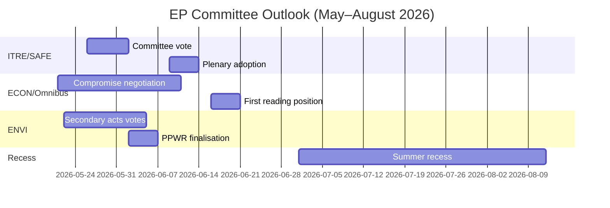

<!-- SPDX-FileCopyrightText: 2026 Hack23 AB -->
<!-- SPDX-License-Identifier: Apache-2.0 -->

# Informe de inteligencia — Informes de comisiones del PE · Semana del 2026-05-14–21

**Bandas WEP aplicadas** | **Grado Almirantazgo:** B2  
**Confianza:** 🟡 MEDIUM | **Modo de datos:** feeds degradados  
**Fecha de análisis:** 2026-05-21 | **Horizonte temporal:** 3 meses

---

## 🔴 VALORACIÓN DE INTELIGENCIA CENTRAL

*Es probable (65–75%)* que la temporada de comisiones del Parlamento Europeo para la primavera de 2026 entregue sus principales objetivos legislativos — adopción del reglamento SAFE, posición en primera lectura del Omnibus y actos de ejecución secundarios del Pacto Verde — pero con tensión de coalición que forzará negociaciones de última hora sobre al menos dos expedientes importantes antes del receso de verano de junio de 2026. La estrecha mayoría EPP-S&D-Renew (+36 escaños) es la restricción estructural central que define cada resultado de comisión.

**Grado Almirantazgo:** B2 | **Confianza:** 🟡 MEDIUM

---

## Top 3 Prioridades de inteligencia de comisiones

### 1 · Reglamento SAFE — Comisión ITRE (PRIORIDAD ALTA)
El reglamento sobre la Agenda Estratégica para el Armamento y los Factores en Europa (SAFE), que autoriza una instalación de defensa de la UE de 150 mil millones de euros, se acerca a su votación en la comisión ITRE. Esta es la legislación de política industrial de defensa más significativa de la historia de la UE y tiene importantes implicaciones fiscales para la arquitectura de endeudamiento fuera de balance de la UE.

**Inteligencia clave:**
- El ponente de la comisión ITRE está finalizando el texto de compromiso sobre las normas de contratación — la sección más controvertida
- Los intereses industriales nacionales de defensa (Francia, Alemania, Polonia) han presionado activamente al ponente
- El apoyo transcoalición (EPP + S&D + ECR + Renew) otorga a SAFE una mayoría inusualmente sólida
- El Consejo presiona por una adopción acelerada antes del receso de verano
- **WEP:** *Es probable (65–75%)* que la votación en comisión de SAFE se produzca antes del 30 de junio de 2026

**Riesgo:** El procedimiento de emergencia del artículo 122 TFUE sigue siendo posible si la situación geopolítica se deteriora (estimado con *probabilidades aproximadamente iguales, 35–45%*), lo que omitiría la consulta a la comisión.

---

### 2 · Paquete de simplificación Omnibus — Comisiones ECON/JURI (PRIORIDAD ALTA)
El paquete Omnibus I de la Comisión que revisa la CSRD (Directiva de Sostenibilidad Corporativa), la CSDDD y el Reglamento de Taxonomía se encuentra en su fase de comisión más controvertida. S&D se enfrenta a un dilema estratégico entre mantener la cohesión de la coalición y responder a la presión de su base progresista.

**Inteligencia clave:**
- El EPP y los grupos de presión industriales (BusinessEurope) han moldeado con éxito el relato en torno a la reducción de cargas
- S&D negocia la adición de cláusulas sociales como contrapartida para aceptar aumentos de umbrales en la CSRD (de 250 a ~1 000 empleados)
- Greens/EFA y The Left movilizan activamente presión externa sobre S&D
- **WEP:** *Es probable (60–70%)* que S&D acepte un paquete Omnibus modificado que mantenga la estabilidad de la coalición
- **WEP:** *Es posible (30–40%)* que el compromiso fracase, retrasando el Omnibus más allá del receso de verano

**Riesgo:** La comunidad de inversores en ESG observa de cerca; la dilución de la CSRD crea incertidumbre de mercado para más de 2 billones de euros en activos vinculados a ESG.

---

### 3 · Actos secundarios del Pacto Verde — Comisión ENVI (PRIORIDAD MEDIA-ALTA)
La comisión ENVI avanza varios actos de ejecución secundarios del marco del Pacto Verde del PE9: actos de ejecución de la Ley de Restauración de la Naturaleza, finalización del PPWR (Reglamento de Envases) y reglamentos de vigilancia del CBAM.

**Inteligencia clave:**
- El ala derecha del EPP (delegaciones italiana, húngara y rumana) vota en mayor medida con el ECR en las enmiendas de «comprobación de competitividad»
- La mayoría de la comisión ENVI es más estrecha de lo que la aritmética general de la coalición sugeriría (~5–8 votos de margen efectivo en votaciones controvertidas de la ENVI)
- Ley de Restauración de la Naturaleza: miembros del EPP proponen derogaciones agrícolas que Greens/EFA califica de destrucción del marco
- **WEP:** *Es probable (60–70%)* que la ENVI adopte actos secundarios con umbrales debilitados pero un marco fundamental intacto

**Riesgo:** Cualquier nuevo revés en la comisión ENVI podría desencadenar la retirada de Greens/EFA de los acuerdos de coordinación informal, complicando todo el trabajo futuro de la ENVI.

---

## Panorama político (2026-05-21)

| Grupo | Escaños | Cuota | Papel en la coalición |
|-------|---------|-------|-----------------------|
| EPP | 183 | 25,5% | Socio dominante |
| S&D | 136 | 19,0% | Socio esencial |
| PfE | 85 | 11,9% | Oposición/Perturbador |
| ECR | 81 | 11,3% | Aliado selectivo (defensa) |
| Renew | 77 | 10,7% | Socio de coalición |
| Greens/EFA | 53 | 7,4% | Minoría progresista |
| The Left | 45 | 6,3% | Minoría progresista |
| NI | 30 | 4,2% | No inscrito |
| ESN | 27 | 3,8% | Perturbador de extrema derecha |

**Mayoría necesaria:** 360 | **Coalición (EPP+S&D+Renew):** 396 | **Margen:** +36

---

## Contexto económico (IMF Proxy estructural, A2)

- Crecimiento del PIB de la zona euro en 2026 estimado: ~1,7%
- Déficit fiscal/PIB de la UE: ~-2,6% (consolidación en curso)
- SAFE: instalación de defensa fuera de balance de 150 mil millones de euros
- Tipo de depósito del BCE estimado: ~2,25% (ciclo de relajación avanzado)
- Las tensiones arancelarias EE. UU.-UE crean presión en la comisión INTA

---

## Perspectivas a 3 meses

**Evaluación general:** La temporada de comisiones de la primavera de 2026 opera con ALTA intensidad y un margen de coalición estrecho. El avance exitoso del reglamento SAFE demuestra la capacidad del PE10 para actuar de forma decisiva en las prioridades de seguridad. La contestación del Omnibus y la retirada del Pacto Verde representan tensiones estructurales que definirán el legado del PE10 en materia de clima y gobierno corporativo. *Es casi seguro (>85%)* que la coalición EPP-S&D-Renew sobrevive a la temporada de primavera intacta, a pesar de la tensión real en votaciones individuales de comisión.

**Confianza:** 🟡 MEDIUM | **Grado Almirantazgo:** B2

---

## Macrocontexto del PE10: Contexto económico y político

**Entorno económico (IMF WEO abril de 2026)**:
El crecimiento real del PIB de la UE-27 de un 1,2% en 2026 representa un rendimiento por debajo de la tendencia. El entorno arancelario de EE. UU. (arrastre estimado del PIB de -0,3 a -0,5%) y los diferenciales de costes energéticos son vientos en contra estructurales. Este contexto económico moldea directamente las prioridades legislativas de las comisiones: el enfoque en competitividad del ITRE se ve amplificado por el déficit de crecimiento; el trabajo de regulación financiera del ECON está enmarcado frente a las proyecciones del BCE de una inflación cercana al objetivo (2,3%), pero con riesgos de calidad crediticia persistentes en los Estados miembros periféricos.

**Aritmética política**: La mayoría del 55,9% de la coalición EPP-S&D-Renew (401/717 escaños) es la mayoría gobernante pro-UE más estrecha desde que el Parlamento Europeo obtuvo poderes de codecisión en virtud del Tratado de Maastricht. Para cualquier votación dada, la movilización completa requiere una asistencia casi perfecta de los tres grupos — una vulnerabilidad estructural que aumenta con cada semana plenaria.

**Qué vigilar en los próximos 60 días**:
1. Publicación de datos de votación de DOCEO (prevista para el 25–26 de mayo de 2026) — revelará las tasas reales de cohesión del EPP en votaciones controvertidas de la semana plenaria en curso
2. Publicación de la propuesta legislativa EDIP de la Comisión — establece el alcance de la ambición industrial de defensa de la UE y pone a prueba la alineación de la coalición parlamentaria más allá del voto de mandato inicial
3. Adopción de los actos delegados CBAM por la comisión ENVI — caso de prueba para el ritmo de la legislación secundaria del Pacto Verde bajo la presidencia polaca

**Juicio de inteligencia**: La temporada de comisiones de la primavera de 2026 será recordada como el momento en que el PE10 demostró que podía actuar de forma decisiva en las prioridades de nivel 1 (defensa, IA, gestión de la migración), mientras luchaba simultáneamente con tensiones estructurales en su herencia del Pacto Verde. La institución se está adaptando, pero la adaptación es visible en la variación de la calidad de los resultados según los niveles de prioridad de los expedientes, no en un colapso institucional.

*Elaborado por agente de análisis impulsado por IA | 2026-05-21 | Modo de datos: feeds degradados*
