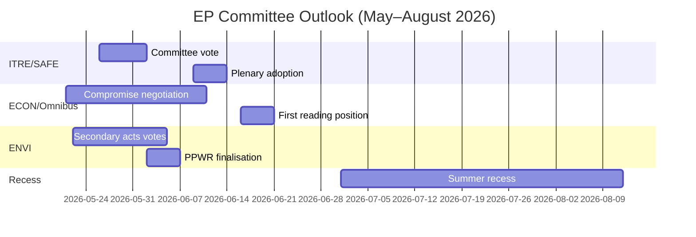

<!-- SPDX-FileCopyrightText: 2026 Hack23 AB -->
<!-- SPDX-License-Identifier: Apache-2.0 -->

# Tiedustelutiivistelmä — EP Valiokuntaraportit · Viikko 2026-05-14–21

**WEP-tasot sovellettu** | **Amiraaliston luokka:** B2  
**Luottamusaste:** 🟡 MEDIUM | **Datatila:** heikentyneet syötteet  
**Analyysipäivä:** 2026-05-21 | **Aikahorisontti:** 3 kuukautta

---

## 🔴 KESKEINEN TIEDUSTELUARVIO

*On todennäköistä (65–75%)*, että Euroopan parlamentin valiokuntatoimikausi keväällä 2026 saavuttaa ensisijaiset lainsäädäntötavoitteensa — SAFE-asetuksen hyväksyminen, Omnibus-paketin ensimmäisen käsittelyn kanta ja vihreän kehityksen ohjelman toissijaiset täytäntöönpanosäädökset — mutta koalition kuormituksen pakottamina viime hetken neuvotteluilla vähintään kahdesta tärkeästä tiedostosta ennen kesäistuntotaukoa kesäkuussa 2026. Kapea EPP-S&D-Renew-enemmistö (+36 paikkaa) on keskeinen rakenteellinen rajoite, joka määrittelee jokaisen valiokunnan tuloksen.

**Amiraaliston luokka:** B2 | **Luottamusaste:** 🟡 MEDIUM

---

## Kolme tärkeintä valiokuntatieto-prioriteettia

### 1 · SAFE-asetus — ITRE-valiokunta (KORKEA PRIORITEETTI)
Euroopan puolustusalan strategista agendaa koskeva asetus (SAFE), jolla hyväksytään 150 miljardin euron EU:n puolustusrahoitusväline, lähestyy äänestystään ITRE-valiokunnassa. Tämä on merkittävin puolustusalan teollisuuspolitiikan lainsäädäntö EU:n historiassa, ja sillä on merkittäviä finanssipoliittisia seurauksia EU:n taseen ulkopuoliselle lainausarkkitehtuurille.

**Keskeinen tiedustelu:**
- ITRE-valiokunnan esittelijä viimeistelee kompromissitekstiä hankintasääntöjä koskien — kiistanalaisin osa
- Kansalliset puolustusalan teollisuusintressit (Ranska, Saksa, Puola) ovat aktiivisesti lobbanneet esittelijää
- Ristikkäinen koalitiotuki (EPP + S&D + ECR + Renew) antaa SAFE:lle poikkeuksellisen vahvan enemmistön
- Neuvosto painostaa nopeaa hyväksymistä ennen kesätaukoa
- **WEP:** *On todennäköistä (65–75%)*, että SAFE-valiokunnan äänestys tapahtuu ennen 30. kesäkuuta 2026

**Riski:** Hätätoimenpide EUT-sopimuksen 122 artiklan nojalla on edelleen mahdollinen, jos geopoliittinen tilanne pahenee (arviolta *suunnilleen tasavertaiset todennäköisyydet, 35–45%*), mikä ohittaisi valiokuntakonsultaation.

---

### 2 · Omnibus-yksinkertaistamispaketti — ECON/JURI-valiokunnat (KORKEA PRIORITEETTI)
Komission Omnibus I -paketti, jolla muutetaan CSRD:tä (yritysten kestävyysraportointidirektiivi), CSDDD:tä ja taksonomia-asetusta, on kiistanalaisimmassa valiokuntavaiheessaan. S&D on koalition yhtenäisyyden ylläpitämisen ja progressiivisen tukijoukon paineen vastaamisen välisessä strategisessa dilemmassa.

**Keskeinen tiedustelu:**
- EPP ja teollisuuslobbarit (BusinessEurope) ovat menestyksekkäästi muovanneet kertomusta hallinnollisesta taakasta
- S&D neuvottelee sosiaaliehtojen lisäämisestä vastineena CSRD-kynnysarvojen korotuksille (250:stä n. 1 000 työntekijään)
- Greens/EFA ja The Left mobilisoivat aktiivisesti ulkoista painetta S&D:tä kohtaan
- **WEP:** *On todennäköistä (60–70%)*, että S&D hyväksyy muutetun Omnibus-paketin, joka ylläpitää koalition vakauden
- **WEP:** *On mahdollista (30–40%)*, että kompromissi hajoaa ja Omnibus viivästyy kesätauon jälkeiseen aikaan

**Riski:** ESG-sijoitusyhteisö seuraa tarkasti; CSRD:n peruminen luo markkinaepävarmuutta yli 2 biljoonan euron ESG-sidotuille varoille.

---

### 3 · Vihreän kehityksen ohjelman toissijaiset säädökset — ENVI-valiokunta (KESKI-KORKEA PRIORITEETTI)
ENVI-valiokunta vie eteenpäin useita toissijaisia täytäntöönpanosäädöksiä EP9:n vihreän kehityksen ohjelman puitteissa: luonnonennallistamislain täytäntöönpanosäädökset, PPWR:n (pakkausasetus) viimeistely ja CBAM-valvonta-asetukset.

**Keskeinen tiedustelu:**
- EPP:n oikeisto (italialaiset, unkarilaiset ja romanialaiset valtuuskunnat) äänestää kasvavassa määrin ECR:n kanssa "kilpailukykytestausta" koskevista tarkistuksista
- ENVI-valiokunnan enemmistö on kapeampi kuin koalition kokonaisaritmetiikka antaa ymmärtää (~5–8 äänen käytännön marginaali kiistanalaisilla ENVI-äänestyksillä)
- Luonnonennallistamislaki: EPP-jäsenet ehdottavat maatalouspoikkeuksia, joita Greens/EFA kuvaavat kehystuhoukseksi
- **WEP:** *On todennäköistä (60–70%)*, että ENVI hyväksyy toissijaiset säädökset heikennetyillä kynnyksillä mutta ehjällä perustavanlaatuisella kehyksellä

**Riski:** Lisävastoinkäyminen ENVI-valiokunnassa voi laukaista Greens/EFA:n vetäytymisen epävirallisista koordinointisopimuksista, mikä mutkistaa kaikkea tulevaa ENVI-työtä.

---

## Poliittinen tilannekatselmus (2026-05-21)

| Ryhmä | Paikkoja | Osuus | Koalitiorooli |
|-------|----------|-------|---------------|
| EPP | 183 | 25,5% | Dominoiva kumppani |
| S&D | 136 | 19,0% | Välttämätön kumppani |
| PfE | 85 | 11,9% | Oppositio/Häiritsijä |
| ECR | 81 | 11,3% | Selektiivinen liittolainen (puolustus) |
| Renew | 77 | 10,7% | Koalitiokumppani |
| Greens/EFA | 53 | 7,4% | Progressiivinen vähemmistö |
| The Left | 45 | 6,3% | Progressiivinen vähemmistö |
| NI | 30 | 4,2% | Sitoutumaton |
| ESN | 27 | 3,8% | Äärioikeistolainen häiritsijä |

**Tarvittava enemmistö:** 360 | **Koalitio (EPP+S&D+Renew):** 396 | **Marginaali:** +36

---

## Taloudellinen konteksti (IMF Rakenteellinen välitysmuuttuja, A2)

- Euroalueen BKT-kasvu 2026 arvioitu: ~1,7%
- EU:n finanssipoliittinen alijäämä/BKT: ~-2,6% (konsolidaatio käynnissä)
- SAFE: 150 miljardin euron taseen ulkopuolinen puolustusrahoitusväline
- EKP:n talletuskorko arvioitu: ~2,25% (kevennyssykli edennyt)
- USA-EU-tullikiisteet luovat painetta INTA-valiokunnassa

---

## 3 kuukauden näkymä

**Kokonaisarvio:** Kevään 2026 valiokuntatoimikausi toimii KORKEAN intensiteetin ja kapean koalitiomarginaalin olosuhteissa. SAFE-asetuksen onnistunut eteneminen osoittaa EP10:n kyvyn toimia päättäväisesti turvallisuusprioriteeteissa. Omnibus-kiistely ja vihreän kehityksen ohjelman takapakki edustavat rakenteellisia jännitteitä, jotka määrittelevät EP10:n perinnön ilmastossa ja yrityshallinnossa. *On lähes varmaa (>85%)*, että EPP-S&D-Renew-koalitio selviää keväästoimikaudesta ehjänä, huolimatta todellisesta kuormituksesta yksittäisissä valiokuntaäänestyksissä.

**Luottamusaste:** 🟡 MEDIUM | **Amiraaliston luokka:** B2

---

## EP10 Makrokonteksti: Taloudellinen ja poliittinen tausta

**Taloudellinen ympäristö (IMF WEO huhtikuu 2026)**:
EU-27:n reaalinen BKT-kasvu 1,2% vuonna 2026 edustaa trendin alaista suoritusta. Yhdysvaltojen tullipolitiikka (arvioitu -0,3–-0,5%:n BKT-vaikutus) ja energiakustannuserot ovat rakenteellisia vastatuulia. Tämä taloudellinen konteksti muovaa suoraan valiokuntien lainsäädäntöprioriteetit: ITRE:n kilpailukykyyn keskittymistä vahvistaa kasvuvaje; ECON:n rahoitussääntelytyö on kehystetty EKP:n ennusteiden mukaan lähes tavoiteinflation (2,3%), mutta pysyvät luottolaadun riskit perifeerisissä jäsenvaltioissa.

**Poliittinen aritmetiikka**: EPP-S&D-Renew-koalition 55,9%:n enemmistö (401/717 paikkaa) on kapein EU-myönteinen hallitusenemmistö sitten Euroopan parlamentin saadessa yhteispäätösoikeudet Maastrichtissa. Missä tahansa äänestyksessä täysi mobilisaatio edellyttää lähes täydellistä läsnäoloa kaikilta kolmelta ryhmältä — rakenteellinen haavoittuvuus, joka kasvaa jokaisen täysistuntoviikon myötä.

**Mitä seurata seuraavien 60 päivän aikana**:
1. DOCEO-äänestysdatan julkaisu (odotettavissa 25.–26. toukokuuta 2026) — paljastaa todelliset EPP-koheesioasteet kiistanalaisissa äänestyksissä kuluvan täysistuntoviikon ajalta
2. Komission EDIP-lainsäädäntöehdotuksen julkaisu — määrittelee EU:n puolustusalan teollisten tavoitteiden laajuuden ja testaa parlamenttikoalition yhdenmukaistumista alkuperäisen mandaattiäänestyksen jälkeen
3. ENVI-valiokunnan CBAM-delegoitujen säädösten hyväksyminen — testitapaus vihreän kehityksen ohjelman toissijaiselle lainsäädäntötahdille Puolan puheenjohtajuuskaudella

**Tiedusteluarvio**: Kevään 2026 valiokuntatoimikausi muistetaan hetkenä, jolloin EP10 osoitti kykenevänsä toimimaan päättäväisesti Taso 1 -prioriteeteissa (puolustus, tekoäly, muuttoliikkeenhallinta) samalla kun se kamppaili rakenteellisten jännitteiden kanssa vihreän kehityksen ohjelman perinnöstä. Instituutio sopeutuu, mutta sopeutuminen näkyy tuottokvaliteetin vaihteluna tiedostoprioriteettiluokkien välillä — ei institutionaalisena romahduksena.

*Laadittu tekoälypohjaisen analyysiagentti | 2026-05-21 | Datatila: heikentyneet syötteet*
