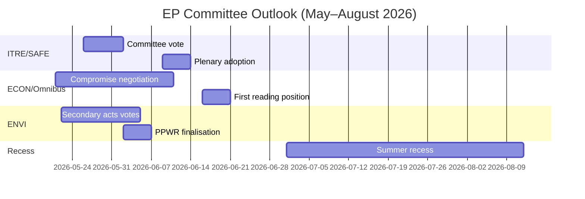

<!-- SPDX-FileCopyrightText: 2026 Hack23 AB -->
<!-- SPDX-License-Identifier: Apache-2.0 -->

# Note de renseignement — Rapports de commissions du PE · Semaine du 2026-05-14–21

**Bandes WEP appliquées** | **Grade de l'Amirauté :** B2  
**Confiance :** 🟡 MEDIUM | **Mode données :** flux dégradés  
**Date d'analyse :** 2026-05-21 | **Horizon temporel :** 3 mois

---

## 🔴 JUGEMENT DE RENSEIGNEMENT CENTRAL

*Il est probable (65–75%)* que la saison de commissions du Parlement européen pour le printemps 2026 livrera ses principaux objectifs législatifs — adoption du règlement SAFE, position en première lecture de l'Omnibus et actes d'exécution secondaires du Pacte vert — mais avec une tension de coalition forçant des négociations de dernière minute sur au moins deux dossiers majeurs avant la pause estivale de juin 2026. La majorité étroite EPP-S&D-Renew (+36 sièges) est la contrainte structurelle centrale définissant chaque résultat de commission.

**Grade de l'Amirauté :** B2 | **Confiance :** 🟡 MEDIUM

---

## Top 3 des priorités de renseignement des commissions

### 1 · Règlement SAFE — Commission ITRE (HAUTE PRIORITÉ)
Le règlement sur l'Agenda stratégique pour les armements et les facteurs en Europe (SAFE), autorisant une facilité de défense européenne de 150 milliards d'euros, approche de son vote en commission ITRE. Il s'agit de la législation de politique industrielle de défense la plus significative de l'histoire de l'UE et comporte des implications fiscales majeures pour l'architecture d'emprunt hors bilan de l'UE.

**Renseignements clés :**
- Le rapporteur de la commission ITRE finalise le texte de compromis sur les règles de passation de marchés — la section la plus contestée
- Les intérêts industriels nationaux de défense (France, Allemagne, Pologne) ont activement fait du lobbying auprès du rapporteur
- Le soutien trans-coalition (EPP + S&D + ECR + Renew) donne à SAFE une majorité inhabituellement robuste
- Le Conseil presse pour une adoption accélérée avant la pause estivale
- **WEP :** *Il est probable (65–75%)* que le vote en commission SAFE ait lieu avant le 30 juin 2026

**Risque :** La procédure d'urgence de l'article 122 TFUE reste possible si la situation géopolitique se dégrade (estimé à *chances à peu près égales, 35–45%*), ce qui contournerait la consultation en commission.

---

### 2 · Paquet de simplification Omnibus — Commissions ECON/JURI (HAUTE PRIORITÉ)
Le paquet Omnibus I de la Commission révisant la CSRD (directive sur la durabilité des entreprises), la CSDDD et le règlement Taxonomie se trouve dans sa phase la plus contestée en commission. S&D est face à un dilemme stratégique entre le maintien de la cohésion de la coalition et la réponse aux pressions de sa base progressiste.

**Renseignements clés :**
- L'EPP et les lobbyistes industriels (BusinessEurope) ont réussi à façonner le récit autour de la réduction des charges
- S&D négocie l'ajout de clauses sociales en contrepartie de l'acceptation des relèvements des seuils CSRD (de 250 à ~1 000 employés)
- Greens/EFA et The Left mobilisent activement une pression externe sur S&D
- **WEP :** *Il est probable (60–70%)* que S&D accepte un paquet Omnibus modifié maintenant la stabilité de la coalition
- **WEP :** *Il est possible (30–40%)* que le compromis s'effondre, retardant Omnibus au-delà de la pause estivale

**Risque :** La communauté des investisseurs ESG observe de près ; un recul sur la CSRD crée une incertitude de marché pour plus de 2 000 milliards d'euros d'actifs liés à l'ESG.

---

### 3 · Actes secondaires du Pacte vert — Commission ENVI (PRIORITÉ MOYENNE-HAUTE)
La commission ENVI avance plusieurs actes d'exécution secondaires du cadre Pacte vert du PE9 : actes d'exécution de la loi sur la restauration de la nature, finalisation du PPWR (règlement sur les emballages) et règlements de surveillance du MCAS.

**Renseignements clés :**
- L'aile droite de l'EPP (délégations italienne, hongroise et roumaine) vote de plus en plus avec l'ECR sur les amendements d'«évaluation de la compétitivité»
- La majorité de la commission ENVI est plus étroite que la seule arithmétique de coalition ne le laisserait penser (~5–8 voix de marge effective lors des votes ENVI contestés)
- Loi sur la restauration de la nature : les membres de l'EPP proposent des dérogations agricoles que Greens/EFA qualifient de destruction du cadre
- **WEP :** *Il est probable (60–70%)* qu'ENVI adopte des actes secondaires avec des seuils affaiblis mais un cadre fondamental intact

**Risque :** Tout nouveau revers au sein de la commission ENVI pourrait déclencher le retrait de Greens/EFA des accords de coordination informels, compliquant tous les futurs travaux d'ENVI.

---

## Panorama politique (2026-05-21)

| Groupe | Sièges | Part | Rôle de coalition |
|--------|--------|------|-------------------|
| EPP | 183 | 25,5% | Partenaire dominant |
| S&D | 136 | 19,0% | Partenaire essentiel |
| PfE | 85 | 11,9% | Opposition/Perturbateur |
| ECR | 81 | 11,3% | Allié sélectif (défense) |
| Renew | 77 | 10,7% | Partenaire de coalition |
| Greens/EFA | 53 | 7,4% | Minorité progressiste |
| The Left | 45 | 6,3% | Minorité progressiste |
| NI | 30 | 4,2% | Non-inscrit |
| ESN | 27 | 3,8% | Perturbateur d'extrême droite |

**Majorité nécessaire :** 360 | **Coalition (EPP+S&D+Renew) :** 396 | **Marge :** +36

---

## Contexte économique (IMF Proxy structurel, A2)

- Croissance du PIB de la zone euro en 2026 estimée : ~1,7%
- Déficit budgétaire/PIB de l'UE : ~-2,6% (consolidation en cours)
- SAFE : facilité de défense hors bilan de 150 milliards d'euros
- Taux de dépôt de la BCE estimé : ~2,25% (cycle d'assouplissement avancé)
- Les tensions tarifaires USA-UE exercent une pression sur la commission INTA

---

## Perspectives sur 3 mois

**Évaluation globale :** La saison des commissions du printemps 2026 fonctionne à HAUTE intensité avec une marge de coalition étroite. L'avancement réussi du règlement SAFE démontre la capacité du PE10 à agir de manière décisive sur les priorités de sécurité. La contestation de l'Omnibus et le recul du Pacte vert représentent des tensions structurelles qui définiront l'héritage du PE10 en matière de climat et de gouvernance d'entreprise. *Il est presque certain (>85%)* que la coalition EPP-S&D-Renew survit intacte à la saison de printemps, malgré une tension réelle sur certains votes en commission.

**Confiance :** 🟡 MEDIUM | **Grade de l'Amirauté :** B2

---

## Contexte macro du PE10 : Contexte économique et politique

**Environnement économique (IMF WEO avril 2026)** :
La croissance réelle du PIB de l'UE-27 de 1,2% en 2026 représente une performance inférieure à la tendance. L'environnement tarifaire américain (estimé à -0,3 à -0,5% de frein au PIB) et les différentiels de coûts énergétiques sont des vents contraires structurels. Ce contexte économique façonne directement les priorités législatives des commissions : le focus de l'ITRE sur la compétitivité est amplifié par le déficit de croissance ; les travaux de réglementation financière de l'ECON s'inscrivent dans le cadre des projections de la BCE d'une inflation proche de l'objectif (2,3%) mais avec des risques de qualité de crédit persistants dans les États membres périphériques.

**Arithmétique politique** : La majorité de 55,9% de la coalition EPP-S&D-Renew (401/717 sièges) est la majorité gouvernante pro-UE la plus étroite depuis que le Parlement européen a obtenu les pouvoirs de codécision en vertu du traité de Maastricht. Pour tout vote donné, la mobilisation totale exige une présence quasi parfaite des trois groupes — une vulnérabilité structurelle qui s'accroît à chaque semaine plénière.

**Ce qu'il faut surveiller dans les 60 prochains jours** :
1. Publication des données de vote DOCEO (attendue les 25–26 mai 2026) — révélera les taux réels de cohésion de l'EPP lors des votes contestés de la semaine plénière en cours
2. Publication de la proposition législative EDIP de la Commission — définit la portée des ambitions industrielles de défense de l'UE et teste l'alignement de la coalition parlementaire au-delà du vote de mandat initial
3. Adoption des actes délégués MCAS par la commission ENVI — cas test pour la cadence de la législation secondaire du Pacte vert sous la présidence polonaise

**Jugement de renseignement** : La saison des commissions du printemps 2026 sera rappelée comme le moment où le PE10 a démontré qu'il pouvait agir de manière décisive sur les priorités de niveau 1 (défense, IA, gestion des migrations) tout en luttant simultanément avec des tensions structurelles sur son héritage du Pacte vert. L'institution s'adapte, mais l'adaptation est visible dans la variation de la qualité des résultats selon les niveaux de priorité des dossiers — pas dans un effondrement institutionnel.

*Préparé par un agent d'analyse piloté par l'IA | 2026-05-21 | Mode données : flux dégradés*
