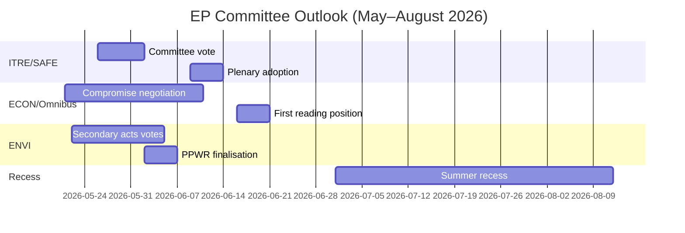

<!-- SPDX-FileCopyrightText: 2026 Hack23 AB -->
<!-- SPDX-License-Identifier: Apache-2.0 -->

# תדריך מודיעיני — דוחות ועדות הפרלמנט האירופי · שבוע 2026-05-14–21

**רצועות WEP שיושמו** | **דרגת אדמירליות:** B2  
**רמת ביטחון:** 🟡 MEDIUM | **מצב נתונים:** זנות מושפלות  
**תאריך ניתוח:** 2026-05-21 | **אופק זמן:** 3 חודשים

---

## 🔴 שיפוט מודיעיני מרכזי

*סביר (65–75%)* שעונת הוועדות של הפרלמנט האירופי לאביב 2026 תספק את יעדיה החקיקתיים העיקריים — אימוץ תקנת SAFE, עמדת הקריאה הראשונה של Omnibus ואקטים משניים ליישום ה-Green Deal — אך עם לחץ קואליציוני שמכריח משא ומתן ברגע האחרון על לפחות שני תיקים מרכזיים לפני הפסקת הקיץ ביוני 2026. הרוב הצר של EPP-S&D-Renew (+36 מושבים) הוא ההגבלה המבנית המרכזית שמגדירה כל תוצאה של ועדה.

**דרגת אדמירליות:** B2 | **רמת ביטחון:** 🟡 MEDIUM

---

## 3 עדיפויות מודיעיניות מובילות של ועדות

### 1 · תקנת SAFE — ועדת ITRE (עדיפות גבוהה)
תקנת האג'נדה האסטרטגית לחימוש ולגורמים באירופה (SAFE), המאשרת מתקן הגנה אירופי של 150 מיליארד יורו, מתקרבת להצבעתה בוועדת ITRE. זוהי החקיקה המשמעותית ביותר של מדיניות תעשיית ההגנה בהיסטוריה של האיחוד האירופי, ויש לה השלכות פיסקליות מרכזיות על מבנה ההלוואות מחוץ למאזן של האיחוד האירופי.

**מידע מודיעיני מרכזי:**
- המדווח של ועדת ITRE מסיים את נוסח הפשרה בנוגע לכללי רכש — הקטע השנוי ביותר במחלוקת
- אינטרסים לאומיים של תעשיית הגנה (צרפת, גרמניה, פולין) לחצו על המדווח באופן פעיל
- תמיכה חוצת-קואליציות (EPP + S&D + ECR + Renew) מעניקה ל-SAFE רוב בלתי-שגרתי
- המועצה לוחצת לאימוץ מואץ לפני הפסקת הקיץ
- **WEP:** *סביר (65–75%)* שהצבעת ועדת SAFE תתקיים לפני 30 ביוני 2026

**סיכון:** הליך חירום לפי סעיף 122 TFEU נותר אפשרי אם המצב הגיאופוליטי יחמיר (הערכה: *סיכויים שווים בקירוב, 35–45%*), מה שיעקוף את ייעוץ הוועדה.

---

### 2 · חבילת פישוט Omnibus — ועדות ECON/JURI (עדיפות גבוהה)
חבילת Omnibus I של הנציבות המתקנת את ה-CSRD (הנחיית דיווח קיימות לחברות), CSDDD ותקנת הטקסונומיה נמצאת בשלב הוועדות השנוי ביותר במחלוקת. S&D ניצב בפני דילמה אסטרטגית בין שמירה על הלכידות הקואליציונית לבין מענה ללחץ מהבסיס הפרוגרסיבי.

**מידע מודיעיני מרכזי:**
- EPP וקבוצות לחץ תעשייתיות (BusinessEurope) הצליחו לעצב את הנרטיב סביב הפחתת נטל
- S&D מנהל משא ומתן להוספת סעיפים חברתיים כתמורה לקבלת העלאות סף ה-CSRD (מ-250 לכ-1,000 עובדים)
- Greens/EFA ו-The Left מגייסים לחץ חיצוני פעיל על S&D
- **WEP:** *סביר (60–70%)* ש-S&D יקבל חבילת Omnibus מותאמת השומרת על יציבות הקואליציה
- **WEP:** *אפשרי (30–40%)* שהפשרה תתמוטט ותעכב את Omnibus מעבר לחופשת הקיץ

**סיכון:** קהילת ההשקעות בתחום ESG עוקבת בדריכות; נסיגה מה-CSRD יוצרת אי-ודאות שוק עבור יותר מ-2 טריליון יורו בנכסים מקושרי ESG.

---

### 3 · אקטים משניים של ה-Green Deal — ועדת ENVI (עדיפות בינונית-גבוהה)
ועדת ENVI מקדמת אקטים משניים מרובים ליישום מסגרת ה-Green Deal של EP9: אקטי יישום לחוק שיקום הטבע, השלמת PPWR (תקנת אריזות) ותקנות ניטור CBAM.

**מידע מודיעיני מרכזי:**
- הכנף הימנית של EPP (משלחות איטלקיה, הונגריה ורומניה) מצביעה יותר ויותר עם ECR על תיקוני "בדיקת תחרותיות"
- רוב ועדת ENVI צר יותר מכפי שמתמטיקת הקואליציה הכוללת מרמזת (~5–8 קולות מרחב יעיל בהצבעות ENVI שנויות במחלוקת)
- חוק שיקום הטבע: חברי EPP מציעים פטורים חקלאיים שGrees/EFA מכנה הרס מסגרת
- **WEP:** *סביר (60–70%)* ש-ENVI יאמץ אקטים משניים עם סף מוחלש אך מסגרת יסוד שלמה

**סיכון:** כל נסיגה נוספת בוועדת ENVI עלולה להפעיל את נסיגת Greens/EFA מהסכמי תיאום בלתי פורמליים, מה שיסבך כל עבודת ENVI עתידית.

---

## תמונת מצב פוליטי (2026-05-21)

| קבוצה | מושבים | נתח | תפקיד בקואליציה |
|--------|---------|-----|-----------------|
| EPP | 183 | 25.5% | שותף דומיננטי |
| S&D | 136 | 19.0% | שותף חיוני |
| PfE | 85 | 11.9% | אופוזיציה/מפריע |
| ECR | 81 | 11.3% | בעל ברית סלקטיבי (הגנה) |
| Renew | 77 | 10.7% | שותף קואליציוני |
| Greens/EFA | 53 | 7.4% | מיעוט פרוגרסיבי |
| The Left | 45 | 6.3% | מיעוט פרוגרסיבי |
| NI | 30 | 4.2% | לא מסונף |
| ESN | 27 | 3.8% | מפריע קיצוני |

**רוב נדרש:** 360 | **קואליציה (EPP+S&D+Renew):** 396 | **מרחב:** +36

---

## הקשר כלכלי (IMF שרת מבני, A2)

- צמיחת תוצר איזור היורו 2026 משוערת: ~1.7%
- גירעון פיסקלי/תוצר של האיחוד האירופי: ~-2.6% (גיבוש בתהליך)
- SAFE: מתקן הגנה מחוץ למאזן של 150 מיליארד יורו
- ריבית פיקדונות של הבנק המרכזי האירופי משוערת: ~2.25% (מחזור הקלה מתקדם)
- מתחים מכסיים בין ארה"ב לאיחוד האירופי יוצרים לחץ בוועדת INTA

---

## תחזית ל-3 חודשים

**הערכה כוללת:** עונת הוועדות של אביב 2026 פועלת בעצימות גבוהה עם מרחב קואליציוני צר. ההתקדמות המוצלחת של תקנת SAFE מדגימה את יכולת EP10 לפעול בנחישות בעניין עדיפויות ביטחון. הסכסוך סביב Omnibus ונסיגת ה-Green Deal מייצגים מתחים מבניים שיגדירו את מורשת EP10 בתחומי האקלים וממשל תאגידי. *כמעט ודאי (>85%)* שקואליציית EPP-S&D-Renew תשרוד את עונת האביב בשלמות, למרות לחץ אמיתי בהצבעות פרטניות של ועדות.

**רמת ביטחון:** 🟡 MEDIUM | **דרגת אדמירליות:** B2

---

## הקשר מאקרו של EP10: רקע כלכלי ופוליטי

**הסביבה הכלכלית (IMF WEO אפריל 2026)**:
צמיחת התוצר הריאלי של 27 מדינות האיחוד האירופי של 1.2% בשנת 2026 מייצגת ביצועים מתחת למגמה. סביבת המכסים האמריקאית (גרר מוערך על התוצר של -0.3 עד -0.5%) ופערי עלויות אנרגיה הם רוחות נגד מבניות. הקשר כלכלי זה מעצב ישירות את העדיפויות החקיקתיות של הוועדות: מיקוד ITRE בתחרותיות מועצם על ידי גירעון הצמיחה; עבודת הרגולציה הפיננסית של ECON ממוסגרת מול תחזיות הבנק המרכזי האירופי לאינפלציה קרוב ליעד (2.3%) אך עם סיכוני איכות אשראי מתמשכים במדינות חבר פריפריאליות.

**חשבון פוליטי**: הרוב של 55.9% של קואליציית EPP-S&D-Renew (401/717 מושבים) הוא הרוב השולט הפרו-אירופי הצר ביותר מאז שהפרלמנט האירופי קיבל סמכויות שיתוף-החלטה לפי אמנת מאסטריכט. בכל הצבעה נדרש גיוס מלא עם נוכחות כמעט מושלמת משלושת הקבוצות — פגיעות מבנית המתגברת עם כל שבוע מליאה.

**מה לעקוב אחריו ב-60 הימים הקרובים**:
1. פרסום נתוני הצבעה של DOCEO (צפוי ב-25–26 במאי 2026) — יחשוף שיעורי לכידות EPP בפועל בהצבעות שנויות במחלוקת מהשבוע הנוכחי של המליאה
2. פרסום הצעת החקיקה EDIP של הנציבות — קובעת את היקף השאיפה התעשייתית ההגנתית של האיחוד האירופי ובוחנת את יישור הקואליציה הפרלמנטרית מעבר להצבעת המנדט הראשונית
3. אימוץ אקטי ה-CBAM המואצלים על ידי ועדת ENVI — מקרה מבחן לקצב החקיקה המשנית של ה-Green Deal תחת הנשיאות הפולנית

**שיפוט מודיעיני**: עונת הוועדות של אביב 2026 תיזכר כרגע שבו EP10 הוכיח שיכול לפעול בנחישות בנושאי עדיפות רמה 1 (הגנה, בינה מלאכותית, ניהול הגירה), תוך כדי מאבק בו-זמני עם מתחים מבניים בנוגע למורשת ה-Green Deal שלו. המוסד מסתגל, אך ההסתגלות ניכרת בשונות באיכות הפלט על פני שכבות עדיפות קבצים — לא בקריסה מוסדית.

*הוכן על ידי סוכן ניתוח מונע בינה מלאכותית | 2026-05-21 | מצב נתונים: זנות מושפלות*
