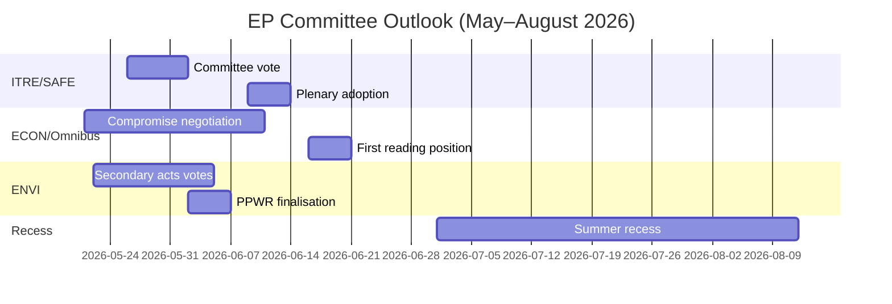

<!-- SPDX-FileCopyrightText: 2026 Hack23 AB -->
<!-- SPDX-License-Identifier: Apache-2.0 -->

# エグゼクティブ・ブリーフ — EP 委員会報告 · 週次 2026-05-14–21

**WEP バンド適用** | **海軍評価等級:** B2  
**信頼度:** 🟡 MEDIUM | **データモード:** フィード劣化  
**分析日:** 2026-05-21 | **時間的射程:** 3 ヶ月

---

## 🔴 中核的情報判断

*可能性が高い（65–75%）*：欧州議会の2026年春季委員会シーズンは、主要立法目標を達成する見通しである。具体的には、SAFE規制の採択、Omnibus第一読会ポジション、グリーン・ディール二次実施措置がこれに含まれる。ただし、6月2026年夏季休会前に少なくとも2つの主要ファイルに関する土壇場の交渉を余儀なくさせる連立ストレスが生じる。EPP-S&D-Renew連立の薄い過半数（+36議席）が、すべての委員会結果を規定する中心的な構造的制約である。

**海軍評価等級:** B2 | **信頼度:** 🟡 MEDIUM

---

## 委員会情報トップ3優先事項

### 1 · SAFE規制 — ITRE委員会（最高優先度）
欧州防衛産業戦略アジェンダ（SAFE）規制（1,500億ユーロの EU 防衛ファシリティを認可）が ITRE 委員会での採決に近づいている。これはEU史上最も重要な防衛産業政策立法であり、EU のオフバランスシート借入アーキテクチャに対する重大な財政的含意を持つ。

**主要情報：**
- ITRE 委員会の報告者が調達規則の妥協案テキストを最終調整中 — 最も論争的なセクション
- 国内防衛産業利益（フランス、ドイツ、ポーランド）が報告者に積極的にロビー活動
- 超党派支持（EPP + S&D + ECR + Renew）により SAFE は異例に強固な多数派を獲得
- 欧州理事会は夏季休会前の迅速採択を求めて圧力
- **WEP:** *可能性が高い（65–75%）* SAFE 委員会採決が2026年6月30日前に実施される

**リスク：** 地政学的状況が悪化した場合、EU 機能条約第122条による緊急手続き（推定 *ほぼ五分五分、35–45%*）が発動され、委員会協議を回避する可能性が残る。

---

### 2 · Omnibus 簡素化パッケージ — ECON/JURI 委員会（最高優先度）
CSRD（企業持続可能性報告指令）、CSDDD、分類規則を改正する欧州委員会 Omnibus I パッケージが、最も争われている委員会フェーズにある。S&D は連立結束の維持と進歩的基盤からの圧力への対応の間の戦略的ジレンマに直面している。

**主要情報：**
- EPP と産業ロビー（BusinessEurope）が負担軽減に関するナラティブの形成に成功
- S&D は CSRD 閾値引き上げ（250名から約1,000名の従業員へ）受け入れの見返りとして社会条項追加を交渉中
- Greens/EFA と The Left が S&D への外部圧力を積極的に動員
- **WEP:** *可能性が高い（60–70%）* S&D が連立安定を維持する修正 Omnibus パッケージを受け入れる
- **WEP:** *可能性あり（30–40%）* 妥協が崩壊し、Omnibus が夏季休会後まで遅延する

**リスク：** ESG 投資コミュニティが注視；CSRD 後退により2兆ユーロ超の ESG 連動資産に市場不確実性が生じる。

---

### 3 · グリーン・ディール二次措置 — ENVI 委員会（中高優先度）
ENVI 委員会が EP9 のグリーン・ディール枠組みの複数の二次実施措置を推進中：自然回復法実施措置、PPWR（包装規制）最終化、CBAM 監視規則。

**主要情報：**
- EPP 右派（イタリア、ハンガリー、ルーマニア代表団）が「競争力チェック」改正案で ECR と共に投票する機会が増加
- ENVI 委員会の多数派は連立全体の数値が示唆するよりも薄い（争点ある ENVI 採決で有効余裕 約5–8票）
- 自然回復法：EPP 議員が農業免除を提案しており、Greens/EFA は枠組み破壊と表現
- **WEP:** *可能性が高い（60–70%）* ENVI が閾値を弱めた二次措置を採択するが基本枠組みは維持される

**リスク：** ENVI 委員会でのさらなる挫折は Greens/EFA の非公式協調合意からの離脱を引き起こし、すべての将来の ENVI 業務を複雑にする可能性がある。

---

## 政治的景観スナップショット（2026-05-21）

| 会派 | 議席 | 比率 | 連立での役割 |
|------|------|------|-------------|
| EPP | 183 | 25.5% | 主要パートナー |
| S&D | 136 | 19.0% | 不可欠のパートナー |
| PfE | 85 | 11.9% | 野党/撹乱者 |
| ECR | 81 | 11.3% | 選択的同盟（防衛） |
| Renew | 77 | 10.7% | 連立パートナー |
| Greens/EFA | 53 | 7.4% | 進歩的少数派 |
| The Left | 45 | 6.3% | 進歩的少数派 |
| NI | 30 | 4.2% | 無所属 |
| ESN | 27 | 3.8% | 極右撹乱者 |

**必要過半数:** 360 | **連立（EPP+S&D+Renew）:** 396 | **余裕:** +36

---

## 経済的文脈（IMF 構造代理変数、A2）

- ユーロ圏 GDP 成長率2026年推定：~1.7%
- EU 財政赤字/GDP：~-2.6%（財政健全化進行中）
- SAFE：1,500億ユーロのオフバランスシート防衛ファシリティ
- ECB 預金金利推定：~2.25%（緩和サイクル進行）
- 米EU 関税緊張が INTA 委員会に圧力を生成

---

## 3ヶ月見通し

**総合評価：** 2026年春季委員会シーズンは高強度で薄い連立余裕の中で運営されている。SAFE 規制の成功した進展は、EP10 の安全保障優先事項における果断な行動能力を実証している。Omnibus 論争とグリーン・ディール後退は、気候と企業統治における EP10 の遺産を規定する構造的緊張を表している。*ほぼ確実（>85%）* EPP-S&D-Renew 連立は個々の委員会採決での実際のストレスにもかかわらず、春季シーズンを無傷で乗り切る。

**信頼度:** 🟡 MEDIUM | **海軍評価等級:** B2

---

## EP10 マクロ文脈：経済的・政治的背景

**経済環境（IMF WEO 2026年4月）**:
2026年の EU-27 実質 GDP 成長率 1.2% はトレンド以下の成績を表している。米国関税環境（GDP への推定 -0.3〜-0.5% の下押し）とエネルギーコスト格差が構造的逆風となっている。この経済的文脈は委員会の立法優先事項を直接形成している：ITRE の競争力重点は成長不足により増幅され；ECON の金融規制業務は ECB のインフレ目標近辺（2.3%）の予測に対してフレーミングされているが、周辺加盟国における信用品質リスクが持続している。

**政治的数値計算**：EPP-S&D-Renew 連立の55.9% 過半数（401/717議席）は、欧州議会がマーストリヒト条約下で共同決定権限を取得して以来、最も薄い親EU統治過半数である。いずれの採決においても、完全動員は3つのすべての会派からほぼ完全な出席を必要とし、これは毎回の本会議週ごとに増大する構造的脆弱性である。

**今後60日間で注視すべき点**：
1. DOCEO 投票データ公表（2026年5月25–26日予定）— 現行本会議週の争点ある採決における EPP の実際の結束率を明らかにする
2. 欧州委員会 EDIP 立法提案公表 — EU 防衛産業的野心の範囲を設定し、最初の委任採決を超えた議会連立の整合性を試す
3. ENVI 委員会による CBAM 委任措置採択 — ポーランド議長国下でのグリーン・ディール二次立法ペースの試験事例

**情報判断**：2026年春季委員会シーズンは EP10 が第1層優先事項（防衛、AI、移住管理）において果断に行動できることを実証した瞬間として記憶されるとともに、グリーン・ディールの遺産に関する構造的緊張と同時に格闘していた。機関は適応しているが、その適応はファイル優先順位の層を超えた産出品質のばらつきに可視化される — 機関的崩壊においてではない。

*AI 駆動分析エージェントによる作成 | 2026-05-21 | データモード：フィード劣化*
