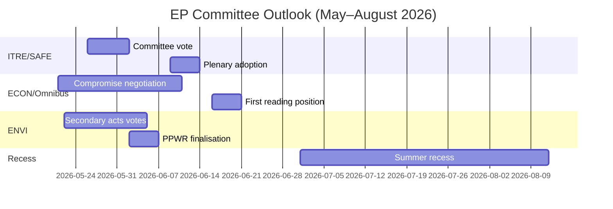

<!-- SPDX-FileCopyrightText: 2026 Hack23 AB -->
<!-- SPDX-License-Identifier: Apache-2.0 -->

# 집행 브리핑 — 유럽의회 위원회 보고서 · 2026-05-14–21 주간

**WEP 밴드 적용** | **해군 평가 등급:** B2  
**신뢰도:** 🟡 MEDIUM | **데이터 모드:** 피드 저하  
**분석일:** 2026-05-21 | **시간적 범위:** 3개월

---

## 🔴 핵심 정보 판단

*가능성이 높다（65–75%）*: 유럽의회의 2026년 봄 위원회 시즌이 주요 입법 목표를 달성할 전망이다. 구체적으로 SAFE 규정 채택, Omnibus 1차 독회 포지션, 그린딜 2차 이행 조치가 이에 포함된다. 다만 2026년 6월 여름 휴회 전 적어도 두 개의 주요 파일에 대한 막판 협상을 강제하는 연립 스트레스가 수반된다. EPP-S&D-Renew 연립의 얇은 과반수（+36석）가 모든 위원회 결과를 규정하는 핵심 구조적 제약이다.

**해군 평가 등급:** B2 | **신뢰도:** 🟡 MEDIUM

---

## 위원회 정보 상위 3대 우선순위

### 1 · SAFE 규정 — ITRE 위원회（최고 우선순위）
유럽 방위 전략 의제 규정（SAFE）은 1,500억 유로의 EU 방위 시설 승인을 담은 것으로 ITRE 위원회 표결에 근접하고 있다. 이는 EU 역사상 가장 중요한 방산 정책 입법으로, EU의 부외（off-balance-sheet）차입 구조에 중대한 재정적 함의를 지닌다.

**핵심 정보：**
- ITRE 위원회 보고자가 조달 규칙에 관한 타협안 텍스트를 마무리 중 — 가장 논쟁적인 섹션
- 국내 방위 산업 이익（프랑스, 독일, 폴란드）이 보고자에게 적극적으로 로비
- 초당파 지지（EPP + S&D + ECR + Renew）로 SAFE가 이례적으로 견고한 과반수 확보
- 유럽이사회가 여름 휴회 전 신속 채택을 위해 압박
- **WEP:** *가능성이 높다（65–75%）* SAFE 위원회 표결이 2026년 6월 30일 전에 실시될 것

**위험:** 지정학적 상황이 악화될 경우 EU 기능조약 제122조에 따른 긴급 절차（추정: *거의 반반의 확률, 35–45%*）가 발동되어 위원회 협의를 우회할 가능성 남음.

---

### 2 · Omnibus 간소화 패키지 — ECON/JURI 위원회（최고 우선순위）
CSRD（기업 지속가능성 보고 지침）, CSDDD 및 분류 규정을 개정하는 유럽위원회 Omnibus I 패키지가 가장 논쟁적인 위원회 단계에 있다. S&D는 연립 결속 유지와 진보적 기반으로부터의 압력 대응 사이의 전략적 딜레마에 직면해 있다.

**핵심 정보：**
- EPP와 산업 로비（BusinessEurope）가 부담 감소 서사를 성공적으로 형성
- S&D가 CSRD 임계값 인상（250명에서 약 1,000명으로）수용의 대가로 사회 조항 추가를 협상 중
- Greens/EFA와 The Left가 S&D에 대한 외부 압력을 적극 동원
- **WEP:** *가능성이 높다（60–70%）* S&D가 연립 안정을 유지하는 수정 Omnibus 패키지를 수용할 것
- **WEP:** *가능성 있다（30–40%）* 타협이 붕괴되어 Omnibus가 여름 휴회 이후로 지연될 것

**위험:** ESG 투자 커뮤니티가 예의주시; CSRD 후퇴로 2조 유로 이상의 ESG 연계 자산에 시장 불확실성 발생.

---

### 3 · 그린딜 2차 조치 — ENVI 위원회（중간-고 우선순위）
ENVI 위원회가 EP9 그린딜 프레임워크의 여러 2차 이행 조치를 진행 중: 자연 복원법 이행 조치, PPWR（포장 규정）최종화, CBAM 모니터링 규정.

**핵심 정보：**
- EPP 우파（이탈리아, 헝가리, 루마니아 대표단）가 '경쟁력 검토' 수정안에서 ECR과 함께 표결하는 빈도 증가
- ENVI 위원회 과반수가 전체 연립 산술이 시사하는 것보다 더 얇음（논쟁적 ENVI 표결 시 실효 여유 약 5–8표）
- 자연 복원법: EPP 의원들이 Greens/EFA가 프레임워크 파괴로 묘사하는 농업 예외를 제안
- **WEP:** *가능성이 높다（60–70%）* ENVI가 임계값이 약화되었지만 기본 프레임워크는 유지되는 2차 조치를 채택할 것

**위험:** ENVI 위원회에서의 추가 좌절이 Greens/EFA의 비공식 조정 협정 탈퇴를 촉발하여 향후 모든 ENVI 업무를 복잡하게 만들 수 있음.

---

## 정치적 지형 스냅샷（2026-05-21）

| 그룹 | 의석 | 비율 | 연립에서의 역할 |
|------|------|------|----------------|
| EPP | 183 | 25.5% | 지배적 파트너 |
| S&D | 136 | 19.0% | 필수 파트너 |
| PfE | 85 | 11.9% | 반대/방해자 |
| ECR | 81 | 11.3% | 선택적 동맹（방위） |
| Renew | 77 | 10.7% | 연립 파트너 |
| Greens/EFA | 53 | 7.4% | 진보적 소수파 |
| The Left | 45 | 6.3% | 진보적 소수파 |
| NI | 30 | 4.2% | 무소속 |
| ESN | 27 | 3.8% | 극우 방해자 |

**필요 과반수:** 360 | **연립（EPP+S&D+Renew）:** 396 | **여유:** +36

---

## 경제적 맥락（IMF 구조적 대리변수, A2）

- 유로존 GDP 성장률 2026년 추정: ~1.7%
- EU 재정 적자/GDP: ~-2.6%（재정 건전화 진행 중）
- SAFE: 1,500억 유로의 부외 방위 시설
- ECB 예금 금리 추정: ~2.25%（완화 사이클 진행）
- 미국-EU 관세 긴장이 INTA 위원회에 압력 발생

---

## 3개월 전망

**종합 평가:** 2026년 봄 위원회 시즌은 높은 강도와 얇은 연립 여유로 운영되고 있다. SAFE 규정의 성공적인 진전은 EP10이 안보 우선순위에 단호하게 행동할 수 있는 역량을 입증한다. Omnibus 논쟁과 그린딜 후퇴는 EP10의 기후 및 기업 거버넌스 유산을 규정할 구조적 긴장을 나타낸다. *거의 확실（>85%）* EPP-S&D-Renew 연립이 개별 위원회 표결에서의 실제 스트레스에도 불구하고 봄 시즌을 무사히 넘길 것이다.

**신뢰도:** 🟡 MEDIUM | **해군 평가 등급:** B2

---

## EP10 거시적 맥락: 경제적·정치적 배경

**경제 환경（IMF WEO 2026년 4월）**:
2026년 EU-27의 실질 GDP 성장률 1.2%는 추세 이하의 성과를 나타낸다. 미국 관세 환경（GDP 하방 압력 추정 -0.3~-0.5%）과 에너지 비용 차이가 구조적 역풍이다. 이 경제적 맥락이 위원회의 입법 우선순위를 직접 형성한다: ITRE의 경쟁력 초점은 성장 부진으로 증폭되고；ECON의 금융 규제 업무는 목표치 근처 인플레이션（2.3%）에 대한 ECB 전망 대비로 프레이밍되지만 주변 회원국에서 신용 품질 위험이 지속된다.

**정치적 수치계산**: EPP-S&D-Renew 연립의 55.9% 과반수（401/717석）는 유럽의회가 마스트리흐트 조약에 따른 공동결정 권한을 획득한 이래 가장 얇은 친EU 집권 과반수다. 어떤 표결에서도 완전한 동원을 위해서는 세 그룹 모두의 거의 완벽한 출석이 필요하며 — 이는 매 본회의 주마다 커지는 구조적 취약성이다.

**향후 60일 동안 주목할 사항**:
1. DOCEO 투표 데이터 공개（2026년 5월 25–26일 예정）— 현재 본회의 주의 논쟁적 표결에서 EPP의 실제 결속률을 드러낼 것
2. 유럽위원회 EDIP 입법 제안 공개 — EU 방위 산업적 야망의 범위 설정 및 초기 위임 표결을 넘어선 의회 연립의 일치 여부 검증
3. ENVI 위원회의 CBAM 위임 조치 채택 — 폴란드 의장국 하에서 그린딜 2차 입법 속도의 시험 사례

**정보 판단**: 2026년 봄 위원회 시즌은 EP10이 1등급 우선순위（방위, AI, 이민 관리）에 단호하게 행동할 수 있음을 입증하는 동시에 그린딜 유산에 관한 구조적 긴장과 씨름하던 순간으로 기억될 것이다. 기관은 적응하고 있지만 그 적응은 파일 우선순위 계층을 가로지르는 산출 품질의 변동에서 가시화된다 — 기관적 붕괴가 아니라.

*AI 기반 분석 에이전트 작성 | 2026-05-21 | 데이터 모드: 피드 저하*
