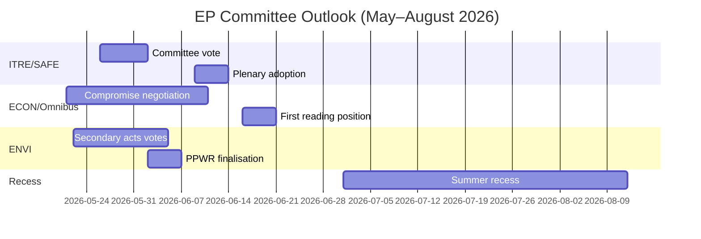

<!-- SPDX-FileCopyrightText: 2026 Hack23 AB -->
<!-- SPDX-License-Identifier: Apache-2.0 -->

# Inlichtingenbriefing — EP Commissierapporten · Week van 2026-05-14–21

**WEP-banden toegepast** | **Admiraliteitsgraad:** B2  
**Betrouwbaarheid:** 🟡 MEDIUM | **Datamodus:** gedegradeerde feeds  
**Analysedatum:** 2026-05-21 | **Tijdshorizon:** 3 maanden

---

## 🔴 CENTRALE INLICHTINGENBEOORDELING

*Het is waarschijnlijk (65–75%)* dat het commissieseizoen van het Europees Parlement voor het voorjaar van 2026 zijn primaire wetgevingsdoelstellingen zal behalen — aanneming van de SAFE-verordening, standpunt bij eerste lezing van het Omnibus en secundaire uitvoeringshandelingen van de Green Deal — maar met coalitiedruk die in elk geval op twee grote dossiers last-minute onderhandelingen afdwingt vóór het zomerreces van juni 2026. De krappe EPP-S&D-Renew-meerderheid (+36 zetels) is de centrale structurele beperking die elk commissieresultaat bepaalt.

**Admiraliteitsgraad:** B2 | **Betrouwbaarheid:** 🟡 MEDIUM

---

## Top 3 Commissie-inlichtingenprioriteiten

### 1 · SAFE-verordening — ITRE-commissie (HOGE PRIORITEIT)
De verordening betreffende de Strategische Agenda voor Bewapening en Factoren in Europa (SAFE), waarbij een EU-defensiefaciliteit van 150 miljard euro wordt goedgekeurd, nadert haar stemming in de ITRE-commissie. Dit is de meest significante wetgeving inzake defensie-industriebeleid in de EU-geschiedenis en heeft grote budgettaire gevolgen voor de off-balance-sheet leenarchitectuur van de EU.

**Kerninlichtingen:**
- De rapporteur van de ITRE-commissie rondt de compromistekst over aanbestedingsregels af — de meest omstreden sectie
- Nationale defensie-industriële belangen (Frankrijk, Duitsland, Polen) hebben actief gelobbyd bij de rapporteur
- Overkoepelend coalitiesteuning (EPP + S&D + ECR + Renew) geeft SAFE een ongewoon robuuste meerderheid
- De Raad dringt aan op versnelde aanneming vóór het zomerreces
- **WEP:** *Het is waarschijnlijk (65–75%)* dat de SAFE-commissiestemming plaatsvindt vóór 30 juni 2026

**Risico:** De noodprocedure van artikel 122 VWEU blijft mogelijk als de geopolitieke situatie verslechtert (geschat op *ongeveer gelijke kansen, 35–45%*), wat de commissieraadpleging zou omzeilen.

---

### 2 · Omnibus-vereenvoudigingspakket — ECON/JURI-commissies (HOGE PRIORITEIT)
Het Omnibus I-pakket van de Commissie dat de CSRD (richtlijn duurzaamheidsrapportage ondernemingen), de CSDDD en de taxonomieverordening herziet, bevindt zich in haar meest omstreden commissiefase. S&D staat voor een strategisch dilemma tussen het handhaven van de coalitiecohesie en het beantwoorden van druk van de progressieve achterban.

**Kerninlichtingen:**
- EPP en industrielobbyisten (BusinessEurope) hebben het narratief rond lastenverlaging succesvol vorm gegeven
- S&D onderhandelt over de toevoeging van sociale clausules als tegenprestatie voor aanvaarding van drempelverlagingen in de CSRD (van 250 naar ~1.000 werknemers)
- Greens/EFA en The Left mobiliseren actief externe druk op S&D
- **WEP:** *Het is waarschijnlijk (60–70%)* dat S&D een aangepast Omnibus-pakket aanvaardt dat de coalitie stabiel houdt
- **WEP:** *Het is mogelijk (30–40%)* dat het compromis mislukt, waardoor Omnibus voorbij het zomerreces vertraging oploopt

**Risico:** De ESG-beleggingsgemeenschap volgt dit nauwlettend; een terugdraaien van de CSRD schept marktonzekerheid voor meer dan 2 biljoen euro aan ESG-gekoppelde activa.

---

### 3 · Secundaire handelingen van de Green Deal — ENVI-commissie (MIDDELHOGE PRIORITEIT)
De ENVI-commissie werkt meerdere secundaire uitvoeringshandelingen voor het Green Deal-kader van EP9 verder uit: uitvoeringshandelingen voor de Wet herstel natuur, voltooiing van de PPWR (verpakkingsverordening) en CBAM-bewakingsverordeningen.

**Kerninlichtingen:**
- De rechtervleugel van de EPP (Italiaanse, Hongaarse en Roemeense delegaties) stemt in toenemende mate mee met de ECR over amendementen inzake 'competitiviteitstoetsing'
- De meerderheid van de ENVI-commissie is smaller dan de overkoepelende coalitie-arithmetiek suggereert (~5–8 stemmen effectieve marge bij omstreden ENVI-stemmingen)
- Wet herstel natuur: EPP-leden stellen landbouwafwijkingen voor die Greens/EFA als kaderbeschadiging omschrijven
- **WEP:** *Het is waarschijnlijk (60–70%)* dat ENVI secundaire handelingen aanneemt met verzwakte drempels maar een intact fundamenteel kader

**Risico:** Verdere tegenvallers in de ENVI-commissie kunnen de terugtrekking van Greens/EFA uit informele coördinatieakkoorden veroorzaken, wat al toekomstig ENVI-werk compliceert.

---

## Politiek landschapsoverzicht (2026-05-21)

| Groep | Zetels | Aandeel | Coalitionerol |
|-------|--------|---------|---------------|
| EPP | 183 | 25,5% | Dominante partner |
| S&D | 136 | 19,0% | Essentiële partner |
| PfE | 85 | 11,9% | Oppositie/Verstorende factor |
| ECR | 81 | 11,3% | Selectieve bondgenoot (defensie) |
| Renew | 77 | 10,7% | Coalitionepartner |
| Greens/EFA | 53 | 7,4% | Progressieve minderheid |
| The Left | 45 | 6,3% | Progressieve minderheid |
| NI | 30 | 4,2% | Niet-ingeschrevene |
| ESN | 27 | 3,8% | Extreemrechtse verstorende factor |

**Vereiste meerderheid:** 360 | **Coalitie (EPP+S&D+Renew):** 396 | **Marge:** +36

---

## Economische context (IMF Structurele proxy, A2)

- Bbp-groei van de eurozone in 2026 geschat: ~1,7%
- EU begrotingstekort/bbp: ~-2,6% (consolidatie aan de gang)
- SAFE: 150 miljard euro off-balance-sheet defensiefaciliteit
- ECB-depositotarief geschat: ~2,25% (versoepelingscyclus gevorderd)
- US-EU-tariefspanningen creëren druk in de INTA-commissie

---

## 3-maandenvooruitzichten

**Algehele beoordeling:** Het commissieseizoen van het voorjaar van 2026 opereert op HOGE intensiteit met een krappe coalitionemarge. De succesvolle voortgang van de SAFE-verordening toont de capaciteit van EP10 om doortastend op te treden inzake veiligheidsprioriteiten. De Omnibus-contestatie en de terugtrekking van de Green Deal vertegenwoordigen structurele spanningen die het erfenis van EP10 op het gebied van klimaat en ondernemingsbestuur zullen definiëren. *Het is vrijwel zeker (>85%)* dat de EPP-S&D-Renew-coalitie het voorjaarsseizoen intact overleeft, ondanks reële druk bij individuele commissiestemmingen.

**Betrouwbaarheid:** 🟡 MEDIUM | **Admiraliteitsgraad:** B2

---

## EP10 Macrocontext: Economische en politieke achtergrond

**Economische omgeving (IMF WEO april 2026)**:
De reële bbp-groei van EU-27 van 1,2% in 2026 vertegenwoordigt een prestatie onder de trend. De Amerikaanse tariefomgeving (geschat bbp-rem van -0,3 tot -0,5%) en energiekostenverschillen zijn structurele tegenwind. Deze economische context vormt direct de wetgevingsprioriteiten van de commissies: de concurrentiefocus van ITRE wordt versterkt door het groeigebrek; het financiële reguleringswerk van ECON is ingekaderd tegenover ECB-projecties van een bijna-doelinflatie (2,3%) maar aanhoudende kredietkwaliteitsrisico's in perifere lidstaten.

**Politieke rekenkunde**: De meerderheid van 55,9% van de EPP-S&D-Renew-coalitie (401/717 zetels) is de smalste pro-EU-regeringsmeerderheid sinds het Europees Parlement medebeslissingsbevoegdheden kreeg onder het Verdrag van Maastricht. Voor elke stemming vereist volledige mobilisatie bijna perfecte aanwezigheid van alle drie de groepen — een structurele kwetsbaarheid die toeneemt met elke plenaire week.

**Wat de komende 60 dagen te volgen**:
1. Publicatie van DOCEO-stemgegevens (verwacht op 25–26 mei 2026) — zal werkelijke EPP-cohesiepercentages bij omstreden stemmingen van de huidige plenaire week onthullen
2. Publicatie van het EDIP-wetgevingsvoorstel van de Commissie — bepaalt de reikwijdte van de EU-defensie-industriële ambitie en test de parlementaire coalitie-afstemming voorbij het initiële mandaatbesluit
3. Aanneming van CBAM-gedelegeerde handelingen door de ENVI-commissie — testgeval voor het tempo van secundaire Green Deal-wetgeving onder het Poolse voorzitterschap

**Inlichtingenbeoordeling**: Het commissieseizoen van het voorjaar van 2026 zal worden herinnerd als het moment waarop EP10 aantoonde doortastend te kunnen handelen bij Tier 1-prioriteiten (defensie, AI, migratiebeheer), terwijl het tegelijkertijd worstelde met structurele spanningen in zijn Green Deal-erfenis. De instelling past zich aan, maar de aanpassing is zichtbaar in outputkwaliteitsvariatie over bestandsprioriteitslagen heen — niet in institutionele ineenstorting.

*Opgesteld door een AI-gedreven analyseagent | 2026-05-21 | Datamodus: gedegradeerde feeds*
