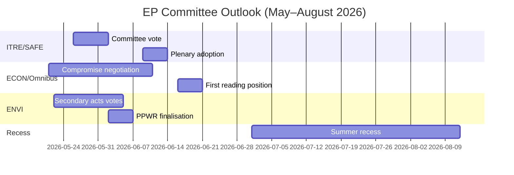

<!-- SPDX-FileCopyrightText: 2026 Hack23 AB -->
<!-- SPDX-License-Identifier: Apache-2.0 -->

# Etterretningsbriefing — EP Komitérapporter · Uken 2026-05-14–21

**WEP-bånd anvendt** | **Admiralitetsgrad:** B2  
**Konfidens:** 🟡 MEDIUM | **Datatilstand:** degraderte feeds  
**Analysedato:** 2026-05-21 | **Tidshorisont:** 3 måneder

---

## 🔴 SENTRAL ETTERRETNINGSVURDERING

*Det er sannsynlig (65–75%)* at Europaparlamentets komitésesong for våren 2026 vil levere sine primære lovgivningsmål — vedtakelse av SAFE-forordningen, Omnibussens første behandlingsposisjon og den grønne pakkes sekundære gjennomføringsrettsakter — men med koalisjonspress som tvinger forhandlinger i siste liten om minst to store saker før sommerferien i juni 2026. Det smale EPP-S&D-Renew-flertallet (+36 seter) er den sentrale strukturelle begrensningen som definerer hvert komitéresultat.

**Admiralitetsgrad:** B2 | **Konfidens:** 🟡 MEDIUM

---

## Topp 3 Komitéetterretningsprioriteringer

### 1 · SAFE-forordningen — ITRE-komiteen (HØY PRIORITET)
Forordningen om den strategiske dagsordenen for armamenter og faktorer i Europa (SAFE), som godkjenner en EU-forsvarsfasilitet på 150 milliarder euro, nærmer seg sin komitéavstemning i ITRE. Dette er den mest betydningsfulle forsvarsindustrielle lovgivningen i EU-historien og har store finanspolitiske konsekvenser for EU:s off-balance-sheet lånearchitektur.

**Sentral etterretning:**
- ITRE-komiteens ordfører ferdigstiller kompromisstext om anskaffelsesregler — den mest omstridte seksjonen
- Nasjonale forsvarsindustrielle interesser (Frankrike, Tyskland, Polen) har aktivt lobbet ordføreren
- Tverrkosalisjonstøtte (EPP + S&D + ECR + Renew) gir SAFE et uvanlig robust flertall
- Rådet presser på rask vedtakelse før sommerferien
- **WEP:** *Det er sannsynlig (65–75%)* at SAFE-komiteens avstemning skjer innen 30. juni 2026

**Risiko:** Nødprosedyren i henhold til artikkel 122 TEUV er fortsatt mulig dersom den geopolitiske situasjonen forverres (vurdert *omtrent like odds, 35–45%*), noe som ville omgå komitéhøringen.

---

### 2 · Omnibus-forenklingspackagen — ECON/JURI-komiteene (HØY PRIORITET)
Kommisjonens Omnibus I-pakke, som reviderer CSRD (direktivet om bærekraftsrapportering for foretak), CSDDD og taksonomiforordningen, befinner seg i sin mest omstridte komitéfase. S&D står overfor et strategisk dilemma mellom å opprettholde koalisjonens samhold og å imøtekomme press fra den progressive basen.

**Sentral etterretning:**
- EPP og industrilobbyister (BusinessEurope) har med suksess formet narrativet rundt byrdelette
- S&D forhandler om tillegg av sosiale klausuler som motytelse for å akseptere CSRD-terskeløkninger (fra 250 til ~1 000 ansatte)
- Greens/EFA og The Left mobiliserer aktivt eksternt press mot S&D
- **WEP:** *Det er sannsynlig (60–70%)* at S&D aksepterer en modifisert Omnibus-pakke som opprettholder koalisjonsstabilitet
- **WEP:** *Det er mulig (30–40%)* at kompromisset bryter sammen og forsinker Omnibus etter sommerferien

**Risiko:** ESG-investeringssamfunnet følger nøye med; CSRD-tilbakerulling skaper markedsusikkerhet for mer enn 2 billioner euro i ESG-koblede eiendeler.

---

### 3 · Den grønne pakkes sekundære rettsakter — ENVI-komiteen (MIDDELS-HØY PRIORITET)
ENVI-komiteen fremmer flere sekundære gjennomføringsrettsakter for EP9s ramme for den grønne pakken: gjennomføringsrettsakter for naturrestaureringslovens, ferdigstillelse av PPWR (emballasjeforordningen) og CBAM-overvåkingsforordninger.

**Sentral etterretning:**
- EPPs høyrefløy (italienske, ungarske og rumenske delegasjoner) stemmer i stigende grad med ECR om "konkurranseevneprøving"-endringsforslag
- ENVI-komiteens flertall er smalere enn den overordnede koalisjonsaritmetikken antyder (~5–8 stemmers effektiv margin ved omstridte ENVI-avstemninger)
- Naturrestaureringslovens: EPP-medlemmer foreslår landbruksunntak som Greens/EFA beskriver som rammeødeleggelse
- **WEP:** *Det er sannsynlig (60–70%)* at ENVI vedtar sekundære rettsakter med svekkede terskler men intakt grunnleggende ramme

**Risiko:** Ytterligere ENVI-komitémotvind kan utløse Greens/EFA:s tilbaketrekking fra uformelle koordineringsavtaler, noe som vil komplisere alt fremtidig ENVI-arbeid.

---

## Politisk landskap-øyeblikksbilde (2026-05-21)

| Gruppe | Seter | Andel | Koalisjonsrolle |
|--------|-------|-------|-----------------|
| EPP | 183 | 25,5% | Dominerende partner |
| S&D | 136 | 19,0% | Nødvendig partner |
| PfE | 85 | 11,9% | Opposisjon/Forstyrrer |
| ECR | 81 | 11,3% | Selektiv alliert (forsvar) |
| Renew | 77 | 10,7% | Koalisjonspartner |
| Greens/EFA | 53 | 7,4% | Progressivt mindretall |
| The Left | 45 | 6,3% | Progressivt mindretall |
| NI | 30 | 4,2% | Ikke-tilknyttet |
| ESN | 27 | 3,8% | Ytterliggående forstyrrer |

**Nødvendig flertall:** 360 | **Koalisjon (EPP+S&D+Renew):** 396 | **Margin:** +36

---

## Økonomisk kontekst (IMF Strukturell proxy, A2)

- Eurosone BNP-vekst 2026 anslått: ~1,7%
- EUs finanspolitiske underskudd/BNP: ~-2,6% (konsolidering pågår)
- SAFE: 150 milliarder euro off-balance-sheet forsvarsfasilitet
- ECBs innskuddsrente anslått: ~2,25% (lettelsessyklus avansert)
- USA-EU-tollspenninger skaper press i INTA-komiteen

---

## 3-måneders utsikt

**Samlet vurdering:** Komitésesongen våren 2026 opererer med HØY intensitet og en smal koalisjonsmargin. SAFE-forordningens vellykkede fremskritt demonstrerer EP10s kapasitet til å handle bestemt i sikkerhetsprioriteringer. Omnibus-bestriden og den grønne pakkes tilbakegang representerer strukturelle spenninger som vil definere EP10s arv på klima og selskapsstyring. *Det er nesten sikkert (>85%)* at EPP-S&D-Renew-koalisjonen overlever vårsesong intakt, til tross for reelt press ved individuelle komitéavstemninger.

**Konfidens:** 🟡 MEDIUM | **Admiralitetsgrad:** B2

---

## EP10 Makrokontekst: Økonomisk og politisk bakgrunn

**Økonomisk miljø (IMF WEO april 2026)**:
EU-27s reale BNP-vekst på 1,2% i 2026 representerer en under-trend prestasjon. Det amerikanske tollmiljøet (anslått -0,3 til -0,5% BNP-drag) og energikostnadsdifferanser er strukturelle motvinder. Denne økonomiske konteksten former direkte komitéenes lovgivningsprioriteringer: ITREs konkurranseevnefokus forsterkes av vekstunderskuddet; ECONs finansreguleringsarbeid er innrammet mot ECBs fremskrivninger om nær-mål-inflasjon (2,3%), men vedvarende kredittkvalitetsrisiki i perifere medlemsstater.

**Politisk aritmetikk**: EPP-S&D-Renew-koalisjonens 55,9%-flertall (401/717 seter) er det smaleste pro-EU styrende flertallet siden Europaparlamentet fikk medbeslutningsfullmakter under Maastricht. Ved enhver gitt avstemning krever full mobilisering nærmest perfekt fremmøte fra alle tre gruppene — en strukturell sårbarhet som øker med hver plenumuke.

**Hva man bør følge de neste 60 dagene**:
1. DOCEO-avstemningsdata-publisering (forventet 25.–26. mai 2026) — vil avsløre faktiske EPP-kohesionstall ved omstridte avstemninger fra den aktuelle plenumsuken
2. Kommisjonens EDIP-lovforslags publisering — fastsetter omfanget av EUs forsvarsindustrielle ambisjoner og tester parlamentskoalisjonens samstemmighet utover det innledende mandatvedtaket
3. ENVI-komiteens CBAM-delegerte rettsakter vedtakelse — testtilfelle for den grønne pakkes sekundære lovgivningstakt under det polske presidentskapet

**Etterretningsvurdering**: Komitésesongen våren 2026 vil huskes som det øyeblikket da EP10 demonstrerte at det kunne handle bestemt i Tier 1-prioriteringer (forsvar, AI, migrasjonsforvaltning), mens det samtidig kjempet med strukturelle spenninger i sitt grønne pakke-arv. Institusjonen tilpasser seg, men tilpasningen er synlig i outputkvalitetsvariasjon på tvers av filprioritetsnivåer — ikke i institusjonell kollaps.

*Utarbeidet av AI-drevet analyseagent | 2026-05-21 | Datatilstand: degraderte feeds*
