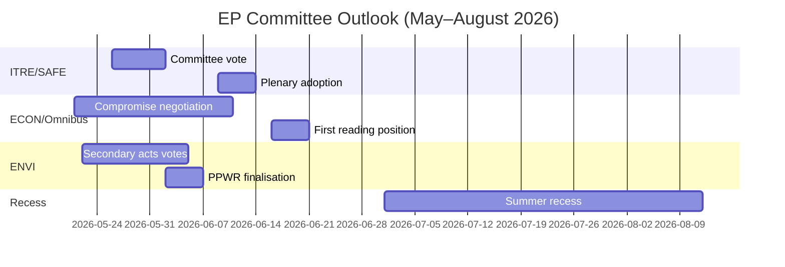

<!-- SPDX-FileCopyrightText: 2026 Hack23 AB -->
<!-- SPDX-License-Identifier: Apache-2.0 -->

# Underrättelsebriefing — EP Utskottsrapporter · Veckan 2026-05-14–21

**WEP-band tillämpade** | **Admiralitetsgrad:** B2  
**Konfidensgrad:** 🟡 MEDIUM | **Dataläge:** degraderade flöden  
**Analysdatum:** 2026-05-21 | **Tidshorisont:** 3 månader

---

## 🔴 CENTRALT UNDERRÄTTELSEBEDÖMNING

*Det är sannolikt (65–75%)* att Europaparlamentets utskottssäsong för våren 2026 kommer att leverera sina primära lagstiftningsmål — antagandet av SAFE-förordningen, Omnibusets första behandlingsposition och Gröna dealens sekundära genomförandeakter — men med koalitionsstress som tvingar fram sista minuten-förhandlingar om minst två stora ärenden innan sommarpausen i juni 2026. Den smala EPP-S&D-Renew-majoriteten (+36 mandat) är den centrala strukturella begränsning som definierar alla utskottsresultat.

**Admiralitetsgrad:** B2 | **Konfidensgrad:** 🟡 MEDIUM

---

## Topp 3 Utskottsunderrättelseprioriteringar

### 1 · SAFE-förordningen — ITRE-utskottet (HÖG PRIORITET)
Förordningen om den strategiska agendan för rustningsindustri och faktorer i Europa (SAFE), som godkänner en EU-försvarsfacilitet på 150 miljarder euro, närmar sig sin omröstning i ITRE-utskottet. Detta är den mest betydelsefulla lagstiftningen om försvarsindustriell politik i EU:s historia och har stora finanspolitiska konsekvenser för EU:s off-balance-sheet lånearchitektur.

**Central underrättelse:**
- ITRE-utskottets föredragande finsliper kompromisstext om upphandlingsregler — den mest omtvistade sektionen
- Nationella försvarsindustriella intressen (Frankrike, Tyskland, Polen) har aktivt lobbat mot föredraganden
- Tvärskoalitionsstöd (EPP + S&D + ECR + Renew) ger SAFE en ovanligt robust majoritet
- Rådet pressar på för snabbt antagande före sommarpausen
- **WEP:** *Det är sannolikt (65–75%)* att SAFE-utskottets omröstning äger rum före den 30 juni 2026

**Risk:** Nödproceduren enligt artikel 122 TFEU kvarstår som möjlighet om den geopolitiska situationen försämras (bedömt *ungefär lika odds, 35–45%*), vilket skulle kringgå utskottskonsultationen.

---

### 2 · Omnibusets förenklingspaket — ECON/JURI-utskotten (HÖG PRIORITET)
Kommissionens Omnibus I-paket, som reviderar CSRD (direktivet om hållbarhetsrapportering), CSDDD och taxonomiförordningen, befinner sig i sin mest omtvistade utskottsfas. S&D ställs inför ett strategiskt dilemma mellan att upprätthålla koalitionens sammanhållning och att tillgodose trycket från den progressiva basen.

**Central underrättelse:**
- EPP och industrilobbyister (BusinessEurope) har framgångsrikt format narrativet kring bördebegränsning
- S&D förhandlar om tillägg av sociala klausuler som motprestation för att acceptera CSRD-tröskelökningar (från 250 till ~1 000 anställda)
- Greens/EFA och Vänstern mobiliserar aktivt externt tryck mot S&D
- **WEP:** *Det är sannolikt (60–70%)* att S&D accepterar ett modifierat Omnibus-paket som upprätthåller koalitionens stabilitet
- **WEP:** *Det är möjligt (30–40%)* att kompromissen bryter samman och försenar Omnibus efter sommarpausen

**Risk:** ESG-investerarsamhället följer noga; CSRD-tillbakadragandet skapar marknadsosäkerhet för mer än 2 biljoner euro i ESG-länkade tillgångar.

---

### 3 · Gröna dealens sekundära akter — ENVI-utskottet (MEDEL-HÖG PRIORITET)
ENVI-utskottet avancerar flera sekundära genomförandeakter för EP9:s ramverk för den Gröna dealen: genomförandeakter för naturrestaureringslagen, slutförandet av PPWR (förpackningsförordningen) och CBAM-övervakningsförordningar.

**Central underrättelse:**
- EPP:s högerflygel (italienska, ungerska och rumänska delegationer) röstar i ökande utsträckning med ECR om "konkurrenskraftsgranskning"-ändringar
- ENVI-utskottets majoritet är smalare än koalitionens totala matematiska underlag antyder (~5–8 rösters effektiv marginal vid omtvistade ENVI-omröstningar)
- Naturrestaureringslagen: EPP-ledamöter föreslår jordbruksundantag som Greens/EFA beskriver som en ramverksförstöring
- **WEP:** *Det är sannolikt (60–70%)* att ENVI antar sekundära akter med försvagade trösklar men ett intakt grundläggande ramverk

**Risk:** Ytterligare bakslag i ENVI-utskottet kan utlösa Greens/EFA:s tillbakadragande från informella samordningsavtal, vilket skulle komplicera allt framtida ENVI-arbete.

---

## Politisk landskapsbild (2026-05-21)

| Grupp | Mandat | Andel | Koalitionsroll |
|-------|--------|-------|----------------|
| EPP | 183 | 25,5% | Dominerande partner |
| S&D | 136 | 19,0% | Nödvändig partner |
| PfE | 85 | 11,9% | Opposition/Störare |
| ECR | 81 | 11,3% | Selektiv allierad (försvar) |
| Renew | 77 | 10,7% | Koalitionspartner |
| Greens/EFA | 53 | 7,4% | Progressiv minoritet |
| The Left | 45 | 6,3% | Progressiv minoritet |
| NI | 30 | 4,2% | Obunden |
| ESN | 27 | 3,8% | Ytterligare störare |

**Majoritetskrav:** 360 | **Koalition (EPP+S&D+Renew):** 396 | **Marginal:** +36

---

## Ekonomisk kontext (IMF Strukturell proxy, A2)

- Eurozons BNP-tillväxt 2026 beräknad: ~1,7%
- EU:s finanspolitiska underskott/BNP: ~-2,6% (konsolidering pågår)
- SAFE: 150 miljarder euro off-balance-sheet försvarsfacilitet
- ECB:s inlåningsränta beräknad: ~2,25% (lättnadsindex avancerat)
- USA-EU tullspänningar skapar tryck i INTA-utskottet

---

## 3-månadersutsikter

**Samlad bedömning:** Utskottssäsongen våren 2026 opererar med HÖG intensitet och en smal koalitionsmarginal. SAFE-förordningens framgångsrika framsteg visar EP10:s förmåga att agera beslutsamt i säkerhetsfrågor. Omnibus-bestridan och Gröna dealens tillbakagång representerar strukturella spänningar som kommer att definiera EP10:s arv vad gäller klimat och bolagsstyrning. *Det är nästan säkert (>85%)* att EPP-S&D-Renew-koalitionen överlever vårsäsongen intakt, trots verklig stress vid enskilda utskottsomröstningar.

**Konfidensgrad:** 🟡 MEDIUM | **Admiralitetsgrad:** B2

---

## EP10 Makrokontext: Ekonomisk och politisk bakgrund

**Ekonomisk miljö (IMF WEO april 2026)**:
EU-27:s reala BNP-tillväxt på 1,2% år 2026 representerar en prestation under trenden. Den amerikanska tullmiljön (beräknat -0,3 till -0,5% BNP-bromseffekt) och energikostnadsdifferenser är strukturella motvind. Detta ekonomiska sammanhang formar direkt utskottens lagstiftningsprioriteringar: ITRE:s konkurrenskraftsfokus förstärks av tillväxtunderskottet; ECON:s finansregleringsarbete är inramat mot ECB:s projektioner om nära målinflation (2,3%) men kvarstående kreditkvalitetsrisker i perifera medlemsstater.

**Politisk matematik**: EPP-S&D-Renew-koalitionens majoritet på 55,9% (401/717 mandat) är den smalaste pro-EU-styrande majoriteten sedan Europaparlamentet fick medbeslutandebefogenheter under Maastricht. Vid varje given omröstning kräver full mobilisering nära perfekt närvaro från alla tre grupperna — en strukturell sårbarhet som ökar med varje plenarsvecka.

**Vad man bör följa under de närmaste 60 dagarna**:
1. DOCEO omröstningsdata publicering (förväntad 25–26 maj 2026) — kommer att avslöja faktiska EPP-kohesionstal vid omtvistade omröstningar under den nuvarande plenaerveckan
2. Kommissionens EDIP-lagstiftningsförslag publicering — fastställer omfattningen av EU:s försvarsindustriella ambition och testar parlamentskoalitionens samstämmighet bortom det initiala mandatbeslutet
3. ENVI-utskottets CBAM-delegerade akter antagande — testfall för genomförandetakten för Gröna dealens sekundära lagstiftning under Polskt ordförandeskap

**Underrättelsebedömning**: Utskottssäsongen våren 2026 kommer att minnas som det ögonblick när EP10 visade att det kunde agera beslutsamt i Tier 1-prioriteringar (försvar, AI, migrationshantering) medan man samtidigt kämpade med strukturella spänningar kring sitt Gröna deal-arv. Institutionen anpassar sig, men anpassningen syns i variationen i outputkvalitet mellan filprioritetsnivåer — inte i institutionell kollaps.

*Framtagen av AI-driven analysagent | 2026-05-21 | Dataläge: degraderade flöden*
