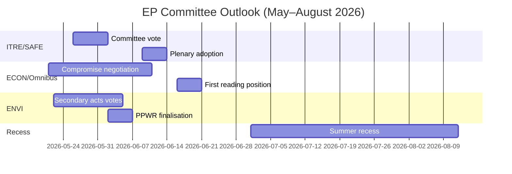

<!-- SPDX-FileCopyrightText: 2026 Hack23 AB -->
<!-- SPDX-License-Identifier: Apache-2.0 -->

# 执行简报 — 欧洲议会委员会报告 · 2026-05-14–21 周

**已应用WEP等级** | **海军评级：** B2  
**置信度：** 🟡 MEDIUM | **数据模式：** 信息源降级  
**分析日期：** 2026-05-21 | **时间范围：** 3个月

---

## 🔴 核心情报判断

*可能性较高（65–75%）*：欧洲议会2026年春季委员会季节将完成其主要立法目标——通过SAFE法规、批准《综合一揽子》第一次审议立场，以及《绿色协议》二级实施措施——但在2026年6月夏季休会前，至少两个重要文件的联合压力将迫使最后时刻的谈判。EPP-S&D-Renew联盟的微弱多数（+36席）是决定每项委员会结果的核心结构性约束。

**海军评级：** B2 | **置信度：** 🟡 MEDIUM

---

## 委员会情报前三大优先事项

### 1 · SAFE法规 — ITRE委员会（最高优先级）
《欧洲军备与工业战略议程》法规（SAFE）授权规模达1500亿欧元的欧盟防务设施，正接近ITRE委员会的投票阶段。这是欧盟历史上最重要的防务工业政策立法，对欧盟的表外借贷架构具有重大财政影响。

**关键情报：**
- ITRE委员会报告员正在最终确定有关采购规则的折中文本——争议最大的部分
- 国内防务工业利益（法国、德国、波兰）对报告员进行了积极游说
- 跨联盟支持（EPP + S&D + ECR + Renew）使SAFE获得异常牢固的多数
- 理事会正推动在夏季休会前加速通过
- **WEP：** *可能性较高（65–75%）* SAFE委员会表决将于2026年6月30日前进行

**风险：** 如果地缘政治形势恶化，根据《欧盟运作条约》第122条发动紧急程序（估计*几乎五五开，35–45%*）的可能性依然存在，这将绕过委员会咨询程序。

---

### 2 · Omnibus简化一揽子方案 — ECON/JURI委员会（最高优先级）
欧盟委员会修订CSRD（企业可持续发展报告指令）、CSDDD和分类法规的Omnibus I一揽子方案目前处于争议最激烈的委员会阶段。S&D面临维护联盟凝聚力与回应进步派基层压力之间的战略两难。

**关键情报：**
- EPP和工业游说团体（BusinessEurope）成功主导了围绕减轻负担的叙事
- S&D正就增加社会条款进行谈判，以换取接受CSRD门槛的提升（从250名员工增至约1,000名）
- Greens/EFA和The Left正积极动员对S&D施加外部压力
- **WEP：** *可能性较高（60–70%）* S&D将接受能维持联盟稳定的修订版Omnibus一揽子方案
- **WEP：** *有可能（30–40%）* 妥协破裂，导致Omnibus推迟至夏季休会后

**风险：** ESG投资界密切关注；CSRD的倒退将为逾2万亿欧元的ESG关联资产带来市场不确定性。

---

### 3 · 绿色协议二级措施 — ENVI委员会（中高优先级）
ENVI委员会正在推进EP9《绿色协议》框架下的多项二级实施措施：《自然恢复法》实施措施、PPWR（包装法规）最终化以及CBAM监测法规。

**关键情报：**
- EPP右翼（意大利、匈牙利、罗马尼亚代表团）在"竞争力验证"修正案上与ECR联合投票的频率日益增加
- ENVI委员会的多数席位比整体联盟数字所示的更为薄弱（在争议性ENVI投票中实际余量约5–8票）
- 《自然恢复法》：EPP成员提出农业豁免条款，Greens/EFA将其描述为破坏法律框架
- **WEP：** *可能性较高（60–70%）* ENVI将以门槛弱化但基本框架完整的形式通过二级措施

**风险：** ENVI委员会的进一步挫折可能引发Greens/EFA退出非正式协调协议，从而使所有未来的ENVI工作趋于复杂。

---

## 政治格局快照（2026-05-21）

| 党团 | 席位 | 占比 | 联盟角色 |
|------|------|------|---------|
| EPP | 183 | 25.5% | 主导伙伴 |
| S&D | 136 | 19.0% | 不可或缺的伙伴 |
| PfE | 85 | 11.9% | 反对派/破坏者 |
| ECR | 81 | 11.3% | 选择性盟友（防务） |
| Renew | 77 | 10.7% | 联盟伙伴 |
| Greens/EFA | 53 | 7.4% | 进步派少数 |
| The Left | 45 | 6.3% | 进步派少数 |
| NI | 30 | 4.2% | 无党籍 |
| ESN | 27 | 3.8% | 极右破坏者 |

**所需多数：** 360 | **联盟（EPP+S&D+Renew）：** 396 | **余量：** +36

---

## 经济背景（IMF 结构性代理指标，A2）

- 欧元区2026年GDP增长预估：~1.7%
- 欧盟财政赤字/GDP：~-2.6%（财政整合进行中）
- SAFE：1500亿欧元表外防务设施
- 欧洲央行存款利率预估：~2.25%（宽松周期进展）
- 美欧关税紧张局势对INTA委员会形成压力

---

## 3个月展望

**总体评估：** 2026年春季委员会季节以高强度和薄弱的联盟余量运作。SAFE法规的顺利推进展示了EP10在安全优先事项上果断行动的能力。Omnibus争议和绿色协议的退步代表着将界定EP10在气候和公司治理方面遗产的结构性张力。*几乎可以确定（>85%）* EPP-S&D-Renew联盟在春季完好无损地存续下来，尽管在个别委员会投票上存在真实的压力。

**置信度：** 🟡 MEDIUM | **海军评级：** B2

---

## EP10宏观背景：经济与政治背景

**经济环境（IMF WEO 2026年4月）**：
欧盟27国2026年实际GDP增长率1.2%代表着低于趋势的表现。美国关税环境（估计对GDP拖累-0.3至-0.5%）和能源成本差异是结构性逆风。这一经济背景直接塑造了委员会的立法优先事项：ITRE对竞争力的关注因增长缺口而加强；ECON的金融监管工作以欧洲央行接近目标通胀（2.3%）的预测为框架，但外围成员国的信用质量风险依然持续。

**政治算术**：EPP-S&D-Renew联盟55.9%的多数（401/717席）是欧洲议会根据《马斯特里赫特条约》获得共同决策权以来，亲欧盟执政多数最为薄弱的局面。在任何特定投票中，充分动员需要三个党团几乎完美的出席率——这是一种随每个全体会议周加剧的结构性脆弱性。

**未来60天值得关注的事项**：
1. DOCEO投票数据公布（预计2026年5月25–26日）——将揭示当前全会周争议性投票中EPP的实际凝聚力
2. 欧盟委员会EDIP立法提案发布——确定欧盟防务工业雄心的范围，并在初始委托投票之外检验议会联盟的一致性
3. ENVI委员会通过CBAM授权措施——波兰轮值主席期间绿色协议二级立法节奏的试验案例

**情报判断**：2026年春季委员会季节将被铭记为EP10证明自己能够在一级优先事项（防务、人工智能、移民管理）上果断行动，同时与绿色协议遗产上的结构性张力并行博弈的时刻。机构正在适应，但这种适应体现在文件优先层次上产出质量的差异化——而非机构性崩溃。

*由AI驱动的分析代理准备 | 2026-05-21 | 数据模式：信息源降级*
