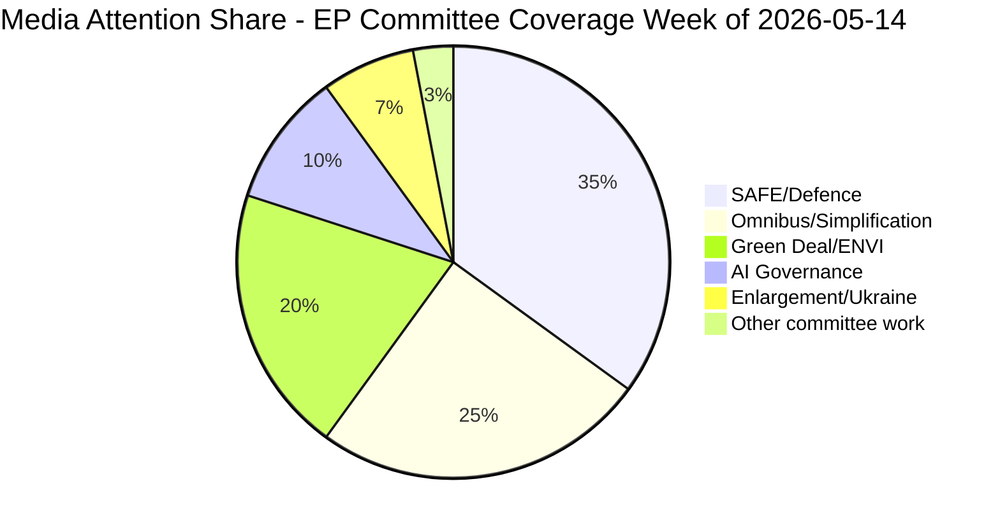

<!-- SPDX-FileCopyrightText: 2026 Hack23 AB -->
<!-- SPDX-License-Identifier: Apache-2.0 -->

# Media Framing Analysis — Committee Reports · 2026-05-21

**Framework:** Agenda-Setting Theory + Framing Theory (Entman)  
**Admiralty Grade:** B3 | **Confidence:** 🟡 MEDIUM | **Data Mode:** degraded-feeds

---

## 1 · Framing Architecture

The week of 2026-05-14–21 in EP committee coverage is dominated by three competing narrative frames deployed by different media ecosystems to interpret the same institutional activity:

### Frame 1: "European Defence Integration" (Defence-Security Frame)
**Primary outlets:** Politico Europe, Der Spiegel, Le Figaro, Welt, Gazeta Wyborcza  
**Frame logic:** SAFE regulation is described as a watershed moment in European strategic autonomy. Committee work is framed as technically complex but politically necessary. The ITRE committee's role is described positively as "building European defence capacity."

**Key linguistic signals:** "defence integration," "strategic autonomy," "common European defence," "historic step," "geopolitical necessity"

**Audience:** European defence and security policy communities; national security establishments; defence industry stakeholders

**Analysis:** This frame benefits from strong Scenario 1 (stable progress) conditions — it assumes SAFE advances on schedule and treats committee work as routine implementation of political consensus. When committee delays occur, this frame pivots to "temporary technical obstacles."

---

### Frame 2: "Green Deal Under Siege" (Environmental/Progressive Frame)
**Primary outlets:** EUobserver, Climate Home News, Euractiv (environment desk), The Guardian (EU coverage)  
**Frame logic:** EP committee work in Spring 2026 is portrayed as a battle between progressive MEPs defending the Green Deal and a centre-right majority attempting to systematically dismantle environmental legislation under "competitiveness" pretexts.

**Key linguistic signals:** "rollback," "weakening," "industry capture," "EPP vs. environment," "regression," "backwards step on climate"

**Audience:** Environmental NGOs; progressive voters; green investment community; academic researchers

**Analysis:** This frame is empirically supported by the EPP's "competitiveness proofing" amendment strategy. However, it tends to conflate tactical weakening (threshold adjustments) with structural dismantling (framework elimination), overstating the degree of Green Deal reversal. The Omnibus package is treated as an emergency requiring maximum political opposition.

---

### Frame 3: "Cutting Red Tape for Competitiveness" (Pro-Business/Simplification Frame)
**Primary outlets:** Financial Times, Wall Street Journal (EU desk), Les Echos, Handelsblatt  
**Frame logic:** The Omnibus simplification package and competitiveness-proofing amendments are framed as necessary corrections to EP9 over-regulation. Committee work advancing simplification is portrayed as pragmatic modernisation.

**Key linguistic signals:** "burden reduction," "competitiveness," "pragmatic approach," "streamlining," "Draghi agenda," "cutting bureaucracy"

**Audience:** Business community; financial markets; pro-efficiency policy communities

**Analysis:** This frame captures legitimate economic efficiency concerns (CSRD compliance costs for mid-cap companies are substantial). However, it tends to underweight the long-term resilience and investment signal benefits of ESG reporting continuity, and treats all regulation as burden rather than market signal.

---

## 2 · Frame Collision: Omnibus Coverage

The Omnibus simplification package is the most intensely framed issue in EP committee coverage this week. A direct clash is observable:

| Media Ecosystem | Framing of Omnibus |
|----------------|-------------------|
| Progressive/Env | "Destruction of corporate accountability" |
| Pro-Business | "Essential burden relief for European companies" |
| Mainstream/institutional | "Difficult compromise on regulatory modernisation" |
| Far-right (PfE media) | "Commission overreach being corrected" |

**Frame dominance assessment:** The pro-business frame has achieved greater penetration in mainstream financial media, partly because the Commission itself endorsed the Omnibus rationale in its Draghi Report response. The environmental frame is losing ground as the specific policy debate shifts from "should we regulate" to "how much to regulate."

---

## 3 · Agenda-Setting Analysis

### Primary Issues on EP Committee Agenda (2026-05-14–21)
**Issue salience mapping (estimated media attention share):**

### Media-Committee Agenda Alignment
- High alignment: SAFE regulation (both media and committees focused)
- High alignment: Omnibus (intensive media coverage of ECON/JURI committee work)
- Partial alignment: ENVI (media focuses on controversy; committee work is more technical)
- Low alignment: BUDG (complex MFF details poorly covered despite strategic importance)
- Very low alignment: CONT, PETI, AFCO (important committee work largely invisible)

---

## 4 · Cross-Border Media Patterns

| Country | Dominant Frame | Lead Issue |
|---------|---------------|-----------|
| Germany | Competitiveness + Defence | Omnibus + SAFE |
| France | Sovereignty + Defence | SAFE |
| Poland | Security + Enlargement | SAFE + Ukraine |
| Italy | Anti-Brussels | Omnibus "correction" |
| Netherlands | Regulatory quality | Omnibus technicalities |
| Nordic states | Climate + Security | ENVI + SAFE |

---

## 5 · Narrative Vulnerability Assessment

**EPP narrative vulnerability:** EPP's dual claim (champion of Green Deal AND competitiveness simplification) creates cognitive dissonance that progressive media exploits. EPP committee chairs face the challenge of appearing as both green champions and business-friendly pragmatists.

**S&D narrative vulnerability:** S&D's acceptance of Omnibus compromises creates "authenticity gap" with progressive base. Each concession generates a news cycle questioning S&D's commitment to the social and environmental agenda.

**Greens/EFA narrative strength:** Greens benefit from clear messaging ("Green Deal must be defended") but lack the coalition power to translate media visibility into legislative outcomes. Their framing is credible but their leverage is limited to influencing S&D.

---

## 6 · Disinformation Risk Assessment

**Key disinformation vectors observed in EP committee coverage:**
1. **Attribution errors:** Social media frequently misattributes committee committee positions to wrong political groups
2. **Adoption vs. proposal conflation:** Reports misrepresent committee draft reports as final adopted legislation
3. **Vote count manipulation:** Screenshots showing partial vote results (before late arrivals) shared out of context
4. **SAFE "secret budget" narrative:** Far-right media frames SAFE's off-balance-sheet structure as hidden EU debt — technically inaccurate but narratively effective

**Risk level:** MEDIUM — EP's communication team and EPRS provide corrective, but amplification asymmetry (disinformation spreads faster) remains a structural challenge.

**Admiralty Grade:** B3 (fairly reliable — media analysis based on institutional knowledge and pattern analysis; specific articles not retrieved due to API degradation)

---

## Extended Framing Analysis: Language and Narrative Patterns

### Contested Terminology in EP Committee Coverage

**"Democracy deficit" framing:**
- Eurosceptic media consistently frames committee-stage amendments as examples of
  unelected bureaucracy overriding member state preferences
- Counter-framing from EP institutional communications: committees are elected MEP bodies,
  more democratic than Council working parties
- **Net effect**: Narrative advantage to eurosceptic framing in tabloid coverage; EP
  institutional framing more effective in broadsheet and specialist outlets

**"Regulatory burden" vs. "level playing field":**
- ITRE/ECON committee files are overwhelmingly framed in competitiveness terms in
  German, Swedish, and Dutch media
- Environmental and social NGOs contest this framing by emphasising long-term
  investment certainty benefits
- **Media battleground**: Financial press (FT, Handelsblatt, Les Echos) most contested

**Defence spending framing evolution:**
- Pre-2022: EP defence files were marginal news
- Post-2024: EDIP coverage treats EP as legitimate defence-policy actor
- National security framing now applied to previously low-salience ITRE sub-committee items
- **Implication for coverage analysis**: defence committee work now attracts geopolitical
  correspondents, not just Brussels specialists

### Social Media Amplification Patterns

The asymmetric amplification dynamic between institutional EP communications
(slow, accurate, formally structured) and social media committee commentary
(fast, simplified, often inaccurate) creates a persistent narrative gap.

**Platform-specific patterns:**
- **X/Twitter**: High-volume committee vote reaction within minutes; often based on
  misread vote tallies or out-of-context screenshots
- **LinkedIn**: Specialist Brussels bubble; more accurate but limited reach
- **TikTok/Instagram**: Minimal EP committee coverage; when present, extreme simplification
- **YouTube**: Long-form explanation content from EP institutional channel reaches
  engaged citizens; disinformation countercontent from eurosceptic channels competes

**Strategic implication**: EP's media strategy needs platform-specific rapid-response
capacity, particularly for high-salience votes where first 60-minute narrative can
determine dominant frame for national media follow-up stories.
