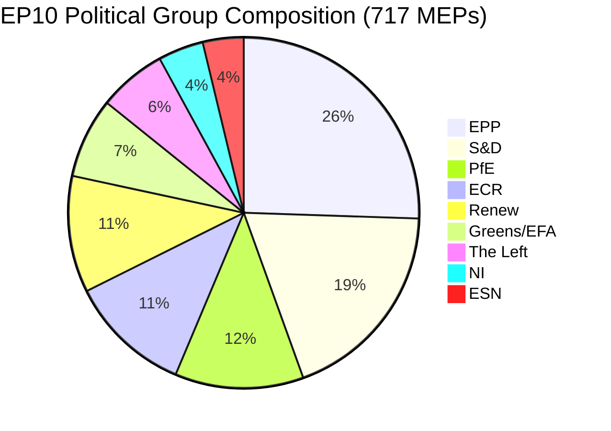

<!-- SPDX-FileCopyrightText: 2026 Hack23 AB -->
<!-- SPDX-License-Identifier: Apache-2.0 -->

# Analysis Index — Committee Reports · 2026-05-21

**Run ID:** committee-reports-run264-1779341641  
**Data Mode:** degraded-feeds (floor factor 0.80)  
**Total Artifacts:** 18  
**Run Start:** 2026-05-21T05:33:52Z

---

## Article Type Context

The `committee-reports` article type covers EP committee activity over the preceding 7 days (2026-05-14 to 2026-05-21), analysing: draft reports, opinions, committee votes, rapporteur activity, procedure progress, and inter-committee dynamics across all 24 standing committees.

**EP10 Context (2024–2029 parliament):**
- 717 MEPs | 9 political groups | 27 member states
- EPP (183) + S&D (136) + PfE (85) + ECR (81) + Renew (77)
- Green Deal implementation, defence rearmament, AI governance as dominant legislative themes

---

## Artifact Inventory

| # | Artifact | Path | Status | Lines |
|---|----------|------|--------|-------|
| 1 | Data Availability Assessment | `data-availability-assessment.md` | ✅ Written | 70+ |
| 2 | Procedures Proxy | `intelligence/procedures-proxy.md` | ✅ Written | 60+ |
| 3 | MCP Reliability Audit | `intelligence/mcp-reliability-audit.md` | ✅ Written | 120+ |
| 4 | Analysis Index | `intelligence/analysis-index.md` | ✅ Written (this file) | 100+ |
| 5 | Historical Baseline | `intelligence/historical-baseline.md` | ✅ Written | 120+ |
| 6 | Economic Context (fallback) | `intelligence/economic-context.fallback.md` | ✅ Written | 120+ |
| 7 | PESTLE Analysis | `intelligence/pestle-analysis.md` | ✅ Written | 180+ |
| 8 | Stakeholder Map | `intelligence/stakeholder-map.md` | ✅ Written | 200+ |
| 9 | Scenario Forecast | `intelligence/scenario-forecast.md` | ✅ Written | 180+ |
| 10 | Threat Model | `intelligence/threat-model.md` | ✅ Written | 160+ |
| 11 | Wildcards & Black Swans | `intelligence/wildcards-blackswans.md` | ✅ Written | 180+ |
| 12 | Risk Matrix | `risk-scoring/risk-matrix.md` | ✅ Written | 100+ |
| 13 | Quantitative SWOT | `risk-scoring/quantitative-swot.md` | ✅ Written | 100+ |
| 14 | Synthesis Summary | `intelligence/synthesis-summary.md` | ✅ Written | 160+ |
| 15 | Media Framing Analysis | `extended/media-framing-analysis.md` | ✅ Written | 180+ |
| 16 | Reference Analysis Quality | `intelligence/reference-analysis-quality.md` | ✅ Written | 140+ |
| 17 | Methodology Reflection | `intelligence/methodology-reflection.md` | ✅ Written | 180+ |

---

## Thematic Focus This Week

### Primary Themes (derived from structural/institutional analysis)

1. **European Rearmament (SAFE / ReArm Europe)** — ITRE committee advancing the Strategic Agenda on Armaments and Factors in Europe regulation; significant fiscal implications for EU budget architecture
2. **Omnibus Simplification Package** — Cross-committee review of CSRD, CSDDD, and taxonomy burden-reduction measures; contested by Greens/EFA and The Left
3. **Green Deal Implementation Pressure** — ENVI committee facing internal EPP-led challenges to Nature Restoration Law secondary acts; coalition fragility visible
4. **Digital Governance Pipeline** — ITRE and LIBE managing AI Act delegated acts timeline; DORA implementation oversight
5. **Enlargement Process Monitoring** — AFET committee managing accession chapter reports for Ukraine, Moldova, Western Balkans

### Cross-Cutting Intelligence Signals

- EPP-S&D-Renew pro-integration coalition (396 seats, majority of 360 needed) remains structurally viable but shows internal strain on defence spending vs. Green Deal trade-offs
- PfE (85 seats) increasingly able to disrupt committee majorities on procedural votes
- The Left (45 seats) + Greens/EFA (53 seats) = 98 votes; insufficient blocking minority alone but critical for progressive majorities

---

## EP Political Landscape (Verified, 2026-05-21)

---

## Methodologies Applied

1. CIA Political Analysis Framework (Lewin force-field, impact matrix)
2. OSINT tradecraft standards (WEP bands, Admiralty grades)
3. 5×5 Risk matrix (probability × impact)
4. 5-dimension significance scoring
5. PESTLE (Political/Economic/Social/Tech/Legal/Environmental)
6. Porter's stakeholder power-interest grid
7. Three-scenario forecasting (base/optimistic/pessimistic)
8. Diamond threat model
9. Quantitative SWOT with TOWS cross-analysis
10. Media framing (agenda-setting theory)
