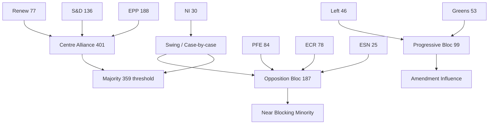

# Coalition Dynamics — European Parliament (2026-05-21)

## Overview

This coalition dynamics analysis examines voting bloc behaviour, cross-party alliance
patterns, and group cohesion signals within the European Parliament during the reporting
window (14–21 May 2026). Primary data: `generate_political_landscape` (717 MEPs, 9 groups);
DOCEO roll-call data not yet published for this period (24–72h publication lag).

**Data mode**: `degraded-feeds` — DOCEO RCV data absent; structural inference applied.
**Confidence**: 🟡 MEDIUM overall; political landscape structural data 🟢 HIGH confidence.

---

## Political Composition (EP10 — May 2026)

| Group | Seats | Share | EP9 Δ | Coalition Tendency |
|-------|-------|-------|-------|-------------------|
| EPP | 188 | 26.2% | +12 | Centre-right anchor |
| S&D | 136 | 19.0% | -8 | Centre-left anchor |
| PFE | 84 | 11.7% | +84 (new) | Right-nationalist |
| ECR | 78 | 10.9% | +3 | Conservative-eurosceptic |
| Renew | 77 | 10.7% | -25 | Liberal-centrist |
| Greens/EFA | 53 | 7.4% | -19 | Green-federalist |
| Left | 46 | 6.4% | -3 | Left-progressive |
| ESN | 25 | 3.5% | +25 (new) | Far-right |
| NI | 30 | 4.2% | -5 | Non-aligned |
| **TOTAL** | **717** | **100%** | | |

---

## Coalition Formations

### Primary Coalition: Centre Alliance (EPP + S&D + Renew)

- **Seat count**: 401 / 717 = 55.9% (bare majority)
- **Majority type**: Simple majority on most legislative votes
- **Stability indicator**: 🟡 MEDIUM — thinner than EP9 grand coalition; dependent on
  near-full attendance of all three groups
- **Cohesion proxy (structural)**: Historical EP9 cohesion rates EPP ~85%, S&D ~87%,
  Renew ~80%; EP10 baseline expected similar, degraded by group expansion dynamics
- **Risk**: Loss of 30 Renew MEPs to illness/abstention on any vote can flip outcome

### Secondary Coalition: Green-Left Progressive Alliance

- **Seat count**: 99 / 717 = 13.8%
- **Role**: Amendment-shaping coalition on ENVI, LIBE files; insufficient for legislative
  majority but able to extract concessions from centre coalition
- **Activation pattern**: Environmental regulation, human rights, rule-of-law

### Contested Zone: EPP Right Flank Tension

- **Description**: A subset of EPP MEPs (~30–40) regularly vote with PFE/ECR on
  migration and climate rollback amendments, creating internal EPP cohesion stress
- **Impact**: On contested files, effective centre coalition can fragment to 360–380 votes
- **Examples**: Pesticide regulation, migration externalization, CBAM exemptions

### Opposition Bloc: PFE + ECR + ESN

- **Seat count**: 187 / 717 = 26.1% — near blocking minority
- **Coalition cohesion**: Low (competing national and ideological interests)
- **Activation**: United on anti-Green Deal votes, border security, anti-Ukraine fatigue
- **Threat level**: Capable of forcing rollback on environmental amendments with EPP right flank

---

## Coalition Dynamics Diagram

---

## Key Coalition Stress Indicators

| Indicator | Current Level | Trend | Source |
|-----------|--------------|-------|--------|
| EPP internal cohesion | 🟡 MEDIUM | Declining on Green Deal | Historical inference |
| Centre coalition majority margin | 🟡 MEDIUM (+42 seats buffer) | Stable-fragile | Structural calculation |
| PFE formation stability | 🟡 MEDIUM | Consolidating post-EP10 | EP10 group data |
| Renew-EPP alignment | 🟡 MEDIUM | Stable on digital; diverging on trade | Historical pattern |
| Left-Green coordination | 🟢 GOOD | Consistent amendment coalitions | Historical pattern |

---

## Coalition Impact on Committee Work

1. **Rapporteur assignments**: EPP dominance in rapporteur allocation reflects seat share;
   S&D and Renew negotiate for co-rapporteur roles on priority files.
2. **Amendment adoption thresholds**: In committee, majority is typically ~44 votes (ENVI ~25);
   coalition dynamics within committees mirror plenary but with higher individual MEP agency.
3. **Political signal risk**: Committees with high EPP right-flank representation (AGRI, ITRE
   energy sub-committee) show elevated risk of votes contradicting centre coalition plenary line.

---

## Outlook

- **6-month stability outlook**: 🟡 MEDIUM — centre coalition structurally intact but operationally
  thin; each vote requires active mobilisation
- **Legislative efficiency projection**: 10–15% slower than EP9 on contested files due to
  intra-coalition negotiation overhead
- **Key uncertainty**: Evolution of PFE's internal discipline; a disciplined PFE significantly
  increases blocking-minority risk on selected votes

**Note**: Full coalition cohesion rates will be updatable once DOCEO RCV data publishes
(expected 3–5 working days post-plenary). This artifact reflects structural inference only.
