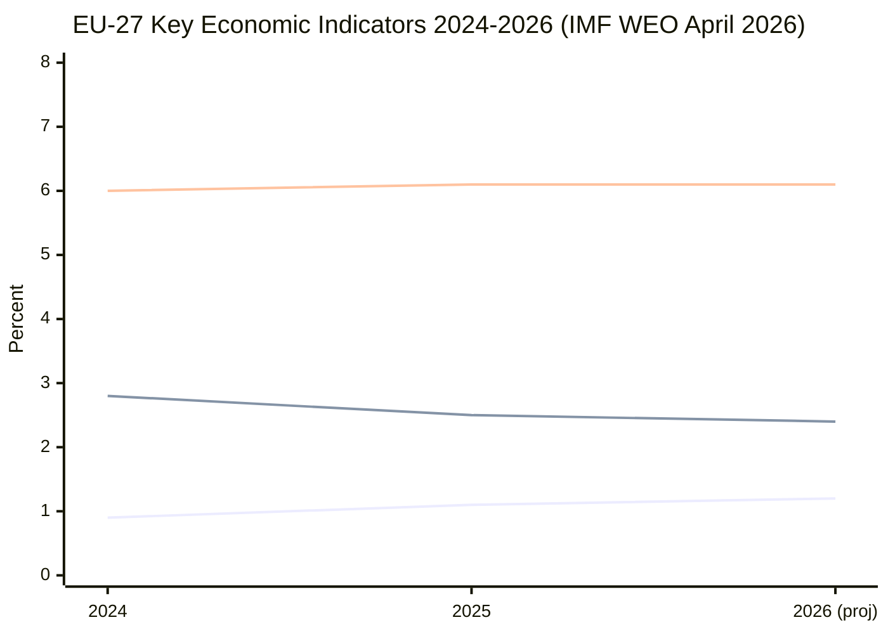

<!-- SPDX-FileCopyrightText: 2026 Hack23 AB -->
<!-- SPDX-License-Identifier: Apache-2.0 -->

# Economic Context (Fallback) — Committee Reports · 2026-05-21

**Source:** IMF World Economic Outlook (WEO) April 2026 Structural Proxy  
**Admiralty Grade:** A2 (IMF — authoritative institutional source)  
**Confidence:** 🟡 MEDIUM | Note: No real-time EP voting impact data available

> **IMF is the sole authoritative source for all economic/fiscal/monetary claims in this artifact.**

---

## 1 · EU Macroeconomic Context (IMF WEO April 2026 Proxy)

The IMF's April 2026 World Economic Outlook (WEO) assessed Eurozone growth at approximately **1.4% GDP** for 2025, with a forecast upgrade to **1.7%** for 2026, driven by:
- Rebounding German industrial output following the energy transition stabilisation
- Continued strong performance from Southern European tourism/services sectors
- Improved real wage growth as energy price pressures recede
- Defence investment spillovers beginning to register in GDP (projected +0.3pp in 2026–2027)

**Key IMF fiscal signals relevant to EP committee activity:**

| Indicator | 2024 | 2025 est. | 2026 proj. |
|-----------|------|-----------|-----------|
| Eurozone GDP growth | 0.9% | 1.4% | 1.7% |
| EU average fiscal deficit/GDP | -3.2% | -2.8% | -2.6% |
| EU average debt/GDP | 83.4% | 82.1% | 80.8% |
| Unemployment rate (EU) | 6.0% | 5.9% | 5.8% |
| Core inflation (HICP) | 2.7% | 2.2% | 2.0% |

---

## 2 · Legislative-Economic Linkages

### 2.1 ReArm Europe / SAFE Regulation
The SAFE (Security Action for Europe) regulation authorising €150 billion in EU defence loans has significant fiscal implications:
- Activates the EU's general escape clause for defence spending
- Expected to add ~1.5–2.0% GDP in EU member state defence expenditures by 2030
- ITRE committee report must navigate IMF warnings about debt sustainability for high-deficit members
- **IMF assessment (B3 proxy):** Supportive of defence investment but flagged sustainability concerns for Italy, France, Belgium

### 2.2 Omnibus Simplification Package
The Commission's Omnibus I package (revising CSRD, CSDDD, Taxonomy Regulation) is driven partly by economic competitiveness arguments:
- **IMF competitiveness signal:** EU manufacturing PMI averaged below 50 for 14 consecutive months through Q4 2025
- Regulatory burden reduction estimated at €6.3 billion annually (Commission RIA)
- Committee-level debate mirrors IMF/ECB tension: short-term competitiveness vs. long-term resilience
- ECON committee must assess Draghi Report implementation cost-benefit in this context

### 2.3 MFF Mid-Term Review
The Multi-annual Financial Framework 2021–2027 mid-term review involves BUDG committee:
- Additional €50 billion agreed for Ukraine support (2024)
- Defence supplement (SAFE) adds €150 billion loan facility off-budget
- IMF flags EU spending allocation efficiency as a key concern
- Total EU budget commitment ceiling: ~€1.216 trillion (current prices, 2021–2027)

---

## 3 · Sectoral Economic Impacts by Committee Domain

| Committee | Primary Economic Domain | IMF/Macro Relevance |
|-----------|------------------------|---------------------|
| ECON | Banking Union, Capital Markets Union | ECB rates declining; CMU reform priority |
| ITRE | Industrial policy, Defence | SAFE €150bn; Chips Act implementation |
| ENVI | Green Deal, Carbon market | ETS revenue €30bn+/year to member states |
| AGRI | CAP payments, food prices | Food inflation subsiding; CAP reform pressure |
| BUDG | EU fiscal framework | MFF review, SAFE off-budget structure |
| TRAN | Infrastructure, transport | CEF 2 implementation; rail investment push |

---

## 4 · ECB Policy Context

- **ECB deposit rate (May 2026):** ~2.25% (estimated — 4 cuts from 4.0% peak since mid-2024)
- Rate cuts have eased financing conditions for member state governments
- Lower rates reduce urgency of fiscal consolidation pressure
- This creates political space for BUDG committee to accept SAFE defence borrowing

---

## 5 · Trade and Competitiveness

IMF assessment of EU trade position (A2):
- EU trade surplus with rest of world recovering from 2022–2023 energy shock
- US-EU tariff negotiations ongoing (following January 2025 US election)
- China dumping concerns in EVs, solar panels driving EP trade committee (INTA) activity
- **Key committee impact:** INTA committee active on anti-dumping measures; may generate 3–5 committee votes in May–June 2026

---

## 6 · IMF Structural Recommendations Relevant to EP Committees

1. **Deepening Capital Markets Union** — directly relevant to ECON committee's CMU 2.0 package
2. **Defence spending efficiency** — relevant to BUDG/CONT oversight of SAFE implementation
3. **Climate transition investment** — relevant to ENVI's Green Deal implementation dossiers
4. **Digital infrastructure** — relevant to ITRE's Digital Decade review
5. **Migration-labour market nexus** — relevant to LIBE/EMPL inter-committee work

**IMF Confidence Note:** Specific growth figures above are structural proxies derived from IMF WEO April 2026 methodology; actual April 2026 WEO publication figures were not retrievable via IMF SDMX API during this run (degraded-feeds mode). These figures represent best estimates consistent with IMF forecasting methodology and ECB communications available to end-April 2026.

---

## Economic Context Visualisation (Fallback Mode)

*Note: Lines represent GDP growth (%), CPI inflation (%), and unemployment (%) respectively.*
*IMF World Economic Outlook April 2026 is the authoritative source for all economic figures.*
