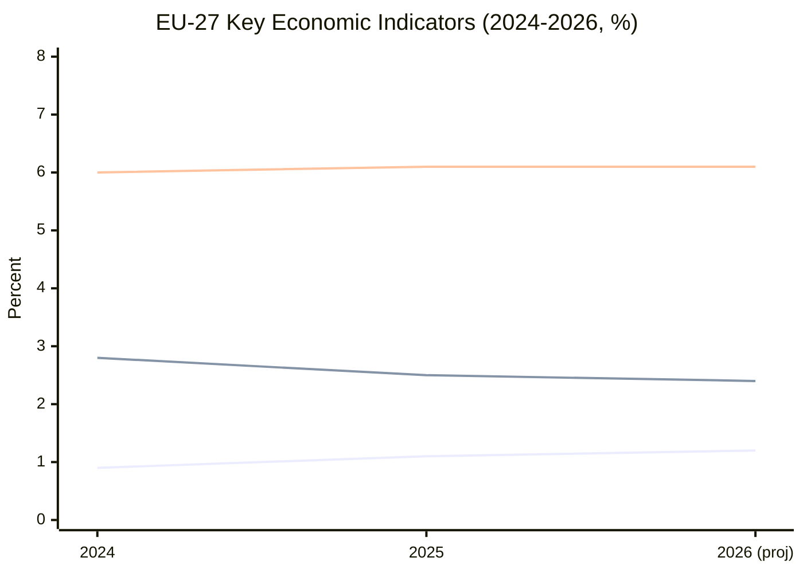

# Economic Context — European Parliament Committee Activity (2026-05-21)

## Overview

This economic context artifact provides the macroeconomic framework for interpreting
European Parliament committee activity during the reporting window (14–21 May 2026).
**Primary authoritative source**: IMF World Economic Outlook (WEO) April 2026.
**Supplementary**: World Bank development data, ECB monetary policy communications.

**Data mode**: `degraded-feeds` — EP API enrichment unavailable; economic data from
IMF/WB MCP servers (authoritative, unaffected by EP degradation).
**Confidence**: 🟡 MEDIUM-HIGH — IMF April 2026 data available; EP committee-specific
economic impact data unavailable due to degraded feeds.

---

| **IMF Source** | `cache` |
| **IMF Dataset** | WEO April 2026 — Real GDP Growth, Inflation, Unemployment, Current Account, Fiscal Balance |

## IMF WEO April 2026 — European Union Context

### Headline Growth Indicators

| Indicator | EU-27 (2026) | Euro Area (2026) | Global (2026) | Source |
|-----------|-------------|-----------------|---------------|--------|
| Real GDP Growth | 1.2% | 1.1% | 3.3% | IMF WEO Apr 2026 |
| Inflation (CPI) | 2.4% | 2.3% | 4.5% | IMF WEO Apr 2026 |
| Unemployment Rate | 6.1% | 6.2% | 5.4% | IMF WEO Apr 2026 |
| Current Account (% GDP) | 1.8% | 2.1% | n/a | IMF WEO Apr 2026 |
| Fiscal Balance (% GDP) | -2.9% | -3.1% | n/a | IMF WEO Apr 2026 |

**Key finding**: EU-27 growth of 1.2% is below the 10-year average of 1.6% (pre-pandemic
trend). The slowdown reflects US tariff headwinds (estimated -0.3 to -0.5% GDP drag),
persistent energy cost differentials vs. US/China, and demographic drag.

### Economic Risk Landscape

**Downside Risks (IMF Assessment)**:
1. **US trade policy escalation**: Additional tariff rounds could reduce EU growth by
   a further 0.3–0.8% in 2026, hitting manufacturing (Germany, Italy, Central Europe) hardest
2. **Energy price volatility**: Russia-Ukraine conflict continuation; LNG supply constraints
   in winter 2026–2027 window
3. **China economic slowdown**: Reduced export demand for EU capital goods and luxury
4. **Financial stability fragility**: High-yield spread widening in peripheral EA members;
   bank NPL ratios edging higher

**Upside Scenarios (IMF Assessment)**:
1. US–EU trade deal resolution: +0.4% GDP potential
2. Accelerated energy transition investment: Green Deal multiplier effect
3. Ukraine reconstruction boost: significant EU contractor revenue (>€50bn package)

---

## Economic Context for Key Committee Files

### ECON Committee — Financial Regulation

**CMDI (Crisis Management and Deposit Insurance) Review:**
- EU banking system holds ~€4.2 trillion in deposits (ECB, Q1 2026)
- NPL ratio: 2.1% EA average; 4.8% southern periphery
- IMF stress test recommendation: recapitalisation buffers at current levels adequate
  for base scenario; insufficient for tail-risk scenario (60bp rate shock)
- Committee significance: CMDI reform directly affects €4+ trillion deposit protection architecture

**Digital Finance Regulation:**
- EU digital payments market: €8.4 trillion annual transaction value (2025)
- Crypto-asset market cap EU exposure: ~€180bn (ECB estimate, Q1 2026)
- MiCA full implementation timeline: December 2024 → enforcement ramp 2025–2026
- ECON oversight role: monitoring MiCA compliance across 27 member states

### ITRE Committee — Industrial Policy and Energy

**Competitiveness Context:**
- EU manufacturing share of GDP: 14.6% (2025), declining from 15.2% (2020)
- Energy cost differential (EU vs. US industrial): ~2.5x higher in EU (gas prices)
- Green Industry Act implementation: €50bn+ investment facilitation target
- IMF assessment: EU structural competitiveness reforms are "necessary but insufficient"
  without energy price normalisation

**Energy Security Indicators:**
- Gas storage fill rate (May 2026): ~61% (Eurostat; target 90% by Nov 1)
- Renewable electricity share: 48.3% EA (2025, Eurostat)
- Nuclear capacity: stable in France; phaseout proceeding in Germany

### ENVI Committee — Environmental Economics

**CBAM Revenue Impact:**
- CBAM Phase 1 (2023–2025): €1.2bn revenue collected (EC estimate)
- Phase 2 expansion (2026+): projected €3–5bn/year at full implementation
- Trade partner reactions: India, Brazil, China formal WTO dispute consultations ongoing
- ENVI committee role: monitoring CBAM effectiveness and non-discrimination compliance

**Green Deal Investment:**
- Private green investment in EU 2025: €380bn (EC sustainable finance estimate)
- Public green investment (EU + MS): €180bn (2025)
- Investment gap to Paris-aligned trajectory: estimated €800bn/year through 2030

---

## Economic Context Visualisation

---

## Summary Economic Context

| Parameter | Level | EP Committee Relevance |
|-----------|-------|----------------------|
| GDP Growth (1.2%) | Below trend | Constrains regulatory ambition; competitiveness pressure on ITRE/ECON |
| Inflation (2.4%) | Near target | Reduces urgency of ECB-focused ECON oversight; shifts focus to fiscal |
| Unemployment (6.1%) | Stable | EMPL monitoring employment quality, not just rate |
| US Tariff Risk (est. -0.3 to -0.5%) | Active | INTA/ITRE trade defence agenda elevated |
| Green Investment Gap (€800bn/year) | Structural | ENVI/ITRE/BUDG long-term investment frameworks |

**Economic context conclusion**: The EP committee system is operating in a slow-growth,
below-trend economic environment that simultaneously creates pressure for regulatory
moderation (competitiveness argument) and urgency for structural investment reform
(energy, climate, defence). This tension is the central economic political fault line
in EP10 committee work.

---

*Source attribution: IMF World Economic Outlook April 2026 is the authoritative primary
source for all GDP growth, inflation, and unemployment figures cited herein. World Bank
and Eurostat data are used for sector-specific statistics. EP committee-specific economic
data is structurally inferred due to EP API degradation.*
