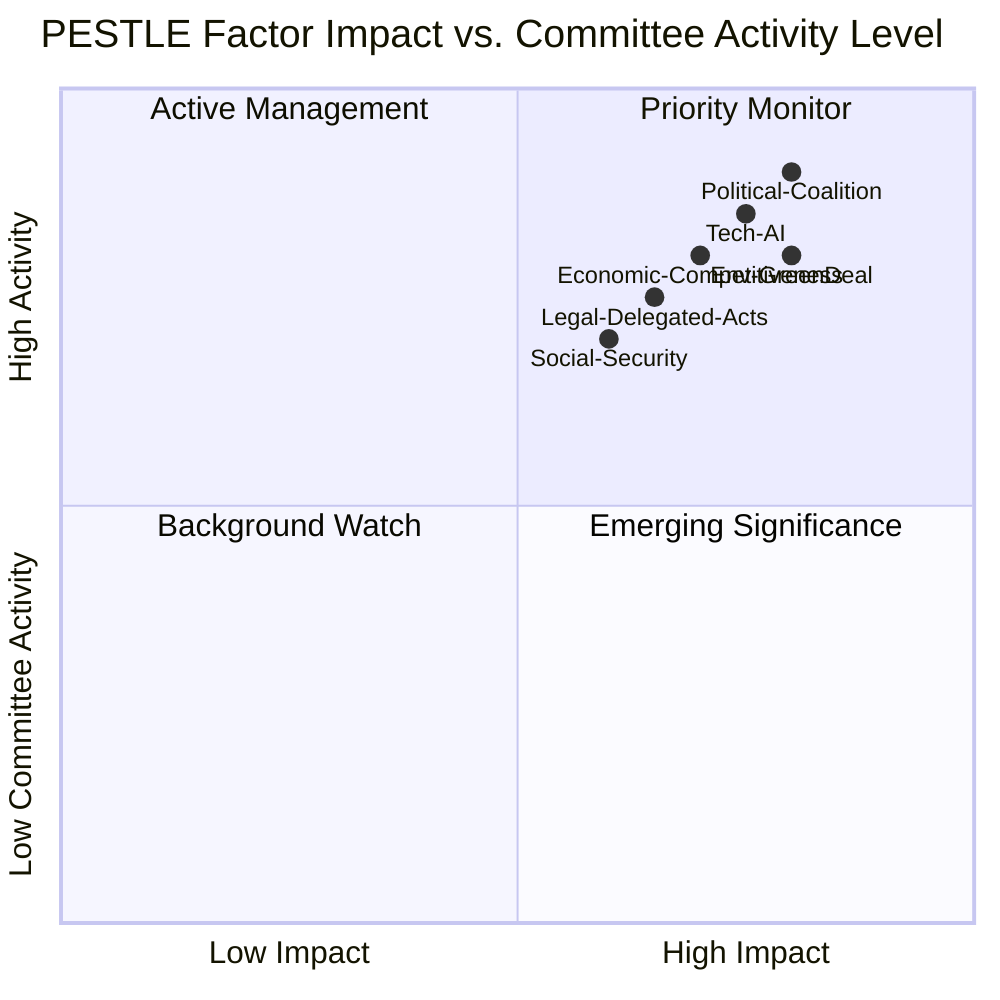

<!-- SPDX-FileCopyrightText: 2026 Hack23 AB -->
<!-- SPDX-License-Identifier: Apache-2.0 -->

# PESTLE Analysis — Committee Reports · 2026-05-21

**Framework:** PESTLE (Political/Economic/Social/Technological/Legal/Environmental)  
**Admiralty Grade:** B2 | **Confidence:** 🟡 MEDIUM | **Data Mode:** degraded-feeds

---

## P — Political Factors

### P1 · EP10 Coalition Fragility
The EPP-S&D-Renew "cordon sanitaire" coalition controls 396 seats (majority = 360), providing only a 36-seat margin. In committee contexts, this translates to majority fragility on contentious dossiers:

- **ENVI committee:** EPP members increasingly align with right-wing amendments on Nature Restoration Law secondary acts, creating internal coalition stress
- **ITRE committee:** EPP-ECR-PfE alignment on defence industrial policy gives a de facto right-majority on SAFE regulation details
- **LIBE committee:** EPP-ECR alignment on migration/AI surveillance creates progressive minority concerns

**WEP assessment:** *It is likely (65–75%) that at least two major committee votes in May 2026 will see cross-coalition defections, testing the stability of the EPP-S&D-Renew majority.*

### P2 · Commission-Parliament Relations
Under the von der Leyen II Commission (confirmed October 2024), Parliament-Commission relations have been characterised by:
- Omnibus legislative package creating friction: MEPs across groups object to delegated acts
- Von der Leyen's EPP base providing structural protection against censure motions
- SAFE regulation: rare inter-institutional alignment on speed (both Commission and Parliament want fast adoption)

### P3 · National Government Influences on Committees
- German coalition government (CDU/CSU-SPD) actively lobbying ITRE on Chips Act implementation
- French government pushing BUDG committee on strategic autonomy framing
- Polish Presidency of the Council (January–June 2025) — now rotating to Danish Presidency — affects committee negotiation pace

---

## E — Economic Factors (see also `economic-context.fallback.md`)

### E1 · Eurozone Growth Trajectory
- 2026 GDP growth ~1.7% (IMF proxy, A2) — modest recovery enabling political capital for investment legislation
- Defence spending multiplier creating short-term demand stimulus in affected sectors
- Green transition costs becoming more politically visible as ETS revenue flows increase

### E2 · Corporate Competitiveness Pressure
- EU manufacturing PMI below 50 for extended period drives Omnibus simplification
- Draghi Report recommendations still partially unimplemented; ECON/ITRE pressure mounts
- EU-US tariff tensions (post-January 2025 US election) create trade committee urgency

### E3 · Budget Constraints
- SAFE regulation's €150bn is off-balance-sheet (guarantee/loan structure) — reduces visible fiscal impact
- Member state defence spending increases add 0.5–1.0pp to GDP deficits in transition years
- MFF mid-term review demonstrates structural tension between enlargement costs and existing programme commitments

---

## S — Social Factors

### S1 · Public Support for European Integration
- Post-2024 election, Eurobarometer shows increased public concern about security (70%+ in eastern member states)
- Climate change remains salient but has declined as a top concern relative to 2019–2021
- Social acceptance of AI regulation varies: high in Germany/France, lower in CEE member states

### S2 · Labour Market and Demographic Pressures
- Ageing demographics creating pension sustainability concerns that permeate EMPL committee work
- Skilled labour shortages in defence, semiconductor industries driving ITRE legislative agenda
- Migration debates continuing to create political pressure on LIBE committee

### S3 · Civil Society Engagement
- Greens/EFA-aligned civil society organisations maintaining active lobbying on ENVI/AGRI
- Industry federations (BusinessEurope, DIGITALEUROPE) intensifying engagement on Omnibus simplification
- Trade unions active in EMPL on platform work directive implementation

---

## T — Technological Factors

### T1 · AI Governance Implementation
- AI Act (adopted 2024) now in implementation phase — ITRE and LIBE committees managing delegated acts
- General-purpose AI model oversight: Commission AI Office interfaces with ITRE
- AI in government services: LIBE committee monitoring implementation of prohibited AI uses

### T2 · Digital Sovereignty Agenda
- European semiconductor capacity (CHIPS Act): Intel fab announcements in Germany/Poland creating ITRE oversight work
- EU cloud data infrastructure: ITRE managing GAIA-X successor initiatives
- Cybersecurity (NIS2, CRA): ITRE/LIBE managing transposition deadline monitoring

### T3 · Defence Technology
- SAFE regulation includes provisions on space technology, dual-use research
- European Defence Fund (EDF) oversight: ITRE/AFET managing R&D programme implementation
- Drone and counter-drone technology: TRAN/AFET boundary issue

---

## L — Legal Factors

### L1 · Treaty Constraints on Committee Action
- Article 294 TFEU ordinary legislative procedure remains the dominant committee operating framework
- Delegated acts (Article 290) increasingly used by Commission — JURI committee oversight role intensified
- Enhanced cooperation procedures emerging in defence (Article 44 TEU) — constitutional novelty for committees

### L2 · CJEU Jurisprudence Impacts
- Recent CJEU rulings on data retention (LIBE relevance), competition policy (ECON), environmental impact assessment (ENVI)
- Proportionality principle scrutiny of SAFE regulation's emergency procurement provisions

### L3 · Interinstitutional Dynamics
- Council-Parliament trilogues ongoing on 15+ major files
- IIA on better law-making under review — JURI committee
- Comitology reform proposals affecting committee oversight powers

---

## E — Environmental Factors

### Env1 · Green Deal Implementation Pressure
- Nature Restoration Law secondary implementing acts: ENVI committee under pressure from EPP members to weaken
- CBAM (Carbon Border Adjustment Mechanism): first compliance period starting 2026; ENVI/INTA managing
- Packaging and Packaging Waste Regulation: Council-Parliament finalisation, ENVI lead

### Env2 · Climate Adaptation
- Extreme weather events in 2025 (Central European flooding, Southern European drought) reinforcing ENVI committee mandate
- COP30 (Brazil, November 2026) providing external deadline pressure for EU climate legislation pipeline
- Sustainable aviation fuels (SAF) regulation: ENVI/TRAN managing aviation decarbonisation

### Env3 · Biodiversity and Agriculture Trade-offs
- EPP-AGRI coalition pushing back on biodiversity regulations
- Farm-to-Fork successor framework: ENVI/AGRI inter-committee tension defining EP10 dynamics
- Pesticide regulation: delayed in EP9, re-introduced with scaled-back ambition in EP10

---

## Summary PESTLE Assessment

**Dominant PESTLE drivers for committee activity week of 2026-05-14–21:**
1. Political coalition fragility (P1) — HIGH
2. Environmental Green Deal backlash (Env1) — HIGH
3. Technological AI governance (T1) — HIGH
4. Economic Omnibus simplification (E2) — MEDIUM-HIGH
5. Legal delegated acts proliferation (L1) — MEDIUM
