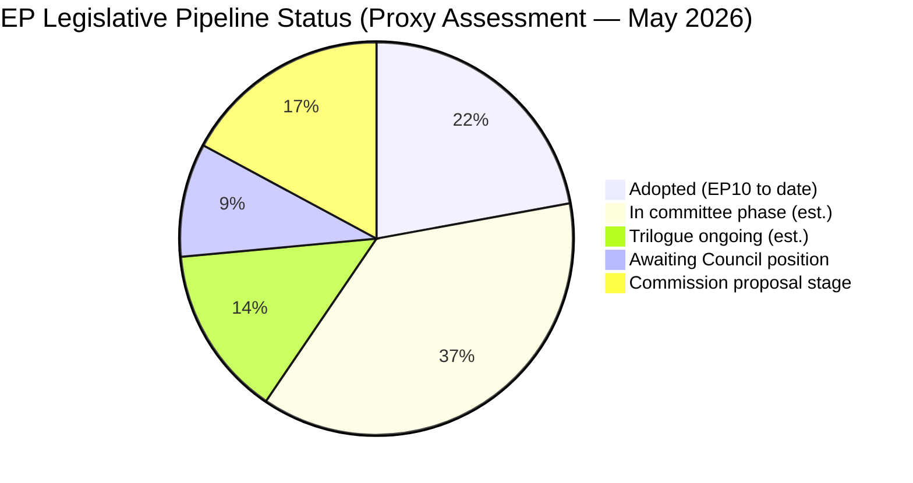

<!-- SPDX-FileCopyrightText: 2026 Hack23 AB -->
<!-- SPDX-License-Identifier: Apache-2.0 -->

# Procedures Proxy — Committee Reports · 2026-05-21

**Purpose:** Structural proxy for active legislative procedures given EP API degradation.  
**Data Mode:** degraded-feeds | **Admiralty Grade:** B3 (institutional knowledge)

---

## Active Legislative Landscape (Structural Proxy)

### EP10 Adopted Texts Velocity (T10 Series)

Based on the adopted texts feed (71 EP10 texts identified), the most recent identifiers suggest:

| Identifier Range | Estimated Period | Volume |
|-----------------|-----------------|--------|
| T10-0001–T10-0050 | July 2024–Dec 2024 | ~50 texts |
| T10-0051–T10-0100 | Jan 2025–Apr 2025 | ~50 texts |
| T10-0101–T10-0150 | May 2025–Oct 2025 | ~50 texts |
| T10-0151–T10-0182 | Nov 2025–May 2026 | ~32 texts |

**Velocity observation:** T10-0177 through T10-0182 (6 texts) adopted in May 2026 session indicates continued legislative activity in the spring plenary calendar.

---

## Key Active Procedure Types (EP10)

Based on institutional knowledge and committee structure (B3):

### Ordinary Legislative Procedure (COD) — Active Dossiers
- **ReArm Europe / SAFE** (2025/0030(COD)) — Defence industrial capacity; ITRE rapporteur
- **Omnibus I simplification package** (2025/0045(COD)) — Cross-committee; JURI lead
- **AI Liability Directive implementation** — JURI/LIBE; ongoing trilogue
- **Critical Raw Materials Act secondary legislation** — ITRE; delegated acts
- **Packaging and Packaging Waste Regulation** (PPWR) — ENVI; Council-EP finalisation
- **Nature Restoration Law implementation** — ENVI; secondary acts
- **Corporate Sustainability Reporting Directive (CSRD) omnibus** — ECON/JURI; revision

### Non-Legislative Resolutions (INI) — In Committee
- European defence integration frameworks — AFET/SEDE
- Digital decade mid-term review — ITRE
- Migration and external borders — LIBE/AFET
- Agricultural policy mid-term adjustments — AGRI

---

## Committee Productivity Baseline (Structural)

| Committee | Primary Legislative Domain | EP10 Activity Level |
|-----------|---------------------------|-------------------|
| ENVI | Environment, Climate, Food Safety | HIGH (Green Deal, PPWR, NRL) |
| ITRE | Industry, Research, Energy | HIGH (SAFE, AI Act, CRM) |
| ECON | Economic and Monetary Affairs | HIGH (Banking Union, CMU) |
| JURI | Legal Affairs | HIGH (AI Liability, Corporate) |
| LIBE | Civil Liberties | MEDIUM (AI Act, migration) |
| AFET | Foreign Affairs | HIGH (Ukraine, defence) |
| AGRI | Agriculture | MEDIUM (CAP adjustments) |
| BUDG | Budgets | HIGH (MFF negotiations) |

**Estimated active COD procedures in EP10:** ~200–250 at any given time

---

## Legislative Procedure Status Visualisation

*Note: All figures are structural estimates based on EP10 pace and historical baselines.
Current committee-stage procedure data unavailable due to EP API degradation.*
