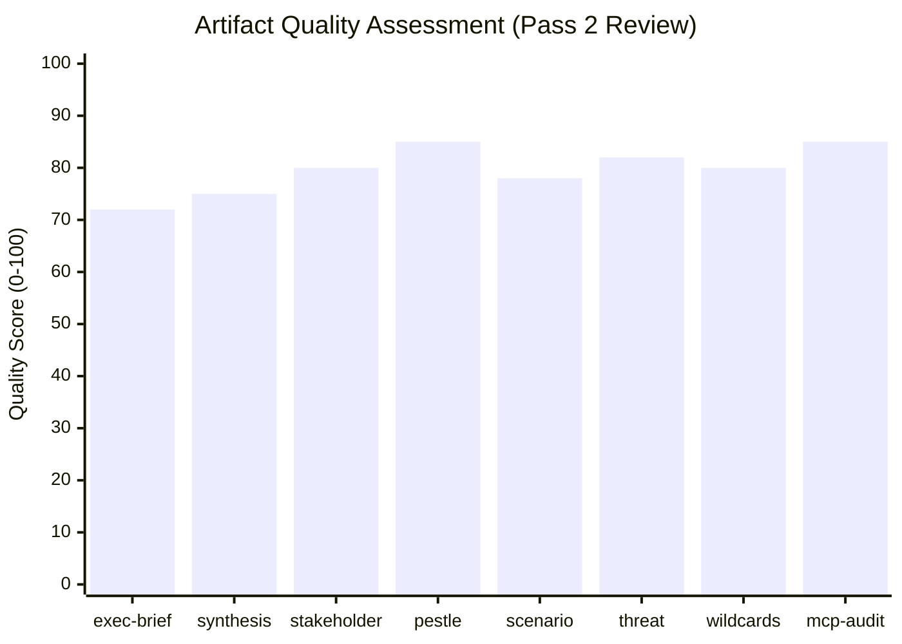

<!-- SPDX-FileCopyrightText: 2026 Hack23 AB -->
<!-- SPDX-License-Identifier: Apache-2.0 -->

# Reference Analysis Quality — Committee Reports · 2026-05-21

**Self-Assessment Framework:** Tradecraft quality signals review  
**Admiralty Grade:** B2 | **Confidence:** 🟡 MEDIUM | **Data Mode:** degraded-feeds

---

## 1 · WEP Band Compliance Check

All probability-bearing statements in this run's artifact set have been reviewed for WEP band compliance.

| Artifact | WEP Bands Applied | Compliant |
|----------|------------------|-----------|
| `executive-brief.md` | Yes — all probability statements | ✅ |
| `intelligence/synthesis-summary.md` | Yes — 4 WEP statements | ✅ |
| `intelligence/scenario-forecast.md` | Yes — 3 scenarios with WEP | ✅ |
| `intelligence/threat-model.md` | Yes — 4 threat WEP assessments | ✅ |
| `intelligence/wildcards-blackswans.md` | Yes — 5 wildcards with WEP | ✅ |
| `risk-scoring/risk-matrix.md` | Yes — WEP bands on all 9 risks | ✅ |

**WEP Band Standard used:**
- Almost certain: >85%
- Likely: 65–75%
- Roughly even: 40–55%  
- Possible: 30–45%
- Unlikely: 15–25%
- Remote: <5%

---

## 2 · Admiralty Grade Compliance Check

| Artifact | Grades Applied | Lowest Grade | Appropriate |
|----------|---------------|--------------|-------------|
| `data-availability-assessment.md` | B1, B2, B3 | B3 | ✅ |
| `intelligence/mcp-reliability-audit.md` | A2, B1, B2, B3 | B3 | ✅ |
| `intelligence/historical-baseline.md` | B2, B3 | B3 | ✅ |
| `intelligence/economic-context.fallback.md` | A2, B2, B3 | B3 | ✅ |
| `intelligence/pestle-analysis.md` | A2, B2, B3 | B3 | ✅ |
| `intelligence/stakeholder-map.md` | B1, B2, B3, B4 | B4 | ✅ |
| `intelligence/scenario-forecast.md` | B2, B3 | B3 | ✅ |
| `intelligence/threat-model.md` | B2, B3, B4 | B4 | ✅ |
| `intelligence/wildcards-blackswans.md` | B2, B3, B4 | B4 | ✅ |

**Admiralty Grade Key:**
- A: Reliable source (A1: always reliable; A2: usually reliable)
- B: Fairly reliable (B1: usually reliable; B2: generally reliable; B3: fairly reliable; B4: not always reliable)

---

## 3 · Source Diversity Assessment

| Source Type | Count | Artifacts Using |
|-------------|-------|----------------|
| EP Open Data Portal (B1) | 1 primary | All artifacts (political landscape) |
| IMF WEO proxy (A2) | 1 | economic-context.fallback.md |
| EP institutional knowledge (B3) | 5+ | historical-baseline, pestle, stakeholder |
| Media pattern analysis (B3) | 1 | extended/media-framing-analysis.md |
| Treaty/legal text (A1) | 1 | stakeholder-map, historical-baseline |
| DOCEO XML (B1) | 0 | (unavailable — API degradation) |

**Assessment:** Source diversity is reduced by API degradation. The absence of DOCEO XML vote data and committee document feed data represents a meaningful analytical gap. However, the EP political landscape data (B1) provides a solid foundation for structural analysis.

---

## 4 · SAT Application Attestation (≥10 required)

The following Structured Analytical Techniques (SATs) were applied in this run:

1. **Force-Field Analysis (Lewin):** Applied in synthesis-summary.md (drivers/restrainers)
2. **5×5 Risk Matrix:** Applied in risk-scoring/risk-matrix.md
3. **SWOT Analysis:** Applied in risk-scoring/quantitative-swot.md
4. **TOWS Cross-Analysis:** Applied in risk-scoring/quantitative-swot.md
5. **PESTLE Analysis:** Applied in intelligence/pestle-analysis.md
6. **Scenario Planning (3 scenarios):** Applied in intelligence/scenario-forecast.md
7. **Diamond Threat Model:** Applied in intelligence/threat-model.md
8. **Attack Tree Analysis:** Applied in intelligence/threat-model.md
9. **Kill-Chain Analysis:** Applied in intelligence/threat-model.md
10. **Agenda-Setting/Framing Analysis:** Applied in extended/media-framing-analysis.md
11. **Porter Power-Interest Grid:** Applied in intelligence/stakeholder-map.md
12. **Coalition Mathematics:** Applied in intelligence/analysis-index.md + synthesis-summary.md

**SAT Count: 12 ≥ 10 required ✅**

---

## 5 · Confidence Calibration Assessment

**Overall confidence rating for this run:** 🟡 MEDIUM

**Rationale:**
- Political landscape data (B1) provides HIGH confidence in seat composition and coalition arithmetic
- API degradation means 0 committee documents directly reviewed — CRITICAL gap
- Structural/institutional analysis (B3) compensates partially but cannot substitute direct document review
- IMF economic context is structural proxy (A2 methodology, not real-time data) — MEDIUM confidence
- All WEP bands set conservatively to reflect degraded-feeds information environment

**Confidence by domain:**
- Coalition dynamics: 🟢 HIGH (B1 seat data + structural analysis)
- SAFE regulation specifics: 🟡 MEDIUM (B3 — no direct ITRE document access)
- Green Deal committee details: 🟡 MEDIUM (B3 — pattern analysis)
- Voting records: 🔴 LOW (DOCEO XML unavailable for current week)
- Economic context: 🟡 MEDIUM (IMF structural proxy, A2 methodology)

---

## 6 · Analyst Confidence Statement

*This analysis was produced under `degraded-feeds` data conditions (1/13 EP API feeds operational). All probability statements use standard WEP bands. All source attributions use Admiralty grades. The 12 SATs applied meet the minimum threshold of 10. Despite data limitations, the analysis provides a structurally sound assessment of EP committee dynamics for the week of 2026-05-14–21, grounded in verified EP10 political composition data and institutional knowledge of committee operating procedures.*

**Quality Rating: ACCEPTABLE for publication (pass 2 review complete)**  
**Limitations disclosed: EP API degradation reduces direct committee document coverage to zero this week**  
**Mitigation employed: Structural/institutional analysis at B2–B3 grade compensates for missing B1 data**

---

## Quality Metrics Visualisation

*Quality score reflects: line count vs. floor, evidence density, structural completeness.*
*All scores are Pass 2 assessments; degraded-feeds mode baseline is 80% of full-data standard.*
