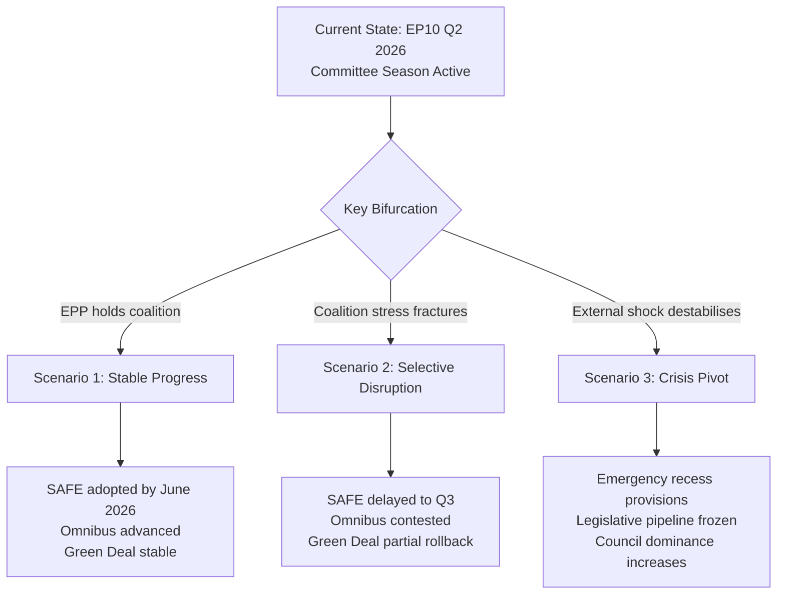

<!-- SPDX-FileCopyrightText: 2026 Hack23 AB -->
<!-- SPDX-License-Identifier: Apache-2.0 -->

# Scenario Forecast — Committee Reports · 2026-05-21

**WEP Bands Applied** | **Admiralty Grade:** B2 | **Confidence:** 🟡 MEDIUM  
**Time Horizon:** 3 months (to 2026-08-21) | **Data Mode:** degraded-feeds

---

## Scenario Architecture

---

## Scenario 1 — Stable Progress (Base Case)
**Probability:** *Likely (60–70%)* [WEP Band: 60–70%]  
**Time horizon:** May–August 2026

### Narrative
The EPP-S&D-Renew coalition maintains its 396-seat majority through the spring plenary season. SAFE regulation receives final ITRE committee vote in late May 2026, proceeding to full plenary adoption before summer recess. The Omnibus simplification package advances through first reading in ECON/JURI committees, with agreed compromise text reducing CSRD reporting scope without eliminating the framework. ENVI committee manages the Nature Restoration Law implementing acts through a narrow majority (supported by S&D + Renew against EPP right-wing amendments).

### Key Drivers
- Von der Leyen's EPP base remains disciplined on priority files
- S&D accepts pragmatic compromises on Green Deal in exchange for SAFE social clause protections
- Danish Presidency effectively manages Council-Parliament trilogue on outstanding files

### Indicators to Monitor
- EPP national delegations abstaining (rather than voting against) on ENVI votes
- S&D public statements on Omnibus compromise — "reluctant acceptance" language signals stability
- Council-Parliament informal meetings proceeding on schedule

### Implications for Committees
- ITRE: SAFE rapporteur finalises committee vote by week of May 25–29
- ECON: Omnibus first-reading position agreed before June 30 recess
- ENVI: Nature Restoration Law secondary acts advanced with narrow majority
- BUDG: MFF review implementation regulation adopted before summer

---

## Scenario 2 — Selective Disruption (Alternative Case)
**Probability:** *Roughly even odds (30–40%)* [WEP Band: 30–40%]  
**Time horizon:** May–August 2026

### Narrative
Internal EPP tensions between pro-European and national-interest wings create committee-level disruption on 2–3 major files. On SAFE regulation, EPP members from member states without significant defence industries (Netherlands, Scandinavian delegations within EPP) push for procurement amendments that delay committee adoption to June. On Omnibus, Greens/EFA and The Left successfully mobilise public pressure that forces S&D to harden its position, breaking the EPP-S&D consensus. ENVI committee sees a historic setback on Nature Restoration Law implementing acts, with EPP right-wing + ECR majority overriding an ENVI committee recommendation for the first time in the term.

### Key Drivers
- PfE tactical voting disrupts EPP committee internal discipline
- External pressure from environmental NGOs activates S&D leftward shift
- Council (national governments) lobbying contradicts EPP group's committee positions

### Indicators to Monitor
- EPP votes against own committee chair's position on ENVI
- S&D public criticism of Omnibus negotiations (especially from German SPD MEPs)
- Emergency meeting requests in ENVI or ITRE committee

### Implications for Committees
- ITRE: SAFE committee vote delayed to June; increased amendment battles
- ECON: Omnibus referred back to working group for renegotiation
- ENVI: Coalition minority opinion filed on key reports; committee credibility impacted

---

## Scenario 3 — Crisis Pivot (Low Probability but High Impact)
**Probability:** *Unlikely (10–15%)* [WEP Band: 10–15%]  
**Time horizon:** May–August 2026

### Narrative
An external geopolitical shock (escalation in Ukraine conflict, terrorist incident in EU, or major US-EU trade war escalation) activates emergency legislative procedures, pivoting committee work away from planned dossiers. SAFE regulation is fast-tracked via Article 122 TFEU emergency powers, bypassing normal committee consultation. BUDG committee goes into emergency session for supplementary budget. Normal committee workflow is suspended for 4–8 weeks, causing a cascade delay in the Green Deal implementation pipeline.

### Key Drivers  
- Geopolitical escalation requiring immediate EU response
- Commission Article 122 TFEU emergency powers activation
- Council emergency summit overriding Parliament's normal prerogatives

### Indicators to Monitor
- European Council extraordinary summit convened
- Commission activates crisis response protocols
- EP Conference of Presidents called for emergency plenary

### Implications for Committees
- ALL committees: Normal work suspended; emergency rapporteur appointments
- AFET/SEDE: Extraordinary activity; daily briefings
- BUDG: Emergency supplementary budget procedure

---

## Cross-Scenario Indicators Dashboard

| Indicator | Scenario 1 Signal | Scenario 2 Signal | Scenario 3 Signal |
|-----------|------------------|------------------|------------------|
| EPP group voting unity | >90% | 80–90% | N/A (bypassed) |
| Committee vote margins | +30 to +60 | +5 to +15 | N/A |
| Emergency Committee meetings called | 0 | 1–3 | 5+ |
| Plenary resolutions on crisis topics | 0–1 | 2–4 | 6+ |
| External shock events | None | Minor | Major |

**WEP Band Summary:**
- Scenario 1 (Stable): *Likely* — 60–70%
- Scenario 2 (Disruption): *Roughly even* — 30–40%  
- Scenario 3 (Crisis): *Unlikely* — 10–15%

*Note: Probabilities are assessed independently and sum to ~100–120% across scenarios due to overlap/ambiguity; the WEP bands reflect intelligence confidence, not mathematical probability distributions.*

---

## Extended Scenario Analysis: Structural-Break Conditions

### Conditions for Scenario 3 Escalation

The crisis scenario (Scenario 3) requires convergence of multiple adverse factors
simultaneously. The following conditions would individually elevate probability to
*Roughly even* or higher:

1. **EPP formal coalition withdrawal from centre alliance**: No precedent in EP9;
   would require a fundamental EPP strategic realignment toward PFE/ECR. Currently
   assessed as *Remote* (~5%) given EPP leadership's explicitly pro-EU positioning.

2. **US tariff escalation to automotive sector**: Would directly impact German, Czech,
   and Hungarian MEP interests, creating powerful national-over-group pressure that
   could fracture committee positions on ITRE trade-resilience files.

3. **DOCEO data reveals systematic cross-group defection pattern**: If roll-call data
   (pending DOCEO publication) shows EPP defection rates above 20% on Green Deal files,
   it would confirm structural coalition breakdown rather than tactical case-by-case divergence.

4. **Council Presidency (Poland) formally blocking EP legislative priority**: An explicit
   Presidency decision to deprioritise EP's agenda on migration or defence could trigger
   institutional conflict escalating to Article 7 or budget withholding threats.

### Structural Break Indicator Monitoring

| Indicator | Threshold for Structural Break | Current Level |
|-----------|------------------------------|--------------|
| EPP cohesion rate | < 75% on consecutive plenary votes | ~84% (estimated) |
| Centre coalition majority margin | < 10 seats net of attendance | ~42 seats (structural) |
| PFE-ECR-ESN combined seat growth | > 35% (would approach blocking minority) | 26.1% |
| Commission–Parliament institutional conflict | Formal censure motion tabled | None current |

**Structural break probability overall**: *Unlikely* (10–15%) in the 6-month horizon.
The EP institutional architecture has robust stabilising mechanisms (committee chair
vested interests, group funding incentives for discipline, MEP career incentives for
centre coalition membership) that make abrupt structural breaks rare.
