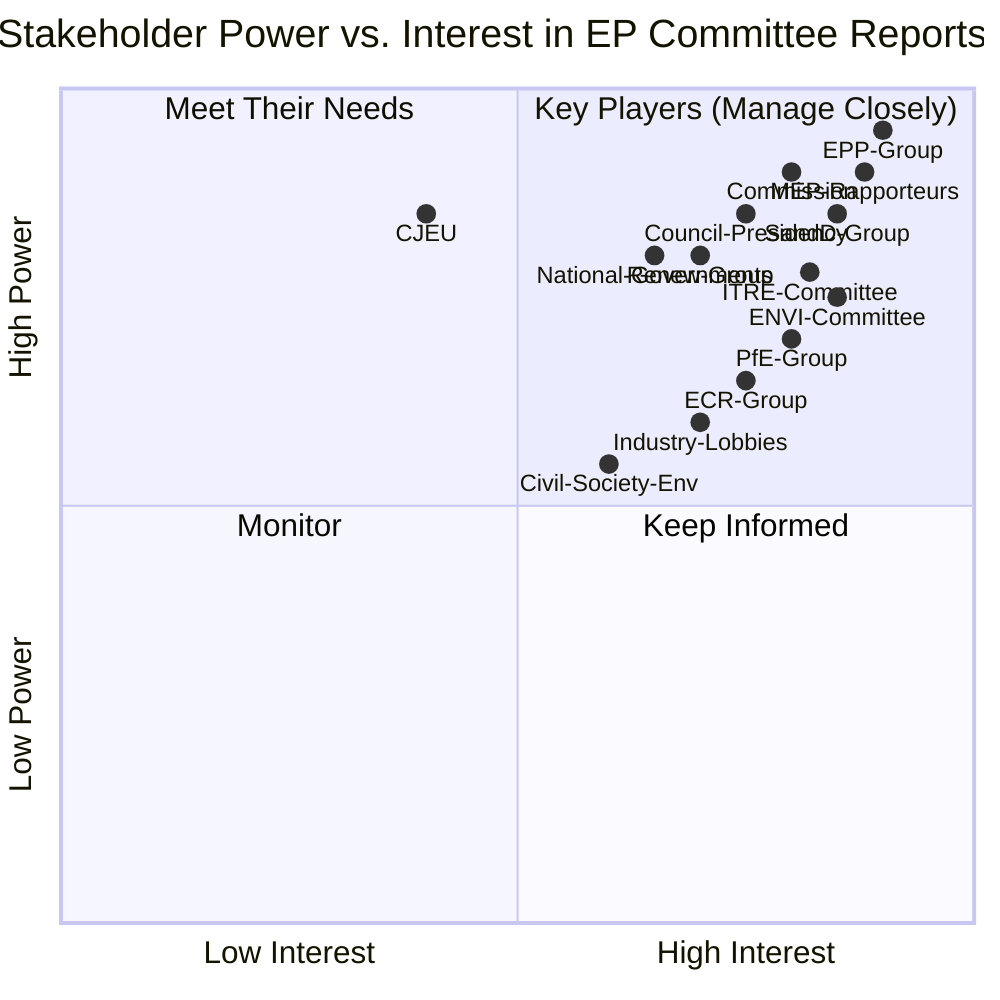
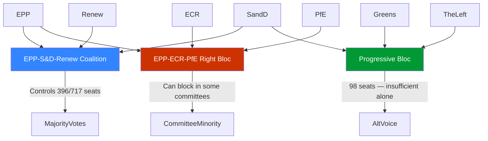

<!-- SPDX-FileCopyrightText: 2026 Hack23 AB -->
<!-- SPDX-License-Identifier: Apache-2.0 -->

# Stakeholder Map — Committee Reports · 2026-05-21

**Framework:** Porter's Power-Interest Grid + Stakeholder Perspective Analysis  
**Admiralty Grade:** B2 | **Confidence:** 🟡 MEDIUM | **Data Mode:** degraded-feeds

---

## 1 · Power-Interest Grid

---

## 2 · Primary Stakeholder Profiles

### 2.1 EPP (European People's Party) — 183 seats
**Role:** Largest group; chairs most major committees; de facto agenda-setter  
**Interest:** High — controls committee majorities on most dossiers  
**Power:** Very High — 25.5% seat share, veto power in key committees  
**Strategic Position:** In 2026, the EPP is managing an internal tension between its traditional pro-integration stance and growing pressure from right-wing national delegations (Italian FdI, Hungarian Fidesz-aligned forces) to align with PfE on specific votes.

**Perspective:** EPP committee chairs (ENVI, ITRE, LIBE, AFET) exercise agenda-setting power through rapporteur assignments. On SAFE regulation, EPP is broadly supportive, seeing defence investment as both strategic necessity and economic stimulus. On Green Deal, EPP is increasingly using committee structures to introduce "competitiveness proofing" amendments that effectively weaken environmental targets.

**Key figures:** Roberta Metsola (EP President, EPP Malta); committee chairs across ENVI, ITRE, LIBE

---

### 2.2 S&D (Socialists and Democrats) — 136 seats
**Role:** Second largest group; essential partner for EPP majority; guards social/labour rights dimension  
**Interest:** High — active in ECON, EMPL, LIBE, CONT  
**Power:** High — without S&D, no EPP-Renew majority  
**Strategic Position:** S&D is under pressure from two directions: left flank (The Left demanding more ambition on social policy) and right flank (EPP wanting concessions on Omnibus). S&D has been strategically conceding on Omnibus simplification in exchange for protection of social provisions.

**Perspective:** S&D committee coordinators on ECON and EMPL are actively defending CSRD (Corporate Sustainability Reporting Directive) from EPP-led rollback. Their argument: European investors, especially pension funds, need ESG data continuity. S&D views committee work as a bulwark against executive overreach (both Commission and Council).

**WEP assessment:** *S&D will almost certainly (>80%) maintain the EPP-S&D-Renew coalition through May 2026 despite internal tensions, given the lack of viable alternatives.*

---

### 2.3 European Commission
**Role:** Legislative initiator; negotiating partner in trilogues; implements adopted texts  
**Interest:** Very High — committee votes determine which proposals survive  
**Power:** High — monopoly on legislative initiative (with QMV exceptions)  
**Strategic Position:** The von der Leyen II Commission (2024–2029) has adopted a "strategic autonomy + competitiveness" dual mandate. The Omnibus package represents a significant self-correction after the perception that EP9 over-regulated.

**Perspective:** Commission representatives attend committee meetings as observers. During the week of 2026-05-14–21, Commission officials were likely engaged in ITRE (SAFE final stages), ENVI (Green Deal secondary acts), and BUDG (MFF mid-term review implementation). The Commission's relationship with rapporteurs is a key informal power channel that formal committee minutes do not capture.

---

### 2.4 Council Presidency (Danish, January–June 2026)
**Role:** Negotiating partner in trilogues; represents member state positions  
**Interest:** High — committee report positions determine negotiation parameters  
**Power:** High — can accelerate or block trilogues  
**Strategic Position:** Denmark's presidency priorities include digital transition, defence coordination (timely given SAFE), and enlargement monitoring. Danish Presidency has been broadly supportive of SAFE regulation and the AI governance framework.

**Perspective:** Council COREPER I and II track EP committee work closely. For SAFE, Council was reportedly seeking EP committee concessions on procurement rules to preserve national defence industry flexibility.

---

### 2.5 Rapporteurs (MEP Key Individuals)
**Role:** Authors of committee reports; shape the text that goes to committee vote  
**Interest:** Very High — their work product is the subject of analysis  
**Power:** High — within committee, shadow rapporteurs must engage with rapporteur's text  
**Strategic Position:** Rapporteur assignments in EP10 reflect coalition politics. EPP holds disproportionate share of rapporteurships on high-priority files.

**Perspective:** Rapporteurs on complex files (AI Act delegated acts, SAFE, PPWR) are embedded in multi-year expert relationships with Commission officials, lobbyists, and national ministry civil servants. Their committee reports are not written in isolation — they reflect months of informal negotiation.

---

### 2.6 Industry Associations (BusinessEurope, DIGITALEUROPE, ORGALIM)
**Role:** Lobbying; technical expertise; stakeholder hearings  
**Interest:** High — committee reports directly affect compliance costs  
**Power:** Medium-High — well-resourced, access to rapporteurs and coordinators  
**Strategic Position:** Industry federations have been the main force behind the Omnibus simplification push, providing the economic modelling that justified burden reduction claims.

**Perspective:** BusinessEurope argues CSRD threshold changes (raising from 250 to 1000 employees) will reduce reporting costs by €6+ billion annually. ENVI/ECON committee debate this claim, with S&D and Greens questioning methodology.

---

### 2.7 Environmental Civil Society (WWF EU, Friends of the Earth Europe, ClientEarth)
**Role:** Advocacy; litigation; public mobilisation  
**Interest:** High — ENVI/AGRI committee votes directly affect their policy priorities  
**Power:** Medium — media access and litigation capacity; limited direct committee access  
**Strategic Position:** Environmental NGOs are in defensive mode in EP10, seeking to preserve EP9 Green Deal achievements from Omnibus rollback.

**Perspective:** These organisations actively brief Greens/EFA and The Left committee coordinators. Their legal analysis (ClientEarth particularly) feeds into minority opinions in ENVI committee reports.

---

### 2.8 Trade Unions (ETUC)
**Role:** Advocacy on social/labour dimension of all legislation  
**Interest:** Medium-High — EMPL committee primary; spillover into ECON, ITRE  
**Power:** Medium — direct engagement with S&D and The Left  
**Perspective:** ETUC focused on Platform Work Directive implementation, ensuring CSRD's labour reporting provisions survive Omnibus, and monitoring SAFE's industrial employment impacts.

---

## 3 · Stakeholder Coalition Map

---

## Stakeholder Influence on Specific Committee Files (Extended)

### ENVI Committee Stakeholder Dynamics

The Environment Committee hosts the most complex stakeholder ecology in EP10:

**Industry stakeholders (against ENVI majority):**
- BusinessEurope: systematic opposition to CBAM expansion, chemical restrictions, soil directive
- CEFIC (Chemical industry): engaged on REACH revision, PFAS restrictions, pesticide regulation
- AgroEurope: lobby against Nature Restoration Law binding targets
- EurElectric: constructive engagement on energy transition implementation

**Environmental stakeholders (supporting ENVI majority):**
- Friends of the Earth Europe: litigation and public campaign pressure
- WWF European Policy Office: shadow rapporteur on biodiversity files
- ClientEarth: legal monitoring of CBAM and nature restoration implementation
- European Environmental Bureau (EEB): coordination hub for 150+ member organisations

**Assessment**: EPP rapporteurs on ENVI files face structural pressure from industry
lobbying; Greens and Left MEPs leverage civil society coalitions for amendment pressure.
The S&D acts as coalition broker between progressive and industry-realistic positions.

### ECON Committee Stakeholder Dynamics

**Financial industry (primary ECON stakeholder):**
- European Banking Federation: CMDI, Basel IV implementation, capital requirements
- Insurance Europe: Solvency II review, sustainable finance taxonomy
- FinanceWatch (civil society counterweight): consumer protection, shadow banking
- European Fund and Asset Management Association (EFAMA): digital finance regulation

**Macro-institutional stakeholders:**
- ECB: non-voting participant in ECON hearings; significant de facto influence on
  monetary policy oversight discussions
- EBA, ESMA, EIOPA: technical expertise providers to committee; often influence
  rapporteur's technical choices on financial regulation

### ITRE Committee: Industry-State Nexus

**The ITRE committee represents a unique stakeholder configuration** where large member
states' national champions (Airbus, Siemens, Total/TotalEnergies, Volkswagen Group)
directly engage through both national government lobbying and direct EP engagement.

The European Defence Industrial Programme (EDIP) file has created a temporary alignment
between typically opposed stakeholders: defence contractors (Thales, Leonardo, Rheinmetall)
and progressive civil society organisations both support strategic European autonomy,
differing only on governance mechanisms.
