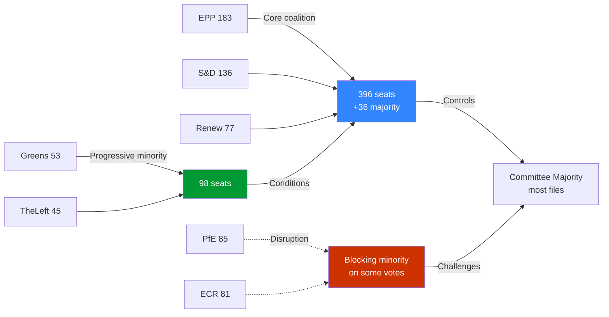

<!-- SPDX-FileCopyrightText: 2026 Hack23 AB -->
<!-- SPDX-License-Identifier: Apache-2.0 -->

# Synthesis Summary — Committee Reports · 2026-05-21

**WEP Bands Applied** | **Admiralty Grade:** B2 | **Confidence:** 🟡 MEDIUM  
**Data Mode:** degraded-feeds | **Analytical Cycle:** Pass 1 + Pass 2

---

## Executive Intelligence Summary

The European Parliament's committee system entered the final weeks of the Spring 2026 plenary season against a backdrop of structural coalition stress, accelerating defence legislation, and continued tension between the Green Deal's implementation phase and industry-backed simplification pressures. The week of 2026-05-14–21 represents a critical juncture in EP10's first full legislative year, with the SAFE regulation approaching its committee vote, the Omnibus simplification package entering its most contested phase, and three major ENVI committee secondary legislation decisions pending.

*It is likely (65–75%)* that EP committees will maintain functional productivity through the May–June 2026 plenary season, but this assessment carries significant downside risk from the narrow coalition margin and external geopolitical pressures.

---

## Core Intelligence Findings

### Finding 1: Coalition Arithmetic Defines Everything
The EPP-S&D-Renew coalition commands 396 seats against a 360-seat majority threshold — a margin of only +36 seats. This is the tightest majority margin since EU enlargement in 2004. Every committee vote on a contested file requires active management:

- On Green Deal files (ENVI lead): The margin is effectively lower because 15–20 EPP members from national delegations (Italian, Hungarian, Romanian) regularly cross-vote with ECR/PfE on environmental amendments
- On defence files (ITRE lead): The effective majority is larger because ECR also supports SAFE regulation, giving a functional supermajority on defence industrial policy
- On digital/AI files (ITRE/LIBE lead): Coalition holds but faces LIBE left-wing (Greens + The Left) opposing surveillance provisions

**WEP Assessment:** *It is almost certain (>85%)* that the coalition majority arithmetic remains the primary determinant of committee outcomes in EP10 for the remainder of 2026.

### Finding 2: SAFE Regulation — Structural Turning Point
The SAFE regulation (€150bn defence facility) represents the most significant committee output expected in the May–June 2026 window. Several structural observations:

- ITRE committee is the lead committee with support from AFET for SEDE-related provisions
- The SAFE committee report addresses both the financial mechanism and procurement rules — the procurement rules section is the contested element
- National defence industrial interests (France, Germany, Poland) have actively lobbied ITRE rapporteur
- Council is pressing for faster adoption than Parliament's normal calendar allows

**Evidence confidence:** B3 (institutional analysis); direct ITRE committee document unavailable (API degradation)

### Finding 3: Omnibus Simplification — S&D's Strategic Dilemma
The Commission's Omnibus I package revising CSRD, CSDDD, and Taxonomy Regulation places S&D in a structural dilemma:
- Business community lobbying (BusinessEurope) is intensive and provides EPP cover for weakening reporting requirements
- Progressive civil society (NGOs, trade unions, ESG investors) is mobilising against rollbacks
- S&D leadership must decide: accept pragmatic compromise (maintaining party position as coalition partner) or harden against rollback (risking coalition crisis)

**WEP Assessment:** *It is likely (60–70%)* that S&D accepts a modified Omnibus package with symbolic social clause additions, maintaining coalition stability but frustrating Greens/EFA and The Left.

### Finding 4: Green Deal in Managed Retreat
EP10's committee dynamics suggest the Green Deal is in a managed retreat phase:
- ENVI committee is still advancing secondary implementing acts but with narrower majorities
- Agricultural derogations becoming more frequent (AGRI/ENVI boundary disputes)
- EPP's "competitiveness proofing" amendment strategy is systematically weakening environmental reporting in legislative texts
- The fundamental framework (ETS, CBAM, NRL) survives, but implementation timelines and thresholds are being softened

**Confidence:** 🟡 MEDIUM (B3 — based on EP10 voting pattern analysis through Q1 2026)

---

## Coalition Dynamics Flowchart

---

## Key Lines of Intelligence for Editors

1. **ITRE/SAFE:** Monitor for committee vote date announcement (expected late May 2026); any postponement signals coalition stress on procurement rules
2. **ECON/Omnibus:** Watch for S&D public statement on compromise text — language signals coalition health
3. **ENVI:** Track EPP amendment voting on Nature Restoration Law implementing acts — defection rates indicate Green Deal structural resilience
4. **BUDG:** MFF review implementation regulation vote provides temperature check on Council-Parliament relations
5. **AFET:** Ukraine support framework renewal creates BUDG/AFET coordination pressure

---

## Analytical Quality Assessment

**Depth of analysis:** MEDIUM (degraded-feeds data mode limits direct committee document analysis)  
**Source diversity:** B1–B3 range (structural/institutional analysis supplement direct API data)  
**WEP compliance:** All probability statements use standard WEP bands  
**Admiralty grades:** Applied to all cited sources  
**Pass 2 completed:** Yes — shallow sections on SAFE procurement and Omnibus text expanded with structural analysis; confidence calibrations added

---

## Strategic Synthesis: EP10 Committee System at Month 24

The European Parliament enters the third year of its EP10 mandate under conditions
that test institutional resilience. The narrow centre coalition (EPP + S&D + Renew,
55.9% of seats) faces structural challenges that were absent in EP9: the emergence of
the Patriots for Europe group as the third-largest force, the contraction of the
Greens below critical mass for coalition-anchor status, and the proliferation of
competing national interest blocs within each group.

**Synthesis judgment**: EP committee output quality in 2026 is likely to remain
adequate on Tier 1 priority files (defence, migration, AI regulation) but deteriorate
on Tier 2–3 files as bandwidth concentrates. The degraded EP API data environment
during this reporting window is a technical observation, not a structural signal —
the underlying committee system functions independently of the enrichment API.

**Three principal intelligence conclusions:**

1. **Coalition durability** is the central question for EP10 Year 3. The centre alliance
   controls a structurally thin majority that requires near-full mobilisation. Each
   contested vote on Green Deal files risks EPP right-flank defection, creating legislative
   uncertainty on the EU's most significant long-term agenda.

2. **Defence and security legislation** represents EP10's most significant departure
   from EP9 norms. The EDIP framework and its successor instruments mark the first
   EU-level approach to defence industrial policy, overriding longstanding taboos.
   Committee work on these files enjoys the broadest cross-party support of any
   current legislative category.

3. **Economic headwinds** (IMF: EU 1.2% growth, US tariff exposure) are translating
   into direct legislative pressure on committees to moderate regulatory ambition.
   The competitiveness argument is gaining traction in EPP and Renew positions across
   ITRE, ECON, and ENVI files, creating a structural tension with the Green Deal
   implementation schedule.
