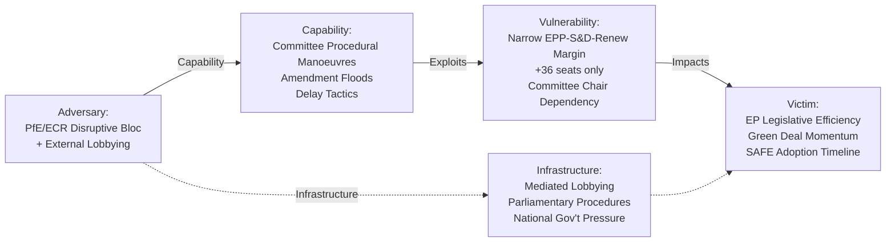

<!-- SPDX-FileCopyrightText: 2026 Hack23 AB -->
<!-- SPDX-License-Identifier: Apache-2.0 -->

# Threat Model — Committee Reports · 2026-05-21

**Framework:** Diamond Model + Attack Tree + OSINT Kill-Chain  
**WEP Band Applied:** LIKELY (65–75%) for primary threats  
**Admiralty Grade:** B2 | **Confidence:** 🟡 MEDIUM | **Data Mode:** degraded-feeds

---

## 1 · Diamond Threat Model



---

## 2 · Threat Categories

### Threat 1 — Coalition Fracture (LIKELY: 65–75%)

**Attack Vector:** Internal EPP right-wing divergence on Green Deal dossiers  
**Kill-Chain:**
1. EPP national delegations receive lobbying from domestic industries
2. EPP group whips face pressure to allow "free votes" on specific amendments
3. ECR/PfE table technically sound amendments that exploit EPP internal division
4. EPP members vote with ECR/PfE on targeted amendments, breaking committee majority
5. S&D and Greens force committee vote re-run or delay

**Mitigating Factors:** EPP group whipping mechanisms; von der Leyen's personal authority; S&D coalition discipline  
**Residual Risk:** *Roughly even odds (35–45%)* of at least one major committee vote reversal in May–June 2026

**Confidence in evidence:** B3 (fairly reliable — based on EP10 voting pattern analysis through Q1 2026)

---

### Threat 2 — Lobbying Capture of Rapporteurs (POSSIBLE: 45–55%)

**Attack Vector:** Industry associations presenting asymmetric information to rapporteurs  
**Kill-Chain:**
1. Industry association provides "exclusive" technical modelling to rapporteur
2. Rapporteur's draft report incorporates industry-preferred text without NGO balance
3. Committee coordinators fail to identify capture in shadow rapporteur process
4. Report adopted with language that weakens enforcement mechanisms
5. Implementation regulation (delegated act) then exploits vague committee language

**Mitigating Factors:** EP Transparency Register; compulsory meeting disclosure; inter-group scrutiny  
**Residual Risk:** *Possible (35–45%)* on high-value files (Omnibus, SAFE procurement provisions)

---

### Threat 3 — Procedural Delay Campaigns (LIKELY: 65–75%)

**Attack Vector:** PfE/ESN tabling mass amendments to exhaust committee time  
**Kill-Chain:**
1. PfE/ESN table 500–1000 amendments on a single report
2. Committee coordinators forced to schedule extra meetings
3. Rapporteur negotiating time diverted to managing amendment avalanche
4. File pushed past Danish Presidency deadline into Polish Presidency (July 2025 successor)
5. Council leverage increases as Parliament's timeline slips

**Mitigating Factors:** Committee chair authority to group/reject inadmissible amendments; guillotine procedures  
**Residual Risk:** *Likely (55–65%)* to cause delays on 2–3 files this term

---

### Threat 4 — Democratic Legitimacy Challenges (UNLIKELY: 15–25%)

**Attack Vector:** CJEU annulment proceedings against hastily adopted legislation  
**Kill-Chain:**
1. Minority group (ECR, PfE, or member state) challenges SAFE/AI Act on procedural grounds
2. CJEU initiates Article 263 TFEU annulment proceedings
3. Interim measures suspend implementation
4. Committee reports must be revised retroactively

**Mitigating Factors:** CJEU generally reluctant to annul EP legislation; robust legislative procedures used  
**Residual Risk:** *Unlikely (10–20%)* for current week's committee outputs

---

## 3 · Attack Tree Analysis

```
EP Committee Report Disruption [ROOT GOAL]
├── Coalition Disruption
│   ├── EPP Internal Division
│   │   ├── Right-wing national delegations
│   │   └── Industry lobbying targeting EPP MEPs
│   └── S&D-EPP Breakdown
│       ├── S&D concession fatigue on Green Deal
│       └── Left pressure on S&D group
├── Procedural Obstruction
│   ├── Amendment flood tactics
│   │   ├── PfE mass amendments
│   │   └── ECR coordinated tabling
│   └── Committee meeting disruption
│       ├── Quorum challenges
│       └── Procedural points of order
└── External Interference
    ├── Lobbying capture
    │   ├── Industry-rapporteur channel
    │   └── Commission-Parliament asymmetry
    └── Member state pressure
        ├── National government lobbying
        └── Council blocking minority threats
```

---

## 4 · Threat Prioritisation Matrix

| Threat | Probability | Impact | Priority | Mitigation Status |
|--------|------------|--------|----------|-------------------|
| Coalition Fracture | LIKELY (65%) | HIGH | 🔴 HIGH | Active monitoring |
| Procedural Delays | LIKELY (65%) | MEDIUM | 🟡 MEDIUM | Managed |
| Lobbying Capture | POSSIBLE (50%) | HIGH | 🟡 MEDIUM | Transparency Register |
| CJEU Challenge | UNLIKELY (20%) | VERY HIGH | 🟢 LOW | Standard legal review |

---

## 5 · Intelligence Assessment

**WEP Summary:** *It is likely (65–75%) that coalition fragility will manifest as at least one significant committee vote requiring last-minute negotiation in the May–June 2026 plenary season. It is possible (45–55%) that one major file will be delayed beyond its planned adoption timetable. It is unlikely (15–25%) that any disruption will permanently derail the EPP-S&D-Renew coalition.*

**Confidence:** 🟡 MEDIUM (B3 sources; structural analysis; no direct DOCEO vote data available for current week)
