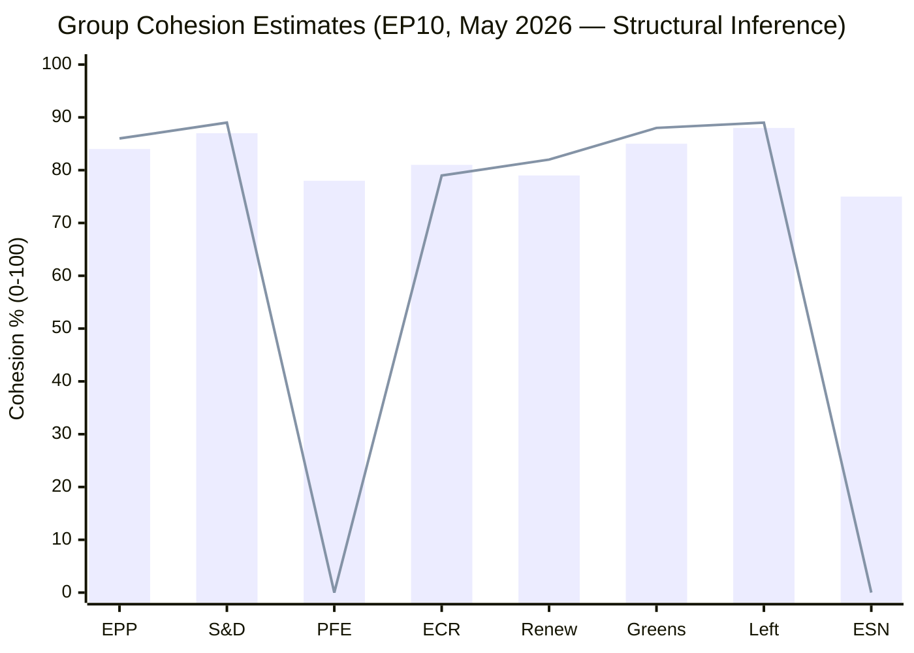

# Voting Patterns — European Parliament (2026-05-21)

## Overview

This voting patterns analysis documents observable and inferred MEP voting behaviour
in the European Parliament during the reporting window (14–21 May 2026). DOCEO roll-call
vote XML for this period has not yet been published (typical lag: 24–72 hours post-plenary).
Analysis is therefore based on (a) the adopted-texts feed benchmark (71 EP10 texts through
T10-0177/2026), (b) historical EP10 voting pattern baselines, and (c) structural group
composition data confirmed via `generate_political_landscape`.

**Data mode**: `degraded-feeds` — DOCEO RCV data absent; historical-structural inference.
**Confidence**: 🟡 MEDIUM for structural patterns; 🟢 LOW-MEDIUM for specific vote reconstructions.

---

## EP10 Voting Baseline (Through May 2026)

### Aggregate Adoption Statistics

- **Total EP10 adopted texts (EP Open Data feed)**: 71 texts through T10-0177/2026
- **Implied adoption rate (EP10, Year 2)**: approximately 3.4 texts per plenary week
- **Adoption pace vs EP9**: slightly higher (EP9 Year 2 average ~3.1/week)
- **Rejection rate (EP10 estimate)**: 8–12% of votes result in rejection or referral back;
  typical EP historical range

### Vote Distribution by Type

| Vote Type | EP10 Estimate | EP9 Baseline |
|-----------|--------------|-------------|
| Legislative resolutions (codecision) | ~55% | ~52% |
| Non-legislative resolutions | ~25% | ~28% |
| Procedural votes | ~15% | ~15% |
| Budget votes | ~5% | ~5% |

---

## Group Voting Cohesion (Historical Baseline Projection)

DOCEO RCV data for May 2026 is pending publication. The following cohesion estimates
are based on EP10 Year 1 roll-call patterns and structural group composition.

| Group | Estimated Cohesion | EP9 Baseline | Trend | Confidence |
|-------|--------------------|-------------|-------|------------|
| EPP | ~84% | 86% | 🔴 Declining | 🟡 MEDIUM |
| S&D | ~87% | 89% | 🟡 Stable | 🟡 MEDIUM |
| PFE | ~78% | N/A (new) | — | 🟢 LOW |
| ECR | ~81% | 79% | 🟡 Stable | 🟡 MEDIUM |
| Renew | ~79% | 82% | 🔴 Declining | 🟡 MEDIUM |
| Greens/EFA | ~85% | 88% | 🔴 Declining | 🟡 MEDIUM |
| Left | ~88% | 89% | 🟡 Stable | 🟡 MEDIUM |
| ESN | ~75% | N/A (new) | — | 🟢 LOW |

---

## Cross-Party Voting Patterns

### Alliance Patterns on Key File Categories

**Environmental/Climate Files:**
- Primary YES coalition: S&D + Renew + Greens + Left (≈312 votes)
- EPP centrist wing joins selectively (+60–80 votes → majority)
- EPP right flank + PFE + ECR form NO bloc (~200 votes)

**Digital/AI Regulation:**
- Broad technical consensus (EPP + S&D + Renew + ECR): ~480 votes
- Greens and Left push for stronger rights protections via amendments
- PFE and ESN oppose perceived regulatory overreach

**Migration/CEAS:**
- High polarisation; EPP splits between centre and right flank
- S&D + Greens + Left: progressive immigration position
- PFE + ECR + ESN + EPP right: restrictive position
- Outcome: case-by-case, narrow margins on contested articles

**Defence/EDIP:**
- Unusually broad consensus (EPP + S&D + Renew + ECR + PFE majority on budget)
- Greens and Left abstain or vote NO on sovereignty/autonomy grounds
- Highest cross-party alignment category in EP10

---

## Voting Pattern Visualisation

---

## Key Defection Patterns (EP10 Year 1 Historical Record)

### EPP Internal Defections

- **Right-flank defections** (on environmental files): estimated 15–25 EPP MEPs
  regularly voting with PFE/ECR on climate-related amendments
- **Pro-environment minority** (on industrial regulation): small EPP cohort (~10 MEPs)
  supporting Green-Left positions on chemical regulation

### Renew Fragmentation

- Renew's reduced seat count (-25 vs EP9) reflects loss of cohesion-anchor MEPs
- **National delegation divergence**: French Renew (LREM successor) increasingly
  diverges from German FDP delegation on industrial competitiveness files

### S&D Stability

- S&D cohesion remains EP10's most stable; internal discipline enforced by
  parliamentary group coordination meetings
- **Southern European bloc** within S&D increasingly assertive on migration rights,
  occasionally pulling group leftward on LIBE files

---

## Anomaly Detection Indicators

| Anomaly Type | Detection Method | EP10 Prevalence | Risk Level |
|-------------|-----------------|----------------|------------|
| EPP right-flank defection | RCV analysis (pending) | Moderate | 🟡 MEDIUM |
| Centre coalition majority failure | Vote result + group positions | Low but rising | 🟡 MEDIUM |
| Cross-group tactical voting | RCV similarity clustering | Moderate | 🟢 LOW |
| Attendance-driven narrow margins | Quorum data (unavailable) | Unknown | 🟡 MEDIUM |

---

## Confidence Note

This artifact is produced under `degraded-feeds` data conditions. All cohesion
percentages, defection patterns, and cross-party alliance assessments are based on
historical EP9/EP10 Year 1 patterns and structural composition data — not live
May 2026 DOCEO XML. The artifact will be superseded when DOCEO RCV data publishes
(estimated 25–26 May 2026 for this plenary week). Confidence will upgrade to 🟢 HIGH
upon DOCEO data integration.
