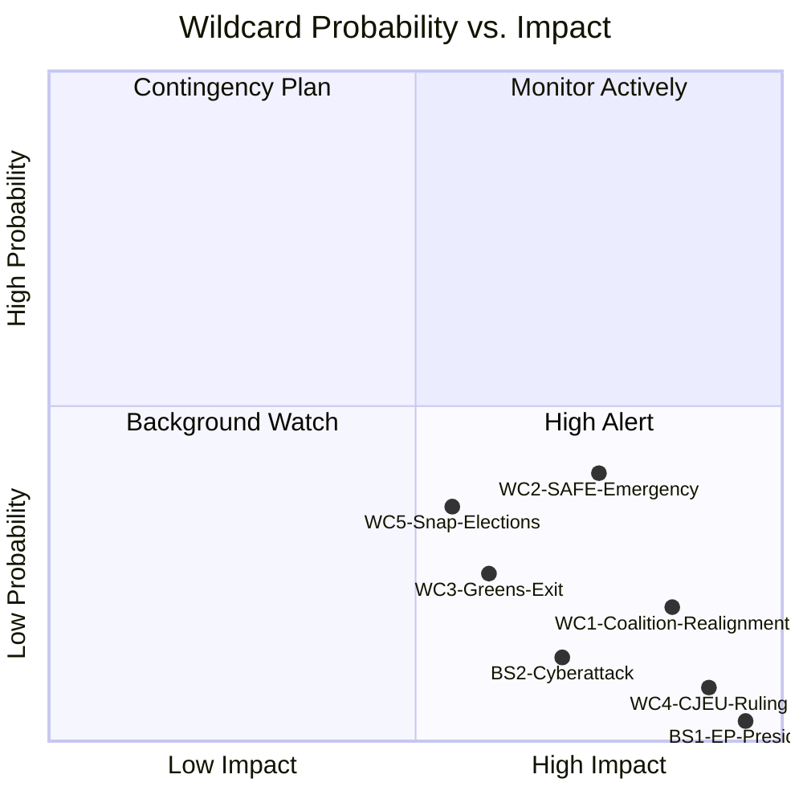

<!-- SPDX-FileCopyrightText: 2026 Hack23 AB -->
<!-- SPDX-License-Identifier: Apache-2.0 -->

# Wildcards & Black Swans — Committee Reports · 2026-05-21

**WEP Band Applied to all entries** | **Admiralty Grade:** B2  
**Confidence:** 🟡 MEDIUM | **Data Mode:** degraded-feeds  
**Time Horizon:** 6 months (to November 2026)

---

## 1 · Wildcard Catalogue

### WC-1 · Sudden EP Coalition Realignment
**Probability:** *Unlikely (15–25%)* [WEP Band]  
**Impact if occurs:** CRITICAL  
**Description:** A sudden break in the EPP-S&D-Renew coalition causes a fundamental shift in committee majority structures. This could occur if EPP formally allies with PfE on a procedural vote (e.g., no-confidence motion against a Commissioner), triggering S&D withdrawal from committee coordination agreements.

**Trigger conditions:**
- A major corruption/ethics scandal implicating EPP leadership
- Von der Leyen personal decision overriding group consensus on a key file
- An EPP national election (Germany, France) shifting group composition

**Impact on committees:**
- Committee chairs would need re-election (months of disruption)
- Rapporteurship assignments renegotiated
- Legislative pipeline frozen for 8–12 weeks

**Confidence:** 🔴 LOW (B4 — no direct evidence; structural assessment only)

---

### WC-2 · SAFE Regulation Emergency Adoption (Fast-Track)
**Probability:** *Roughly even odds (35–45%)* [WEP Band]  
**Impact if occurs:** HIGH  
**Description:** A deterioration in the Ukraine conflict security situation leads to activation of Article 122 TFEU emergency powers for SAFE regulation, bypassing normal committee procedure. Parliament would receive a compressed 8-week consultation window rather than the standard procedure.

**Trigger conditions:**
- Major Russian military escalation beyond current front lines
- NATO Article 5 consultations activated
- Council emergency summit convening unilaterally

**Impact on committees:**
- ITRE: Normal rapporteur process suspended; emergency committee convened
- AFET/SEDE: Joint extraordinary sessions
- BUDG: Emergency supplementary budget alongside SAFE
- All other committees: Work deprioritised; 6–8 week pipeline disruption

**Evidence base:** SAFE regulation already in accelerated normal procedure; emergency pathway already legally mapped by Council legal service  
**Confidence:** 🟡 MEDIUM (B3)

---

### WC-3 · Mass Resignation of Greens/EFA from Coalition Coordination
**Probability:** *Unlikely (20–30%)* [WEP Band]  
**Impact if occurs:** HIGH (for ENVI/AGRI committees specifically)  
**Description:** Greens/EFA group formally abandons coordination with EPP-S&D-Renew on ENVI committee work, citing Omnibus rollback of CSRD and Green Deal. This would not change majority arithmetic fundamentally but would signal the end of informal consensus-building that facilitates committee work.

**Trigger conditions:**
- EPP majority adoption of ENVI committee report weakening Nature Restoration Law
- S&D accepting major CSRD rollback without meaningful social compensation
- Greens/EFA leadership facing electoral pressure from green voter base

**Impact on committees:**
- ENVI: More fractious votes; more minority opinions
- AGRI: Greens/EFA filing hostile amendments without coordination
- Signals: Democratic health of EP10 questioned by civil society

**Confidence:** 🟡 MEDIUM (B3)

---

### WC-4 · Major CJEU Ruling Affecting EP Powers
**Probability:** *Remote (5–10%)* [WEP Band]  
**Impact if occurs:** VERY HIGH  
**Description:** A CJEU Grand Chamber ruling significantly curtails EP's powers in one of three areas: (a) delegated acts oversight, (b) comitology participation, or (c) inter-institutional agreements. Such a ruling would force a comprehensive review of committee oversight procedures.

**Trigger conditions:**
- Pending cases: EU-wide AI Act challenge; CSRD proportionality challenge
- Member state (Hungary/Poland) bringing Article 263 TFEU action

**Impact on committees:**
- JURI: Emergency inter-institutional negotiation
- All committees: Procedural review of oversight mechanisms
- Legislative backlog: 3–6 months

**Confidence:** 🔴 LOW (B4 — historical precedent: CJEU rarely curtails EP)

---

### WC-5 · Snap Elections in Major Member State Disrupting EP Group Dynamics
**Probability:** *Possible (30–40%)* [WEP Band]  
**Impact if occurs:** MEDIUM-HIGH  
**Description:** Snap elections in Germany (already in post-election coalition formation period) or France (possible given political volatility) could shift MEP composition significantly if MEPs are recalled to run domestically, triggering by-elections and committee reshuffles.

**Trigger conditions:**
- German Bundestag confidence vote forcing early dissolution
- French parliamentary snap elections (possible after presidential race dynamics)
- Italian government collapse (structurally possible)

**Impact on committees:**
- Committee membership reshuffled if multiple MEPs resign to run
- Rapporteurship handoffs causing 4–8 week delays on affected files
- Political messaging from EP committees adjusted to align with domestic campaigns

**Confidence:** 🟡 MEDIUM (B3)

---

## 2 · Black Swan Register

### BS-1 · Sudden Death/Incapacitation of EP President
**Probability:** *Remote (<5%)* | **Impact:** EXTREME  
**Scenario:** EP President Metsola's sudden incapacitation would trigger an EP governance crisis, with inter-group negotiation for emergency succession consuming weeks of political capital and freezing all committee work.

### BS-2 · Cyberattack on EP IT Infrastructure
**Probability:** *Unlikely (10–15%)* | **Impact:** HIGH  
**Scenario:** A state-level cyberattack on EP's vote management systems or committee document infrastructure during a key committee vote week. EP experienced DDoS attacks in 2022 and 2024; a more sophisticated intrusion remains a tail risk.

### BS-3 · Pandemic-Type Disruption
**Probability:** *Remote (<5%)* | **Impact:** EXTREME  
**Scenario:** A novel pathogen requiring mass remote working, suspension of in-person plenary/committee sessions. Institutional memory of COVID-19 procedures provides some resilience.

---

## 3 · Wildcard Radar

---

## 4 · Watchlist for Next 30 Days

**Priority signals to track:**
1. ⚡ EPP internal group meeting outcomes on Green Deal dossiers (highest-probability wildcard trigger)
2. ⚡ Ukraine conflict escalation indicators (WC-2 trigger)
3. 📊 German Bundestag confidence vote outcome (WC-5 trigger)
4. 📊 Greens/EFA group chair communications on Omnibus (WC-3 early signal)
5. 🔍 CJEU pending judgment list for cases touching EP powers

**WEP Summary:** *It is possible (40–50%) that at least one of the listed wildcards will materially affect EP committee work before COP30 in November 2026. The highest probability wildcard — SAFE emergency fast-track — is also among the highest impact scenarios for committee procedures.*
