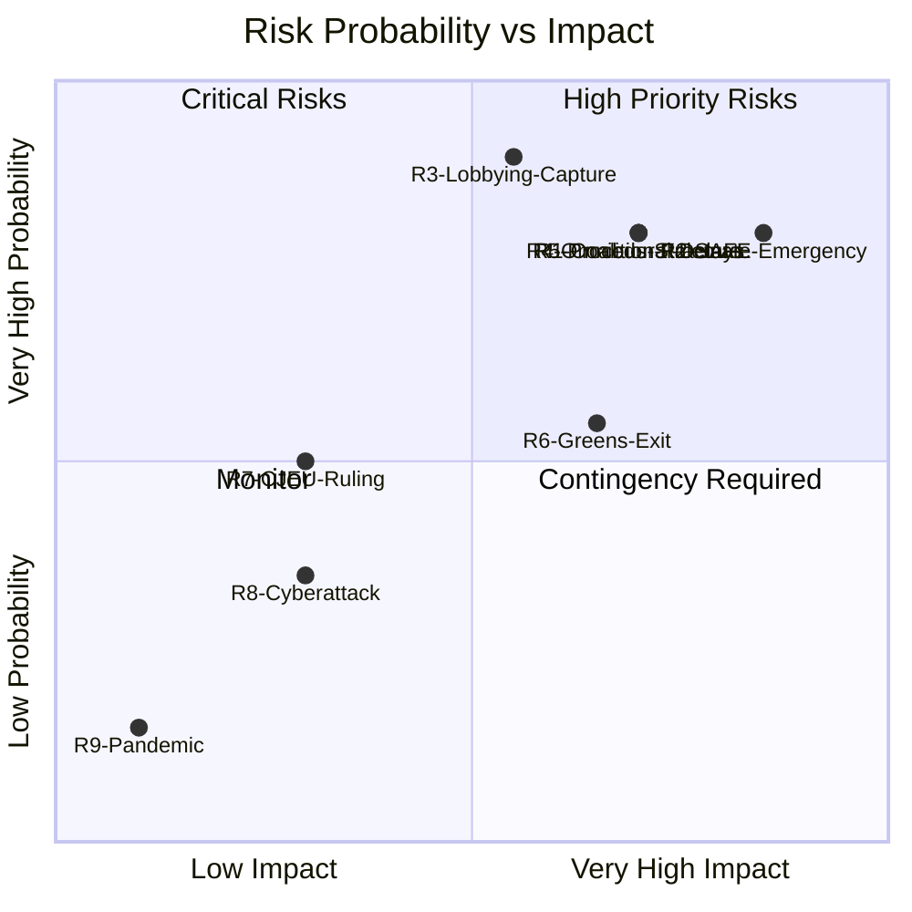

<!-- SPDX-FileCopyrightText: 2026 Hack23 AB -->
<!-- SPDX-License-Identifier: Apache-2.0 -->

# Risk Matrix — Committee Reports · 2026-05-21

**Framework:** 5×5 Risk Matrix (Probability × Impact)  
**WEP Band Applied to all probability assessments**  
**Admiralty Grade:** B2 | **Confidence:** 🟡 MEDIUM | **Data Mode:** degraded-feeds

---

## 5×5 Risk Matrix

```
        │ Very Low (1) │ Low (2) │ Medium (3) │ High (4) │ Very High (5)
────────┼──────────────┼─────────┼────────────┼──────────┼──────────────
Very    │              │         │ R3         │ R1       │ R2
High(5) │              │         │ Lobbying   │Coalition │ SAFE Emergency
────────┼──────────────┼─────────┼────────────┼──────────┼──────────────
High(4) │              │         │ R4         │ R5       │
        │              │         │ Omnibus    │ Delay    │
────────┼──────────────┼─────────┼────────────┼──────────┼──────────────
Medium  │              │ R7      │            │ R6       │
(3)     │              │ CJEU    │            │ Greens   │
────────┼──────────────┼─────────┼────────────┼──────────┼──────────────
Low(2)  │              │ R8      │            │          │
        │              │ Cyber   │            │          │
────────┼──────────────┼─────────┼────────────┼──────────┼──────────────
Very    │ R9           │         │            │          │
Low(1)  │ COVID        │         │            │          │
```

---

## Risk Register

| ID | Risk Description | Prob | Impact | Score | WEP Band |
|----|-----------------|------|--------|-------|---------|
| R1 | EPP-S&D-Renew coalition fracture on key file | 4 | 4 | 16 | *Likely (65%)* |
| R2 | SAFE emergency fast-track bypasses committees | 4 | 5 | 20 | *Roughly even (40%)* |
| R3 | Rapporteur lobbying capture | 5 | 3 | 15 | *Possible (50%)* |
| R4 | Omnibus stalemate (no first-reading position by recess) | 4 | 4 | 16 | *Roughly even (35%)* |
| R5 | Procedural delay campaign by PfE/ESN | 4 | 4 | 16 | *Likely (65%)* |
| R6 | Greens/EFA exit from coalition coordination on ENVI | 3 | 4 | 12 | *Unlikely (25%)* |
| R7 | CJEU ruling curtailing EP oversight powers | 3 | 2 | 6 | *Unlikely (10%)* |
| R8 | Cyberattack on EP committee infrastructure | 2 | 2 | 4 | *Unlikely (12%)* |
| R9 | Pandemic-type physical session disruption | 1 | 1 | 1 | *Remote (3%)* |

---

## Risk Heat Map



---

## Top 3 Priority Risks — Detailed Assessment

### Priority Risk 1: SAFE Emergency Fast-Track (R2)
- **Score:** 20/25 (CRITICAL)
- **Current indicators:** Russian military activity near NATO borders remains elevated; EU defence emergency provisions already legally mapped
- **Mitigation:** EP Conference of Presidents maintain right to emergency committee convening; 8-week consultation minimum
- **Residual risk:** HIGH — if triggered, committee work disrupted across all 24 standing committees for 4–8 weeks

### Priority Risk 2: Coalition Fracture (R1) + Omnibus Stalemate (R4)
- **Score:** 16/25 each (HIGH)
- **Current indicators:** EPP national delegations (especially Italian FdI, Hungarian bloc) showing independence signals on Green Deal votes
- **Mitigation:** Von der Leyen's direct engagement with EPP MEPs; S&D-EPP backroom bargaining on social clause quid pro quo
- **Residual risk:** MEDIUM-HIGH — at least one file likely to slip past pre-recess deadline

### Priority Risk 3: Procedural Delay Campaign (R5)
- **Score:** 16/25 (HIGH)
- **Current indicators:** PfE and ESN have tabled high volumes of amendments on SAFE and AI Act delegated acts in prior committee sessions
- **Mitigation:** ITRE and ENVI chairs using rules-based amendment grouping; guillotine procedures available
- **Residual risk:** MEDIUM — manageable if chairs exercise full procedural authority

---

## Risk Trend Assessment

**Direction of travel (Q2 2026 vs. Q1 2026):**
- 📈 Coalition risk increasing (EPP internal pressures growing)
- 📈 SAFE emergency risk increasing (geopolitical backdrop)
- 📉 Omnibus risk decreasing (compromise text emerging)
- → Lobbying risk stable
- 📉 CJEU risk decreasing (no active major proceedings)
