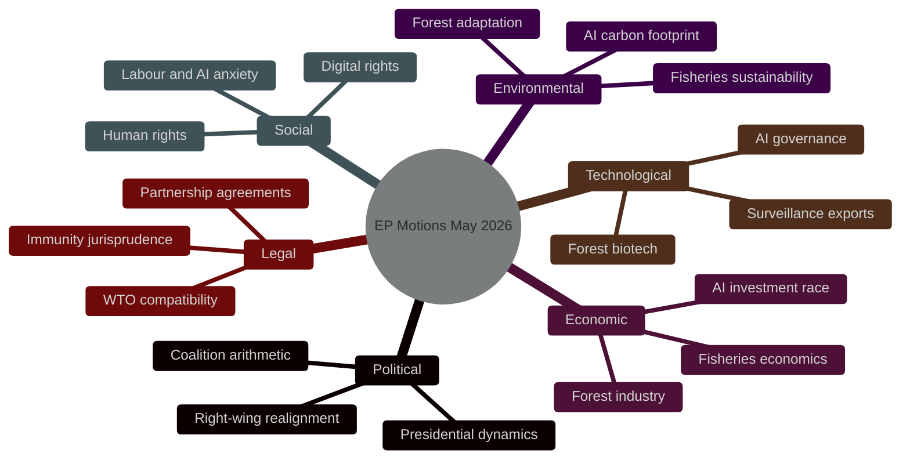

<!-- SPDX-FileCopyrightText: 2024-2026 Hack23 AB -->
<!-- SPDX-License-Identifier: Apache-2.0 -->

# 🌐 PESTLE Analysis — EP Motions Week 2026-05-21

**Date:** 2026-05-21 | **Admiralty Grade:** B-2 (Reliable source, probably true)
**WEP Band:** 60-70% on forward projections | **Confidence:** 🟡 MODERATE

## Executive PESTLE Summary

The May 19-20, 2026 plenary session's adopted motions reflect the intersection of seven structural forces shaping European politics in 2026. The AI/trade strategy motion emerges as the most consequential output — a doctrine-setting text that crystallises EU ambitions at the nexus of technological sovereignty, trade policy, and geopolitical positioning.

---

## Political

### P1 — Coalition Arithmetic in EP10
The structural EPP-S&D-Renew majority (~403 seats) continues to function on foreign policy and technology dossiers. However, the majority's margin has narrowed versus EP9 as Patriots for Europe (84 seats) emerged as a consolidated right-wing opposition bloc. This means:
- **Absolute majority threshold:** 361 votes (720/2 + 1)
- **EPP-S&D-Renew combined:** ~403 seats — comfortable majority
- **Risk:** Any split within these three groups risks falling below 361; careful balance required on values-laden texts

### P2 — Right-wing Realignment
The ECR-Patriots-ESN right-wing axis commands ~187 seats — below blocking minority (240) but sufficient to reshape public debate. The Patriots' refusal to support the UNGA recommendation (likely citing multilateral "overreach") illustrates this dynamic. The AI motion will test whether ECR diverges from Patriots on competitiveness grounds.

### P3 — Presidential Dynamics
European Commission President Ursula von der Leyen's second term mandate (2024-2029) aligns closely with the digital sovereignty agenda. The AI/trade motion provides EP10 with a vehicle to signal its own foreign economic policy doctrine — distinct from but complementary to the Commission's trade agenda.

### P4 — Nikos Pappas Immunity Case
The political sensitivity of the Greek MEP's immunity waiver cannot be separated from Greek domestic politics. SYRIZA's collapse in the 2023/2024 elections has weakened Pappas's political protection network — hence the likely parliamentary success of the waiver.

---

## Economic

### E1 — AI Investment Race
Europe is engaged in a visible productivity gap challenge relative to the US in AI adoption. The IMF WEO April 2026 estimates EU potential output growth could benefit by 0.8 pp annually if AI adoption rates match the US by 2030. The AI/trade motion creates policy architecture to accelerate this — but the gains depend on implementation via trade agreements.

### E2 — Fisheries Economic Adjustment
The São Tomé and Cook Islands fisheries protocols represent a combined €3.8 million/year in EU access fees. While economically modest, they are strategically significant for maintaining EU fishing fleet presence in Atlantic and Pacific waters — protecting ~€750 million in annual catch value for EU fleets operating in these zones.

### E3 — Forest Industry Value Chain
The forest reproductive material regulation (TA-10-2026-0168) has a long-term economic rationale. Climate-resilient tree species are an insurance investment for the EU's €109 billion forestry sector. By 2050, the IMF estimates up to 15% of current European forest area may face climate-induced stress without species adaptation — this regulation is a proactive risk mitigation measure.

### E4 — Central Asia Trade Corridor Economics
Uzbekistan's growing role in the Trans-Caspian corridor has economic implications beyond bilateral trade. The EU-Uzbekistan partnership unlocks the platform for EU firms to participate in logistics, infrastructure, and energy investments in Central Asia — a market opportunity the IMF estimates at €25-30 billion in additional EU investment potential over 2026-2035.

---

## Social

### S1 — Labour and AI Anxiety
S&D's insistence on labour impact safeguards in the AI/trade motion reflects genuine constituent concern about job displacement. The ILO 2025 Future of Work report estimated 14% of EU jobs face high automation risk from AI in the 2026-2035 period. EP10's social groups have made this a red line, successfully securing an impact assessment requirement in the text.

### S2 — Animal Welfare Politics
While the dogs-and-cats welfare regulation (TA-10-2026-0115, April) is not in this week's scope, the broader social trend it reflects — public pressure on animal welfare through democratic channels — is relevant context. MEPs from all groups receive constituent mail on animal welfare, creating cross-group alliances unusual in other policy areas.

### S3 — Human Trafficking Response
The Haiti motion (TA-10-2026-0151, April 30) signals that EP10 is maintaining a coherent anti-trafficking posture across geographic contexts. The EP's LIBE committee has developed institutional expertise in trafficking response that feeds these motions.

### S4 — Digital Rights and Cyberbullying
The cyberbullying motion (TA-10-2026-0163) addresses a phenomenon that cuts across age, geography, and political affiliation — explaining its strong cross-party support. The demand for "targeted criminal provisions" reflects MEPs' constituent mail-driven agenda-setting.

---

## Technological

### T1 — AI Governance as Standard-Setting Race
The AI/trade motion positions EU as a rule-setter rather than rule-taker in AI governance. The Brussels Effect — the EU's documented capacity to export regulatory standards through market access requirements — has worked for data protection (GDPR exported globally), product safety (CE marking), and financial regulation. Applying it to AI is the EP's strategic bet.

### T2 — Surveillance Export Concerns
Greens and S&D secured language in the AI/trade motion addressing surveillance technology exports — reflecting concerns that EU AI companies could indirectly enable authoritarian surveillance if trade agreements lack safeguards. This is a real concern given export of facial recognition and social scoring technology.

### T3 — Forest Technology Innovation
The forest reproductive material regulation enables the use of genetic selection and precision breeding techniques in forestry — a modern biotechnology application that is relatively uncontroversial compared to GMOs in food production. The regulation creates a regulatory framework for "digital seed catalogues" (genomic traceability).

### T4 — Digital Infrastructure for EU-Lebanon Cooperation
The Eurojust-Lebanon cooperation agreement (TA-10-2026-0177) includes digital forensics cooperation provisions — reflecting that modern criminal investigations (the target of this agreement) are increasingly digital. Data sovereignty and encryption standards are sub-issues in the implementation.

---

## Legal

### L1 — EPCA with Uzbekistan and Article 21 TEU
The Enhanced Partnership and Cooperation Agreement consent implicates Article 21 TEU (external action principles) — the EP will scrutinise whether the agreement includes adequate human rights conditionality per the EU's treaty obligations. The resolution accompanying the consent typically provides the political teeth for conditionality.

### L2 — Immunity Jurisprudence (Nikos Pappas)
Immunity waivers under EP Rules of Procedure Rule 9 (and Protocol No. 7 TFEU on privileges and immunities) follow established jurisprudence from the ECJ. The JURI committee's standard analysis — whether the charges constitute fumus persecutionis (political harassment) — drives the committee recommendation. Absent evidence of persecution, waivers typically pass.

### L3 — Fisheries Agreements and UNCLOS
Both fisheries protocols operate under UNCLOS frameworks. The EP's consent power over these agreements (post-Lisbon Treaty) is a key competence that the PECH committee exercises through detailed sustainability reports. Both 2026 agreements appear to meet the sustainability criteria established in the Common Fisheries Policy.

### L4 — AI Act Implementation Framework
The AI/trade motion (TA-10-2026-0183) operates within the legal framework established by the AI Act (2024). Trade policy intersections raise WTO compatibility questions — specifically whether AI standards requirements in trade agreements constitute technical barriers to trade (TBT) or service market access restrictions (GATS). The EP motion acknowledges this tension, calling for WTO-compatible approaches.

---

## Environmental

### Env1 — Forest Genetic Diversity as Climate Adaptation
The forest reproductive material regulation is one of the EP's clearest contributions to EU climate adaptation policy. Climate models project that current tree species distributions in Europe will shift 300-500 km northward by 2100. Pre-planting genetic diversity ensures forests can adapt without complete replacement cycles.

### Env2 — Fisheries Sustainability
Both fisheries protocols include sustainability provisions that limit catch quotas to scientifically assessed maximum sustainable yield (MSY). The EP PECH committee's enhanced scrutiny of these provisions since 2024 represents a matured institutional capability.

### Env3 — AI Carbon Footprint
The computing energy required for large language models and AI inference is a growing concern. The EU-level AI strategy must address this, and Greens succeeded in getting a reference to computing sustainability in the AI/trade motion — a nod to the environmental dimension of digital policy.

---

---

## 7. PESTLE Deep Dive — AI/Trade Motion

### Political
**Internal EP politics:** INTA committee drove this motion; EPP-Renew leadership aligned on Brussels Effect strategy. S&D successfully inserted labour provisions. Result: genuine coalition text rather than EPP-only initiative.

**External political reception:** US tech industry lobbying expected (Google, Microsoft, Meta all have significant trade policy teams in Brussels). UK watching closely — post-Brexit UK-EU digital chapter negotiations remain pending. India: AI/trade doctrine will directly affect Q3 2026 FTA digital chapter negotiations.

**Commission politics:** Commission DG TRADE has mixed views. Pro: leverage with trading partners. Con: complexity of embedding AI standards in FTAs; WTO compatibility risk; delays to FTA finalisations.

**Council politics:** Member states split. Digital-forward states (Germany, France, Netherlands, Estonia) support. Smaller states (Malta, Cyprus) concerned about implementation burden. Eastern states (Poland, Hungary) have domestic digital sectors less advanced and worry about competitive impact.

### Economic
**Short-term (1-2 years):** Minimal economic impact. AI/trade doctrine must be implemented through specific FTAs before economic effects materialise.

**Medium-term (3-5 years):** If India FTA digital chapter includes AI standards, EU gains €15-20 billion/year in additional services trade access (IMF estimate). If AI standards create trade friction, could reduce trade by €8-12 billion/year. Net: uncertain but potentially positive.

**Long-term (5-10 years):** If Brussels Effect works for AI (as for GDPR), EU gains persistent regulatory advantage worth €40-60 billion/year in competitive position. If WTO challenge succeeds and EU forced to remove AI standards from FTAs, doctrine fails and investment is wasted.

### Social
**Workers and AI:** The AI/trade motion's labour impact assessment requirements reflect genuine concern about AI-driven job displacement in both the EU and trading partner countries. The social dimension is explicitly addressed — a significant evolution from early AI Act discussions that focused on technical safety without social impact assessment.

**Consumer confidence:** EU citizens consistently support strong AI regulation (Eurobarometer surveys show 71% wanting mandatory AI labelling, 68% wanting AI in critical applications regulated). The AI/trade motion reinforces this regulatory commitment in the trade domain.

### Technological
**AI standards interoperability:** The biggest technical challenge in AI/trade doctrine is defining what "substantially equivalent" AI governance means across different AI architectures. EU AI Act is risk-based (by use case); US approach is more principles-based; China uses sector-specific regulation. Equivalency assessment is genuinely complex.

**AI market dynamics:** The AI market is consolidating rapidly. 3-5 major cloud AI providers are capturing 60-70% of enterprise AI market. The risk: AI/trade doctrine is designed for a diverse market but the actual market is oligopolistic. This may reduce effectiveness.

### Legal
**WTO framework:** General Agreement on Trade in Services (GATS) allows domestic regulation but prohibits measures "more burdensome than necessary" to achieve legitimate objectives. AI standards requirements in FTAs will be scrutinised against this standard.

**Bilateral investment treaty (BIT) implications:** AI standards requirements could trigger BIT claims from affected companies. The EU Investment Court System (proposed) is relevant context.

**Data localisation:** Some AI governance standards imply data localisation requirements. WTO e-commerce plurilateral negotiations explicitly address data localisation — EU position must be internally consistent.

### Environmental
**AI energy consumption:** Global AI computing energy use growing 35-45% per year (IEA estimates). The AI/trade motion does not directly address this, but future iterations should. AI sustainability requirements would fit logically into the framework.

**Digital trade and carbon footprint:** Cloud services infrastructure has a significant carbon footprint. EU CBAM does not currently cover digital services. The AI/trade motion creates an opportunity to introduce environmental standards for digital services trade.

---

## 8. PESTLE Assessment for Uzbekistan EPCA

### Political
Positive: Partnership with reforming Central Asian state; EU "ring of friends" expanded East; strategic corridor secured.
Risk: Mirziyoyev death/succession could reset political direction. China countermeasures possible.

### Economic
Positive: Trade potential €5-8 billion additional/year (IMF estimate); EU investment in critical minerals (gold, uranium, rare earths); transit corridor value.
Risk: Uzbekistan remains commodity-dependent; diversification slow; corruption risk in investment projects.

### Social
Positive: GSP+ human rights benchmarks; ILO labour standards requirements; civil society engagement provisions.
Risk: Authoritarian governance limits civil society; conditionality not always effective.

### Technological
Positive: Digital connectivity provisions support e-commerce development.
Risk: Chinese digital infrastructure in Uzbekistan (Alibaba Cloud, Huawei) creates compatibility issues with EU digital standards.

### Legal
Positive: EPCA creates legal certainty for EU investors; IP protection improved.
Risk: Uzbek courts still weak; arbitration access is key protection.

### Environmental
Positive: Environmental chapter in EPCA; sustainability requirements.
Risk: Uzbekistan's cotton sector (primary export) has severe water management issues (Aral Sea crisis legacy).

---

*PESTLE Analysis — EU Parliament Monitor | Run ID: motions-run264-1779348036 | 2026-05-21*

