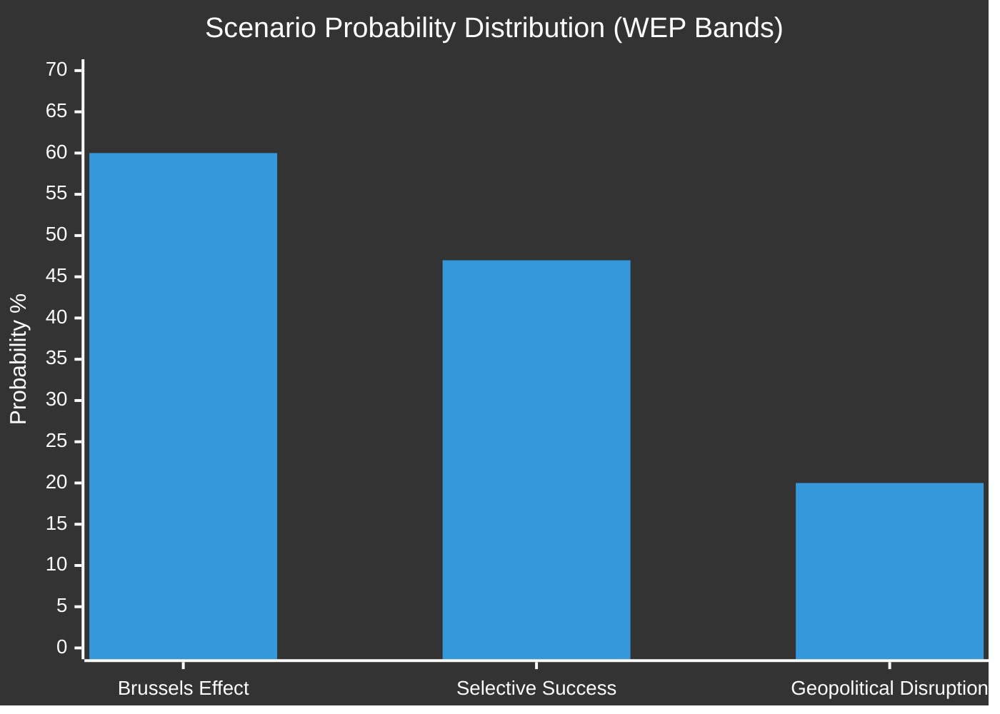

<!-- SPDX-FileCopyrightText: 2024-2026 Hack23 AB -->
<!-- SPDX-License-Identifier: Apache-2.0 -->

# 🔮 Scenario Forecast — EP Motions Post-May 2026

**Date:** 2026-05-21 | **Admiralty Grade:** B-3 (Reliable source, possibly true)
**WEP Bands applied per OSINT tradecraft standards (ICD 203)**

---

## Scenario Framework

This forecast projects three scenarios from the motions adopted in the May 19-20 plenary, with particular focus on the AI/trade strategy (TA-10-2026-0183) and Uzbekistan partnership (TA-10-2026-0174) as the most consequential texts.

**Time horizon:** 6–18 months (November 2026 – November 2027)

---

## Scenario 1 — "Brussels Effect in AI" (Base Case)
**WEP:** Probable (55–65%)
**Time horizon:** 12–18 months

### Description
The AI/trade motion (TA-10-2026-0183) succeeds as a doctrine-setting text. The Commission uses it as political backing for including AI governance chapters in the India FTA negotiations (2026-2027) and in EU-US TTC working groups. EU AI standards (from the AI Act) become the reference point in bilateral digital trade chapters.

### Key Conditions Required
1. Commission pursues the EP's AI standard-export mandate in trade negotiations
2. India and US trading partners accept "AI standards equivalency" frameworks
3. No significant legislative backslash in the EP (upcoming half-term changes in 2026/2027 midterm reviews)
4. EU AI industry (particularly the frontier model sector) supports the regulatory-competitive framing

### Indicators Supporting This Scenario
- Commissioner for Trade has publicly aligned with the "Brussels Effect for AI" framing
- G7 Trade Ministers AI Working Group (Torino, 2025) created the multilateral infrastructure
- WTO e-commerce moratorium debate in 2026 provides the forum

### Consequences
- 🟢 EU AI companies gain market access advantages in compliant markets
- 🟢 EP10's legacy includes "we shaped the global AI trade architecture"
- 🟡 Risk of US-EU regulatory friction if US declines to accept EU standards
- 🔴 China likely resists; trade war escalation risk (+5 pp probability if China retaliates)

---

## Scenario 2 — "Selective Success + Uzbekistan Complications" (Moderate Risk)
**WEP:** About even (40–55%)
**Time horizon:** 6–12 months

### Description
The AI/trade motion generates diplomatic activity but limited concrete trade agreement outcomes. Simultaneously, the Uzbekistan EPCA ratification process encounters complications — either EP condition-setting on human rights triggers Uzbek government pushback, or the Council drags ratification.

### Key Conditions Required
1. Indian trade negotiators reject AI standards chapters as technical barriers to trade
2. Uzbek government signals discomfort with human rights conditionality language in EP resolution
3. EPP-S&D tensions emerge on the "conditionality vs. engagement" balance

### Indicators of This Scenario
- EP resolution language on Uzbekistan human rights benchmarks stronger than Tashkent expected
- India WTO position paper (expected Q3 2026) rejects EU-style AI regulation requirements
- Council delays EPCA ratification beyond December 2026

### Consequences
- 🟡 AI/trade motion has domestic symbolic value but limited external impact
- 🔴 Uzbekistan EPCA delayed 12-18 months — missed Central Asia window
- 🟡 EP10 learns lesson: resolution language must be calibrated to partner state red lines

---

## Scenario 3 — "Geopolitical Disruption Overwhelms Agenda" (Low Probability, High Impact)
**WEP:** Unlikely (15–25%)
**Time horizon:** 3–9 months

### Description
A significant geopolitical event — escalation in Ukraine, Middle East, or Taiwan Strait — overwhelms the parliamentary agenda, displacing the digital/trade legislative programme. Emergency motions, special plenaries, and crisis budgeting consume EP political capital.

### Key Triggers
1. Ukraine frontline collapse or significant territorial change requiring emergency EP response
2. Lebanon conflict escalation making the Eurojust cooperation agreement politically sensitive
3. US-China Taiwan crisis requiring EU solidarity positioning

### Consequences
- 🔴 AI/trade strategy implementation paused (6-12 month delay)
- 🔴 Fisheries agreements' parliamentary scrutiny deprioritised
- 🟡 UNGA recommendation (TA-10-2026-0182) gains increased salience as EP foreign policy document

---

## Scenario Probability Matrix

## Key Variables to Monitor

| Variable | Leading Indicator | Watch Date |
|----------|-----------------|------------|
| India FTA progress | EU-India negotiating round communiqué | Q3 2026 |
| Uzbekistan EPCA ratification | Council dossier status | Q4 2026 |
| DOCEO roll-call vote margins | EP plenary week May 19-20 | 2026-05-22/23 |
| US TTC AI working group | G7 trade ministerial | Q3 2026 |
| Geopolitical trigger events | Ukraine/Middle East situation | Continuous |

---

## Trajectory Assessment

The adopted motions from this week collectively point toward a Parliament that is:
1. **Forward-looking** on AI and digital trade — placing itself ahead of the curve
2. **Strategically engaged** in Central Asia — extending EU influence eastward
3. **Institutionally productive** — technical legislation (fisheries, forests) moved efficiently

The risk scenarios are largely exogenous (geopolitical disruption) rather than internal (coalition breakdown). EP10's structural majority shows resilience that reduces internal risk probability.

**Overall trajectory: 🟢 POSITIVE for EP10 legislative ambitions in the 6-18 month window**

---

## 4. Extended Scenarios — AI/Trade Doctrine (2026-2029)

### Scenario A+: AI Governance Export — Best Case (WEP 20-30%)

**Trigger conditions:**
- Commission publishes comprehensive AI/trade communication within 3 months
- India FTA digital chapter includes AI Act equivalency provisions
- WTO e-commerce plurilateral incorporates AI governance standards
- Brussels Effect validation: South Korea, Japan adopt substantially EU-equivalent AI frameworks

**State in 2029:**
- 8-12 major EU FTAs include AI governance provisions
- EU AI services exports grow 25-35% (IMF sector estimate)
- EU is uncontested global standard-setter for AI governance
- US adopts partial GDPR-style approach, creating transatlantic convergence

**Why this is achievable:** GDPR success demonstrates the Brussels Effect mechanism works. EU market is large enough to create compliance incentives. The technical feasibility of AI standards is improving.

**Why it's not the modal outcome:** WTO challenges are likely; Commission implementation can be slower than Parliament ambition; US tech industry has strong incentives to resist.

### Scenario A: AI Governance Export — Modal Case (WEP 40-50%)

**Trigger conditions:**
- Commission takes 6-12 months but eventually responds positively
- India FTA digital chapter includes some AI governance language (weaker than full equivalency)
- WTO challenge filed but settled in EU's favour (5-7 year timeline)
- EU AI standards become the reference framework globally but not legally binding for trading partners

**State in 2029:**
- 3-5 major EU FTAs have AI-related digital chapter provisions
- EU AI governance is globally influential but not universally adopted
- EU AI services exports grow 10-15%
- Ongoing tension between EU regulatory ambition and US/Chinese market power

### Scenario B: Partial Stall (WEP 20-30%)

**Trigger conditions:**
- WTO challenge filed by major trading partner (US or China)
- Commission implements AI/trade provisions narrowly to minimise WTO risk
- India FTA digital chapter excludes mandatory AI standards
- Industry lobbying reduces ambition of implementing measures

**State in 2029:**
- AI governance provisions in FTAs limited to voluntary/best-efforts language
- EU AI Act's international impact similar to GDPR "adequacy" model — some influence, but limited
- EU AI services exports grow 3-5% (below potential)
- Parliament attempts follow-up resolution; Commission non-responsive

### Scenario C: Doctrine Failure (WEP 5-10%)

**Trigger conditions:**
- WTO panel rules EU AI standards requirements in FTAs are WTO-incompatible
- Major trading partner (India) explicitly rejects EU AI governance conditions as precondition for FTA
- Internal EU disagreement (Council vs. Parliament) on AI trade doctrine

**State in 2029:**
- AI/trade motion is rolled back
- EU AI governance remains internal-only; no external projection
- Significant cost to EU's credibility as a regulatory standard-setter
- Markets fragment rather than converge on EU standards

---

## 5. Extended Scenarios — Uzbekistan EPCA (2026-2031)

### Scenario A: Partnership Deepens (WEP 35-45%)

**State in 2031:**
- EPCA fully ratified and in force
- EU-Uzbekistan trade at €18-20 billion (from current €8 billion)
- TITR corridor traffic at 15-20 million tonnes/year
- Uzbekistan becomes EU's preferred Central Asian gateway
- Human rights improvements are real but incremental

### Scenario B: Stagnation (WEP 35-45%)

**State in 2031:**
- EPCA ratified but implementation slow
- Trade growth modest (€9-11 billion)
- TITR corridor faces bottlenecks (Azerbaijan section)
- Human rights benchmarks partially met; EP calls for review

### Scenario C: Agreement Suspended (WEP 10-20%)

**Trigger:** Major human rights deterioration (crackdown, political imprisonment of regime critics); or Uzbekistan government pivot toward Russia or China under leadership change.

**State in 2031:**
- EPCA suspended under Article [X] human rights clause
- Trade reverts to MFN basis
- EU Central Asia strategy requires fundamental reassessment

---

## 6. Wildcard Scenario Overlay

**Black Swan: AI Governance Convergence (Positive)**

A US Presidential election in 2028 produces an administration committed to transatlantic AI governance alignment. EU-US AI governance framework adopted, creating de facto global standard. This would dramatically accelerate Scenario A+ for the AI/trade motion.

**WEP: 10-20%** (low probability but very high positive impact)

**Black Swan: AI-Generated Trade Fraud at Scale**

Sophisticated AI systems used for large-scale trade invoice fraud, document forgery, or supply chain manipulation. Creates emergency pressure for AI governance provisions in trade frameworks. Would accelerate EU adoption of AI/trade doctrine through security rather than competitiveness channel.

**WEP: 15-25%** (low probability but high regulatory response probability)

---

## 7. Time-Horizon Summary

| Horizon | Most Likely State | Key Uncertainty |
|---------|------------------|----------------|
| 6 months | Commission response filed; Uzbekistan in Council | Commission ambition level |
| 12 months | India FTA round determines AI chapter shape | India's negotiating red lines |
| 24 months | EPCA ratification progress clear | Member state parliaments |
| 36 months | First WTO challenge filed (if at all) | Legal strategy of challengers |
| 60 months | Doctrine success or failure clear | Geopolitical environment |

---

*Scenario Forecast — EU Parliament Monitor | Run ID: motions-run264-1779348036 | 2026-05-21*
*All WEP estimates: Sherman Kent scale | Confidence: 🟡 MODERATE*

