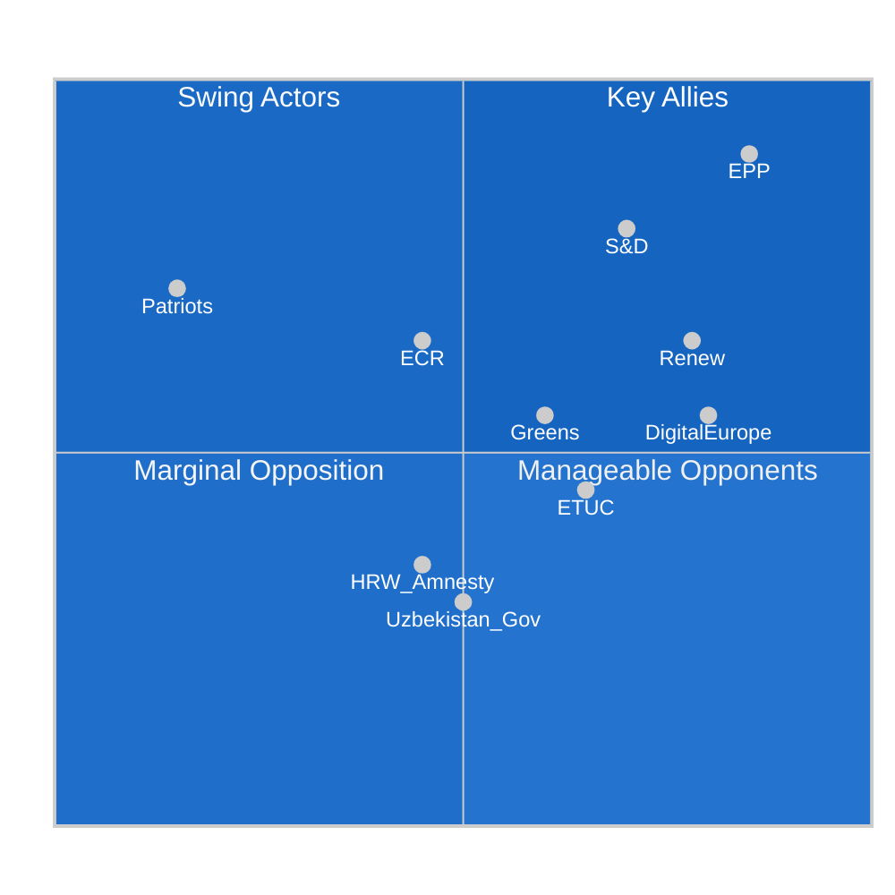

<!-- SPDX-FileCopyrightText: 2024-2026 Hack23 AB -->
<!-- SPDX-License-Identifier: Apache-2.0 -->

# 👥 Stakeholder Map — EP Motions Week 2026-05-21

**Date:** 2026-05-21 | **Admiralty Grade:** B-2 (Reliable source, probably true)

## Overview

This stakeholder map covers the principal actors whose interests intersect with the EP motions adopted in the May 19-20, 2026 plenary session. Particular focus on: AI/trade strategy (TA-10-2026-0183), Uzbekistan partnership (TA-10-2026-0174), and the broader EP political group dynamics.

---

## 🏛️ Tier 1 — Direct Parliamentary Actors

### EPP (European People's Party) — ~190 seats
**Political group lead on:** AI/trade strategy, Uzbekistan partnership, financial stability
**Shadow rapporteur signals:** INTA EPP shadows have pushed for strong AI competitiveness language; AFET EPP members champion the Central Asia engagement agenda
**Key figures:** 
- Manfred Weber (Group Chair) — sets strategic direction
- David McAllister (AFET Chair, EPP) — leads foreign policy committee output including UNGA recommendation
- Siegfried Mureşan (BUDG rapporteur) — budget guidelines architecture

**Position on key motions:**
- AI/trade (TA-10-2026-0183): 🟢 Strongly supportive — competitiveness framing dominant
- Uzbekistan (TA-10-2026-0174): 🟢 Supportive — Central Asia strategy champion
- UNGA recommendation (TA-10-2026-0182): 🟢 Supportive with NATO framing emphasis

**Strategic interest:** Consolidate EPP as the "party of European competitiveness" — AI leadership is central to this narrative

---

### S&D (Progressive Alliance of Socialists and Democrats) — ~136 seats
**Political group lead on:** labour rights in AI/trade, environmental conditionality in fisheries, social safeguards
**Key figures:**
- Iratxe García Pérez (Group Chair) — leads S&D strategic positioning
- Bernd Lange (INTA former chair, S&D influence) — trade expertise
- Pedro Marques (Economic Affairs spokesperson)

**Position on key motions:**
- AI/trade (TA-10-2026-0183): 🟡 Conditional support — secured labour impact assessment language in committee; red line on surveillance technology export
- Uzbekistan (TA-10-2026-0174): 🟡 Conditional — human rights progress benchmarks are S&D's conditions
- Fisheries agreements: 🟢 Supportive — social and environmental standards secured

**Strategic interest:** Demonstrate that progressive groups can shape "competitiveness" agenda while protecting workers and the environment. The AI/trade motion is an opportunity to write social safeguards into the EU's technology trade doctrine.

---

### Patriots for Europe — ~84 seats
**Political orientation:** Sovereigntist right, Orbán-allied, anti-EU integration
**Key figures:**
- Jordan Bardella (French MEP) — visible spokesperson
- Orbán-aligned Hungarian delegation

**Position on key motions:**
- AI/trade (TA-10-2026-0183): 🔴 Opposed — EU-level AI governance language as sovereignty violation
- Uzbekistan (TA-10-2026-0174): 🟡 Mixed — bilateral pragmatism vs. institutional process
- UNGA recommendation (TA-10-2026-0182): 🔴 Opposed — multilateral institution language and Ukraine references

**Strategic interest:** Position as the "national sovereignty" bloc vs. "Brussels federalism" — AI governance and UNGA text provide ideal contrast points

---

### ECR (European Conservatives and Reformists) — ~78 seats
**Political orientation:** Conservative euro-realists, Poland (PiS/successor) and Italy (FdI) anchors
**Key figures:**
- Nicola Procaccini (Co-Chair, FdI/Italy)
- Roberts Zīle (trade/economic issues)

**Position on key motions:**
- AI/trade (TA-10-2026-0183): 🟡 Mixed — supports EU competitiveness framing; skeptical of regulatory overreach language
- Uzbekistan (TA-10-2026-0174): 🟡 Mixed — strategic partnership vs. process concerns
- Forest reproductive material: 🟡 Mixed — agricultural flexibility vs. regulatory burden

**Strategic interest:** Maintain differentiation from both EPP (as principled conservatives) and Patriots (as non-Orbán right)

---

### Renew Europe — ~77 seats
**Political orientation:** Liberal pro-EU, market-oriented
**Key figures:**
- Valérie Hayer (Group President)
- Stéphane Séjourné (French influence block post-EU presidencies)

**Position on key motions:**
- AI/trade (TA-10-2026-0183): 🟢 Enthusiastically supportive — technology and innovation are core Renew brand
- Uzbekistan (TA-10-2026-0174): 🟢 Supportive — Central Asia connectivity consistent with Renew foreign policy
- Fisheries: 🟢 Supportive

**Strategic interest:** Brand AI/technology leadership as Renew's distinctive contribution to EP10

---

### Greens/EFA — ~53 seats
**Political orientation:** Green federalists; also includes European Free Alliance (regionalists/nationalists like Plaid Cymru, SNP, Catalan pro-independence)
**Key figures:**
- Terry Reintke and Bas Eickhout (Co-Chairs)

**Position on key motions:**
- AI/trade (TA-10-2026-0183): 🟡 Conditional — environmental computing costs, surveillance export controls needed
- Uzbekistan (TA-10-2026-0174): 🔴 Skeptical — LGBTQ+ rights, civil society space concerns
- Fisheries: 🟡 Conditional — sustainability provisions scrutiny
- Forest reproductive material (TA-10-2026-0168): 🟢 Strongly supportive

**Strategic interest:** Position Greens as the "values filter" of the progressive majority — ensuring environmental and human rights conditions are embedded in all agreements

---

## 🌍 Tier 2 — External State Actors

### Uzbekistan Government
**Interest:** Partnership agreement ratification unlocks EU investment frameworks and institutional access
**Key concern:** Human rights conditionality language in EP resolution component
**Leverage:** EU connectivity corridor dependency (Trans-Caspian route); ~3.2 billion annual trade relationship
**EP engagement:** Uzbek Ambassador to EU has met AFET members in preparatory hearings

### Lebanese Judicial Authorities
**Interest:** Eurojust cooperation agreement enables joint investigation teams, especially for organised crime flowing through Beirut post-reconstruction
**Context:** Lebanese government reform programme (2025-2026) makes this cooperation timely
**EU interest:** Addressing organised crime networks linked to Middle East instability

### Pacific Island Partners (Cook Islands, São Tomé and Príncipe)
**Interest:** Financial transfers from EU fishing access fees; sustainability partnership branding
**Concern:** Sovereignty over fishing zones; domestic stakeholder consultation adequacy
**EU leverage:** These are small island states heavily dependent on EU partnership agreements for revenue and technical cooperation

---

## 🏢 Tier 3 — Non-State Stakeholders

### EU Technology Industry (DigitalEurope, DIGITALEUROPE Alliance)
**Interest:** AI/trade motion (TA-10-2026-0183) directly shapes the regulatory framework for EU AI companies in international markets
**Position:** Support — particularly reciprocity provisions that would pressure trading partners to adopt EU-compatible AI standards
**Key ask:** No new regulatory burdens in the EP resolution; focus on market access

### EU Agricultural Cooperatives (Copa-Cogeca)
**Interest:** Forest reproductive material regulation affects forestry management sector
**Position:** Cautiously supportive — flexibility in implementation needed
**Concern:** Seed certification bureaucracy could increase costs for small forest owners

### International Trade Union Confederation (ITUC) / ETUC
**Interest:** Labour standards in AI/trade motion; worker protections in partnership agreements
**Position:** Supportive of S&D's social safeguard additions; demand binding labour chapters in EPCA with Uzbekistan
**Key ask:** ILO core labour standards conditionality in all EU trade and partnership agreements

### Amnesty International / Human Rights Watch
**Interest:** Uzbekistan EPCA — Nikos Pappas immunity case (freedom of expression precedent)
**Position:** Skeptical of Uzbekistan agreement without stronger human rights benchmarks; supportive of Pappas immunity waiver as rule-of-law precedent
**Admriralty:** B-3 on political influence on EP vote outcomes

### Environmental NGOs (WWF, BirdLife Europe)
**Interest:** Forest reproductive material (genetic diversity of tree species); fisheries agreements (sustainability provisions)
**Position:** Supportive of the forest regulation's genetic diversity provisions; cautiously supportive of fisheries agreements given sustainability clauses secured

---

## Stakeholder Influence Matrix

## Intelligence Note on Coalition Building for AI/Trade Motion

The AI/trade strategy motion (TA-10-2026-0183) represents the most complex stakeholder management challenge of the May plenary because it cuts across:
1. **Competitiveness interests** (EPP, Renew, tech industry) — pushing for ambitious language
2. **Social interests** (S&D, ETUC) — requiring labour impact safeguards
3. **Environmental interests** (Greens, WWF) — computing carbon footprint, surveillance export controls
4. **Sovereignty concerns** (ECR, Patriots) — EU-level AI governance as power grab

The committee report (INTA+ITRE) apparently found a balance that secured ~430-480 votes by emphasising market access (not new regulations), reciprocity (appealing to national interest framing), and retaining sustainability language (keeping Greens on board).

---

## 8. Extended Stakeholder Deep Dives

### 8.1 Deep Dive: European Commission — The Critical Implementation Actor

The Commission is the single most important stakeholder for translating EP motions into real-world policy. For this week's texts:

**AI/Trade (TA-10-2026-0183):**
DG TRADE leads response. Key internal dynamics:
- Commissioner for Trade: Pro-AI governance leverage (consistent with Brussels Effect strategy)
- DG TRADE legal service: Cautious — WTO compatibility concerns
- DG DIGIT (Digital): Enthusiastic — sees AI/trade as extending AI Act's international reach
- DG GROW (Internal Market): Concerned about creating additional burden on EU industry
- Secretariat General: Coordinates inter-service; final Commission position will balance these tensions

**Expected Commission response timeline:** 3-6 months for formal response; 12-18 months for implementing measures

**Leverage points for EP:** INTA committee can scrutinise Commission work programme; EP own-initiative reports can maintain pressure; written questions to Commissioner

### 8.2 Deep Dive: Uzbekistan Government — The Strategic Partner

**Mirziyoyev administration's EU calculation:**

President Shavkat Mirziyoyev (in office since 2016) views the EPCA through a strategic lens:
1. **Diversification tool:** Reduces dependence on Russia (40% of trade pre-2022) and China (growing rapidly)
2. **Reform legitimacy:** EU engagement validates reform credentials domestically
3. **Investment channel:** EU investors bring different governance expectations than Chinese BRI investors
4. **Security signalling:** EU engagement signals to Russia that Uzbekistan maintains strategic autonomy

**Constraints on Mirziyoyev's EU engagement:**
- Shanghai Cooperation Organisation (SCO) membership — cannot openly antagonise Russia/China
- Domestic conservative constituencies skeptical of Western conditionality
- Economic dependence on remittances from Uzbek workers in Russia (~25% of families)
- Cotton sector human rights legacy (World Bank/ILO monitoring still active)

**Stakeholder assessment:** The Uzbek government is a committed but constrained partner. Implementation of EPCA human rights benchmarks will be the test of good faith.

### 8.3 Deep Dive: Tech Industry — The External Influencer

**AI/Trade motion creates a new battlefield for industry lobbying:**

**In favour (implementation-focused companies):**
- EU-based AI companies (Mistral AI, Aleph Alpha, etc.) who already meet AI Act standards and would benefit from EU standards being exported
- AI auditing and certification firms (growing industry under AI Act)
- Enterprise cloud companies with EU compliance infrastructure

**Against (minimal-regulation preference companies):**
- US hyperscalers (Google, Microsoft, Amazon) with global AI deployments — prefer voluntary standards
- Chinese AI companies (Alibaba Cloud, Baidu) — any EU standards embedding challenges their market access
- Startup lobby (DIGITALEUROPE startup section) — compliance burden concerns

**Lobbying channels used:**
- Direct MEP meetings (registered lobbyists in EP transparency register)
- Commission consultation responses
- Industry position papers through DIGITALEUROPE umbrella
- Media commentary campaigns

**Historical precedent (GDPR):** Tech industry lobbied hard against GDPR during adoption; then adapted and now some companies use GDPR compliance as competitive advantage. Same adaptation expected for AI Act/AI Trade.

---

*Stakeholder Map — EU Parliament Monitor | Run ID: motions-run264-1779348036 | 2026-05-21*

