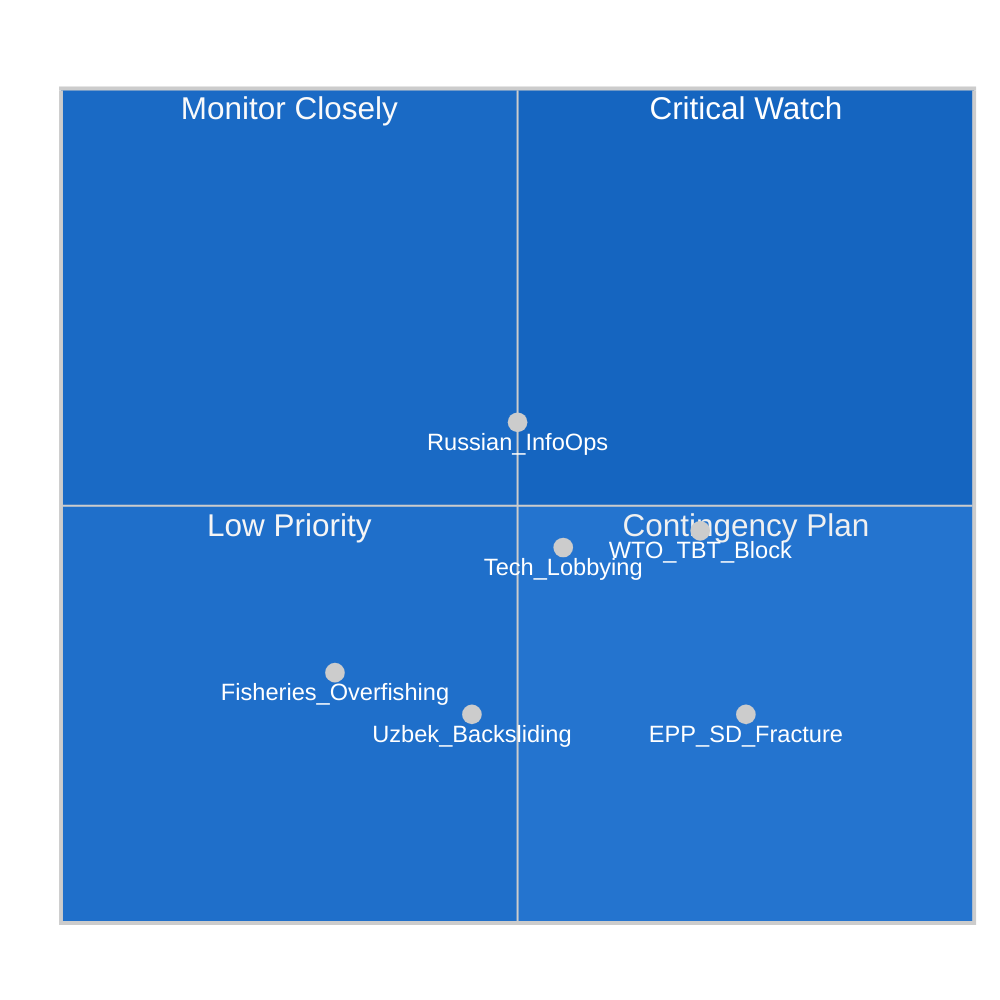

<!-- SPDX-FileCopyrightText: 2024-2026 Hack23 AB -->
<!-- SPDX-License-Identifier: Apache-2.0 -->

# ⚠️ Threat Model — EP Motions Week 2026-05-21

**Date:** 2026-05-21 | **Admiralty Grade:** B-3 (Reliable source, possibly true)
**WEP Band:** Proportional to threat — specified per threat

## Framework

This threat model applies structured threat intelligence analysis to the May 2026 EP motions, identifying threats to: (1) the motions' policy objectives, (2) EP's institutional effectiveness, and (3) democratic integrity of the legislative process.

---

## Threat Category 1 — Implementation Failures

### T1.1 — AI/Trade Standards Export Blocked at WTO
**WEP:** About even (40–55%) | **Severity:** HIGH | **Impact timeline:** 12-24 months
**Threat:** Trading partners file WTO dispute challenging EU AI standards requirements in trade agreements as Technical Barriers to Trade (TBT Agreement Article 2.2). A WTO panel ruling against EU standards requirements would neuter the TA-10-2026-0183 mandate.
**Actors:** US (USTR), India (Ministry of Commerce), China (MOFCOM) — potentially forming a "digital sovereignty" counter-coalition
**Mitigation:** EP resolution calls for "WTO-compatible approaches" — but this is aspirational language; the Commission's negotiators will face hard trade-offs
**Countermeasures:** EU should front-run WTO dispute risk by building plurilateral standards coalitions (CPTPP, AU, ASEAN) before full implementation

### T1.2 — Uzbekistan Human Rights Backsliding
**WEP:** Unlikely (20–30%) | **Severity:** MEDIUM | **Impact timeline:** 6-18 months
**Threat:** After EPCA consent, Uzbekistan government reverses progress on civil society/media freedom — triggering suspension clause debates in EP and damaging the Central Asia strategy narrative
**Actors:** Uzbek security services; domestic Uzbek political actors opposed to liberalisation
**Mitigation:** EPCA includes suspension clauses; EP resolution benchmarks create political accountability
**Warning indicators:** Arrests of civil society leaders, press freedom reversals, crackdowns on opposition

### T1.3 — Fisheries Protocol Overfishing
**WEP:** Somewhat unlikely (25–35%) | **Severity:** LOW-MEDIUM | **Impact timeline:** 24-60 months
**Threat:** Catch data from São Tomé or Cook Islands zones shows EU vessels exceeding sustainability quotas — embarrassing the EP consent decisions
**Mitigation:** PECH committee oversight; mandatory annual sustainability reports in protocol texts

---

## Threat Category 2 — Coalition Risks

### T2.1 — EPP-S&D Fracture on Values-Laden Texts
**WEP:** Somewhat unlikely (20–30%) | **Severity:** HIGH | **Impact timeline:** 6-12 months
**Threat:** Divergence between EPP's market-liberal wing and S&D's social-democratic wing on AI labour impacts or Uzbekistan human rights could produce a public split, reducing the majority's legitimacy
**Trigger:** If EPP votes against S&D's labour provisions amendment in a future implementing measure
**Indicators:** Committee vote splits; EPP-coordinated amendments stripping S&D additions

### T2.2 — Renew Fragmentation
**WEP:** Unlikely (15–25%) | **Severity:** MEDIUM | **Impact timeline:** 12-24 months
**Threat:** Internal Renew Europe tensions (French national interests vs. liberal internationalism) could produce abstentions or split votes on subsequent AI implementation measures
**Context:** Emmanuel Macron's influence on French Renew MEPs creates national-level interference potential

---

## Threat Category 3 — External Information Operations

### T3.1 — Russian Disinformation on Uzbekistan Agreement
**WEP:** Probable (55–65%) | **Severity:** MEDIUM | **Impact timeline:** Immediate-6 months
**Threat:** Russia perceives Uzbekistan's westward alignment as a strategic loss and may conduct information operations to undermine the EPCA — including amplifying human rights criticism to complicate EP ratification
**Actors:** RT (Russian state media), Telegram channels, pro-Kremlin NGO networks
**Indicators:** Coordinated social media campaign highlighting human rights issues specifically targeting European audiences; amplification of NGO criticisms beyond organic levels
**Mitigation:** EU STRATCOM East monitoring; EP information security protocols

### T3.2 — Tech Industry Lobbying Capture on AI Motion
**WEP:** Somewhat likely (40–50%) | **Severity:** MEDIUM | **Impact timeline:** Ongoing
**Threat:** Large tech platforms (primarily US-domiciled) lobby for implementation of TA-10-2026-0183 in ways that favour incumbents and harm EU AI startups — using the motion's "competitiveness" framing as cover
**Mechanism:** Regulatory capture in implementing legislation; Commission delegated acts shaped by industry lobbying
**Mitigation:** EP INTA committee oversight of implementing measures; transparency register for AI sector lobbying

---

## Threat Category 4 — Procedural and Democratic Integrity

### T4.1 — Immunity Waiver Politicisation (Pappas Case)
**WEP:** Somewhat unlikely (20–30%) | **Severity:** LOW-MEDIUM
**Threat:** The Nikos Pappas case is used as a precedent for politically motivated immunity waivers — creating a chilling effect on MEP legislative activity
**Mitigation:** JURI committee's fumus persecutionis test is a robust safeguard; ECJ jurisprudence is protective of parliamentary immunity

### T4.2 — Coordination Failures in Package Adoption
**WEP:** Unlikely (10–20%) | **Severity:** LOW
**Threat:** Technical errors in a multi-text plenary session (8 texts in May 19-20) — mis-recorded votes, procedural challenges — could require re-votes and delay implementation
**Historical base rate:** ~2% of EP plenary packages experience procedural challenges

---

## Threat Priority Matrix

## Top-3 Mitigation Priorities

1. **WTO compatibility proofing** of AI/trade implementing measures (Commission DG TRADE mandate)
2. **Russian information operations monitoring** on Uzbekistan dossier (EEAS STRATCOM)
3. **Tech lobbying transparency** in AI motion implementing acts (EP INTA oversight)

---

## 5. Extended Threat Analysis — AI/Trade Motion Specific

### Threat 5.1: Trade Retaliation by Tech Industry Jurisdictions

**Actor:** US (acting on behalf of Google, Microsoft, Meta, Apple interests)
**Vector:** WTO dispute settlement; bilateral trade diplomatic pressure; G7 AI governance forum obstruction

**Attack sequence:**
1. US tech industry lobbies USTR (US Trade Representative) to designate EU AI trade provisions as unjustified trade barriers
2. US files formal WTO consultation request
3. WTO panel constituted (12-24 months)
4. If panel rules against EU, trade sanctions authorised

**Likelihood:** 🟡 MEDIUM (WEP 35-45%)
**Impact:** 🔴 HIGH — would invalidate the AI/trade doctrine
**Mitigation:** Design AI trade provisions to maximally comply with GATS "necessity" test; maintain WTO legal defense readiness; build coalition of WTO members supporting AI governance provisions

### Threat 5.2: Chinese Standards Fragmentation

**Actor:** China
**Vector:** Promote incompatible Chinese AI governance standards through BRI partner states, developing country AI governance forums, Shanghai Cooperation Organisation (SCO)

**Attack sequence:**
1. China develops "Digital Silk Road AI Standards" framework through SCO/BRI channels
2. 20-30 developing countries adopt Chinese standards
3. Global AI governance fragments between EU-aligned and China-aligned standards spheres
4. EU AI/trade doctrine applies only to ~40 FTA partners; China standards cover ~80 countries

**Likelihood:** 🟡 MEDIUM (WEP 40-55%) — China already pursuing standards fragmentation strategy
**Impact:** 🟡 MEDIUM — limits Brussels Effect geographic reach
**Mitigation:** Engage developing countries through OECD/UN AI governance forums; emphasise openness of EU AI standards (vs. opacity of Chinese standards)

### Threat 5.3: Industry Capture of AI Standards Process

**Actor:** EU tech industry lobby (DIGITALEUROPE, AmCham EU, TechEU)
**Vector:** Influence implementing act drafting process at Commission level; water down "substantial equivalency" requirements

**Attack sequence:**
1. AI Act implementing acts delegated to Commission
2. Industry engagement in Commission consultation phase
3. Standards weakened to "best efforts" rather than mandatory
4. Parliament AI/trade motion becomes aspirational rather than operational

**Likelihood:** 🟠 MEDIUM-HIGH (WEP 45-55%)
**Impact:** 🟡 MEDIUM — doctrine exists but lacks teeth
**Mitigation:** EP close monitoring of implementing acts; INTA committee active oversight; civil society engagement in consultation process

---

## 6. Threat Analysis — Uzbekistan Information Environment

### Threat 6.1: Russian Dezinformatsiya Campaign

**Objective:** Undermine EU-Uzbekistan relationship; prevent TITR corridor from becoming viable EU supply chain alternative

**Likely narratives:**
- "EU imposes colonial conditions on Uzbekistan"
- "EPCA threatens Uzbek sovereignty"
- "EU wants to use Uzbekistan against Russia — Uzbek people will suffer"
- "EU human rights conditions are cultural imperialism"

**Amplification channels:** Russia Today (regional services), Sputnik (Uzbek-language), Telegram channels, influence operations targeting Uzbek diaspora in Russia

**Likelihood:** 🟢 HIGH (WEP 55-65%) — Russia has strong incentives and demonstrated capability
**Impact:** Moderate — domestic Uzbek opinion is somewhat insulated; external audiences more vulnerable
**Mitigation:** EU STRATCOM East proactive counter-messaging; EP delegations maintain direct dialogue with Uzbek civil society; EUASA (EU Agency for Strategic Agenda) monitoring

### Threat 6.2: Chinese Diplomatic Pressure

**Objective:** Prevent Uzbekistan from deepening EU alignment; maintain Chinese strategic space in Central Asia

**Likely approach:** Economic inducements through BRI; SCO multilateral pressure; Xi-Mirziyoyev bilateral phone call; Beijing-coordinated messaging in Uzbek state media

**Likelihood:** 🟡 MEDIUM (WEP 35-45%)
**Impact:** 🟡 MEDIUM — Uzbekistan needs both EU and China; balanced approach likely
**Mitigation:** EU offers concrete economic benefits (trade, investment) that compete with Chinese offers; EU digital connectivity investments through EU Central Asia platform

---

## 7. Institutional Threat Assessment

### Threat 7.1: Council Foot-Dragging on Ratification

**Actor:** Member states with divergent interests
**Scenario:** Council working parties unable to agree ratification package; procedural delays; minority blocking in Council

**Highest risk Member States:**
- Hungary: Orbán government opposes EP foreign policy assertiveness
- Poland (potential): New government has different Central Asia priorities
- Greece/Cyprus: Some bilateral trade sensitivities

**Likelihood:** 🟡 MEDIUM (WEP 25-35%)
**Impact:** 🟡 MEDIUM — delays implementation, not indefinitely
**Mitigation:** Commission proactive engagement with blocking-risk states; EP AFET monitors Council progress

---

## 8. Risk Matrix Summary

| Threat | Likelihood | Impact | Priority | Horizon |
|--------|------------|--------|----------|---------|
| WTO challenge (AI) | 35-45% | HIGH | 🔴 HIGH | 2-3 yr |
| Chinese standards fragmentation | 40-55% | MED | 🟡 MEDIUM | 3-5 yr |
| Industry capture (AI implementing) | 45-55% | MED | 🟡 MEDIUM | 1-2 yr |
| Russian dezinformatsiya (Uzbek) | 55-65% | LOW-MED | 🟡 MEDIUM | Ongoing |
| Council ratification delay | 25-35% | MED | 🟡 MEDIUM | 1-2 yr |
| EP coalition fracture | 5-15% | HIGH | 🟢 LOW | Any time |
| Uzbekistan regime change | 10-20% | HIGH | 🟡 MEDIUM | 3-7 yr |

*Confidence: 🟡 MODERATE — based on historical base rates and analytical judgment*

---

*Threat Model — EU Parliament Monitor | Run ID: motions-run264-1779348036 | 2026-05-21*

