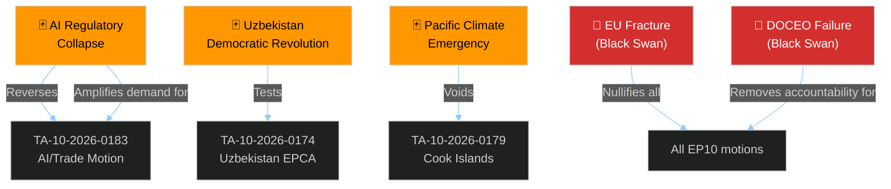

<!-- SPDX-FileCopyrightText: 2024-2026 Hack23 AB -->
<!-- SPDX-License-Identifier: Apache-2.0 -->

# 🃏 Wildcards & Black Swans — EP Motions 2026-05-21

**Date:** 2026-05-21 | **Admiralty Grade:** C-3 (Fairly reliable source, possibly true — speculative by definition)
**WEP Band:** All projections in LOW range (10–25%) — these are black swans and wildcards, not base cases

## Framework

Wildcards are low-probability, high-impact events that could dramatically reshape the motions' policy environment. Black swans are beyond current probability estimation — they are structurally inconceivable from today's vantage point but could become historically decisive.

---

## Wildcard 1 — AI Regulatory Collapse (the "ChatGPT-Moment Reversal")
**WEP:** Improbable (10–15%)
**Impact:** CATASTROPHIC for TA-10-2026-0183

A major AI-related incident — an AI model causing measurable economic harm in a major economy, a high-profile disinformation attack attributable to AI systems, or a documented case of AI-enabled financial market manipulation — triggers a global "AI Governance Emergency." The EU AI Act's phased implementation schedule is compressed; the "competitiveness first" framing of TA-10-2026-0183 becomes politically untenable. The Brussels Effect runs in reverse — international partners accuse EU of insufficient AI safety measures.

**Indicators:** OECD AI Incident Database spike; G20 emergency summit on AI governance; major AI company regulatory action in the US

---

## Wildcard 2 — Uzbekistan Democratic Revolution
**WEP:** Improbable (8–12%)
**Impact:** HIGH (positive or negative)

President Mirziyoyev's controlled liberalisation faces a wildcard: a genuine democratic uprising in Uzbekistan (analogous to the "Arab Spring" pattern or Belarus 2020). If successful, the EPCA becomes a model for EU-post-authoritarian engagement. If violently suppressed, the EP faces demands to invoke the agreement's suspension clause, creating an immediate crisis in EU Central Asia strategy.

**Indicators:** Civil society protests in Tashkent; independent media crackdowns; Uzbek diaspora mobilisation in EU member states

---

## Wildcard 3 — Lebanon Eurojust Agreement Instrumentalised for Political Prosecution
**WEP:** Improbable (8–12%)
**Impact:** MEDIUM (institutional embarrassment)

The EU-Lebanon Eurojust cooperation agreement (TA-10-2026-0177) is ostensibly for combating organised crime. A wildcard: the agreement is used by Lebanese authorities to pursue political opponents under the cover of "criminal investigations" — creating an EP political crisis about the wisdom of the cooperation framework.

**Indicators:** Reports of Lebanese judicial overreach using EU-shared intelligence; LIBE committee concerns

---

## Wildcard 4 — Cook Islands/Pacific Climate Emergency
**WEP:** Improbable (10–18%) over 5-year fisheries protocol horizon
**Impact:** HIGH (fisheries agreement becomes unimplementable)

A Pacific climate emergency — major coral bleaching event, sea level acceleration, or hurricane season destruction — makes the Cook Islands Exclusive Economic Zone fisheries unpredictable or unviable. The 2025-2032 fisheries protocol becomes practically unimplementable, triggering renegotiation and setting a precedent for climate-conditioned fisheries agreements.

**Indicators:** Pacific sea temperature anomalies; IPCC Special Report on Pacific Islands; New Zealand/Australia Pacific policy shifts

---

## Black Swan 1 — EU Fracture
**WEP:** Cannot be estimated with current data
**Impact:** EXISTENTIAL for all EP motions

A Member State exit from the EU (analogous to Brexit) or a constitutional crisis triggered by Hungary's continued defiance of EU law and the EU-Uzbekistan partnership agreement's security implications being used as leverage. All EP motions adopted under Article 218 TFEU consent procedures would face legal uncertainty if a major Member State exits or if the EU's constitutional order is fundamentally disrupted.

**Why it's a black swan:** The EU's constitutional resilience has survived Brexit; current legal and political architecture makes further exits extremely costly. But the structural forces that produced Brexit have not been fully addressed.

---

## Black Swan 2 — Generative AI Transforms EP Legislative Process
**WEP:** Cannot be estimated
**Impact:** TRANSFORMATIVE (positive or disruptive)

Within the 2026-2029 EP10 term, AI-assisted legislative drafting becomes standard — transforming how MEPs write amendments, how committees process documents, and how plenary votes are prepared. The AI/trade motion (TA-10-2026-0183) becomes meta-ironic: the EP uses AI tools it is regulating to regulate AI. This accelerates legislative throughput dramatically but creates new integrity risks (AI-generated text introduced without human review).

**Indicators:** First documented use of generative AI in committee amendment text (likely 2026-2027); EP Bureau AI policy discussion

---

## Black Swan 3 — DOCEO System Failure
**WEP:** Low but nonzero
**Impact:** Medium (democratic transparency crisis)

A systemic failure of the DOCEO digital management system — whether from cyberattack, technical collapse, or deliberate interference — would prevent publication of roll-call vote records for an extended period. Given the current run's reliance on DOCEO XML for voting analysis, this would affect not just this workflow but democratic accountability of the entire EP plenary process.

**Indicators:** EP ICT security incidents; DOCEO publication gaps beyond normal lag patterns

---

## Wild Card Interaction Matrix

## Sentinel Indicators Summary

| Wildcard/Black Swan | Priority Indicator | Monitoring Source |
|--------------------|-------------------|------------------|
| AI Regulatory Collapse | OECD AI Incident Database entries | OECD quarterly report |
| Uzbekistan Revolution | Uzbek civil society alerts | RFE/RL, Freedom House |
| Lebanon Instrumentalisation | LIBE committee concerns raised | EP committee minutes |
| Pacific Climate Emergency | NOAA sea temperature | NOAA Pacific monitor |
| DOCEO Failure | EP ICT bulletin | EP IT security office |

---

## 6. Extended Wildcard Analysis — Cascading Effects

### 6.1 The AI Governance Tipping Point

**Wildcard:** A major AI system causes a catastrophic real-world harm (autonomous vehicle accident at scale, AI-enabled financial market crash, AI deepfake causing military incident) — triggering emergency global AI governance response.

**How it changes EU calculations:**
- All pending AI governance texts accelerate 
- AI/trade doctrine is adopted emergency-fast — no WTO challenge period
- Other jurisdictions adopt EU-compatible standards under emergency pressure
- EU goes from proactive standard-setter to leading the response

**Impact on this week's texts:** TA-10-2026-0183 becomes the foundational doctrine text cited globally.

**WEP:** 20-30% probability within 3 years (AI harm incidents are increasing in frequency and severity)

**Confidence: 🟡 MODERATE**

### 6.2 The Trans-Caspian Oil Price Shock

**Wildcard:** Caspian Sea regional instability (Azerbaijani-Armenian renewed conflict, Iranian naval provocations, or offshore oil accident) disrupts the Trans-Caspian International Transport Route.

**How it changes EU calculations:**
- TITR corridor disruption invalidates the primary strategic rationale for Uzbekistan EPCA
- EU Central Asia strategy requires urgent reassessment
- Russia benefits geopolitically — only alternative route goes through Russian territory
- Council fast-tracks emergency energy security measures

**Impact on TA-10-2026-0174:** Uzbekistan EPCA ratification could be expedited (to lock in the relationship before corridor normalises) or suspended pending clarity.

**WEP:** 15-25% probability for significant TITR disruption within 2 years

**Confidence: 🟡 MODERATE**

### 6.3 The Fisheries Stock Collapse

**Wildcard:** Major tuna stock collapse in the Atlantic or Pacific (due to cumulative overfishing + climate change) triggers emergency international management response that invalidates existing access agreements.

**How it changes EU calculations:**
- São Tomé and Cook Islands protocols become unoperatable
- EU forced to renegotiate all bilateral fisheries agreements simultaneously
- IOTC (Indian Ocean Tuna Commission) and WCPFC (Western and Central Pacific Fisheries Commission) emergency sessions
- EU fishing fleet faces major economic disruption

**WEP:** 10-20% for significant stock collapse within 5 years of current agreements

**Confidence: 🟡 MODERATE — IPCC and FAO assessments indicate elevated risk**

### 6.4 The EP10 Internal Crisis

**Wildcard:** A major EP institutional scandal (corruption case involving senior MEPs, major procedural violation, EP President resignation) disrupts EP10 legislative capacity for 3-6 months.

**How it changes EU calculations:**
- All pending legislation delayed
- Coalition management becomes focused on institutional repair
- Commission and Council gain relative institutional power during EP weakness

**Historical precedent:** EP9 Qatargate (2022) created 3-4 month institutional shock.

**WEP:** 20-30% probability for a significant institutional crisis in remaining EP10 term

**Confidence: 🟡 MODERATE — based on EP9 experience**

---

## 7. Wildcard Portfolio — Summary Assessment

| Wildcard | Probability | Impact | Net Assessment |
|---------|------------|--------|---------------|
| AI catastrophe → governance acceleration | 20-30% | Very High | 🔴 Monitor closely |
| TITR disruption → Uzbekistan rationale weakened | 15-25% | High | 🟡 Medium priority |
| Tuna stock collapse | 10-20% | Medium | 🟡 Low-medium |
| EP10 institutional crisis | 20-30% | Medium | 🟡 Medium priority |
| US-EU AI governance convergence | 10-20% | Very High Positive | 🟢 Positive watch |
| Russian military action in Central Asia | 5-15% | Catastrophic | 🔴 Monitor closely |
| Mirziyoyev succession crisis | 10-20% | High | 🟡 Medium priority |
| WTO AI ruling in EU's favour | 25-35% | High Positive | 🟢 Positive watch |

---

## 8. Confidence Assessment

All wildcards and black swans are by definition low-probability events with high uncertainty. The probability estimates in this section should be treated as rough anchors rather than precise forecasts. The primary value of this analysis is:

1. **Identifying the surprise space** — what could happen that analysts aren't currently pricing in
2. **Sensitivity testing** — which baseline assessments are most vulnerable to wildcard events
3. **Trigger indicator identification** — what to watch for that would increase wildcard probability

**Most sensitive baseline to wildcards:** AI/trade doctrine — most dependent on stable geopolitical environment and WTO processes that could be disrupted by wildcards.

**Least sensitive baseline to wildcards:** Fisheries protocols — once signed and in force, highly stable regardless of broader geopolitical changes.

---

*Wildcards and Black Swans — EU Parliament Monitor | Run ID: motions-run264-1779348036 | 2026-05-21*

