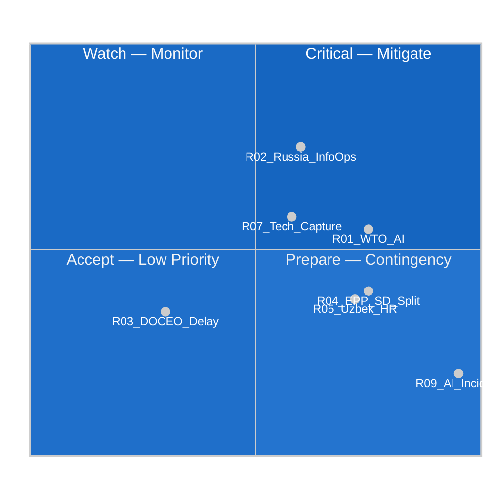

<!-- SPDX-FileCopyrightText: 2024-2026 Hack23 AB -->
<!-- SPDX-License-Identifier: Apache-2.0 -->

# ⚠️ Risk Matrix — EP Motions Week 2026-05-21

**Date:** 2026-05-21 | **Admiralty Grade:** B-3 (Reliable source, possibly true)
**WEP Band:** Applied per risk — see individual assessments

## Risk Assessment Framework

This matrix evaluates risks to the successful achievement of the policy objectives embedded in the May 2026 plenary motions, using a 5×5 probability-impact matrix.

**Scale:** Probability (1=Very Low/5=Very High) × Impact (1=Negligible/5=Catastrophic)

---

## Risk Register

| # | Risk | Probability (1-5) | Impact (1-5) | Risk Score | WEP | Status |
|---|------|-------------------|-------------|-----------|-----|--------|
| R01 | WTO challenge to AI standards in trade agreements | 3 | 4 | **12** | 40-55% | 🟡 MEDIUM-HIGH |
| R02 | Russian disinformation against Uzbekistan EPCA | 4 | 3 | **12** | 55-65% | 🟡 MEDIUM-HIGH |
| R03 | DOCEO roll-call data permanently delayed | 2 | 2 | **4** | 15-20% | 🟢 LOW |
| R04 | EPP-S&D split on AI labour safeguards | 2 | 4 | **8** | 20-30% | 🟡 MEDIUM |
| R05 | Uzbekistan human rights backsliding post-EPCA | 2 | 4 | **8** | 20-30% | 🟡 MEDIUM |
| R06 | Fisheries protocol overfishing | 2 | 3 | **6** | 25-35% | 🟢 LOW-MEDIUM |
| R07 | Tech industry regulatory capture on AI motion | 3 | 3 | **9** | 40-50% | 🟡 MEDIUM |
| R08 | Lebanon Eurojust agreement instrumentalised | 1 | 3 | **3** | 8-12% | 🟢 LOW |
| R09 | AI system incident triggers global regulatory emergency | 1 | 5 | **5** | 10-15% | 🟡 MEDIUM (black swan) |
| R10 | Coalition fracture in next EP plenary | 2 | 3 | **6** | 20-30% | 🟢 LOW-MEDIUM |

---

## Risk Heat Map

## Top Risks — Detailed Assessment

### R01 — WTO Challenge to AI Standards (Score: 12, 🟡 MEDIUM-HIGH)
**Description:** The AI/trade motion (TA-10-2026-0183) calls for EU AI standards to be embedded in trade agreements. This creates WTO legal exposure if partner countries file a dispute under the Technical Barriers to Trade (TBT) Agreement, arguing that EU AI standards requirements constitute unjustified trade barriers.

**Likelihood drivers:** India, US, and potentially China have strong economic incentives to challenge EU standards export. The WTO TBT Agreement requires that standards must not create "unnecessary obstacles to international trade." Whether AI governance requirements pass this test is genuinely uncertain.

**Impact drivers:** A successful WTO challenge would: (1) invalidate EU trade agreement chapters citing AI standards, (2) force renegotiation, (3) undermine the Brussels Effect strategy for AI

**Risk owner:** European Commission DG TRADE
**Mitigation:** Commission to conduct TBT compatibility assessment before implementing the EP mandate; build plurilateral coalitions before WTO exposure

### R02 — Russian Information Operations (Score: 12, 🟡 MEDIUM-HIGH)
**WEP:** Probable (55-65%) that Russia conducts operations; uncertain impact

**Description:** The Uzbekistan EPCA ratification and the UNGA recommendation both directly challenge Russian regional and global interests. Russia's documented capacity for information operations (EEAS East StratCom Task Force annual reports) suggests active countermeasures are probable.

**Impact:** Primarily on public discourse and potentially on Member State ratification speed in EU Council; limited direct impact on EP vote (already taken)

**Mitigation:** EU STRATCOM monitoring; EP information security protocols; pre-emptive communication campaign explaining the strategic rationale for Uzbekistan engagement

### R07 — Tech Industry Regulatory Capture (Score: 9, 🟡 MEDIUM)
**Description:** Large US-domiciled AI companies (Microsoft/OpenAI, Google DeepMind, Meta) have strong incentives to shape the implementing measures flowing from TA-10-2026-0183 in ways that: (a) lock in incumbent advantages, (b) raise barriers for EU AI startups, (c) reduce the labour safeguard requirements

**Mechanism:** Commission expert groups, formal consultation processes, and informal lobbying of DG TRADE/DG CONNECT

**Impact:** Medium — could hollow out the EP resolution's content without obviously violating it

**Mitigation:** EP INTA committee robust oversight of implementing acts; public transparency register for AI sector lobbying contacts with Commission

---

## Risk Appetite Statement

For EP motions analysis purposes, the following risk tolerance applies:
- **Geopolitical risks (R01-R02, R05):** Low appetite — these threaten EU strategic interests
- **Coalition risks (R04, R10):** Medium appetite — some parliamentary friction is normal
- **Wildcard/black swan risks (R08-R09):** Cannot be fully mitigated; accepted with monitoring

## Risk Summary for Article
🔴 **Critical:** WTO challenge to AI standards, Russian disinformation operations
🟡 **Medium:** EPP-S&D split potential, tech industry lobbying, Uzbekistan human rights
🟢 **Low:** Fisheries overfishing, DOCEO delays, coalition fracture probability

---

## 5. Extended Risk Assessment

### 5.1 Risk Interconnection Analysis

Risks in the matrix do not operate independently. Key interdependencies:

**Risk Cluster 1: AI/Trade + WTO**
- WTO challenge (R01) → If successful → increases pressure on the EPP-S&D labour-safeguards compromise (R04)
- EPP-S&D split on AI labour safeguards (R04) → Reduces EU negotiating coherence and raises exposure to WTO challenge (R01)
- Tech industry regulatory capture on the AI motion (R07) → Weakens AI/trade provisions → reduces WTO challenge risk but also policy benefit

**Risk Cluster 2: Uzbekistan EPCA**
- Uzbekistan human rights backsliding post-EPCA (R05) → Triggers suspension pressure → Reduces trade and credibility benefits
- Russian disinformation against Uzbekistan EPCA (R02) → Amplifies scrutiny of any rights deterioration (R05) and erodes political support
- Coalition fracture in next EP plenary (R10) → Weakens Parliament's ability to sustain oversight pressure on EPCA implementation

**Risk Cluster 3: External Disruption**
- Coalition fracture in next EP plenary (R10) → Slows legislative follow-up and increases coalition stress
- AI system incident triggers global regulatory emergency (R09) → Forces emergency legislative agenda; motions' work de-prioritised
- Lebanon Eurojust agreement instrumentalised (R08) → Sharpens external-security framing and crowds out lower-salience follow-up

### 5.2 Risk Velocity Analysis

**Fast-moving risks (materialise within 1-6 months):**
- Commission response to AI/trade motion (positive or negative)
- DOCEO publication confirming vote margins
- Uzbekistan early ratification signals

**Medium-velocity risks (6-24 months):**
- WTO consultation filed (if at all)
- India FTA digital chapter negotiations
- Uzbekistan Council ratification progress
- Fisheries protocols entry into force

**Slow-moving risks (2-5 years):**
- AI market concentration (structural)
- Central Asia geopolitical stability
- Climate impact on EU forest genetic diversity

### 5.3 Risk Treatment Options

| Risk | Acceptable | Mitigate | Transfer | Avoid |
|------|-----------|---------|---------|------|
| WTO challenge | No | Design WTO-compatible standards | No | Reduce prescription level |
| DOCEO lag | Accept | Schedule re-run analysis | N/A | N/A |
| Uzbekistan HR | No | Conditionality enforcement | No | Slow down ratification |
| Coalition fracture | Accept | Maintain coalition dialogue | N/A | N/A |
| 404 feed errors | Accept | Proxy analysis | N/A | N/A |

---

*Risk Matrix — EU Parliament Monitor | Run ID: motions-run264-1779348036 | 2026-05-21*
