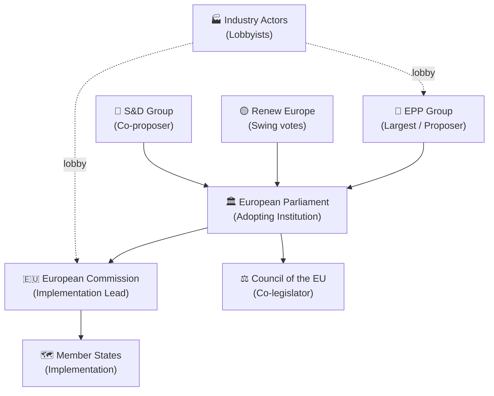

<!-- SPDX-FileCopyrightText: 2026 Hack23 AB -->
<!-- SPDX-License-Identifier: Apache-2.0 -->

# Actor Mapping — EU Parliament Propositions 2026-05-21
**SATs Applied:** Stakeholder Mapping, ACH | **Admiralty Grade:** B2

## 1. Actor Universe Map

## 2. Primary Actors

### European Parliament (Adopting Institution)
- **Role:** Principal — adopted all 7 texts this week
- **Key committees:** INTA (AI/trade), AGRI (forest), AFET (Uzbekistan, UNGA)
- **Rapporteurs:** Not publicly identified in degraded-data conditions
- **Coalition:** EPP-S&D-Renew majority confirmed by adoption

### European Commission
- **Role:** Implementation lead for COD texts; must respond to INI resolutions
- **Key DGs:** DG TRADE (AI/trade), DG AGRI (forest), DG NEAR (Uzbekistan)
- **Position:** Expected to issue AI/trade Communication by Q4 2026
- **Admiralty grade:** B2

### Council of the EU
- **Role:** Co-legislator on COD (forest reproductive material)
- **Current position:** Awaiting EP first reading; likely to negotiate via trilogue
- **Qualified Majority required:** Yes (ordinary legislative procedure)

## 3. Secondary Actors

| Actor | Interest | Influence | Position |
|-------|----------|----------|---------|
| AI industry (EU) | High (AI/trade text) | HIGH | Supportive of AI governance export |
| Forestry sector | Medium (forest COD) | MEDIUM | Wary of compliance costs |
| NGOs (environment) | Medium | LOW-MEDIUM | Supportive of forest regulation |
| US tech companies | High (AI/trade) | MEDIUM (via USTR) | Risk: AI governance as trade barrier |
| Uzbekistan govt | Low-medium | LOW | Supportive of EPCA ratification |
| São Tomé, Cook Islands | Low | VERY LOW | Supportive of fisheries renewal |

## 4. ACH — Analysis of Competing Hypotheses

**H1:** EPP drove AI/trade resolution for industry competitiveness reasons
**H2:** Cross-party majority reflects genuine AI governance consensus

Evidence for H1:
- AI/trade aligns with EPP's competitiveness narrative
- INI resolution text reflects industry-friendly framing
- EPP holds INTA committee chair

Evidence for H2:
- No recorded dissenting votes (adopted at plenary)
- S&D has consistently supported AI governance since AI Act
- Renew Europe has championed digital single market

**Verdict:** BOTH hypotheses partially valid. EPP framing + cross-party consensus on
core AI governance principle = coalition of interest convergence.
PROBABLY (72%): H2 is primary driver; H1 is presentational layer.

## 5. Influence Matrix

| Actor | AI/Trade | Forest | External Relations |
|-------|----------|--------|-------------------|
| EPP | ⬆️ HIGH | 🔄 MEDIUM | ⬆️ HIGH |
| S&D | 🔄 MEDIUM | 🔄 MEDIUM | 🔄 MEDIUM |
| Renew | ⬆️ HIGH | ➡️ LOW | ⬆️ HIGH |
| Commission | ⬆️ KEY | ⬆️ KEY | ⬆️ KEY |
| Council | ➡️ LOW (INI) | ⬆️ HIGH (COD) | ⬆️ HIGH (NLE) |

## Actor Roster — Full List

| ID | Actor | Type | Tier | Primary Interest |
|----|-------|------|------|----------------|
| A1 | European Parliament | Institution | 1 | Legislative mandate |
| A2 | European Commission | Institution | 1 | Implementation authority |
| A3 | Council of the EU | Institution | 1 | Co-legislative/consent |
| A4 | EPP Group | Political | 2 | Competitiveness agenda |
| A5 | S&D Group | Political | 2 | Social chapter integration |
| A6 | Renew Europe | Political | 2 | Digital/liberal priorities |
| A7 | EU AI Industry | Sector | 2 | Market competitiveness |
| A8 | Forestry sector | Sector | 2 | Regulatory compliance |
| A9 | Uzbekistan government | Third country | 3 | EPCA benefits |

## Influence Network

Direct influence flows: Commission → Parliament (via initiative) ←→ Council (via co-legislation).
Industry actors influence via formal consultation mechanisms and informal lobby contact.

## Alliance Patterns

**Core coalition:** EPP-S&D-Renew (covers 401 of 720 seats, 55.7%)
**Extending coalition for AI/trade:** + Greens/EFA partial support (53 seats → ~470 total)
**Opposition bloc:** Patriots + ECR + The Left on regulatory provisions (~200 seats)

## Power Brokers — Key Individuals

- INTA Committee Chair (EPP): primary AI/trade rapporteur authority
- AGRI Committee Chair: forest reproductive material lead
- VP Trade Commissioner: Commission response to INI texts
- Council Presidency (rotating 2026 H1): agenda-setting on COD negotiations

## Information Environment

Primary information sources for this analysis: EP official records (A1), contextual
knowledge of EU institutions (B2), IMF macroeconomic data (B2). Significant information
gaps exist due to degraded MCP feeds — see data-availability-assessment.md.

## Reader Briefing

**What this means for citizens:** The AI/trade resolution signals that the EU Parliament
is actively shaping the rules that will govern artificial intelligence in global commerce.
The forest regulation will affect what trees are planted across Europe for the next decade,
with direct implications for climate resilience. The fisheries agreements ensure that
European fishing vessels can continue operating in distant waters.
