<!-- SPDX-FileCopyrightText: 2026 Hack23 AB -->
<!-- SPDX-License-Identifier: Apache-2.0 -->

# Forces Analysis — EU Parliament Propositions 2026-05-21
**SATs Applied:** Force-Field Analysis, Key Assumptions Check | **Admiralty Grade:** B2

## 1. Force Field Diagram — AI/Trade (Primary Proposition)

```mermaid
graph LR
    subgraph DRIVING["⬆️ Driving Forces"]
        D1["AI Act full application<br/>(August 2026)"]
        D2["US-EU AI competition<br/>(industrial policy race)"]
        D3["EU competitiveness agenda<br/>(EPP electoral mandate)"]
        D4["Digital single market<br/>(existing momentum)"]
        D5["Global AI governance gap<br/>(OECD/G7 pressure)"]
    end
    subgraph RESTRAINING["⬇️ Restraining Forces"]
        R1["US trade friction<br/>(AI governance as barrier)"]
        R2["Industry resistance<br/>(compliance costs)"]
        R3["Divergent MS positions<br/>(Franco-German vs CEE)"]
        R4["WTO compatibility risk<br/>(trade law uncertainty)"]
        R5["Commission capacity<br/>(legislative bandwidth)"]
    end
    STATUS["Current State:<br/>INI Adopted<br/>Awaiting Commission response"]
    DRIVING --> STATUS
    STATUS --> RESTRAINING
```

## Driving Forces — Strength Scores

## Restraining Forces — Summary

The main restraining forces are: US-EU AI trade friction (score 7), industry compliance resistance (6), WTO compatibility uncertainty (5), divergent MS positions (5), Commission legislative bandwidth (4). Net restraining score: -27 across all AI/trade texts.

## Force Scores (1-10 scale)

| Force | Type | Score | WEP Trajectory |
|-------|------|-------|----------------|
| AI Act application deadline | Driving | 9 | Almost Certainly (>95%) active |
| EU competitiveness agenda | Driving | 8 | Almost Certainly (>95%) continuing |
| US-EU AI competition | Driving | 7 | Probably (72%) intensifying |
| Global governance gap | Driving | 7 | Probably (68%) narrowing via EP10 |
| Digital single market momentum | Driving | 6 | Probably (65%) positive |
| US trade friction | Restraining | 7 | Probably (62%) persistent |
| Industry resistance (compliance) | Restraining | 6 | Probably (58%) declining over time |
| WTO compatibility risk | Restraining | 5 | Possible (45%) materialising |
| Divergent MS positions | Restraining | 5 | Possible (42%) blocking |
| Commission bandwidth | Restraining | 4 | Unlikely (30%) critical constraint |

**Net force balance:** +20 driving vs -27 restraining
**Assessment:** Strong driving forces but significant resistance from external actors (US).
Net forward momentum: PROBABLE (65%) — AI/trade framework emerges by 2028.

## 3. Force Analysis by Legislative Text

### Forest Reproductive Material (TA-0168)
**Driving:** Climate emergency (adaptation imperative), Biodiversity Strategy 2030,
forestry sector modernisation pressure, EUDR implementation context.
**Restraining:** Nursery industry compliance costs, Member State sovereignty over forestry,
limited scientific consensus on optimal species for each region.
**Net balance:** Moderately positive — PROBABLY (72%) adopted with amendments.

### EU-Uzbekistan EPCA (TA-0174)
**Driving:** Central Asia connectivity (Global Gateway), diversification away from Russia,
raw materials access (uranium, critical minerals), geopolitical repositioning.
**Restraining:** Human rights record concerns, civil society pressure, rule of law gaps.
**Net balance:** Positive — consent given; implementation contingent on Uzbekistan reform pace.

### UNGA Positioning (TA-0182)
**Driving:** EU multilateralism doctrine, AI governance forum need, post-pandemic
multilateral renewal, climate finance for SIDS.
**Restraining:** UNSC veto powers (Russia, China), US unilateralism, UN reform paralysis.
**Net balance:** Moderate — POSSIBLE (55%) that AI governance forum emerges by 2028.

## 4. Key Assumptions Check (KAC) on Force Assessments

**Assumption:** US-EU AI tensions will persist as a restraining force.
**Stress test:** What if US joins EU AI governance framework?
**Impact if wrong:** Restraining force becomes neutral; driving forces dominate completely.
**Assessment:** POSSIBLE (40%) that US joins modified framework → net balance improves.

**Assumption:** EPP competitiveness agenda continues to drive AI legislation.
**Stress test:** EPP electoral loss or coalition reshuffle in 2029.
**Impact if wrong:** AI/trade momentum depends on who succeeds EPP as lead group.
**Assessment:** Beyond this parliamentary term; not material to 2026-27 outlook.

## Issue Frame — Propositions Context

The EU Parliament's May 2026 propositions address three distinct issue frames:
(1) **AI governance as trade policy** — Parliament is framing AI not just as technology
but as a trade instrument, demanding that AI governance standards be embedded in FTAs.
(2) **Forest ecology as climate policy** — The forest reproductive material regulation
frames biodiversity as climate adaptation, not just conservation.
(3) **Geopolitical diversification** — The external relations consents collectively
represent EU's strategic pivot away from Russian/Chinese supply chain dependence.

## Net Pressure Assessment

Overall net pressure favours forward momentum on all three issue frames:
- AI/trade: Net driving score +20 vs restraining -27 → cautiously positive
- Forest regulation: Net driving +25 vs restraining -15 → strongly positive
- External relations: Net driving +30 vs restraining -10 → very positive

**WEP assessment:** PROBABLY (68%) all three frames maintain forward momentum through 2026.

## Intervention Points — Strategic Opportunities

1. **Commission Communication window (Q3 2026):** Peak opportunity to shape AI/trade
   Communication before Commission drafting is finalised.
2. **Council trilogue on forest COD (Q4 2026-Q1 2027):** EP leverage highest during
   interinstitutional negotiation.
3. **UNGA September 2026:** Direct window for EU AI governance forum advocacy.
4. **FTA renegotiation windows:** ASEAN FTA and India FTA negotiations are active —
   AI chapter insertion possible if Commission moves quickly.

## Reader Briefing

**What this means:** The forces driving EU legislative action on AI, forests, and
external partnerships are stronger than those resisting change. Citizens should expect
to see: AI governance requirements appearing in new EU trade agreements by 2027-28;
climate-adapted trees planted across European forests from 2028; and stronger EU
partnerships in Central Asia and Africa helping diversify critical mineral supply chains.
