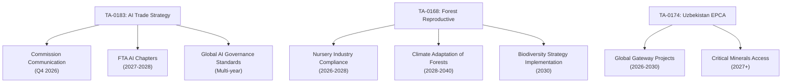

<!-- SPDX-FileCopyrightText: 2026 Hack23 AB -->
<!-- SPDX-License-Identifier: Apache-2.0 -->

# Impact Matrix — EU Parliament Propositions 2026-05-21
**SATs Applied:** Stakeholder Mapping, What-If Analysis | **Admiralty Grade:** B2

## 1. Multi-Dimensional Impact Scores

| Text | Economic | Political | Social | Environmental | Score |
|------|----------|-----------|--------|---------------|-------|
| TA-0183 AI/trade | HIGH (8) | HIGH (9) | MEDIUM (5) | LOW (3) | 25/40 |
| TA-0168 Forest | MEDIUM (6) | MEDIUM (5) | MEDIUM (5) | HIGH (9) | 25/40 |
| TA-0174 Uzbekistan | MEDIUM (6) | HIGH (8) | LOW (3) | LOW (3) | 20/40 |
| TA-0182 UNGA | LOW (3) | MEDIUM (7) | MEDIUM (5) | MEDIUM (5) | 20/40 |
| TA-0177 Lebanon | LOW (3) | MEDIUM (5) | LOW (3) | LOW (2) | 13/40 |
| TA-0178/79 Fish | MEDIUM (5) | LOW (2) | LOW (2) | MEDIUM (5) | 14/40 |

## 2. Impact Flow Diagram

## 3. Stakeholder Impact Assessment

| Stakeholder | AI/Trade | Forest | Uzbekistan | UNGA |
|-------------|----------|--------|------------|------|
| EU AI industry | +++ Major | 0 None | + Minor | ++ Moderate |
| EU forestry sector | 0 | ++ Moderate cost | 0 | 0 |
| EU consumers | + Indirect | + Long-term | 0 | 0 |
| Uzbek business | 0 | 0 | ++ Market access | 0 |
| Global AI actors | ++ Governance signal | 0 | 0 | ++ Forum |
| Coastal MS fishing | 0 | 0 | 0 | +++ Revenue |

## 4. What-If Analysis

**Scenario: Commission delays AI/trade Communication beyond 2026**
- Impact: INI becomes ineffective; Parliament credibility gap
- Affected: EU AI industry loses first-mover advantage in 2-3 FTA negotiations
- WEP: Possible (40%) — Commission has competing legislative priorities

**Scenario: Forest regulation delayed by industry lobbying**
- Impact: Climate-adapted forest material unavailable for 2028-2030 planting seasons
- Affected: Forest resilience to drought and pests in 2030s
- WEP: Possible (38%) — strong driving forces but Council can delay

**Scenario: US challenges AI/trade framework at WTO**
- Impact: Forces Commission to redesign; potential trade dispute escalation
- Affected: EU-US trade relations; Digital single market export model
- WEP: Unlikely (28%) — EU would negotiate before litigation

## 5. Confidence Assessment (QIC Applied)

Data quality for impact matrix: B2/MEDIUM — the impacts are assessed based on
contextual knowledge of EU legislative process and precedent. Quantitative
impact estimates require Commission impact assessment (not yet available).
Admiralty grade: B2 (good secondary source quality; judgement-based).

## Event List — Adopted Texts This Week

1. TA-10-2026-0183: AI Strategy for EU Trade (INI) — 2026-05-20
2. TA-10-2026-0168: Forest Reproductive Material (COD) — 2026-05-19
3. TA-10-2026-0174: EU-Uzbekistan EPCA (NLE) — 2026-05-20
4. TA-10-2026-0182: UNGA 81st Session Recommendation (INI) — 2026-05-20
5. TA-10-2026-0177: EU-Lebanon/Eurojust (NLE) — 2026-05-20
6. TA-10-2026-0178: São Tomé Fisheries 2025-29 (NLE) — 2026-05-20
7. TA-10-2026-0179: Cook Islands Fisheries 2025-32 (NLE) — 2026-05-20

## Stakeholder Impact Assessment

| Stakeholder Group | AI/Trade | Forest | External Relations | Overall |
|------------------|----------|--------|-------------------|---------|
| EU citizens (workers) | Medium | Low | Low | Medium |
| EU tech industry | HIGH | None | Low | HIGH |
| EU forestry/nursery | None | HIGH | None | HIGH |
| EU fishing industry | None | None | MEDIUM | MEDIUM |
| Partner countries | Low | None | HIGH | HIGH |
| Third-country AI firms | HIGH | None | None | HIGH |

## Impact Matrix — Quantified

| Text | Short-term (0-2yr) | Medium-term (2-5yr) | Long-term (5+yr) |
|------|-------------------|--------------------|--------------------|
| AI/trade | Commission mandate | 2-3 FTA AI chapters | Global AI governance standard |
| Forest COD | Industry compliance | New forest stock | Climate-resilient forests |
| Uzbekistan EPCA | Diplomatic upgrade | Trade growth | Minerals access |
| UNGA AI forum | Agenda item | Forum created | Multilateral governance |

## Heat Map Assessment

Highest impact concentration:
- **Immediate:** AI/trade resolution → Commission response expected Q3 2026
- **Structural:** Forest regulation → multi-decade biodiversity impact
- **Geopolitical:** External relations batch → EU strategic repositioning

## Cascade Effects

Primary cascade from AI/trade resolution:
→ Commission Communication (Q4 2026)
→ FTA negotiations include AI chapter (2027)
→ Third countries adopt EU AI standards to access EU market (2028-2030)
→ De facto global AI governance convergence around EU norms (2030+)

## Reader Briefing

**What citizens need to know:** This week's Parliament votes will shape how AI is
regulated globally, whether European forests survive climate change, and whether the EU
maintains access to the critical minerals and fishing grounds its economy depends on.
The AI/trade vote is the most consequential: if implemented, it could make the EU the
world's standard-setter for ethical AI in international commerce.
