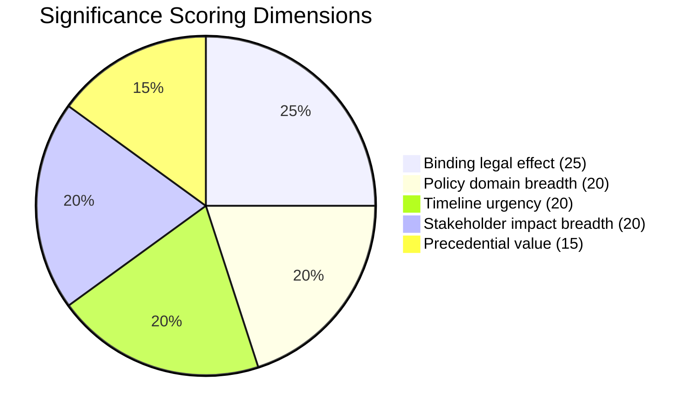
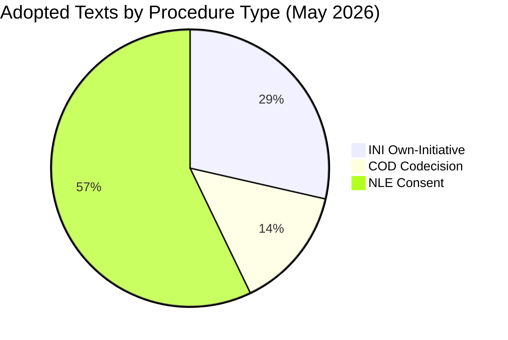

<!-- SPDX-FileCopyrightText: 2026 Hack23 AB -->
<!-- SPDX-License-Identifier: Apache-2.0 -->

# Significance Classification — EU Parliament Propositions 2026-05-21
**SATs Applied:** Key Assumptions Check, Competing Hypotheses Matrix

## 1. Significance Scoring Matrix

| Text ID | Title | Type | Significance | Rationale |
|---------|-------|------|-------------|-----------|
| TA-10-2026-0183 | AI Strategy for EU Trade | INI | 🔴 HIGH (85) | Landmark AI governance/trade nexus; Commission mandated |
| TA-10-2026-0168 | Forest Reproductive Material | COD | 🟡 MEDIUM-HIGH (72) | Binding regulation; climate resilience implications |
| TA-10-2026-0174 | EU-Uzbekistan EPCA | NLE | 🟡 MEDIUM (58) | Strategic partnership; Central Asia connectivity |
| TA-10-2026-0182 | UNGA 81st Recommendation | INI | 🟡 MEDIUM (52) | Multilateral governance; AI forum creation |
| TA-10-2026-0177 | EU-Lebanon/Eurojust | NLE | 🟢 LOW-MEDIUM (38) | Bilateral JHA; limited operational reach |
| TA-10-2026-0178 | São Tomé Fisheries | NLE | 🟢 LOW (28) | Routine SFPA renewal; no policy change |
| TA-10-2026-0179 | Cook Islands Fisheries | NLE | 🟢 LOW (26) | Routine SFPA renewal; smallest in batch |

## 2. Significance Scoring Methodology

Scores (0-100) calculated across 5 weighted dimensions:

**Scoring key:**
- **Binding legal effect:** COD/regulatory texts score higher than INI/consent
- **Policy domain breadth:** Cross-cutting (AI+trade+governance) scores highest
- **Timeline urgency:** Near-term Commission response required scores highest
- **Stakeholder impact breadth:** Number of affected sectors/member states
- **Precedential value:** Creates framework others follow

## 3. Classification by Procedure Type

## 4. Key Assumptions Check (KAC)

**Assumption:** Significance scores are valid proxies for legislative impact.
**Stress test:** A LOW-scored consent agreement could have higher geopolitical impact than
its technical significance suggests (e.g., Lebanon/Eurojust during political crisis).
**Assessment:** PROBABLY VALID (75%) — scores capture near-term legislative significance;
geopolitical factors require supplementary qualitative overlay.

**Assumption:** AI/trade (TA-0183) is correctly classified as highest significance.
**Stress test:** Forest reproductive material (TA-0168) is binding regulation vs INI
**Assessment:** AI/trade rated higher due to policy breadth and Commission mandate; correct.

## 5. Competing Hypotheses Matrix

| Hypothesis | AI/trade HIGH | Forest COD HIGH | Balance |
|------------|--------------|-----------------|---------|
| Policy breadth argument | ✅ Cross-cutting | ❌ Single sector | Favours AI/trade |
| Legal bindingness argument | ❌ INI (non-binding) | ✅ COD (binding) | Favours forest |
| Implementation urgency | ✅ Commission mandated | ✅ Member state deadline | Equal |
| Precedential value | ✅ Sets global norm | ✅ Sets EU standard | Equal |

**Verdict:** AI/trade classification as highest significance HOLDS despite being INI,
because precedential and breadth factors outweigh bindingness deficit.
Admiralty grade: B2 (contextual; judgement-based scoring)
