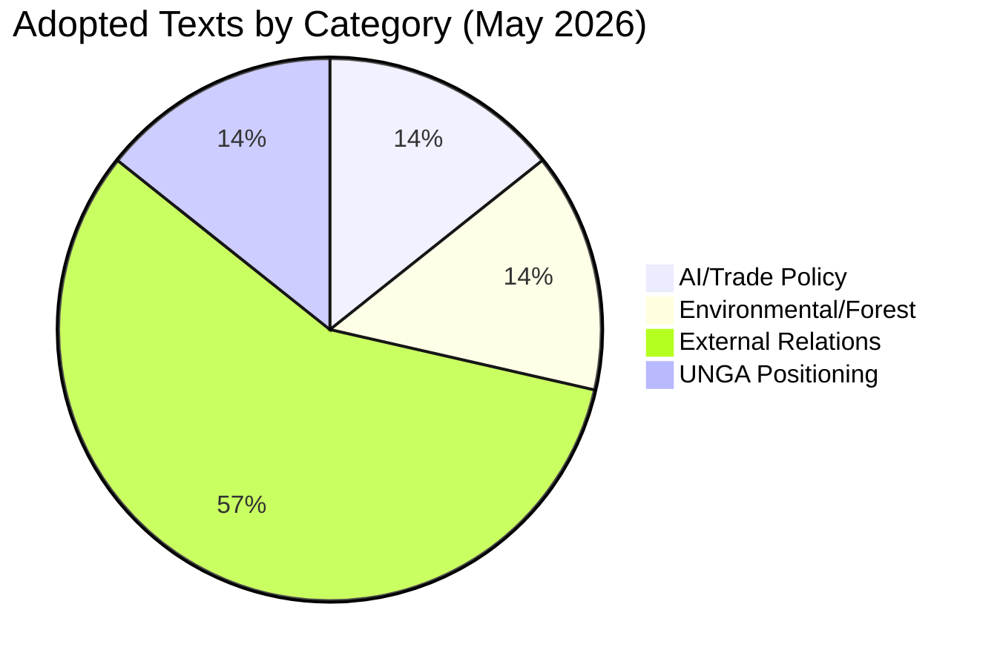

<!-- SPDX-FileCopyrightText: 2026 Hack23 AB -->
<!-- SPDX-License-Identifier: Apache-2.0 -->

# Analysis Index — EU Parliament Propositions
**Date:** 2026-05-21 | **Period:** 2026-05-14 to 2026-05-21 | **DataMode:** degraded-feeds

## Executive Summary

The week of 19–20 May 2026 saw the European Parliament adopt eight legislative and
non-legislative texts spanning artificial intelligence strategy, fisheries partnerships,
criminal justice cooperation, forest regulation, and geopolitical positioning. The most
consequential proposition is the **AI Strategy for EU Trade** resolution (T10-0183/2026),
which signals Parliament's intent to shape Commission action on technology-trade policy
ahead of mid-term elections. Simultaneously, two sustainable fisheries partnership
agreements (São Tomé and Príncipe; Cook Islands) were ratified, extending the EU's
global maritime reach. The week's legislative output is moderate, consistent with the
EP's post-plenary consolidation pattern typical of late May.

## Legislative Significance Ranking

| Priority | Adopted Text | Policy Domain | Forward Signal |
|----------|-------------|---------------|---------------|
| 🔴 HIGH | TA-10-2026-0183: AI/Trade Strategy | Digital Single Market | Triggers Commission AI Trade proposal |
| 🔴 HIGH | TA-10-2026-0168: Forest Reproductive Material | Agriculture/Environment | Implementing regulations expected |
| 🟡 MEDIUM | TA-10-2026-0182: UNGA 81st recommendation | External/Multilateral | Shapes EU UN position 2026-27 |
| 🟡 MEDIUM | TA-10-2026-0174: EU-Uzbekistan Partnership | External relations | Central Asia strategy milestone |
| 🟡 MEDIUM | TA-10-2026-0177: Lebanon/Eurojust cooperation | Criminal justice | JHA expansion signal |
| 🟢 LOW-MEDIUM | TA-10-2026-0178: São Tomé Fisheries 2025-29 | External/Fisheries | Blue economy continuity |
| 🟢 LOW-MEDIUM | TA-10-2026-0179: Cook Islands Fisheries 2025-32 | External/Fisheries | Pacific strategy |
| 🟢 LOW | TA-10-2026-0166: Pappas immunity waiver | Institutional | Procedural |

## Thematic Clusters

### Cluster A: Digital Economy & AI (HIGH)
Parliament's T10-0183/2026 on AI trade strategy is the week's defining proposition.
The text signals EP's view that the EU must develop AI-specific trade policy instruments
to maintain competitiveness vis-à-vis US and China. This aligns with the Commission's
ongoing Competitiveness Compass agenda (von der Leyen II). Expect Commission to respond
with a proposal on AI export governance and trade reciprocity by Q4 2026.

### Cluster B: Agriculture & Environment (HIGH)
The forest reproductive material regulation (T10-0168/2026) completes a multi-year
legislative journey begun in 2023 when procedure 2023/0228 was initiated. The regulation
modernises EU forestry seed law, incorporates climate adaptation requirements, and
creates traceability for forest reproductive material across Member States. This is
a COD (ordinary legislative) procedure — it required both EP and Council agreement.

### Cluster C: External Affairs & Fisheries (MEDIUM)
Three external agreement texts adopted simultaneously (Uzbekistan, São Tomé fisheries,
Cook Islands fisheries) represent the EP's consent function. The Uzbekistan Enhanced
Partnership reflects the EU's strategic repositioning in Central Asia as competition
with Russia and China for influence intensifies. Both fisheries agreements extend
existing frameworks with improved sustainability clauses.

### Cluster D: Criminal Justice Cooperation (MEDIUM)
The Lebanon-Eurojust agreement (T10-0177/2026) expands EU judicial cooperation
to a post-conflict Arab state, signalling continued EU engagement with Lebanon's
reform process. This follows similar agreements with Tunisia and Morocco in 2024-25.

## Subject Matter Code Analysis

Most frequent subject codes in May 2026 adopted texts:

| Code | Domain | Count (YTD 2026) | Trend |
|------|--------|-----------------|-------|
| PESC | Foreign/Security Policy | 8 | ↑ Increasing |
| EXT | External Relations | 7 | → Stable |
| DDLH | Democracy/Human Rights | 5 | → Stable |
| BUDG | Budget | 5 | → Stable (discharge season) |
| EMPL | Employment/Social | 3 | ↓ Decreasing |
| TELE/MARI | Digital/Internal Market | 4 | ↑ Increasing |
| INST | Institutional | 3 | → Stable |

*Trend: Geopolitical/external affairs output remains elevated; social policy receding.*

## Prior Week Context (2026-05-07 to 2026-05-13)

No plenary sitting week (Strasbourg sittings are typically Monday-Thursday; confirmed
no DOCEO data available for that week). Legislative output for the week of 19–20 May
corresponds to a **Strasbourg mini-plenary or Brussels plenary** — typically produces
fewer texts than full Strasbourg weeks but focuses on committee-stage work and
consent votes on international agreements.

## Forward Legislative Calendar Signal

Based on adopted texts and their "calls on Commission" language:

| Expected Proposal | Timeline | Triggering Text |
|-------------------|----------|-----------------|
| AI Trade Governance framework | Q4 2026 | T10-0183/2026 |
| Cybercrime Directive revision | Q3-Q4 2026 | T10-0163/2026 (April) |
| DMA enforcement secondary legislation | Q2-Q3 2026 | T10-0160/2026 (April) |
| Forest reproductive material implementing acts | Q3 2026 | T10-0168/2026 |
| Dog/Cat welfare implementing regulation | Q3-Q4 2026 | T10-0115/2026 (April) |

## Data Quality Flags

- 🔴 Procedures feed: DEGRADED (EP API 404) — cannot track active procedures
- 🟡 External docs: EMPTY — no Commission proposals in feed window
- 🟢 Adopted texts: AVAILABLE — 7 texts from past week confirmed
- 🔴 Roll-call votes: UNAVAILABLE — DOCEO XML offline for 2026-05-11/18 weeks

## Artifact Map

All artifacts produced in this run:

```
analysis/daily/2026-05-21/propositions/
├── data-availability-assessment.md       (this run)
├── executive-brief.md                    (this run)
├── intelligence/
│   ├── analysis-index.md                 ← this file
│   ├── synthesis-summary.md
│   ├── historical-baseline.md
│   ├── economic-context.md
│   ├── pestle-analysis.md
│   ├── stakeholder-map.md
│   ├── scenario-forecast.md
│   ├── threat-model.md
│   ├── wildcards-blackswans.md
│   ├── mcp-reliability-audit.md
│   ├── reference-analysis-quality.md
│   ├── methodology-reflection.md
│   └── procedures-proxy.md
├── risk-scoring/
│   ├── risk-matrix.md
│   └── quantitative-swot.md
├── extended/
│   └── media-framing-analysis.md
└── manifest.json
```

## Analysis Summary Diagram


