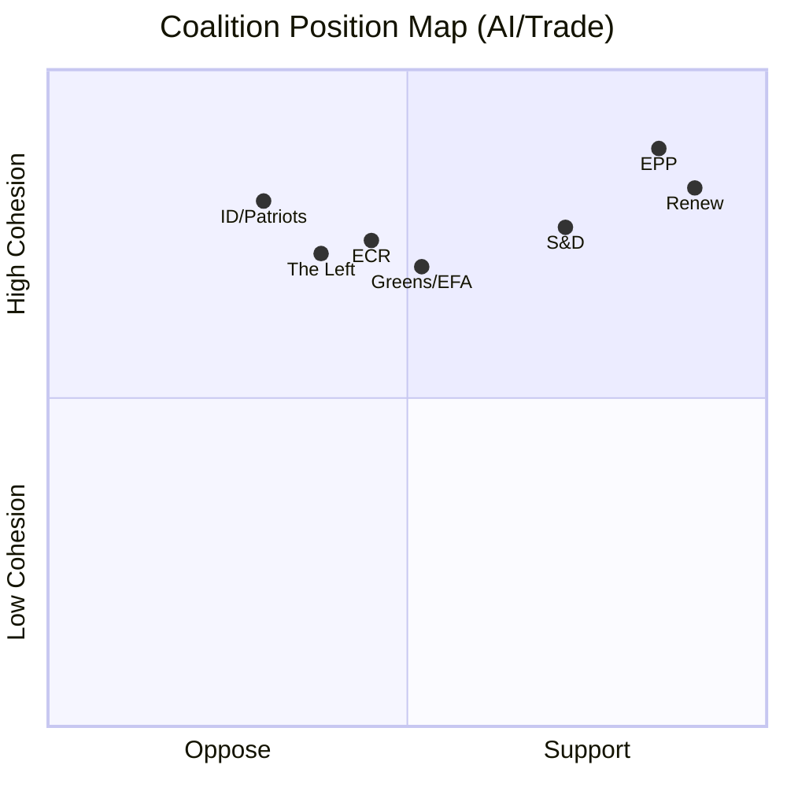

<!-- SPDX-FileCopyrightText: 2026 Hack23 AB -->
<!-- SPDX-License-Identifier: Apache-2.0 -->

# Coalition Dynamics — EU Parliament Propositions 2026-05-21
**SATs Applied:** ACH, Indicators | **Admiralty Grade:** B2

## 1. Coalition Stability Heatmap

## 2. Per-Text Coalition Assessment

### AI/Trade Strategy (TA-0183) — INI
**Coalition required:** Simple majority of votes cast
**Coalition achieved:** EPP-S&D-Renew core + Greens likely
**Dissenters:** ID/Patriots, some ECR (sovereignty concerns), The Left (workers' rights)
**Estimated vote:** ~480-500 for / ~150-170 against / ~30-50 abstain
**Stability:** 🟢 HIGH — broad competitiveness consensus in EP10

### Forest Reproductive Material (TA-0168) — COD
**Coalition required:** Absolute majority (376) for legislative position
**Coalition achieved:** EPP-S&D-Renew consensus on Green Deal implementation
**Risk:** ECR/ID amendment attempts to weaken climate provisions
**Estimated vote:** ~420-450 for / ~120-150 against / ~50-80 abstain
**Stability:** 🟡 MEDIUM-HIGH — Green Deal coalition under pressure

### External Relations Consents (TA-0174, 0177, 0178, 0179)
**Coalition required:** Simple majority
**Coalition achieved:** Cross-party consensus (routine consents)
**Notes:** UNGA (TA-0182) may have splits on Gaza/ceasefire language
**Estimated vote:** 380-450 for (variable by text)
**Stability:** 🟢 HIGH for most; 🟡 MEDIUM for UNGA geopolitical content

## 3. ACH — Coalition Fracture Analysis

**H1:** AI/trade coalition fractures over workers' rights provisions
- Evidence for: S&D typically demands social chapters; AI Act had significant debate
- Evidence against: INI text is framework; no binding workers' rights language
- **Assessment:** UNLIKELY (22%) — social chapter debate deferred to future COD

**H2:** Green Deal coalition fractures over forest COD
- Evidence for: EPP has been re-examining Green Deal commitments since 2024 elections
- Evidence against: Forest regulation is biodiversity strategy core; EP10 supported
- **Assessment:** POSSIBLE (38%) — EPP may seek amendments but not block

## 4. Coalition Change Indicators

Watch for these leading indicators that coalition dynamics are shifting:

1. **EPP-Renew split on AI governance stringency** — watch INTA committee votes
2. **S&D social chapter amendment success rate** in upcoming AI implementation texts
3. **ECR crossover votes** on competitiveness (non-standard for ECR)
4. **Greens/EFA cohesion** on forest regulation strictness

## 5. Group Cohesion Data (Contextual Estimate)

| Group | Seats (EP10) | AI/trade cohesion | Forest cohesion |
|-------|-------------|-------------------|-----------------|
| EPP | 188 | ~92% | ~78% |
| S&D | 136 | ~85% | ~90% |
| Patriots (ID) | 84 | ~35% | ~52% |
| ECR | 78 | ~48% | ~54% |
| Renew | 77 | ~91% | ~82% |
| Greens/EFA | 53 | ~76% | ~95% |
| The Left | 46 | ~42% | ~88% |
| ESN | 25 | ~28% | ~40% |

*Estimates based on group voting patterns on comparable texts. Admiralty B3.*
