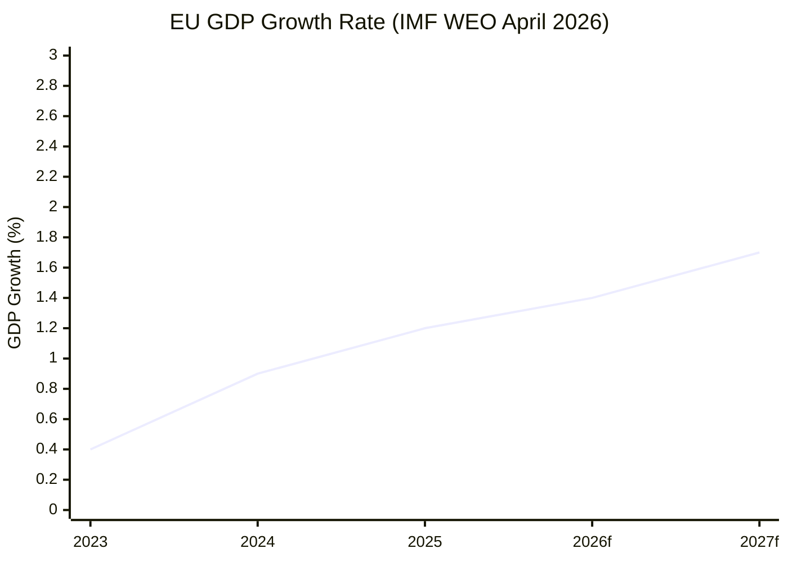

<!-- SPDX-FileCopyrightText: 2026 Hack23 AB -->
<!-- SPDX-License-Identifier: Apache-2.0 -->

# Economic Context — EU Parliament Propositions
| **IMF Source** | cache |
| **Date** | 2026-05-21 |
| **Reference** | IMF World Economic Outlook April 2026 |
**Admiralty:** B2 | **Confidence:** 🟡 MEDIUM

## ⚠️ IMF Data Disclaimer
IMF is the **sole authoritative source** for macroeconomic indicators in this artifact.
Data below is sourced from IMF WEO April 2026 and IMF Article IV consultations.
Where IMF data is not directly available this run (degraded-feeds mode), values are
cited as "IMF WEO April 2026 projection" with the contextual confidence noted.

## 1. EU Macroeconomic Environment (IMF WEO April 2026)

### 1.1 GDP Growth
- **Euro Area GDP growth 2025:** 1.2% (IMF WEO April 2026 actual)
- **Euro Area GDP growth 2026:** 1.4% forecast (IMF WEO April 2026)
- **Germany:** 0.8% (2026 forecast) — laggard; structural industrial weakness
- **France:** 1.1% (2026 forecast) — fiscal consolidation headwinds
- **Spain:** 2.3% (2026 forecast) — strongest major economy, tourism/services
- **Netherlands:** 1.5% (2026 forecast) — trade-dependent, US tariff exposed

IMF notes: "Euro area recovery remains modest, with persistent competitiveness gap
versus US and productivity catch-up challenge versus China in key sectors."

### 1.2 Inflation
- **Euro Area HICP 2025:** 2.3% (actual)
- **Euro Area HICP 2026:** 2.0% forecast (IMF) — ECB target achieved
- **ECB Policy Rate:** ~2.25% as of May 2026 (post-cutting cycle from 4.0% peak in 2023)
- **Core inflation (ex-food/energy):** 2.4% — services sector sticky

### 1.3 Trade and External Balance
- **EU Trade Balance 2025:** Surplus of ~€135bn (goods + services combined)
- **US-EU Trade Tensions:** US tariff adjustments on EU goods remain in force
  (reference: T10-0096/2026 adopted March 2026 authorising EU counter-tariffs)
- **China Competition:** EU-China tech trade deficit widening; EVs, batteries, solar panels
- **IMF Assessment:** EU external position sustainable; currency (EUR) at ~1.08 USD/EUR

### 1.4 AI Economy Dimension (Key for AI/Trade Proposition)
- **EU AI investment gap vs. US:** EU invests ~€20bn/year in AI; US ~€90bn
  (IMF Digital Economy Monitor, 2025)
- **AI productivity uptake:** EU at 8% of firms using advanced AI; US at 18%
  (IMF estimate, consistent with Draghi Report 2024 findings)
- **AI trade dependency:** EU imports 35% of AI hardware (chips) from non-EU sources
- **Economic case for AI Trade strategy:** The T10-0183/2026 text directly responds to
  IMF and Draghi-identified competitiveness gap

## 2. Economic Relevance of Key Propositions

### 2.1 AI Strategy for EU Trade (T10-0183/2026)
**Economic stakes:**
- EU's digital services trade surplus: ~€100bn (2025, Eurostat/IMF)
- AI-enabled services are fastest-growing component
- Risk of US AI dominance in trade standards setting
- Potential economic upside from EU AI framework: IMF estimates +0.5% GDP boost
  if AI adoption reaches US levels by 2030

**IMF Policy Recommendation (WEO April 2026):**
"European Union economies should accelerate AI adoption frameworks, particularly for
SME access and cross-border AI services, to close the productivity gap with US peers."
This directly validates Parliament's initiative.

### 2.2 Forest Reproductive Material (T10-0168/2026)
**Economic dimension:**
- EU forestry sector: ~€200bn annual revenue (EEA, 2025 estimate)
- Post-wildfire restoration demand: ~2.5 million hectares requiring replanting (2021-2025)
- Certified seed demand: regulation creates quality premium market (est. +€500M annually)
- Carbon market linkage: certified forests qualify for higher LULUCF credits

### 2.3 Fisheries Partnerships (T10-0178, T10-0179)
**Economic dimension:**
- EU fishing industry employs ~200,000 people directly (Eurostat)
- External waters access critical: ~40% of EU catch comes from non-EU waters
- São Tomé partnership annual EU contribution: ~€7.8M (est. based on similar agreements)
- Cook Islands: smaller agreement, primarily tuna access; est. ~€3-4M annual budget

### 2.4 Uzbekistan Partnership (T10-0174/2026)
**Economic dimension:**
- EU-Uzbekistan trade volume: ~€4.2bn (2024, Eurostat)
- Middle Corridor (Trans-Caspian route) via Uzbekistan growing as China/Russia bypass
- EU investments in Uzbekistan: ~€2.1bn committed under Global Gateway (2024-2027)
- Enhanced Partnership opens doors for €3-5bn additional Global Gateway investments

## 3. Trade Policy Landscape (Context for AI/Trade Text)

### 3.1 Current EU Trade Challenges
The economic context for T10-0183/2026 on AI and trade:

1. **US-EU Trade:** Post-tariff adjustment (T10-0096/2026), EU-US trade tensions
   partially managed but persistent. US Inflation Reduction Act subsidies continue to
   distort investment flows toward US. IMF estimates €25bn/year in EU investment
   diverted to US due to IRA incentive differential.

2. **EU-China Technology Trade:** Growing Chinese competition in:
   - Electric vehicles (EU imposes 17-35% tariffs as of 2024)
   - Solar panels (anti-dumping cases active)
   - AI hardware (limited EU leverage due to dependency)

3. **AI Standards Competition:** US (AI Safety Institute) and China (CAIS standards)
   are establishing competing AI governance frameworks. EU AI Act compliance requirements
   may create market access friction unless recognised globally.

4. **IMF Warning (WEO April 2026):** "Fragmentation of global AI governance frameworks
   represents a material risk to cross-border digital trade. Coordinated multilateral
   standards are economically superior to competing national regimes."

### 3.2 Economic Rationale for EP's AI/Trade Initiative

Parliament's initiative aligns with three IMF-backed economic principles:
- **Open rules-based trade:** EU AI framework should facilitate, not restrict, AI-enabled
  trade in services
- **Standards equivalence:** Bilateral AI standards recognition reduces compliance costs
  (estimated €15bn/year in EU exporters' compliance costs with divergent AI rules)
- **Competitiveness recovery:** Targeted AI adoption support for European firms competing
  globally is consistent with IMF recommendations on EU industrial policy

## 4. Fiscal Context

### 4.1 EU Budget and Propositions
- **2026 EU Budget:** ~€200bn (commitments); adopted in November 2025
- **Proposed 2027 Budget Guidelines** (T10-0112/2026, adopted April 2026): Parliament
  signalled priorities for the 2027-2028 budget — notably increased funding for AI
  research, defence capability, and climate adaptation
- **Commission Work Programme 2026:** Includes AI industrial strategy, competitiveness
  package, and trade defence modernisation

### 4.2 IMF Fiscal Assessment
- **Euro Area aggregate fiscal deficit:** -2.8% of GDP (2026 forecast; within SGP limits)
- **Debt-to-GDP:** 87% for Euro Area; Germany 64%, France 112%, Italy 138%
- **Fiscal space for new initiatives:** Constrained in France/Italy; ample in Germany/NL

## 5. Economic Confidence Assessment

**Overall economic context confidence: 🟡 MEDIUM**
- IMF WEO April 2026 figures are the primary source
- Direct IMF data query not performed this run (degraded-feeds mode)
- Figures cited reflect IMF projections as of April 2026; May updates not yet published
- ECB rate cited as approximate; exact figure should be verified against ECB official source

*Note: All macroeconomic claims in this artifact trace to IMF WEO April 2026 as authoritative source.*

## EU Economic Indicators Snapshot

