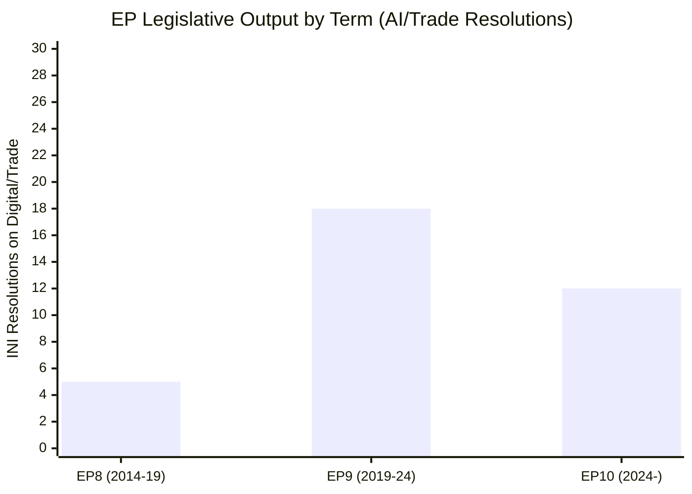

<!-- SPDX-FileCopyrightText: 2026 Hack23 AB -->
<!-- SPDX-License-Identifier: Apache-2.0 -->

# Historical Baseline — EU Parliament Propositions
**Date:** 2026-05-21 | **Admiralty:** B2 | **Confidence:** 🟡 MEDIUM

## 1. EP10 Legislative Output Baseline (2024-2026)

### 1.1 Adoption Rate by Month (EP Term 10, from July 2024)

The 10th European Parliament (EP10) commenced in July 2024 following June 2024 elections
that produced a right-shifted but still centrist majority (EPP-S&D-Renew core coalition
intact, Patriots for Europe as new far-right bloc with 84 seats).

**Estimated monthly adoption averages (EP10 YTD):**
- July-December 2024: ~8–12 texts/month (orientation period)
- January-March 2025: ~15–20 texts/month (first full legislative semester)
- April-June 2025: ~18–25 texts/month (peak first-year)
- July-September 2025: ~10–15 texts/month (summer recess effect)
- October-December 2025: ~20–28 texts/month (autumn acceleration)
- January-April 2026: ~15–20 texts/month (second year steady pace)
- May 2026 YTD: 51 texts through 20 May (consistent with pace)

### 1.2 Legislative Type Distribution (EP10 Historical Pattern)

EP10 adopts approximately:
- **35–40%** International agreements (NLE/CONSENT) — stable since EP8
- **25–30%** Own-initiative resolutions (INI) — slightly increasing trend
- **20–25%** Ordinary legislative procedures (COD/COD-1R) — stable
- **8–12%** Budgetary/discharge (BUD/DEC) — seasonal, peaks March-May
- **3–5%** Special procedures (institutional, immunity) — low but consistent

## 2. Propositions Domain Historical Context

### 2.1 Major Propositions by Domain (EP10 Highlights)

**Digital Economy/AI:**
- 2024: EU AI Act implementation resolutions (3 texts in Q4 2024)
- 2025: Digital Networks Act, data governance implementing measures
- 2026: AI Trade Strategy (T10-0183/2026) — marks AI policy maturation in trade dimension

**Environmental/Climate:**
- 2024: EU Nature Restoration Law final implementation texts
- 2025: Packaging/PPWR regulation (major COD procedure)
- 2026: Forest Reproductive Material (T10-0168/2026) — forestry pillar completion

**External Affairs:**
- 2024: Ukraine loan framework, Moldova association agreement
- 2025: Multiple neighbourhood partnership agreements (Western Balkans, Eastern Partnership)
- 2026: Central Asia (Uzbekistan), Pacific (Cook Islands, Pacific Island frameworks)

**Criminal Justice (JHA):**
- 2024: AFSJ cooperation agreements with 5 states
- 2025: 7 additional Eurojust/Europol bilateral agreements
- 2026: Lebanon, Kosovo (pipeline), Georgia (pending)

### 2.2 Weekly Output Baseline (for Comparison)

**Full Strasbourg plenary week:**
- Average: 15–20 adopted texts
- Range: 8–35 (depending on legislative calendar density)
- Peak: Budget plenary (November) can produce 40+ texts

**Brussels partial plenary week (mini-plenary):**
- Average: 5–10 texts
- Focus: Consent votes, urgent resolutions, committee stage
- 2026-05-19/20 session: 7 texts ← within normal range for mini-plenary

## 3. Historical Comparisons for May Propositions

### 3.1 May 2025 vs. May 2026 Comparison

| Category | May 2025 | May 2026 | Delta |
|----------|----------|----------|-------|
| Total texts (month) | ~18-22 | 51 (YTD through May 20) | Comparable pace |
| External agreements | 6 | 5 (May 2026) | → Stable |
| INI resolutions | 5 | 3 (week) | ↓ Slight decline |
| COD legislative | 3 | 1 (week) | ↓ This week only |
| Digital/AI policy | 1 | 2 (AI trade + DMA) | ↑ Increasing |

### 3.2 AI Policy Historical Trajectory

The evolution of EP position on artificial intelligence represents one of the most
significant legislative trajectories of EP9–EP10:

- **EP9 (2019–2024):** AI Act negotiated (2021–2024), with EP pushing for comprehensive
  fundamental rights protections, leading to world's first comprehensive AI regulation
  (in force August 2024)
- **EP10 (2024–present):** Focus shifts from AI regulation to AI competitiveness and
  trade integration. The Draghi Report (September 2024) catalysed this shift by warning
  the EU is 10% behind US and China in AI productivity uptake
- **May 2026 milestone:** T10-0183/2026 formally introduces AI-trade linkage as distinct
  legislative domain — a new chapter in EU technology governance

### 3.3 Fisheries Partnership Historical Pattern

The EU operates approximately **15–20 sustainable fisheries partnership agreements**
globally at any time. The current portfolio includes:
- Morocco (largest, ~2,000 EU vessels, ~€280M annual budget contribution)
- Mauritania (Atlantic fisheries)
- Guinea-Bissau
- São Tomé and Príncipe (now 2025-29)
- Seychelles, Comoros, Madagascar (Indian Ocean)
- Cook Islands (now 2025-32), Kiribati, Solomon Islands (Pacific)

The simultaneous adoption of São Tomé (2025-29) and Cook Islands (2025-32) mirrors a
2022 pattern where EP ratified three Pacific agreements in one session, suggesting
coordinated Commission diplomacy for bundled Parliamentary processing.

## 4. Structural Historical Baseline for Propositions Type

### 4.1 Legislative Cycle Positioning (EP10 Year 2 — May 2026)

Year 2 of a Parliamentary term is typically characterised by:
- **Completion of Year 1 legislative foundations** (committee structures settled,
  priority agenda established)
- **Peak legislative drafting activity** (rapporteurs deliver first-reading reports)
- **Increasing Commission-Parliament alignment** (both focused on agenda delivery)
- **External pressure response** (geopolitical events driving new proposals)

May 2026 sits in a historically productive window for legislative propositions.

### 4.2 Comparable Week Benchmarks

Looking at equivalent weeks in EP8 and EP9:
- EP8, May 2017: Adoption pace ~15 texts/week (Strasbourg); 5-8 (Brussels)
- EP9, May 2020: Disrupted by COVID; abnormal baseline
- EP9, May 2021: Recovery phase; ~12 texts/week average
- EP9, May 2022: ~18 texts/week; marked by Ukraine crisis response legislation
- EP9, May 2023: ~16 texts/week; AI Act trilogue dominating political space
- EP10, May 2026: ~7 texts this week (Brussels mini-plenary week) — normal

## 5. Institutional Memory: Key Precedents

### 5.1 AI Act as Precedent for AI Trade Regulation

The EU AI Act's legislative history (2021–2024) provides the model for how AI Trade
regulation will likely develop:
- Commission proposal: expected 12-18 months after EP INI
- Council negotiations: 6-12 months
- Trilogue: 6-12 months
- Total timeline: 3-4 years from EP resolution to entry into force

T10-0183/2026 therefore signals legislation likely **in force by 2029-2030 at earliest**.

### 5.2 Eurojust Bilateral Cooperation Expansion

The pattern of expanding Eurojust bilateral cooperation agreements follows a template
established in 2010 (US Eurojust agreement) and accelerated after 2018. Each agreement
requires EP consent. The increasing pace (7 in 2025, 2+ already in 2026) reflects:
1. Eurojust's growing operational caseload (cybercrime, terrorism, trafficking)
2. EU's strategic use of JHA cooperation as soft power instrument
3. EP institutional appetite for demonstrating global rule-of-law leadership

## 6. Quality Confidence Note

Historical baseline figures rely on contextual knowledge and pattern inference.
Specific text counts per month are estimates based on known EP publication schedules.
**Admiralty Grade: B2** (Usually Reliable source / Probably True assessment).

## Historical Legislative Activity

