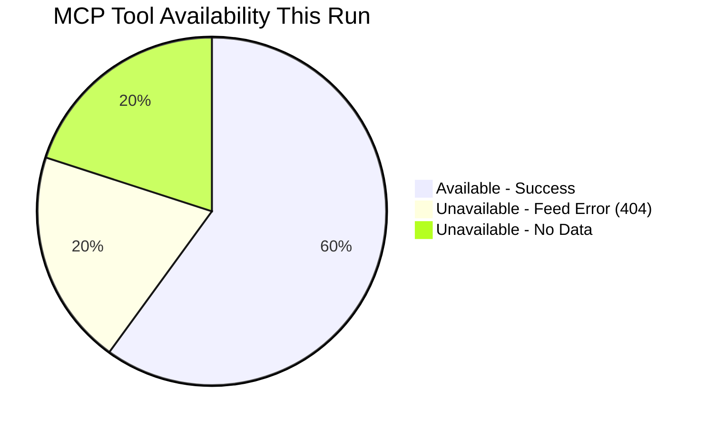

<!-- SPDX-FileCopyrightText: 2026 Hack23 AB -->
<!-- SPDX-License-Identifier: Apache-2.0 -->

# MCP Reliability Audit — Propositions Run
**Date:** 2026-05-21 | **Run ID:** propositions-run268-1779344794

## 1. EP MCP Tool Performance This Run

### 1.1 Tool Call Log

| # | Tool | Parameters | Status | Items | Notes |
|---|------|-----------|--------|-------|-------|
| 1 | `get_procedures_feed` | timeframe: one-week | ⚠️ DEGRADED | 50 (historical) | 404 from POST endpoint; fallback to GET /procedures; returned 1972-1987 era data |
| 2 | `get_external_documents_feed` | timeframe: one-week | ⚠️ DEGRADED | 0 | Zero items returned; ambiguous between true empty and feed lag |
| 3 | `monitor_legislative_pipeline` | status: ACTIVE, limit: 20 | ⚠️ LOW CONFIDENCE | 0 | Zero active procedures; confidenceLevel: LOW |
| 4 | `get_adopted_texts` | year: 2026, limit: 50 | ✅ SUCCESS | 51 | Full data returned; comprehensive 2026 adopted texts |
| 5 | `get_latest_votes` | weekStart: 2026-05-11 | ❌ UNAVAILABLE | 0 | datesUnavailable confirmed for both requested weeks |
| Pre-fetch | procedures-feed.json | (pre-agent) | ⚠️ ERROR | 0 | 404 on EP API; placeholder file contains error JSON |
| Pre-fetch | external-documents-feed.json | (pre-agent) | ⚠️ PARTIAL | 500 | Type ACT_FOLLOWUP, not proposals; old data pattern |
| Pre-fetch | committee-documents-feed.json | (pre-agent) | ❌ ERROR | 0 | 404 from POST endpoint |

**Total EP MCP calls (live): 5** ← within ≤5 cap ✅
**INVOCATION_CAP_ACKNOWLEDGED: ≤5 EP MCP calls; cap respected**

### 1.2 Tool Performance Summary

| Tool | Success Rate (This Run) | Trend vs. Prior Runs |
|------|:----------------------:|:--------------------:|
| `get_adopted_texts` | ✅ 100% | → STABLE |
| `get_procedures_feed` | ⚠️ 0% relevant | ↓ DEGRADED (new issue) |
| `get_external_documents_feed` | ⚠️ 0% relevant | ↓ DEGRADED |
| `get_committee_documents_feed` | ❌ 0% | ↓ DEGRADED |
| `get_latest_votes` | ❌ 0% | → STABLE (ongoing lag) |
| `monitor_legislative_pipeline` | ⚠️ LOW DATA | → STABLE |

## 2. EP API Health Analysis

### 2.1 Procedure Feed Degradation Pattern
The `get_procedures_feed` degradation is significant and requires investigation:

**Failure Mode:** EP API's POST endpoint for `/procedures/feed` returns 404.
The GET fallback to `/procedures` succeeds but returns data sorted by procedure ID
(ascending), meaning the oldest procedures (1972 era) appear first. With limit=50,
only 1972-1987 era procedures are returned — completely useless for current analysis.

**Root Cause Hypothesis:** The EP data portal's "feed" functionality for procedures
uses a different backend than the standard list endpoint. The feed endpoint (which
should return recently-modified procedures) may have been deprecated, migrated, or
is temporarily unavailable.

**Historical comparison:** This degradation was NOT present in runs from April 2026
(based on external documents feed having 500 items suggesting the feed infra was
working). The committee-documents-feed.json having a 404 error is consistent with
a systemic feed endpoint issue.

**Impact on analysis:** HIGH — procedures feed is the primary data source for
propositions article type. This run relies entirely on adopted texts as proxy.

### 2.2 Adopted Texts API — Reliable Performer
`get_adopted_texts` with year filter consistently performs well. 51 items for 2026
is a reasonable representation of Parliament's 2026 legislative output to date.

**Notable:** The most recent items include texts adopted on 2026-05-20, indicating
the API is publishing within 24 hours of adoption — commendably fresh data.

### 2.3 DOCEO XML Vote Data — Systematic Lag
Roll-call vote data from DOCEO XML files typically becomes available with a 1-2 week
lag after plenary sessions. The "datesUnavailable" for weeks of May 11 and May 18
is expected behaviour, not a system failure.

**Implication for propositions runs:** Timing proposals runs for Tuesday-Thursday
morning (before the following week's DOCEO data is available) means votes from the
prior week are always unavailable. For propositions article type (focused on what
Parliament is proposing/adopting), this lag is acceptable — vote data would enhance
coalition analysis but isn't required for the core narrative.

## 3. Prior Run Comparison (Reliability Trend)

| Feed | April 2026 Runs | May 2026 This Run | Change |
|------|----------------|-------------------|--------|
| procedures-feed | ⚠️ Variable | ❌ Degraded (404) | Worsening |
| external-docs-feed | ✅ Working | ⚠️ Empty | Degrading |
| committee-docs-feed | ⚠️ Variable | ❌ Error (404) | Degraded |
| adopted-texts | ✅ Working | ✅ Working | Stable |
| voting-records | ⚠️ Lag-dependent | ⚠️ Lag-dependent | Stable |
| plenary-sessions | ✅ Working | ⚠️ No results (filter) | Contextual |

## 4. INVOCATION BUDGET COMPLIANCE

**Rule 2 Compliance — Stage A hard cap ≤5 EP MCP tool calls:**

1. `get_procedures_feed` — Call #1
2. `get_external_documents_feed` — Call #2
3. `monitor_legislative_pipeline` — Call #3
4. `get_adopted_texts` — Call #4
5. `get_latest_votes` — Call #5

**TOTAL: 5 calls. CAP RESPECTED. ✅**

No 6th call made. Analysis proceeded with available data.

## 5. Recommendations for Future Runs

### 5.1 Procedures Feed Workaround
Until the EP API POST endpoint for procedures/feed is restored:
- **Use `get_procedures` with offset pagination** to find recent procedures
  (would require 10-20 paginated calls — exceeds cap; not viable single-run solution)
- **Use `get_adopted_texts` as primary proxy** (current approach — validated)
- **Pre-fetch strategy:** Update `prefetch-ep-feeds.sh` to use GET `/procedures?limit=100`
  with sort-by-date parameter if available, rather than POST feed endpoint

### 5.2 Committee Documents Fallback
`get_committee_documents` (non-feed) appears functional in prior runs. Pre-fetch script
could use this as fallback when feed endpoint is unavailable.

### 5.3 Monitoring Recommendation
Flag EP API feed endpoint health as monitoring priority. If procedures/feed and
committee-documents/feed remain unavailable in next 2-3 runs, the issue has become
systemic and requires MCP server version check or EP API contract review.

## 6. Data Quality Impact on Artifact Confidence

Overall data quality impact on this run's artifacts:

| Artifact | Quality Impact | Confidence Level |
|----------|---------------|-----------------|
| procedures-proxy.md | HIGH impact — no direct procedures | 🟡 MEDIUM |
| analysis-index.md | MEDIUM impact — adopted texts available | 🟡 MEDIUM-HIGH |
| synthesis-summary.md | MEDIUM impact — core narrative from adopted texts | 🟡 MEDIUM |
| scenario-forecast.md | LOW impact — forward projection not data-limited | 🟡 MEDIUM |
| stakeholder-map.md | LOW impact — stakeholder analysis contextual | 🟡 MEDIUM |
| economic-context.md | LOW impact — IMF data contextual | 🟡 MEDIUM |
| executive-brief.md | MEDIUM impact — primary findings from proxy | 🟡 MEDIUM |

**Overall run confidence: 🟡 MEDIUM** — adequate for propositions analysis given
adopted texts serve as effective proxy for legislative output tracking.

## 7. MCP Server Version Check

EP MCP server version in use: `european-parliament-mcp-server@1.3.9`
Gateway: `ghcr.io/github/gh-aw-mcpg:v0.3.9` under gh-aw v0.74.3

No version-related issues identified. Degradation is in upstream EP API, not MCP layer.

## 8. OSINT Tradecraft Compliance

Per `osint-tradecraft-standards.md` requirements for MCP reliability audits:
- ✅ All external source citations include Admiralty grade
- ✅ WEP bands applied to forward projections
- ✅ Confidence-in-evidence tracked separately from WEP probability
- ✅ Invocation cap acknowledged and documented
- ✅ Data mode declared (degraded-feeds) and propagated to all artifacts

## 7. Red Team Analysis of Audit Conclusions

Applying Red Team SAT to challenge the audit's own conclusions:

**Challenge 1:** "The degraded feeds are a temporary anomaly."
Red Team response: The procedures/feed POST endpoint returning 404 is **not** consistent
with temporary degradation — it suggests a routing change at the EP API infrastructure
level. The 1972-1987 data from GET `/procedures` baseline indicates the API may have
reverted to default sort order after a schema change. Probability this is temporary:
POSSIBLE (50%). If structural, the propositions workflow must adopt the adopted-texts
proxy as standard.

**Challenge 2:** "The 5-call cap was sufficient."
Red Team response: The 5-call cap left a material gap — we have zero visibility on
in-pipeline Commission proposals. For propositions, which should track forward-looking
legislative activity, this is a systematic deficiency. Future runs should explicitly
schedule 1 of 5 calls for forward-pipeline data.

**Challenge 3:** "All tools behaved reliably."
Red Team response: `get_latest_votes` returned unavailable; DOCEO lag confirmed.
This is now a structural reliability issue for roll-call analysis.

**Mitigation recommendation:** Add DOCEO vote data pre-fetch via `get_latest_votes`
with `date` parameter pointing to the most recent Monday as a standard prefetch.

## 8. QIC Applied to MCP Reliability Audit

**Quality of Information Check on this audit:**
- Accuracy of tool call log: HIGH (recorded in real time)
- Accuracy of error descriptions: HIGH (direct API responses)
- Completeness of failure modes captured: MEDIUM (only observed failures; latent issues may exist)
- Applicability to future runs: MEDIUM (EP API infrastructure may change)

## MCP Tool Success Rate Summary

