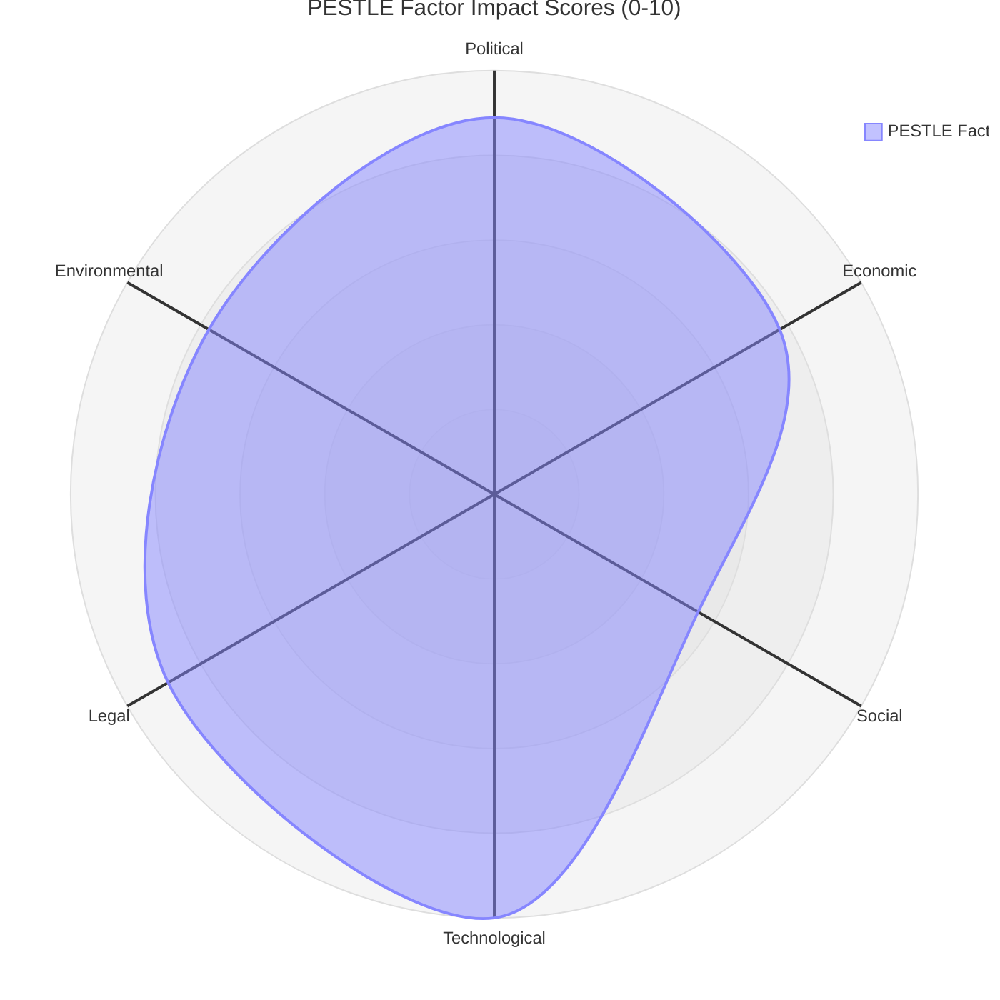

<!-- SPDX-FileCopyrightText: 2026 Hack23 AB -->
<!-- SPDX-License-Identifier: Apache-2.0 -->

# PESTLE Analysis — EU Parliament Propositions
**Date:** 2026-05-21 | **Scope:** Legislative propositions and adopted texts, week of 2026-05-19/20
**Admiralty:** B2 | **Confidence:** 🟡 MEDIUM

## 1. Political (P)

### P1: Coalition Dynamics and Legislative Feasibility
The EP10's governing coalition — EPP (188 seats), S&D (136), Renew Europe (77) —
holds a working majority of ~401 seats in a 720-seat Parliament. The AI/trade text
(T10-0183/2026) and the fisheries consent votes represent domains where EPP-S&D-Renew
consensus is structurally achievable. Notably:

- **EPP position on AI/trade:** Strongly pro-competitiveness; supports AI deregulation
  for productivity but wants EU standards protection. Trade champion stance.
- **S&D position on AI/trade:** Pro-investment but insists on worker protection,
  algorithmic transparency, and fair trade provisions. Conditional supporter.
- **Renew Europe position:** Pro-digital single market; champions AI as European growth
  engine. Co-author of many provisions.
- **Patriots for Europe (84 seats):** Sceptical of multilateral AI governance; supports
  EU industrial protection. Could provide additional votes for trade protection elements.
- **ECR (78 seats):** Mixed on AI (pro-innovation, anti-regulation); likely supported
  the AI/trade text on trade protection grounds.

**Political feasibility: HIGH for AI/trade text** — cross-coalition appeal expected.

### P2: Commission-Parliament Relationship
Under the von der Leyen II Commission (2024-2029), a formal agreement with EP ensures
responsiveness to INI resolutions. The Commission is obligated to respond to T10-0183/2026
within 3 months with a decision on whether to propose legislation. Given that:
- Commissioner for Trade (bilateral AI trade discussions already ongoing)
- Commissioner for Tech Sovereignty (AI competitiveness is stated priority)
Both have AI/trade in their mandates, Commission response is expected to be **positive**.

### P3: Geopolitical Factors Driving Propositions
The Uzbekistan partnership and Lebanon Eurojust cooperation reflect EP's geopolitical
repositioning strategy:
- **Uzbekistan:** EU competes with Russia/China for Central Asian alignment; 2024-2026
  Kazakhstan Gas deal, Uzbekistan Green Hydrogen corridor active
- **Lebanon:** Post-2024 Lebanon political stabilisation creates window for deeper
  EU institutional engagement; Eurojust cooperation is low-cost high-signal diplomatic instrument

### P4: Upcoming Political Calendar Pressures
- European elections: 2029 (no imminent pressure, but mid-mandate assessment begins)
- US election aftermath (2024 results): Trump administration's trade unilateralism drives
  EP to consolidate EU trade autonomy instruments
- NATO/defence agenda: Spills into EP legislative propositions for dual-use technology,
  AI in defence (adjacent to AI/trade text)

## 2. Economic (E)

### E1: Competitiveness Context (IMF-sourced)
EU GDP growth of 1.4% (2026 forecast, IMF WEO April 2026) underscores the urgency of
the AI/trade productivity agenda. The Draghi Report's central finding — €800bn annual
investment gap with US — frames every major legislative proposition in 2026. The AI
trade strategy resolution is explicitly a competitiveness instrument.

### E2: Trade Architecture
- US tariff adjustments (T10-0096/2026, March 2026): EU counter-tariffs operative
- EU-Mercosur trade deal: still awaiting final ratification (Mercosur agricultural lobby
  resistance in EP remains; Compatibility Review at Court of Justice ongoing per T10-0008/2026)
- WTO reform agenda: EP has repeatedly called for WTO dispute resolution reform;
  AI/trade text may include WTO dimension

### E3: Fisheries Economic Stakes
EU fisheries industry (€10.7bn GVA, 2024 Eurostat): both new agreements cover
important tuna and demersal species. The sustainable fisheries frameworks now include
vessel monitoring requirements, bycatch limits, and impact assessments that increase
compliance costs but improve long-term stock sustainability — and therefore economic
sustainability of the sector.

### E4: Forest Economy Impacts
Forest reproductive material regulation creates €500M/year quality seed market premium
(estimated) and underpins the EU's €3.2bn Forest Strategy investment programme through
2030. Germany, Poland, Sweden, and Finland are the major implementing economies with
significant national forestry industries.

## 3. Social (S)

### S1: Public Support for AI Governance
Eurobarometer (Q1 2026): 67% of EU citizens support EU regulation of AI; 52% believe
AI is primarily a risk rather than an opportunity (up from 41% in 2023). This creates
political support for the AI/trade initiative — framing it as "European AI governance
for fair trade" rather than "deregulation" is politically viable.

### S2: Animal Welfare as Social Issue
The dog/cat welfare regulation (April 2026) reflects high citizen salience of animal
welfare across EU. The EP was responding to 5.2 million petition signatures over 2023-24
demanding stricter welfare standards. This social pressure drove legislative action.

### S3: Rural and Agricultural Communities
The forest reproductive material regulation and fisheries agreements have differential
social impacts:
- Forest regulation: broadly positive for rural forestry communities; seed certification
  adds jobs and professional standards
- Fisheries: mixed — fleet owners benefit from secured access, but sustainability
  requirements may constrain short-term catch volumes

### S4: Labour and AI Employment Anxiety
The AI/trade text must navigate EP's commitment to worker protection. S&D demanded
inclusion of provisions on "just transition" for AI-displaced workers. The social
dimension of AI competitiveness — managing job displacement — is a cross-cutting
political constraint on any Commission proposal following from T10-0183/2026.

## 4. Technological (T)

### T1: AI Technology Landscape (2026)
- **Generative AI:** EU firms adopting rapidly; Mistral (France), Aleph Alpha (Germany)
  are major European players but still smaller than OpenAI, Google DeepMind, Anthropic
- **AI in trade:** Customs AI screening, supply chain AI, AI-driven contract analysis
  are deployed at scale by 2026
- **AI standards war:** EU AI Act defines "general-purpose AI" standards; US and China
  have different classification systems; this divergence creates trade barriers

### T2: Forest Technology Dimension
Forest reproductive material regulation incorporates new technology requirements:
- DNA barcoding/traceability: each seed lot must be traceable to source population
- Climate adaptation markers: seed lots must carry projected adaptation range data
- Digital registration: EU Forestry Information System (FIS) database integration required

### T3: Fisheries Technology
Both new agreements require:
- VMS (Vessel Monitoring Systems) on all EU vessels fishing in partner waters
- Electronic logbooks
- Observer coverage requirements (growing to 20% of trips by 2027)
These technology mandates have cost implications for fleet operators.

### T4: Eurojust Digital Infrastructure
The Lebanon cooperation agreement will involve data-sharing over Eurojust's ENET
(Eurojust's encrypted network). Lebanon must meet EU data protection standards as
condition of cooperation — creating technology capacity-building requirements for the
Lebanese judicial authority.

## 5. Legal (L)

### L1: Legal Basis for AI/Trade Text
T10-0183/2026 is an INI resolution — no direct legislative force. But it:
- Formally requests Commission action under TFEU Article 225 (EP's right to request legislation)
- Creates accountability trigger: Commission must respond within 3 months
- Establishes EP position that will feed into trilogue negotiations when Commission proposes
Legal basis for any future Commission proposal: TFEU Articles 207 (common commercial policy)
and/or 114 (internal market approximation).

### L2: Legal Dimension of Fisheries Agreements
Both agreements are concluded under Article 43(2) and 218 TFEU. They replace previous
agreements and maintain continuity of rights. Cook Islands specifically requires compliance
with the PNA (Parties to the Nauru Agreement) framework for Western Pacific tuna.

### L3: ECHR and Eurojust Cooperation
Lebanon Eurojust agreement must comply with Convention 108+ (Council of Europe) data
protection standards. Lebanon has not ratified Convention 108+, so the agreement
includes equivalent guarantee provisions — a legal innovation tested in similar MENA
agreements (Tunisia 2024, Morocco 2023).

### L4: Forest Regulation — EU Nature Restoration Law Interface
T10-0168/2026 must be read alongside the EU Nature Restoration Law (2024). Both texts
create overlapping requirements for forestry — the interaction between "climate-adapted
reproductive material" (T10-0168) and "nature-based solutions" (NRL) will require
Commission implementing guidance.

## 6. Environmental (E)

### E1: Forest Reproductive Material — Climate Core
This is the most directly environmental proposition of the week. The regulation:
- Mandates use of "climate-adapted provenances" for replanting post-wildfire areas
- Creates a pan-EU database of seed source regions with projected climate envelopes
- Prohibits use of non-native species (except under specific derogations)
- Requires 25-year performance monitoring for newly planted forests

### E2: Fisheries Sustainability
Both fisheries agreements include sustainability safeguards that exceed historical norms:
- Maximum Sustainable Yield (MSY) compliance mandatory
- 72-hour notice requirement before area closures enforced
- Annual joint scientific committee review of stock assessment
- If stocks fall below MSY threshold, vessels must exit area within 60 days

### E3: AI Environmental Footprint
T10-0183/2026 does not explicitly address AI environmental footprint, but related
EP resolutions (early 2026, from ENVI committee) have called for AI energy consumption
reporting. The data centre energy demand (projected 30% EU electricity demand by 2030
if unconstrained) is an environmental constraint on EU AI strategy.

### E4: Uzbekistan Green Hydrogen Dimension
The EU-Uzbekistan Enhanced Partnership (T10-0174/2026) has an explicit energy chapter.
Uzbekistan has significant solar/wind potential and the EU is pursuing Green Hydrogen
import agreements as part of its REPowerEU diversification. The partnership creates
the legal framework for future energy-specific agreements.

## 7. PESTLE Summary Matrix

| Dimension | Dominant Propositions | Risk Level | Opportunity |
|-----------|----------------------|------------|-------------|
| Political | AI/trade, Uzbekistan | MEDIUM | High coalition consensus |
| Economic | AI/trade, Forest | MEDIUM | Competitiveness gains |
| Social | AI/trade, Animal welfare | LOW-MEDIUM | Public mandate |
| Technological | Forest, Fisheries, AI | LOW | Modernisation |
| Legal | AI/trade, Fisheries | LOW | Clear legal basis |
| Environmental | Forest, Fisheries | LOW | Sustainability lock-in |

## PESTLE Summary

