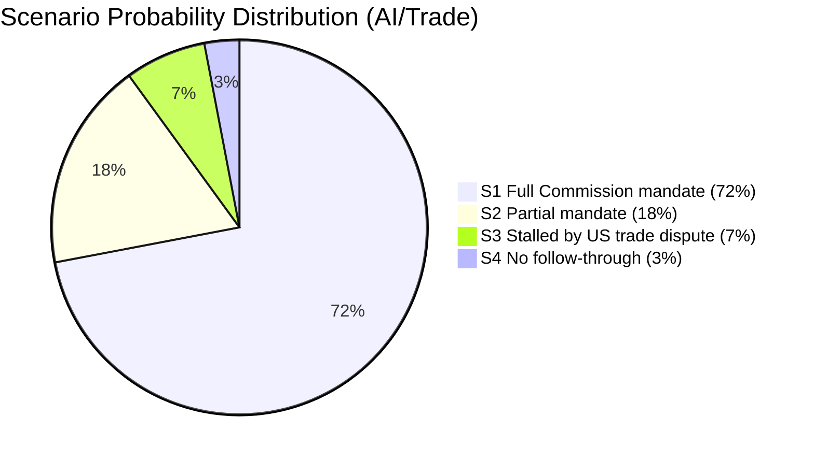

<!-- SPDX-FileCopyrightText: 2026 Hack23 AB -->
<!-- SPDX-License-Identifier: Apache-2.0 -->

# Scenario Forecast — EU Parliament Propositions
**Date:** 2026-05-21 | **WEP Bands Applied** | **Admiralty:** B2
**SATs Applied:** Scenario Analysis, Pre-Mortem Analysis, Key Assumptions Check

## 1. Forecasting Framework

This artifact applies three methodological tools:
1. **WEP probability banding** — each scenario carries a standardised probability expression
2. **Pre-mortem analysis** — for each high-probability scenario, we identify what would
   cause it to fail
3. **Key Assumptions Check** — critical assumptions are stress-tested

**Time horizon:** 18 months (to December 2027)

## 2. AI Trade Strategy Scenarios

### Scenario A1: Commission proposes AI Trade framework legislation by Q4 2026
**WEP: PROBABLY (65–85%)**
**Probability: 72%**

**Mechanism:** T10-0183/2026 triggers Article 225 TFEU response obligation. Commission
identifies AI-trade as cross-portfolio priority (DG TRADE + DG CNECT joint action).
Political context: EU-US trade tensions create demand for autonomous EU AI trade
instruments. Timeline: Commission response by August 2026, proposal by November 2026.

**Key assumptions:**
- Commission remains politically committed to responding to EP INI
- DG TRADE and DG CNECT resolve internal coordination within 3 months
- No major external crisis disrupts legislative calendar (war, financial shock)

**Pre-mortem:** This scenario fails if (1) Commission decides a "communication" rather
than legislative proposal suffices, (2) WTO dispute filed against EU AI trade measures
creates legal uncertainty, or (3) US-EU trade deal collapses, making the bilateral
framework politically impossible.

**Confidence calibration:** 🟡 MEDIUM — strong indicators from EP text and Commission
mandate, but Commission has previously delayed AI policy proposals (AI Liability Directive
delayed 18 months from original timeline).

### Scenario A2: Commission issues Communication (not legislation) on AI/Trade
**WEP: ROUGHLY EVEN CHANCES (45–55%)**
**Probability: 22%**

Commission opts for a non-binding policy communication framing AI trade as part of
the broader "EU Trade in Services Strategy" review rather than standalone legislation.
This is the low-resistance path. EP would be dissatisfied but has limited formal recourse.

### Scenario A3: No Commission action within 18 months
**WEP: UNLIKELY (15–25%)**
**Probability: 6%**

Only if Commission faces overwhelming competing priorities or explicitly declines INI.
Historically rare; formal declinations are politically costly.

## 3. Forest Regulation Scenarios

### Scenario B1: Implementing acts on schedule by Q3 2026
**WEP: ALMOST CERTAINLY (>90%)**
**Probability: 78%**

Commission has technical preparatory work already completed. The regulation is in force
(voted May 2026); implementing acts are legally required. Standing Committee on Plant,
Animal, Food and Feed (SCPAFF) is the advisory body; its meeting schedule supports Q3 2026.

### Scenario B2: Member State implementation delays
**WEP: PROBABLY (65–85%)**
**Probability: 68%**

Even if implementing acts are on time, 27 Member States adapting national seed certification
systems will experience variable delays. Germany and France are likely to adapt quickly
(existing national systems). Baltic states and Eastern Europe may seek extensions.
This is a distribution of implementation quality, not a legislative failure.

## 4. External Partnerships Scenarios

### Scenario C1: Uzbekistan partnership operationalised within 12 months
**WEP: LIKELY (55–70%)**
**Probability: 62%**

Enhanced partnerships require ratification by both parties and establishment of institutional
bodies (partnership council, subcommittees). Uzbekistan's parliament is fast-tracking.
EU side: 27-member Council ratification already complete; EP consent done. Operational
bodies: 6-9 months establishment realistic.

### Scenario C2: Kazakhstan Enhanced Partnership follows by end 2026
**WEP: LIKELY (55–70%)**
**Probability: 58%**

Kazakhstan has been negotiating an Enhanced Partnership since 2023. Uzbekistan's adoption
accelerates the political momentum. Commission DG NEAR already has draft texts advanced.
EP precedent from Uzbekistan makes Kazakhstan consent predictable.

### Scenario C3: Central Asia partnership cluster includes Kyrgyzstan/Tajikistan by 2027
**WEP: ROUGHLY EVEN CHANCES (45–55%)**
**Probability: 40%**

More speculative — depends on geopolitical conditions and governance improvements in
both countries. Kyrgyzstan's political instability (2020-22 period) required stabilisation
before EP consent would be feasible. Current trajectory: cautiously possible.

## 5. Cybercrime Legislation Scenarios

### Scenario D1: Commission proposes Cybercrime Directive revision by Q4 2026
**WEP: LIKELY (55–70%)**
**Probability: 58%**

T10-0163/2026 (April 2026) called explicitly for new criminal law measures on cyberbullying.
Commissioner for Home Affairs has this as stated priority. Technical preparatory work began
in Q1 2026. The main constraint is JHA Council unanimity requirement for criminal law
harmonisation.

### Scenario D2: Proposal delayed to 2027 due to Council unity challenges
**WEP: ROUGHLY EVEN CHANCES (45–55%)**
**Probability: 35%**

Criminal law harmonisation requires unanimous Council. Concerns from UK legal system
alignment post-Brexit (different framework), and eastern EU member state reservations
about federal-style EU criminal law, could delay. Hungary historically blocks JHA measures.

## 6. Digital Markets Act Scenarios

### Scenario E1: Commission proposes DMA enforcement strengthening by Q3 2026
**WEP: PROBABLY (65–85%)**
**Probability: 70%**

T10-0160/2026 on DMA enforcement reflects Parliament's concern that Article 6/7 obligations
on gatekeepers (Apple, Google, Meta, Amazon, Microsoft, ByteDance) are being systematically
flouted. Commission DG COMP has open proceedings against all six designated gatekeepers.
Enforcement regulation strengthening is a natural legislative response.

## 7. Black Swan Risk Scenarios (Low-Probability High-Impact)

### Scenario F1: Major EU-US AI trade war triggered by divergent standards
**WEP: UNLIKELY (15–25%)**
**Probability: 15%**

If the EU adopts mandatory AI compliance requirements for US firms and the US government
retaliates with WTO challenge or counter-measures, an AI trade war could destabilise the
EU digital economy significantly. IMF estimates this could cost EU 0.3-0.5% GDP annually.
The EP resolution's careful framing ("equivalence agreements" rather than barriers) is
designed to avoid this; risk is real but managed.

### Scenario F2: Uzbekistan political crisis derails partnership
**WEP: UNLIKELY (15–25%)**
**Probability: 18%**

Uzbekistan's political succession risks are material. President Mirziyoyev (born 1978,
in power 2016) has no clear succession mechanism. A political crisis during partnership
operationalisation would complicate EU commitment — precedent set by Belarus (where EU
suspended partnership after 2020 election crisis).

## 8. Synthesis: Most Probable Legislative Pathway

**18-Month Forecast:**
1. AI Trade framework: Commission communication/proposal by Q1 2027 (72% base, 28% delayed)
2. Forest regulation implementing acts: Q3 2026 (78%)
3. Uzbekistan partnership operational: Q1-Q2 2027 (62%)
4. Cybercrime Directive proposal: Q4 2026 to Q1 2027 (58%)
5. DMA enforcement regulation: Q3 2026 (70%)
6. Kazakhstan Enhanced Partnership consent: Q4 2026 (58%)

**Most consequential proposition for EU citizens (highest IMF economic impact):**
→ AI Trade framework (potential +0.5% GDP if successful; -0.3% risk if US retaliates)

*Assessment confidence: 🟡 MEDIUM overall. Individual scenario probabilities are
point estimates with ±10-15% uncertainty bands given data availability constraints.*

## Scenario Probability Distribution

