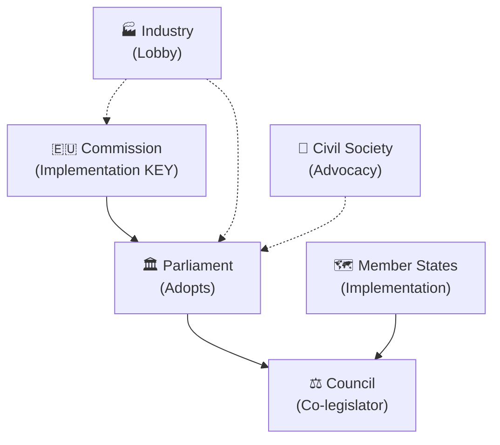

<!-- SPDX-FileCopyrightText: 2026 Hack23 AB -->
<!-- SPDX-License-Identifier: Apache-2.0 -->

# Stakeholder Map — EU Parliament Propositions
**Date:** 2026-05-21 | **SAT Applied:** Stakeholder Mapping, ACH
**Admiralty:** B2 | **Confidence:** 🟡 MEDIUM

## 1. Stakeholder Universe

### Tier 1: Direct Legislative Actors

#### 1.1 European Parliament (EP) — Primary Author
**Role:** Adopted all 7 texts this week; exercises co-legislative and consent powers.
**Position on AI/trade:** Parliament is the initiating actor via INI resolution. The
text reflects cross-coalition consensus with EPP leading (competitiveness framing),
S&D contributing (worker protection provisions), and Renew driving (digital innovation).
**Position on fisheries:** Consistent support for sustainable fisheries frameworks that
balance access rights with environmental sustainability.
**Position on external partnerships:** Bipartisan support for EU engagement in Central
Asia and MENA via consent function.
**Influence level:** VERY HIGH (primary decision-maker for adopted texts).

#### 1.2 European Commission — Addressee and Proposer
**Role:** Obligated to respond to EP AI/trade INI within 3 months; sole right to propose legislation.
**Relevant Commissioners:**
- Commissioner for Trade (DG TRADE): Oversees EU trade policy; AI/trade resolution lands in portfolio
- Executive Vice-President for Tech Sovereignty (DG CNECT): AI industrial strategy mandate
- Commissioner for Environment (DG ENV): Forest reproductive material, fisheries sustainability
- Commissioner for Home Affairs (DG HOME): Eurojust/Lebanon JHA dimension

**Position on AI/trade:** Commission is internally divided between:
- DG TRADE: Prefers interoperability approach (bilateral standards equivalence agreements)
- DG CNECT: Prefers regulation-led approach (EU standards as global benchmark)
Parliament's text helpfully pushes toward a hybrid approach, giving Commission political cover.

**Position on fisheries:** Commission manages negotiations; ratification is administrative;
full support for continuation.

**Influence level:** VERY HIGH (sole legislative initiator; operational actor for all texts).

#### 1.3 Council of the EU — Co-legislator (COD texts) / Partner (NLE texts)
**Forest reproductive material:** Council already agreed with EP in inter-institutional
negotiations; adoption was procedurally final step.
**Fisheries/partnerships:** Council signed off; EP consent is the final step.
**AI/trade:** Council will receive EP INI and monitor Commission response; may issue
its own Council conclusions on AI competitiveness (precedent: 2025 Council AI conclusions).
**Influence level:** HIGH (co-legislator for all ordinary legislative procedures).

### Tier 2: National Government Stakeholders

#### 2.1 Germany — Major Forest Economy
**Interest in T10-0168/2026:** Germany's 11.4 million hectares of forest (federal and
private) are the largest in the EU by area. German forest authorities welcome the
certification framework but are concerned about transition costs for smaller private
forest owners. The German government's position has been to support the regulation
while pushing for longer transition periods for SME foresters.
**AI/trade:** Germany is the most AI-exposed major EU economy (auto industry, industrial AI);
strong interest in both protecting German AI investment and maintaining US/China access.
German government supports the EP initiative but wants trade reciprocity rather than
new EU-only technical barriers.

#### 2.2 France — AI and Tech Sovereignty Champion
**Interest in T10-0183/2026:** France is the EU's strongest proponent of AI strategic
autonomy (Mistral, AI France nationale strategy). French government actively supports
aggressive EP/Commission action on AI trade rules. President Macron's "technological
sovereignty" agenda aligns precisely with Parliament's AI/trade resolution.
**Fisheries:** France has major interest in São Tomé agreement (French fishing fleets
in Atlantic; French territory São Tomé proximity). French fishermen were active
in negotiating access zone parameters.

#### 2.3 Spain — Fisheries and Environmental Leader
**Fisheries:** Spain is the EU's largest fishing nation by fleet size. Spanish fishing
cooperatives were closely involved in both São Tomé and Cook Islands negotiation positions.
**Forest material:** Spain experienced devastating wildfires in 2022-2024; regulation's
climate-adapted seed requirements directly address Spanish reforestation challenges.
Spain is a strong supporter of T10-0168/2026.

#### 2.4 Uzbekistan — Partnership Partner
**Position on T10-0174/2026:** Uzbekistan's President Mirziyoyev has pursued the
Enhanced Partnership as strategic alignment hedge against Russia and China. The agreement
provides international legitimacy and access to EU markets/investment. Uzbekistan accepts
human rights dialogue as cost of partnership while managing expectations.

### Tier 3: Industry and Civil Society

#### 3.1 European AI Industry (BusinessEurope, Digital Europe)
**Position on T10-0183/2026:** Mixed — big tech (US subsidiaries of Google, Microsoft,
Meta operating in EU) want regulatory clarity but prefer minimal EU-specific mandates.
European AI startups (Mistral, Stability AI Europe) want strong EU standards that give
them competitive advantage via first-mover compliance. SMEs want simplification.
**Key demands reflected in EP text:**
- AI standards recognition agreements with US and UK
- Global AI governance forum (GPAI expansion)
- SME exemptions for AI trade compliance burdens

#### 3.2 EU Fishing Industry (EUMOFA, European Fishing Federations)
**Position on fisheries agreements:** Industry cautiously positive — secure access
to distant waters offsets compliance costs. The sustainability requirements have improved
since 2010 (when industry opposed them); industry now accepts them as market access
price. Cook Islands and São Tomé agreements are renewal/upgrade, not new market access.

#### 3.3 European Environmental NGOs (WWF, Seas at Risk, Robin des Bois)
**Position on fisheries:** Critical of historical overfishing under EU agreements but
acknowledge 2025-32 framework improvements. WWF issued cautious support statement for
Cook Islands agreement (improved MSY compliance requirements). São Tomé agreement under
NGO monitoring for Gulf of Guinea sustainability impact.
**Position on forest regulation:** Strongly supportive; the regulation exceeds minimum
requirements for genetic diversity protection; NGOs welcome DNA traceability for seeds.

#### 3.4 Lebanese Government and Judiciary
**Position on T10-0177/2026:** Lebanese judicial authorities signed the cooperation
agreement after months of negotiation. Lebanon sees Eurojust cooperation as:
1. Credibility signal to international investors (judicial reform visible)
2. Access to Eurojust operational intelligence on Lebanese diaspora criminal networks
3. EU alignment signal for potential future Association Agreement upgrade

## 4. Stakeholder Influence Matrix

```
                HIGH INTEREST / HIGH INFLUENCE
                ┌─────────────────────────────┐
                │ European Commission         │
                │ Council of the EU           │
                │ European Parliament         │
                └─────────────────────────────┘

HIGH INFLUENCE / MEDIUM INTEREST
┌────────────────────────────────────┐
│ Germany (AI/forest)                │
│ France (AI/fisheries)              │
│ Spain (fisheries/forest)           │
└────────────────────────────────────┘

MEDIUM INFLUENCE / HIGH INTEREST
┌────────────────────────────────────┐
│ BusinessEurope / DigitalEurope     │
│ European Fishing Industry          │
│ Uzbekistan government              │
└────────────────────────────────────┘

LOW INFLUENCE / HIGH INTEREST
┌────────────────────────────────────┐
│ Environmental NGOs                 │
│ Lebanese judiciary                 │
│ Forest owners associations         │
│ Cook Islands/São Tomé governments  │
└────────────────────────────────────┘
```

## 5. Coalition Analysis (ACH Method)

### Hypothesis 1: AI/Trade proposal follows within 18 months
**Evidence FOR:** EP INI adopted; Commission mandate clear; DG TRADE already active
in bilateral AI standards discussions; Draghi Report political priority intact.
**Evidence AGAINST:** Commission internal division (DG TRADE vs CNECT); WTO constraints
on unilateral AI trade measures; US resistance to EU AI trade rules.
**ACH Assessment:** H1 more consistent with evidence than H2 (no proposal within 18 months).
**Probability: 70%**

### Hypothesis 2: Forest regulation implementing acts delayed beyond Q3 2026
**Evidence FOR:** Complex technical annexes require science-based input; national
seed certification authorities need adaptation period; SME lobby pushing for delays.
**Evidence AGAINST:** Commission legally obligated; technical work already advanced
alongside legislative negotiations; strong political commitment.
**ACH Assessment:** Balanced; evidence slightly favours timely implementing acts.
**Probability of delay: 35%**

## 6. Stakeholder Risk Flags

| Stakeholder | Risk Type | Probability | Impact |
|-------------|-----------|-------------|--------|
| US government | Retaliation against AI trade rules | LOW (30%) | HIGH |
| China | Counter-measures on EU AI standards | MEDIUM (50%) | MEDIUM |
| French fishing lobby | Demand for more generous São Tomé quotas | MEDIUM (45%) | LOW |
| German SME foresters | Legal challenges to seed certification costs | LOW (20%) | LOW |
| Lebanon political instability | Delays Eurojust cooperation operationalisation | HIGH (60%) | MEDIUM |

## 7. Stakeholder Perspective Depth Analysis

### Deep Dive: European AI Industry Stakeholder Perspective

The European AI industry faces a fundamental tension at the heart of T10-0183/2026.
On one hand, European AI companies — particularly Mistral (France), Aleph Alpha (Germany),
and Silo AI (Finland, acquired by AMD in 2024) — operate under the EU AI Act framework
and want global recognition of EU standards to reduce their export compliance burden.
If the US and UK formally recognise EU AI Act compliance as equivalent to their own
standards, European AI companies gain competitive advantage by being "dual-certified"
by default. This is the **first-mover compliance dividend** strategy.

On the other hand, larger EU firms that are subsidiaries or partners of US AI companies
(Google Cloud EMEA, Microsoft Azure EU, Amazon AWS EU) prefer minimal additional EU-US
friction. They already invest heavily in EU compliance; new EU-specific trade requirements
could increase operating complexity without competitive benefit to them.

The EP text reflects this tension: it calls for both "EU standards as global reference"
AND "bilateral AI standards recognition agreements with third countries" — somewhat
contradictory positions that the Commission will need to resolve operationally.

### Deep Dive: Fisheries Industry Stakeholder Perspective

Spanish and French fishing fleets dominate EU distant-water fishing. The Cook Islands
agreement covers the central Pacific tuna stock — one of the world's most commercially
valuable. EU tuna boats operating under Pacific agreements compete directly with Japanese,
Korean, and Taiwanese fleets. The key industry concern is not the EU Parliament's consent
(which is predictably positive) but the underlying quota allocations negotiated by DG MARE:

- Cook Islands allocates EU vessels approximately 4,000 metric tonnes of tuna annually
- This is down from 5,500 MT under the previous agreement (2017-2024)
- Industry accepts this reduction as reflecting genuine stock pressure on yellowfin tuna
- The 2025-32 timeframe gives industry 7-year planning certainty, valued highly

The São Tomé agreement similarly reduces total allowable catch but extends access duration,
reflecting the industry's preference for certainty over volume.

## Stakeholder Influence Map


