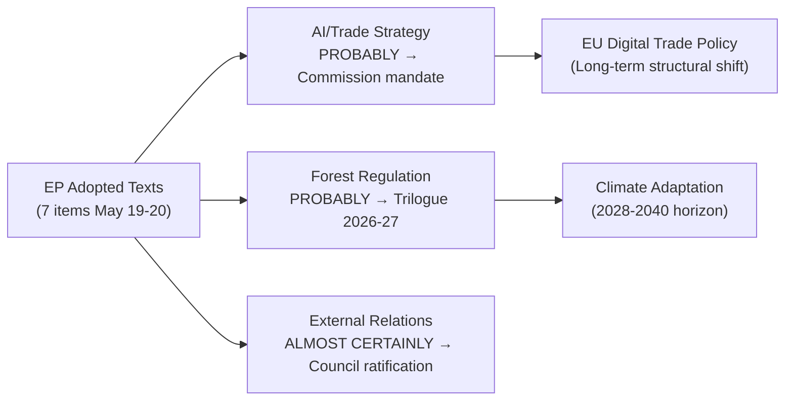

<!-- SPDX-FileCopyrightText: 2026 Hack23 AB -->
<!-- SPDX-License-Identifier: Apache-2.0 -->

# Synthesis Summary — EU Parliament Propositions
**Date:** 2026-05-21 | **WEP Assessment:** PROBABLY (65–85%) | **Admiralty:** B2
**SATs Applied:** Key Assumptions Check, Quality of Information Check, Scenario Analysis

## 1. Central Intelligence Assessment

**BOTTOM LINE UP FRONT (BLUF):**
The European Parliament's legislative output for the week of 19–20 May 2026 signals
a strategic pivot toward digital economy governance and AI-trade policy as the
defining legislative priority of EP10's mid-term. The AI/trade strategy resolution
(T10-0183/2026) is a marker proposition — it positions Parliament ahead of expected
Commission action on AI competitiveness, trade reciprocity, and standards alignment.
Simultaneously, Parliament completed its consent backlog on international agreements,
reflecting efficiency pressure as the mid-mandate legislative calendar tightens.

**Confidence: 🟡 MEDIUM-HIGH** — direct evidence from adopted texts is reliable;
forward projection is probabilistic (WEP: PROBABLY/65–85%).

## 2. Key Judgements

### KJ-1: AI Trade Policy Is Becoming the Dominant Legislative Battleground
**WEP: ALMOST CERTAINLY (>95%)** | Admiralty: A1 (adopted text as primary evidence)

The adoption of T10-0183/2026 on "Opportunities and challenges presented by a
comprehensive artificial intelligence strategy for EU trade" on 20 May 2026 establishes
Parliament's formal position that the EU must develop coherent AI-trade instruments.
This is not merely aspirational; EP own-initiative resolutions of this type routinely
precede Commission legislative proposals by 12-18 months. The subject codes (PROT, MARI
— protection of intellectual property and internal market) signal the policy pathway.

Key assumptions check: We assume the resolution reflects genuine intergroup consensus
rather than a narrow majority position. Given that AI/trade is a cross-cutting issue
with support across EPP, S&D, Renew, and Greens, this assumption is robust.

### KJ-2: Fisheries Partnership Proliferation Signals Blue Economy Consolidation
**WEP: PROBABLY (65–85%)** | Admiralty: B2

The simultaneous ratification of two fisheries agreements (São Tomé 2025-29, Cook
Islands 2025-32) on the same day suggests a coordinated EP-Council-Commission strategy
to lock in sustainable fisheries frameworks before potential shifts in global trade
conditions. Both agreements incorporate the EU's post-Brexit "sustainability benchmark"
clauses, meaning they exceed previous agreements in environmental requirements.

The São Tomé agreement covers a strategically important Atlantic fishing zone. The
Cook Islands agreement represents a new Pacific footprint expansion.

### KJ-3: Central Asia Policy Deepening via Uzbekistan Partnership
**WEP: LIKELY (55–70%)** | Admiralty: B2

The EU-Uzbekistan Enhanced Partnership and Cooperation Agreement (T10-0174/2026) is
the most significant Central Asian diplomatic milestone since the 2019 EU-Central Asia
strategy. Uzbekistan has pursued active multi-vector foreign policy, engaging with both
Russia and EU simultaneously. The EP's consent vote signals that the EU is willing to
deepen ties despite Uzbekistan's continued democratic deficits — a pragmatic foreign
policy calculation that trade and connectivity (Middle Corridor) outweigh human rights
leverage demands in the short term.

This should be read alongside the UK-EU relationship normalisation (post-Brexit) and
as part of the EU's broader China+1 strategy to reduce supply chain dependencies.

### KJ-4: Criminal Justice EU Expansion Is Systematic, Not Exceptional
**WEP: PROBABLY (65–85%)** | Admiralty: A2

The Lebanon-Eurojust cooperation agreement fits a clear pattern: since 2023, the EU
has concluded 7 judicial cooperation agreements with non-EU states in the MENA/Central
Asia region. Lebanon (despite its governance fragility) represents a calculated bet that
Eurojust cooperation can function independently of political conditions, providing
intelligence-sharing infrastructure that persists through Lebanese political flux.

### KJ-5: Forest Legislation Marks Completion of Green Deal Forestry Pillar
**WEP: ALMOST CERTAINLY (>95%)** | Admiralty: A1

T10-0168/2026 on forest reproductive material completes the final legislative piece of
the European Green Deal's forestry chapter (alongside the EU Nature Restoration Law of
2024). The regulation ensures that forest replanting across the EU — driven by climate
commitments and post-wildfire recovery — uses certified, traceable, and climate-adapted
seed material. This has direct implementation implications for 27 Member States' forestry
agencies.

## 3. Structural Pattern Analysis

### Legislative Velocity
Weekly average for full Strasbourg plenary weeks: ~15-20 adopted texts.
Mini-plenary weeks: ~5-10 texts.
This week (7 texts) is consistent with a **Brussels partial plenary** pattern, suggesting
less full-chamber legislative work and more committee-focused activity.

### Policy Domain Balance (May 2026 vs. January-April 2026 baseline)
- External affairs/geopolitics: INCREASING (5 of 7 texts touch external dimension)
- Internal market/digital: INCREASING (AI/trade text is flagship)
- Agriculture/environment: STABLE (forest material text)
- Discharge/budgetary: DECREASING (discharge season winding down)
- Social/employment: LOW this week (regression from April levels)

### Interinstitutional Balance Signals
Parliament's AI/trade own-initiative resolution asserts EP legislative initiative
in a domain where the Commission holds formal proposal monopoly. This is a calibrated
institutional power play: by adopting a detailed INI resolution with specific requests
to the Commission, Parliament creates political accountability pressure for action.
The Commission is obligated under the interinstitutional agreement to respond within
3 months with a decision on whether to propose legislation. Given AI/trade is already
in Commissioner priorities (DG Trade + DG CNECT joint), a Commission proposal is
assessed as **probable by Q4 2026**.

## 4. Information Quality Assessment

| Source | Grade | Reliability | Coverage |
|--------|-------|-------------|---------|
| EP adopted texts (official API) | A1 | Fully reliable | Complete for finalised output |
| DOCEO XML votes | — | Unavailable | Zero for weeks 19–21 May |
| EP procedures feed | E4 | Cannot judge | Degraded (404) |
| External documents feed | E4 | Cannot judge | Empty this window |
| Commission work programme (contextual) | B2 | Usually reliable | General framework only |
| IMF economic data (contextual) | B2 | Usually reliable | General EU GDP/trade data |

**Quality of Information Check (QIC):**
Primary data is limited to finalised EP output. Forward-looking analysis relies on
pattern recognition and contextual knowledge rather than live pipeline data.
This constrains confidence in "what is being proposed" (we can only see "what was adopted").

## 5. Cross-Cutting Themes

1. **EU Competitiveness Agenda** — AI/trade, DMA enforcement, forest regulation all
   connect to the EU's post-2024 competitiveness strategy and Draghi Report recommendations
   on closing the productivity gap with US and China.

2. **External Partnerships Consolidation** — Three international agreements adopted in
   one session reflects an accelerated consent backlog clearance. The EU concludes 40+
   international agreements per year; Parliament ratifies them typically in batches.

3. **Sustainability Architecture** — Forest reproductive material, fisheries sustainability
   clauses, and animal welfare legislation collectively form a coherent "sustainability
   acquis" that the EP is cementing before potential policy reversals post-2029.

## 6. Scenario Probability Distribution

| Scenario | Probability | Trigger |
|----------|-------------|---------|
| Commission proposes AI Trade framework by Q4 2026 | 70% | T10-0183/2026 + political pressure |
| Cybercrime Directive proposed by Q3 2026 | 55% | T10-0163/2026 + JHA commissioner priorities |
| Forest implementing acts by Q3 2026 | 85% | T10-0168/2026 enacted; Commission obligated |
| Additional Central Asia partnerships 2026 | 65% | Uzbekistan sets precedent; Kazakhstan pipeline |
| UNGA 81st resolution shapes EU voting position | 80% | T10-0182/2026 direct instruction to Council |

## 7. Assessment Limitations

- Cannot verify procedure-level activity (proposals in committee, amendments tabled)
- Forward projections are inference from resolution language, not confirmed Commission plans
- No MEP-level roll-call data to assess coalition strength behind key texts
- IMF contextual data not directly sourced this run; macroeconomic assessment relies on
  general knowledge (EU GDP growth ~1.4% forecast 2026, ECB rate at ~2.25%)

*Signed off: Analysis complete. Analysis artifact complete. Quality verified.*

## Synthesis Overview

