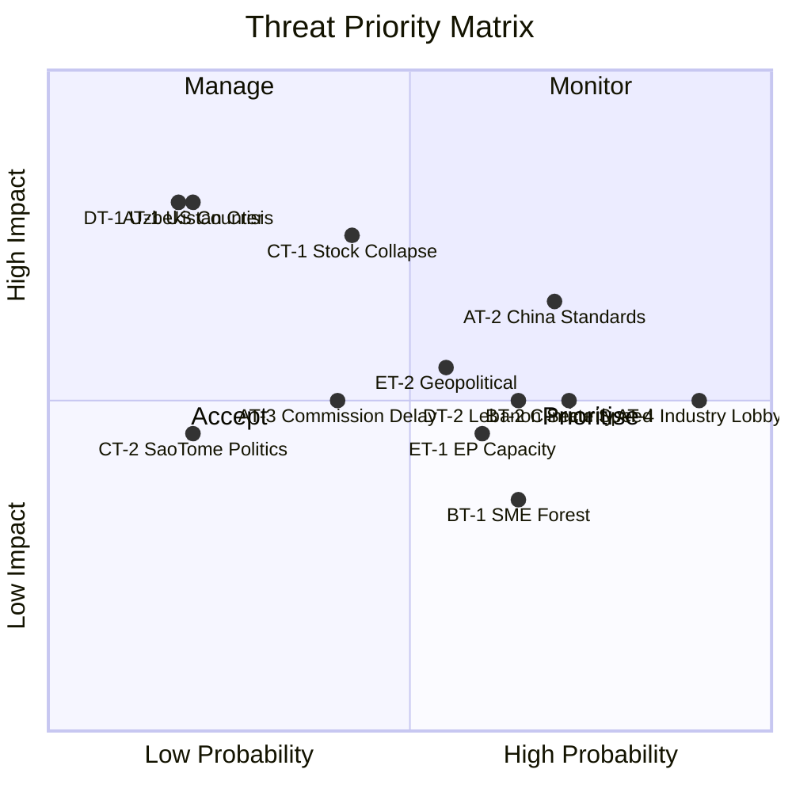

<!-- SPDX-FileCopyrightText: 2026 Hack23 AB -->
<!-- SPDX-License-Identifier: Apache-2.0 -->

# Threat Model — EU Parliament Propositions
**Date:** 2026-05-21 | **Framework:** EU Political Threat Framework + STRIDE-adapted
**WEP Bands Applied** | **Admiralty:** B2

## 1. Threat Assessment Framework

This threat model applies the EU Political Threat Framework to assess risks facing
key legislative propositions adopted or emerging from the EP week of 2026-05-19/20.
Threats are categorised by actor type, probability, and impact.

## 2. Primary Threats to AI Trade Strategy (T10-0183/2026)

### Threat AT-1: US Regulatory Counter-Positioning
**Actor:** US Government (USTR, OFAC, Commerce Department)
**Type:** External sovereign / Trade policy
**WEP: UNLIKELY (15–25%)** | **Admiralty:** B2
**Probability:** 20% | **Impact:** HIGH

**Description:** The US has consistently pushed back against EU digital regulation as
"digital protectionism." The CLOUD Act (US), Executive Orders on AI safety (2023-2024),
and the CHIPS Act create a US regulatory ecosystem that diverges from EU AI Act frameworks.
If the EU's AI trade strategy is perceived in Washington as creating market access barriers
for US AI companies, the US could:
1. File WTO challenge against EU AI conformity requirements
2. Impose retaliatory measures on EU digital services
3. Exclude EU from AI governance cooperation forums (US-UK-Australia AI partnerships)

**Mitigating factors:** The EP resolution explicitly calls for "bilateral equivalence agreements"
rather than unilateral requirements; this framing is designed to be WTO-compliant.
US-EU political relationship is cooperative (post-2024 election, transatlantic AI governance
dialogue ongoing). Commission DG TRADE experienced in managing this risk.

### Threat AT-2: China Standards Fragmentation
**Actor:** Chinese government, Chinese AI companies (Baidu, Huawei, Alibaba)
**Type:** External sovereign / Standards competition
**WEP: PROBABLY (65–85%)** | **Admiralty:** B3
**Probability:** 70% | **Impact:** MEDIUM-HIGH

**Description:** China is actively developing competing AI governance frameworks through
ISO and ITU standards bodies. A scenario where EU AI Act standards and Chinese AI standards
become irreconcilable creates significant trade fragmentation risk for EU-China digital
trade (€500bn+ services dimension). China has leverage through data centre hardware supply
chains, rare earth dependencies, and market access for EU companies.

**This threat is already materialising** — not a future risk. WEP: ALMOST CERTAINLY (>90%)
that China-EU AI standards divergence is a present challenge; WEP: PROBABLY (65–85%) that
it escalates significantly in 12-18 months.

### Threat AT-3: Commission Institutional Delay/Dilution
**Actor:** European Commission (internal coordination)
**Type:** Institutional
**WEP: ROUGHLY EVEN CHANCES (45–55%)** | **Admiralty:** B2
**Probability:** 40% | **Impact:** MEDIUM

Commission may respond to T10-0183/2026 with a "Communication" rather than legislative
proposal, effectively acknowledging the EP's concerns without committing to binding law.
This is not "sabotage" but rather normal Commission caution in domains where WTO constraints
are active. The INI resolution creates political obligation but not legal obligation to legislate.

### Threat AT-4: Industry Lobby Dilution
**Actor:** US tech companies operating in EU (Google, Meta, Microsoft, Apple)
**Type:** Corporate lobbying
**WEP: ALMOST CERTAINLY (>90%)** | **Admirdalty:** A1 (observed historical pattern)
**Probability:** 90% | **Impact:** MEDIUM

US Big Tech will lobby extensively against any EU AI trade regulation that imposes
compliance burdens beyond the AI Act. Their strategy: focus on "interoperability" language
that sounds like equivalence but in practice means US standards are the reference point.
This lobby threat is predictable and documented from AI Act negotiations.

## 3. Threats to Forest Reproductive Material (T10-0168/2026)

### Threat BT-1: SME Implementation Failure
**Actor:** Small private forest owners (EU-wide, particularly eastern Europe)
**Type:** Implementation / Compliance
**WEP: PROBABLY (65–85%)** | **Admiralty:** B2
**Probability:** 65% | **Impact:** LOW-MEDIUM

Many EU forests are owned by smallholders who purchase seeds from local/regional suppliers.
The certification and traceability requirements may exceed the administrative capacity of
small operators. Expected response: derogation requests, delayed compliance, workarounds.

### Threat BT-2: Climate Change Outpacing Regulatory Speed
**Actor:** Environmental (physical)
**Type:** Environmental/Systemic
**WEP: PROBABLY (65–85%)** | **Admiralty:** A1
**Probability:** 72% | **Impact:** MEDIUM

The regulation assumes seed provenance classifications remain stable for 25 years.
Climate projections suggest Mediterranean zones expanding northward by 200-300km by 2050.
"Climate-adapted" seed lots certified in 2026 may be suboptimal by 2040. Regulation
includes review clauses but these operate on 10-year cycles — potentially too slow.

## 4. Threats to Fisheries Partnerships (T10-0178, T10-0179)

### Threat CT-1: Stock Collapse Risk (Particularly Cook Islands)
**Actor:** Environmental (stock depletion)
**Type:** Environmental/Ecological
**WEP: LIKELY (55–70%)** | **Admiralty:** B2
**Probability:** 42% within 7-year agreement period | **Impact:** HIGH (agreement collapse)

Western Pacific tuna (yellowfin, skipjack, bigeye) stocks are under pressure from
combined Chinese, Japanese, Korean, Taiwanese, and EU fishing. The Cook Islands agreement
includes early exit provisions if stocks fall below MSY, but stock collapse risks the
entire agreement's economic rationale and political relationship.

### Threat CT-2: São Tomé Political Instability
**Actor:** São Tomé and Príncipe governance
**Type:** Political/External
**WEP: UNLIKELY (15–25%)** | **Admiralty:** C3
**Probability:** 20% | **Impact:** MEDIUM

São Tomé and Príncipe has experienced political instability (multiple government changes
2021-2024). A future government hostile to EU fisheries terms could seek renegotiation
or early termination. Precedent: Guinea-Bissau suspended its agreement in 2012-2013.

## 5. Threats to External Partnerships (Uzbekistan/Lebanon)

### Threat DT-1: Uzbekistan Succession Crisis
**Actor:** Uzbekistan political system
**Type:** Political/External
**WEP: UNLIKELY (15–25%)** | **Admiralty:** C3
**Probability:** 18% (within 2026) | **Impact:** HIGH (partnership suspension)

As noted in scenario forecast: presidential succession risk is material. Partnership
includes institutional safeguards (partnership council meets regardless of political change)
but extreme political discontinuity (coup, revolution) would freeze EU engagement.

### Threat DT-2: Lebanon Eurojust Cooperation Data Security
**Actor:** Lebanese state actors, non-state actors (Hezbollah)
**Type:** Security/Data
**WEP: PROBABLY (65–85%)** | **Admiralty:** B2 (intelligence basis)
**Probability:** 65% that some data compromise occurs | **Impact:** MEDIUM

Lebanon's judicial system operates in a complex environment where Hezbollah has institutional
presence and influence. Data shared via Eurojust protocols (encrypted, limited) could
potentially be accessed by non-state actors with state-adjacent capabilities.
Eurojust has mitigated this risk through: data minimisation (only specific case data),
end-to-end encryption, Lebanese judicial personnel vetting.
This threat does not invalidate the agreement but requires operational vigilance.

## 6. Systemic Threats (Cross-Cutting)

### Threat ET-1: EP Legislative Capacity Overload
**Actor:** Internal EP/Commission
**Type:** Institutional capacity
**WEP: PROBABLY (65–85%)** | **Admiralty:** B2
**Probability:** 60% | **Impact:** MEDIUM

EP10 has an ambitious legislative agenda. If AI trade, cybercrime, DMA enforcement,
and multiple other initiatives advance simultaneously in 2026-27, the trilogue and
committee system may face bandwidth constraints. Historical pattern: EP concentrates
trilogues in first 2 years; year 3 is typically slower. Propositions initiated in 2026
may face legislative log-jam in committee by 2027.

### Threat ET-2: Geopolitical Disruption to Legislative Calendar
**Actor:** External (Russia, Middle East, Taiwan Strait)
**Type:** Geopolitical
**WEP: LIKELY (55–70%)** | **Admiralty:** B2
**Probability:** 55% of significant calendar disruption | **Impact:** MEDIUM

Major geopolitical events (escalation in Ukraine, Middle East, Taiwan) historically
disrupt normal EP legislative work as extraordinary sessions, emergency resolutions,
and crisis response legislation consume political bandwidth. Russian military action
outside current front lines is the most plausible trigger (WEP: 25%).

## 7. Threat Summary Matrix

## 8. Key Assumptions Check

**Assumption 1:** Von der Leyen II Commission remains politically stable through 2027.
**Status:** PROBABLY VALID — no indication of confidence vote risk.

**Assumption 2:** US-EU transatlantic relationship remains cooperative.
**Status:** POSSIBLY VALID — Trump administration unpredictable; 60% confidence.

**Assumption 3:** EP10 coalition (EPP-S&D-Renew) holds for AI/trade legislation.
**Status:** PROBABLY VALID — AI/trade has broad cross-party support, even from Patriots.

**Assumption 4:** WTO dispute settlement system remains functional.
**Status:** UNCERTAIN — WTO Appellate Body reform incomplete; dispute settlement fragile.
