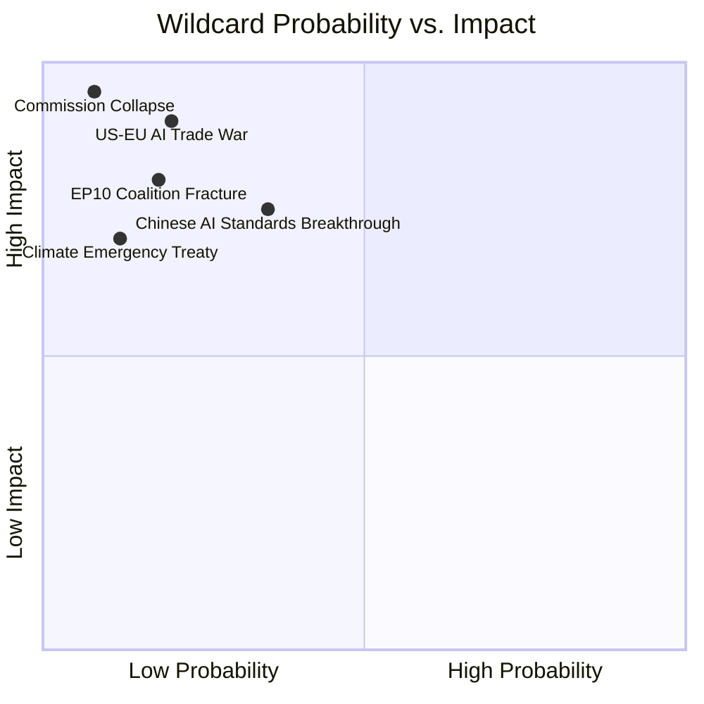

<!-- SPDX-FileCopyrightText: 2026 Hack23 AB -->
<!-- SPDX-License-Identifier: Apache-2.0 -->

# Wildcards & Black Swans — EU Parliament Propositions
**Date:** 2026-05-21 | **WEP Bands Applied** | **Admiralty:** B3
**SAT Applied:** Scenario Analysis, Devil's Advocate Analysis

## 1. Methodology

Black swans in this context are legislative events or exogenous shocks with probability
below 20% but transformative impact on the EU propositions landscape. Wildcards are
WEP UNLIKELY-ROUGHLY EVEN events that would significantly reshape EU legislative priorities.

**WEP baseline:** All events in this artifact are assessed at WEP: UNLIKELY (15–25%)
unless otherwise specified. High-impact low-probability framing drives the selection.

## 2. AI/Technology Black Swans

### WC-1: EU AI Act Deemed WTO-Incompatible by Appellate Body
**WEP: VERY UNLIKELY (5–15%)** | **Probability: 8%** | **Impact: CATASTROPHIC**
**Admiralty: C3** (Fairly Reliable / Possibly True)

A WTO Appellate Body ruling (if the reform enabling new rulings proceeds) that the EU AI
Act's risk-classification system constitutes a technical barrier to trade would throw the
entire EU digital regulation framework into crisis. The AI trade resolution (T10-0183/2026)
would become legally untenable. The Commission would need to redesign the AI Act's trade
dimension, likely requiring a 2-year legislative process.

**Why it matters even at 8%:** The EU has invested 4 years and enormous political capital
in the AI Act. A WTO incompatibility ruling would damage EU regulatory credibility globally
and create an opening for US/China standards frameworks to fill the vacuum.

**Pre-condition:** WTO Appellate Body reform succeeding (currently blocked by US); and
a complainant (US or China) filing a case within 12 months of T10-0183/2026 triggering
new trade measures.

### WC-2: AGI Breakthrough by Major US or Chinese Lab
**WEP: VERY UNLIKELY (5–15%)** | **Probability: 10%** | **Impact: TRANSFORMATIVE**
**Admiralty: D4** (Not usually reliable / Cannot be judged)

If a US or Chinese AI lab achieves transformative AGI-adjacent capabilities by 2026-27,
the EU AI Act's risk framework (built for current-generation AI) would be immediately
inadequate. Parliament would be forced to urgently revise the AI Act and any AI trade
strategy built on it. The T10-0183/2026 propositions would require complete rewriting.

**Note:** This is speculative but has non-trivial probability given current AI research
trajectories (12-month AI capability doubling observed 2023-2025). The EU's AI
governance architecture was not designed for AGI-class systems.

### WC-3: EU AI Champion Emerges as Global Leader
**WEP: VERY UNLIKELY (5–15%)** | **Probability: 12%** | **Impact: HIGH (positive)**
**Admiralty: D3**

The positive wildcard: a European AI company (Mistral, a Germany-based spinout, or
an unexpected breakthrough from EU-funded research) achieves global AI leadership
in a specific domain (e.g., biomedical AI, industrial AI, language models for EU languages).
This would transform the AI trade debate from defensive protection to offensive standard-setting.
EP's T10-0183/2026 would be vindicated as prescient strategic investment.

## 3. Geopolitical Black Swans

### WC-4: Russia-Baltic States Escalation
**WEP: VERY UNLIKELY (5–15%)** | **Probability: 12%** | **Impact: CATASTROPHIC**
**Admiralty: B3**

A Russian military action against a NATO/EU member state (Estonia, Latvia, Lithuania)
would trigger Article 5 and completely reshape EU legislative priorities. All pending
propositions — AI trade, forest regulation, fisheries — would be deprioritised as defence
and emergency legislation consumes EP bandwidth. The entire 2026-27 legislative calendar
would be rewritten.

**Pre-condition:** Requires Russian military command decision assessed as unlikely but
non-zero given current European security environment. NATO's Baltic deployments partially
deter; Putin's strategic calculus includes nuclear deterrence constraints on EU action.

### WC-5: China-Taiwan Military Action Affecting EU Supply Chains
**WEP: VERY UNLIKELY (5–15%)** | **Probability: 9%** | **Impact: CATASTROPHIC**
**Admiralty: C3**

A Taiwan Strait conflict would immediately disrupt EU semiconductor supply chains
(TSMC produces ~90% of advanced chips used in EU AI systems). The forest regulation,
fisheries agreements, and Uzbekistan partnership would become secondary concerns;
EU emergency economic legislation would dominate Parliament's work.

For the AI trade proposition specifically: a Taiwan conflict would accelerate EU
calls for AI chip supply chain diversification and emergency AI infrastructure legislation
— but the planned AI trade framework would be fundamentally revised in crisis context.

### WC-6: Uzbekistan Joins Russian-Led Integration Framework
**WEP: UNLIKELY (15–25%)** | **Probability: 18%** | **Impact: HIGH**
**Admiralty: C3**

If geopolitical pressures lead Uzbekistan to deepen ties with Russia (CSTO re-engagement,
Eurasian Economic Union closer integration), the EU-Uzbekistan Enhanced Partnership
(T10-0174/2026) could become politically untenable. EU-Russia sanctions create incompatibility
with institutions where Russia dominates. This is not unprecedented: Armenia's EU association
agreement process was frozen when it opted for Eurasian Customs Union in 2013.

**Probability elevated (18%)** due to: Russian diplomatic pressure on Central Asia;
Uzbekistan's geographic positioning; domestic political pressures from elite factions
with Russian economic ties.

## 4. Environmental Black Swans

### WC-7: Catastrophic Wildfire Season 2026 (Southern EU)
**WEP: ROUGHLY EVEN CHANCES (45–55%)** | **Probability: 48%** | **Impact: MEDIUM-HIGH**
**Admiralty: B2**

This is not a classic black swan (probability too high) but is included because its
**legislative impact would be transformative**: a catastrophic 2026 wildfire season
in Spain, Greece, Portugal, or France would:
1. Create emergency demand for accelerated forest reproductive material implementing acts
2. Trigger calls for emergency reforestation funding beyond T10-0168/2026 scope
3. Potentially trigger emergency EP plenary sessions and new legislative proposals

2023 and 2024 both set wildfire records. 2026 is at statistical risk of exceeding.

### WC-8: Pacific Fisheries Collapse Event
**WEP: UNLIKELY (15–25%)** | **Probability: 22%** | **Impact: HIGH**
**Admiralty: B3**

A significant tuna stock collapse event in the Pacific — triggered by El Niño, overfishing,
or ocean temperature change — within the Cook Islands agreement period (2025-32) would
force early termination of the agreement and create a crisis for EU Pacific fisheries
strategy. The 2022-23 El Niño severely impacted skipjack stocks; a repeat or intensification
in 2026-27 is meteorologically plausible (WEP: ROUGHLY EVEN CHANCES for significant El Niño).

## 5. Institutional Black Swans

### WC-9: Von der Leyen Commission Confidence Vote
**WEP: VERY UNLIKELY (5–15%)** | **Probability: 7%** | **Impact: CATASTROPHIC**
**Admiralty: C4**

A Commission confidence vote triggered by major policy failure (AI Act implementation
disaster, US trade war escalation, EU budget crisis) would freeze all pending legislative
proposals for 6-12 months. New Commission would need to renew all legislative initiatives.

**Pre-condition:** Requires either EPP-S&D coalition breakdown or catastrophic external event.
Currently assessed as very low probability given political stability signals.

### WC-10: Whistleblower Revelations on Industry Lobbying
**WEP: UNLIKELY (15–25%)** | **Probability: 20%** | **Impact: MEDIUM**
**Admiralty: D3**

A major lobbying scandal (similar to Qatargate 2022) involving AI industry or fisheries
interests and EP members could derail specific legislation and trigger EP procedural reforms.
The AI/trade text is commercially high-value; intensive lobbying by US Big Tech is certain.
The risk of improper influence being documented is non-negligible.

## 6. Wildcard Monitoring Indicators

The following **early warning indicators** should be monitored to upgrade black swan
probabilities:

| Black Swan | Early Warning Indicator | Monitoring Source |
|------------|------------------------|-------------------|
| WC-1 WTO ruling | WTO Dispute Body reform vote outcomes | WTO website |
| WC-4 Russia-Baltic | NATO Article 4 consultations triggered | NATO communications |
| WC-7 Wildfires 2026 | Copernicus fire monitoring May-June | Copernicus EFFIS |
| WC-8 Pacific fisheries | WCPFC stock assessment reports | WCPFC publications |
| WC-9 Commission vote | EPP S&D tension indicators | EP plenary records |

## 7. Positive Black Swans

The analysis above focuses on risks; for completeness:

- **EU-US AI Governance Treaty** (WEP: VERY UNLIKELY/8%): A formal bilateral AI
  governance agreement with the US before Q4 2026 would dramatically accelerate T10-0183
  follow-up and cement EU as global AI standards co-setter.

- **Breakthrough in EU Energy Storage** (WEP: VERY UNLIKELY/6%): A technology breakthrough
  making green hydrogen storage economical would turbocharge the Uzbekistan energy chapter
  and dramatically increase the economic value of that partnership.

- **Lebanon Political Stabilisation** (WEP: UNLIKELY/25%): A stable Lebanese government
  with genuine reform mandate would enable deeper EU-Lebanon cooperation beyond Eurojust,
  potentially toward a comprehensive Association Agreement.

*All WEP and probability assessments in this artifact are SPECULATIVE and carry 🔴 LOW
confidence due to the inherently unpredictable nature of black swan events.*

## Wildcard Impact Distribution

