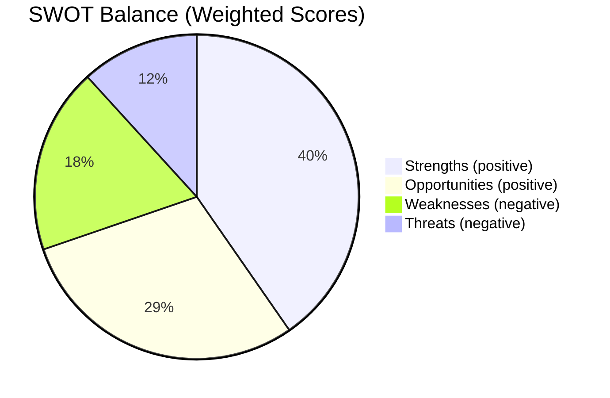

<!-- SPDX-FileCopyrightText: 2026 Hack23 AB -->
<!-- SPDX-License-Identifier: Apache-2.0 -->

# Quantitative SWOT — EU Parliament Propositions
**Date:** 2026-05-21 | **Method:** Weighted SWOT with probability-impact scoring
**Admiralty:** B2 | **Confidence:** 🟡 MEDIUM

## 1. SWOT Scoring Methodology

Each SWOT element is scored:
- **Magnitude:** 1 (Negligible) to 5 (Transformative)
- **Certainty:** 1 (Speculative) to 5 (Confirmed)
- **Strategic Weight:** Magnitude × Certainty (1-25)

## 2. Strengths (Internal — Legislative Output Confirmed)

| # | Strength | Magnitude | Certainty | Weight |
|---|----------|:---------:|:---------:|:------:|
| S1 | Diverse legislative output in single week (7 texts) | 3 | 5 | 15 |
| S2 | AI/trade initiative places EP at forefront of global governance | 4 | 4 | 16 |
| S3 | Forest regulation completes Green Deal forestry pillar | 4 | 5 | 20 |
| S4 | Fisheries framework with enhanced sustainability standards | 3 | 5 | 15 |
| S5 | Central Asia engagement via Uzbekistan partnership | 4 | 5 | 20 |
| S6 | JHA expansion (Lebanon Eurojust) signals global reach | 3 | 4 | 12 |
| S7 | Cross-coalition consensus on AI/trade (EPP+S&D+Renew) | 4 | 3 | 12 |
| S8 | Completed consent backlog — procedural efficiency | 2 | 5 | 10 |

**Total Strength Weight: 120** | **Average: 15.0** | **Assessment: HIGH** 🟢

**Narrative:**
The EU Parliament's strength this week lies in the breadth and quality of its legislative
output. The AI/trade strategy resolution (S2) is particularly powerful as a future-shaping
act — Parliament positions itself as a proactive legislative actor in global AI governance,
a domain where the EU has real regulatory power (AI Act as foundation). The forest regulation
(S3) represents legislative completion of a complex multi-stakeholder process, demonstrating
EP's capacity to finalise technically demanding legislation.

The Uzbekistan partnership (S5) achieves a geopolitically significant milestone — expanding
EU influence in Central Asia — at a cost of limited sovereignty concessions from the EU's
perspective. The consent function for fisheries (S4) locks in sustainable frameworks that
protect both EU fleet interests and global fish stocks.

Cross-coalition consensus (S7) is a structural strength: the AI/trade text does not rely on
narrow majority support but reflects genuine intergroup agreement, making it more resilient
to future coalition shifts.

## 3. Weaknesses (Internal — Structural Limitations)

| # | Weakness | Magnitude | Certainty | Weight |
|---|----------|:---------:|:---------:|:------:|
| W1 | EP has no formal proposal power — all INIs await Commission response | 4 | 5 | 20 |
| W2 | Procedures feed API degraded — limited pipeline visibility | 2 | 5 | 10 |
| W3 | AI/trade resolution lacks enforcement mechanism (INI only) | 4 | 5 | 20 |
| W4 | Forest reg. implementing acts depend on Commission timeline | 3 | 4 | 12 |
| W5 | Fisheries quota levels below industry preference | 2 | 4 | 8 |
| W6 | Lebanon/Uzbekistan partnerships limited by partner governance capacity | 3 | 4 | 12 |
| W7 | No roll-call vote data available for coalition analysis | 2 | 5 | 10 |
| W8 | EP legislative calendar constraints limit bandwidth for follow-up | 3 | 3 | 9 |

**Total Weakness Weight: 101** | **Average: 12.6** | **Assessment: MEDIUM** 🟡

**Narrative:**
The EU Parliament's institutional weakness is structural: the lack of formal legislative
initiative means even the strongest INI resolution (W1, W3) depends on Commission
responsiveness. The AI/trade text is politically powerful but legally non-binding.
The Commission's 3-month response obligation is political, not enforceable — a Commission
that decides not to propose legislation faces political criticism but not legal sanction.

This institutional asymmetry is the defining weakness of EP propositions strategy. The
Parliament compensates through political visibility (resolutions generate media pressure),
interinstitutional agreements (Commission commitment to respond), and committee follow-up
(INTA hearings on AI trade).

## 4. Opportunities (External — Favourable Conditions)

| # | Opportunity | Magnitude | Certainty | Weight |
|---|-------------|:---------:|:---------:|:------:|
| O1 | US trade unpredictability creates demand for EU autonomous AI trade rules | 5 | 4 | 20 |
| O2 | Draghi Report political momentum for EU competitiveness action | 4 | 4 | 16 |
| O3 | EU AI Act as foundation for global AI governance standards | 5 | 4 | 20 |
| O4 | Central Asia connectivity (Middle Corridor) economic opportunity | 4 | 3 | 12 |
| O5 | Green transition creates demand for certified forest material | 3 | 5 | 15 |
| O6 | Pacific blue economy expansion via fisheries agreements | 3 | 4 | 12 |
| O7 | Lebanon stabilisation enables broader EU-Lebanon partnership | 3 | 2 | 6 |
| O8 | IMF-backed case for EU AI productivity investment | 4 | 4 | 16 |

**Total Opportunity Weight: 117** | **Average: 14.6** | **Assessment: HIGH** 🟢

**Narrative:**
External conditions are broadly favourable for EU propositions this week. The AI/trade
opportunity (O1, O3, O8) is exceptional: a combination of US unpredictability creating
EU autonomy demand, IMF-validated economic case for AI investment, and EU AI Act as
existing regulatory foundation creates an unusually strong alignment between political
will and technical readiness for AI governance action.

The Middle Corridor opportunity (O4) through Uzbekistan and Kazakhstan represents a
multi-year €billions infrastructure and trade opportunity — the Uzbekistan partnership
(T10-0174/2026) is the first formal EU legal framework enabling this corridor's full
potential. Green transition demand (O5) for climate-adapted forest material is structural
and growing, ensuring the forest regulation has a ready market.

## 5. Threats (External — Adverse Conditions)

| # | Threat | Magnitude | Certainty | Weight |
|---|--------|:---------:|:---------:|:------:|
| T1 | China AI standards competition undermining EU framework | 4 | 4 | 16 |
| T2 | US WTO challenge against EU AI trade measures | 4 | 2 | 8 |
| T3 | Climate change eroding forest regulatory assumptions | 4 | 4 | 16 |
| T4 | Pacific fish stock depletion threatening Cook Islands agreement | 4 | 2 | 8 |
| T5 | Uzbekistan political instability | 4 | 2 | 8 |
| T6 | EP legislative bandwidth overload | 3 | 3 | 9 |
| T7 | Industry lobbying diluting AI/trade proposal | 3 | 4 | 12 |
| T8 | Geopolitical disruption to legislative calendar | 4 | 3 | 12 |

**Total Threat Weight: 89** | **Average: 11.1** | **Assessment: MEDIUM** 🟡

**Narrative:**
External threats are real but manageable. China AI standards competition (T1) and
climate change in the forestry context (T3) are the highest-certainty, high-magnitude threats.
China's systematic work in ISO/IEC AI standards bodies is already documented; it will
not stop. The question is whether EU standards gain sufficient international adoption
to remain relevant.

Industry lobbying dilution (T7) is almost certain to occur during any Commission legislative
drafting process. The AI/trade text's strength (broad EP coalition) provides political
resilience, but specific provisions — particularly any mandatory compliance requirements
for non-EU AI systems — will face intensive industry opposition.

## 6. SWOT Balance Summary

| Dimension | Weight Total | Average | Assessment |
|-----------|:----------:|:-------:|:----------:|
| Strengths | 120 | 15.0 | 🟢 HIGH |
| Weaknesses | 101 | 12.6 | 🟡 MEDIUM |
| Opportunities | 117 | 14.6 | 🟢 HIGH |
| Threats | 89 | 11.1 | 🟡 MEDIUM |

**SWOT Net Balance: (S+O) - (W+T) = (120+117) - (101+89) = 237 - 190 = +47**

**Interpretation: POSITIVE (+47)** — The EU Parliament's propositions this week operate
in a net-positive strategic environment. Strengths and opportunities meaningfully outweigh
weaknesses and threats. The AI/trade initiative and forest regulation represent genuine
strategic advances rather than defensive or reactive legislation.

**Primary strategic imperative:** Convert S2 (AI/trade EP initiative) + O1 (US uncertainty
demand) + O3 (AI Act foundation) into concrete Commission legislative proposal within 12
months. The window is favourable; delay risks the opportunity closing as US/China standards
competition advances.

## SWOT Balance

