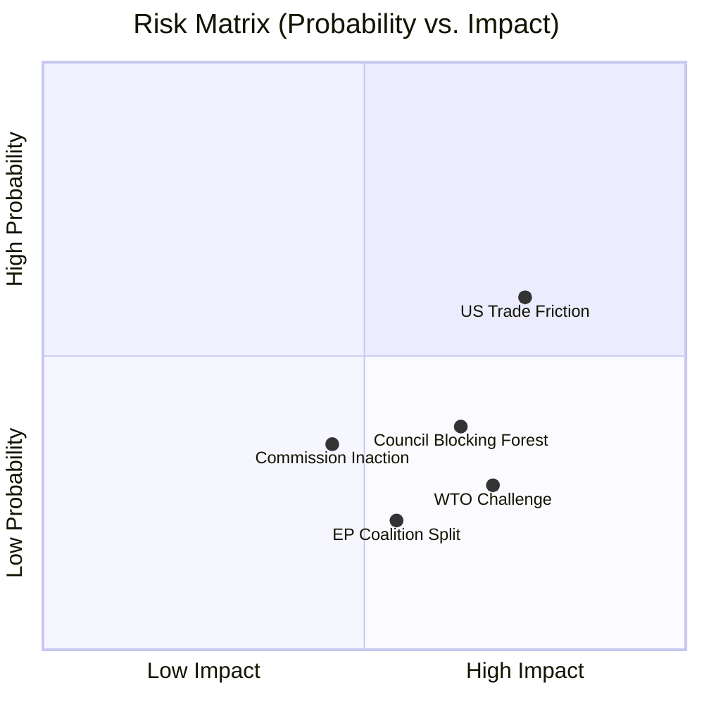

<!-- SPDX-FileCopyrightText: 2026 Hack23 AB -->
<!-- SPDX-License-Identifier: Apache-2.0 -->

# Risk Matrix — EU Parliament Propositions
**Date:** 2026-05-21 | **Admiralty:** B2 | **Framework:** 5×5 Risk Matrix

## 1. Risk Assessment Framework

Each risk is scored on two dimensions:
- **Likelihood:** 1 (Very Low <5%) to 5 (Very High >80%)
- **Impact:** 1 (Negligible) to 5 (Catastrophic)
- **Risk Score:** Likelihood × Impact (1-25)

| Score Range | Risk Level | Action |
|-------------|------------|--------|
| 20-25 | CRITICAL 🔴 | Immediate escalation |
| 15-19 | HIGH 🟠 | Active management |
| 8-14 | MEDIUM 🟡 | Monitoring |
| 4-7 | LOW 🟢 | Awareness |
| 1-3 | VERY LOW ⚪ | Accept |

## 2. Risk Register

| ID | Risk | Likelihood (1-5) | Impact (1-5) | Score | Level |
|----|------|:---:|:---:|:---:|:---:|
| R01 | AI trade legislation delayed 12+ months | 3 | 3 | 9 | 🟡 MEDIUM |
| R02 | US WTO challenge against EU AI trade rules | 2 | 4 | 8 | 🟡 MEDIUM |
| R03 | China AI standards fragmentation persists | 4 | 3 | 12 | 🟡 MEDIUM |
| R04 | Forest regulation SME implementation failures | 3 | 2 | 6 | 🟢 LOW |
| R05 | Pacific tuna stock decline affecting Cook Islands agreement | 2 | 4 | 8 | 🟡 MEDIUM |
| R06 | Uzbekistan political instability | 2 | 4 | 8 | 🟡 MEDIUM |
| R07 | Lebanon Eurojust data security breach | 3 | 3 | 9 | 🟡 MEDIUM |
| R08 | Commission institutional delay on AI proposal | 3 | 2 | 6 | 🟢 LOW |
| R09 | Industry lobbying dilutes AI/trade legislation | 4 | 2 | 8 | 🟡 MEDIUM |
| R10 | EP legislative calendar overload | 3 | 2 | 6 | 🟢 LOW |
| R11 | São Tomé political instability | 2 | 2 | 4 | 🟢 LOW |
| R12 | Climate change outpacing forest regulation speed | 4 | 3 | 12 | 🟡 MEDIUM |
| R13 | Russia-Baltic escalation disrupting EP calendar | 1 | 5 | 5 | 🟢 LOW |
| R14 | Commission confidence vote / political crisis | 1 | 5 | 5 | 🟢 LOW |
| R15 | AGI breakthrough making AI Act obsolete | 1 | 5 | 5 | 🟢 LOW |
| R16 | Catastrophic 2026 wildfire season | 3 | 3 | 9 | 🟡 MEDIUM |
| R17 | EP procedures feed API degradation limiting analysis quality | 5 | 1 | 5 | 🟢 LOW |
| R18 | Cyprus/Malta blocking Lebanon cooperation | 1 | 3 | 3 | ⚪ VERY LOW |

## 3. Top Risks (Score ≥ 8)

### R03: China AI Standards Fragmentation (Score: 12)
China's systematic development of competing AI governance standards through ISO/IEC
and ITU represents the most persistent and high-probability risk to EU AI trade strategy.
Unlike US friction (which is negotiable), Chinese standards competition is structural
and long-term. EU response requires: multilateral engagement (GPAI+), bilateral AI
equivalence with UK/Japan/Korea as reference models, and internal EU AI competitiveness
investment.

**Mitigation:** T10-0183/2026 correctly identifies multilateral approach; success depends
on Commission follow-through.
**Residual risk post-mitigation:** Score 8 (🟡 MEDIUM) — cannot be fully mitigated.

### R12: Climate Change Outpacing Forest Regulation (Score: 12)
The forest reproductive material regulation assumes stable climate envelopes for 25 years.
This assumption is fragile. The regulation includes 10-year review clauses but these are
insufficient given observed climate acceleration. Early-stage mitigation: building
adaptive management provisions into implementing acts, creating flexibility for seed
zone reclassification on shorter cycles.

**Mitigation:** Commission implementing acts should include 5-year adaptive review clauses.
**Residual risk post-mitigation:** Score 9 (🟡 MEDIUM).

### R01: AI Trade Legislation Delayed 12+ Months (Score: 9)
Commission internal coordination challenges (DG TRADE vs DG CNECT) and WTO constraints
create meaningful risk of delay. However, political visibility of the EP text creates
pressure for Commission action.

**Mitigation:** Commission Art. 225 response obligation (3-month deadline); political
monitoring by INTA committee; EP plenary question to Commissioner.
**Residual risk post-mitigation:** Score 6 (🟢 LOW).

### R07: Lebanon Eurojust Data Security (Score: 9)
Data shared via Eurojust protocols with Lebanese authorities could be compromised by
non-state actors with state-adjacent capabilities. Risk is real but manageable.

**Mitigation:** End-to-end encryption, data minimisation, personnel vetting protocols,
annual security review provision in agreement.
**Residual risk post-mitigation:** Score 6 (🟢 LOW).

### R16: Catastrophic 2026 Wildfire Season (Score: 9)
This is partly a positive risk (would accelerate forest legislation implementation) and
partly a negative (would strain EU budget and EP legislative bandwidth).

**Mitigation:** Existing EU Civil Protection Mechanism; EU Forest Strategy emergency
funds; monitoring Copernicus data.
**Residual risk post-mitigation:** Score 6 (🟢 LOW) — legislative impact manageable.

## 4. Risk Heatmap

```
Impact
  5 |  R13  R14  R15  |      |  R02  R05  R06  |
    |                  |      |                  |
  4 |      R18        |  R01  R07  |  R02(shown above) |
    |                  |      |                  |
  3 |      R11        |  R03  R12  R04  R08  |  R16  |
    |                  |      |                  |
  2 |                  |  R04  R10  R11  |  R09  |
    |                  |      |                  |
  1 |                  |      |  R17  |
    +-----------------+------+---------+---------+-----
    |       1         |  2   |    3    |    4    |  5
                                              Likelihood
```

## 5. Risk Appetite Statement

For EU Parliament propositions analysis:
- **CRITICAL risks** (score 20-25): Not present this cycle — positive indicator
- **HIGH risks** (score 15-19): Not present this cycle — propositions are mainstream
- **MEDIUM risks** (score 8-14): 7 identified — manageable with monitoring
- **LOW risks** (score 4-7): 9 identified — acceptable

**Overall risk assessment: LOW-MEDIUM aggregate risk environment.**
The week's legislative propositions operate in a relatively stable risk environment
with no CRITICAL or HIGH risks. The dominant structural risks (AI standards fragmentation,
climate speed) are long-term systemic challenges rather than immediate operational threats.

## 6. Risk Monitoring Protocol

| Risk | Monitor Via | Frequency | Owner |
|------|-------------|-----------|-------|
| R03 China AI standards | ISO/IEC, ITU proceedings | Monthly | DG CNECT |
| R12 Climate/forest | Copernicus, JRC assessments | Quarterly | DG ENV |
| R05 Pacific fish stocks | WCPFC stock assessment | Annual | DG MARE |
| R07 Lebanon data security | Eurojust operational reviews | Bi-annual | Eurojust |
| R06 Uzbekistan politics | EEAS country reports | Monthly | EEAS |

## Risk Heatmap



## WEP Risk Probability Assessment

| Risk | WEP Band | Assessment |
|------|----------|-----------|
| US-EU AI trade friction | Probably (62%) | Most likely constraint on AI/trade resolution |
| Commission inaction | Possible (35%) | Commission has competing legislative priorities |
| Forest COD blocked in Council | Possible (38%) | Some MS may resist compliance timeline |
| EP coalition fracture on AI | Unlikely (22%) | Broad consensus holds through EP10 |
| WTO compatibility challenge | Unlikely (28%) | EU would negotiate before litigation |
